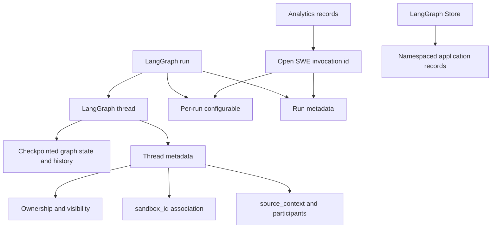
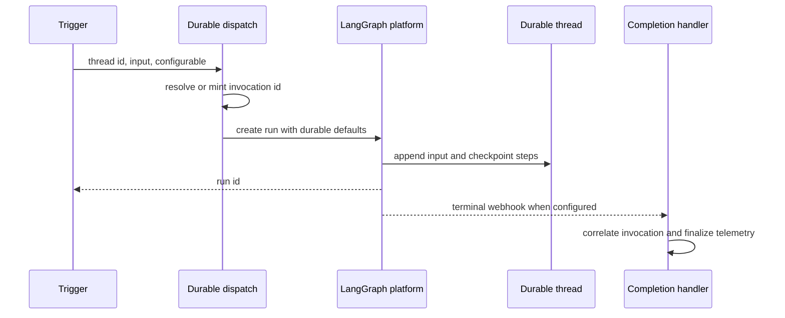

# Threads, Invocations, and Durable State

A LangGraph **thread** is the durable unit of an Open SWE conversation. Its `thread_id` selects graph state and checkpoint history. A **run** is one execution against that thread and has its own platform `run_id`; it adds input and advances state rather than replacing the conversation. An Open SWE **invocation** is a UUID that correlates one logical dispatch across run configuration, run metadata, completion handling, and usage telemetry. It is distinct from both the thread and run identities.

## State ownership

This diagram separates the durable conversation, its per-execution transport data, and application-owned records.

| Owner | Holds | Use it for | Do not use it for |
| --- | --- | --- | --- |
| LangGraph thread/checkpointer | Graph state, message history, status, and checkpoint history | Continuing or recovering a conversation | Cross-thread application records or access policy alone |
| Thread metadata | Source, title, repository, participants, ownership/visibility, settings snapshot, sandbox association, and UI summary fields | Durable, queryable conversation facts and authorization decisions | Per-run transient input |
| Run/configuration and run metadata | Input, graph-specific `configurable` values, streaming settings, `run_id`, and invocation correlation | One execution and its completion | Replacing durable thread metadata |
| LangGraph Store | Namespaced key/value records such as Slack mappings and pending-message queues | Application records with an explicit namespace/key lifecycle | Thread state or metadata |
| Analytics | Invocation-associated usage and operational telemetry | Reporting and correlation | Routing a continuation or authorizing access |

The checkpointer is configured to delete dormant checkpoints: its default TTL is 43,200 minutes and the sweep interval is 60 minutes. Durable routing metadata and Store records are separate from that checkpoint TTL.

## Thread identity is a persistence contract

`agent/thread_ids.py` is the single home for deterministic thread-id derivation. Every ID is a cross-process routing contract: webhooks, the dashboard, and the reviewer re-derive it from the same external identifiers to find an existing thread. Changing a formula or namespace orphans live threads from normal entrypoints.

| Purpose | Stable key and derivation |
| --- | --- |
| Slack location | `slack:{channel}:{timestamp}:{nonce}` through URL-namespaced UUIDv5 |
| PR comment on a non-Open-SWE branch | `{owner}/{repo}/pr/{pr_number}` through UUIDv5 |
| PR reviewer | `{owner}/{repo}/pr/{pr_number}/reviewer` through UUIDv5 |
| Review style | `{owner}/{repo}/review-style` through UUIDv5 |
| Baby-sit lock | `open-swe:baby-sit-lock:{key}` through UUIDv5 |
| Linear issue | `linear-issue:{issue_id}` through `_sha256_uuid` |
| GitHub issue | `github-issue:{issue_id}` through `_sha256_uuid` |

The reviewer key is deliberately distinct from the PR-comment key, so reviewer work cannot collide with the normal agent thread for the same PR. For an Open SWE-created branch, the GitHub PR-comment handler first recovers the UUID embedded in the branch; only a branch without an embedded ID falls back to the PR-comment formula. Linear uses its issue ID, so redelivery converges on the same thread.

### Slack resolution, moves, and code channels

Slack location resolution first checks the Store mapping in the per-channel namespace. When it is absent, it searches thread `source_context` metadata, rejects an ambiguous match, and binds either the sole match or the deterministic fallback. Binding validates the location, refuses an attempt to map it to a different thread, and reads the value back after writing. A location therefore cannot silently resolve to two Open SWE threads.

Retiring a location writes a fresh nonce rather than simply deleting the mapping. The next fallback derivation is consequently different, preventing reuse from colliding with the retired conversation.

A Slack code channel is one conversation spanning the whole channel, represented by `CODE_CHANNEL_SESSION_TS = "0"`. Its mapped thread has source context at `(channel_id, "0")`. The sentinel selects channel-wide `conversations.history`; ordinary Slack threads use `conversations.replies` for their timestamp. The Slack agent-session states `processing`, `active`, `suspended`, and `closed` are UI lifecycle state, not LangGraph thread/run status.

## Metadata, source, ownership, and visibility

`SourceContext` is durable thread metadata describing the opening Slack location, Linear issue, GitHub issue, or PR. Its models preserve unknown supplied fields and dump only set fields, allowing integrations to enrich historical contexts without injecting defaults. Parsing malformed metadata produces an empty context rather than failing the run. Metadata upsert preserves a non-empty existing opening context and an existing title: subsequent activity must not repoint a conversation.

Thread metadata is also the dashboard index. It records source/origin/category, repository, timestamps, current UI summary fields, and participants. Participant logins and emails are key-per-person objects such as `{"octocat": true}`, rather than lists, because JSONB containment can match an individual object key. Reviewer threads carry `kind = "reviewer"`; completion handling uses that discriminator to avoid treating reviewer work as normal agent Slack completion work.

Ownership and visibility are stamped when a thread is created, not reassigned by later webhook activity. A dashboard-created thread has `owner_type = "user"`, `owner_login`, and either `public` or `private` visibility. Public surfaced threads are readable by allowed users; private surfaced threads are readable only by the saved owner or a workspace admin. Only the owner can prompt, approve, or open a shell on a private thread; admin and automation threads additionally require an admin to post. Authorization intentionally returns a 404 for an unreadable thread.

These fields are also a credential boundary. A private run can use personal integration credentials only if the saved owner starts it. System-owned threads must be public and cannot use private credentials. User-owned PR authorship remains tied to the initiating owner, including in a public conversation.

Thread-level `agent_settings` are a separate metadata snapshot. Model, effort, subagent settings, routing, and repository instructions are resolved on the first run; sender identity, personal instructions, and PR preferences stay per-message. Later profile changes affect an existing thread only after an explicit snapshot rewrite, such as a model override. The schema is strictly normalized, cached for five minutes, and load/store fail soft so settings persistence does not block a run.

## Store records are not metadata

`agent/store.py` is the sanctioned Store wrapper. It defines an important failure distinction: a missing record returns `None`, while any other Store failure raises. Callers that can safely degrade must make that decision locally with explicit exception handling rather than treating outages as empty records.

`TypedStore` binds one namespace to a Pydantic model. A requested unreadable record makes `get` fail; listing operations log and skip malformed records so an old corrupt entry cannot take down an entire listing. The dashboard follow-up queue deliberately uses Store namespace `("queue", thread_id)` and key `pending_messages`; it de-duplicates structured `queue_id` values and caps FIFO retention at 100 messages, dropping the oldest entries.

## Invocation and input identities

`invocation_id` is the canonical Open SWE correlation identity; `prepare_run_id` is its legacy compatibility alias. Dispatch resolves an existing non-conflicting value or mints a UUID, then writes both names into `configurable` and run metadata. Conflicting or malformed values are rejected. Completion processing extracts the invocation identity from terminal webhook metadata before finalizing usage telemetry, so telemetry belongs to an invocation and references its thread rather than becoming thread state.

`RunConfig` is a tolerant, forward-compatible per-run `configurable` contract. Unknown keys survive its parse/dump round trip, supplied fields alone are emitted, and parsing iteratively drops invalid fields while preserving valid ones. This allows independently evolving trigger and graph contracts without losing a valid `thread_id` because an unrelated field is malformed.

Run input is new material appended to existing thread state. Authored content is serialized in validated, escaped `<input-message>` envelopes. Person, channel, and system introductions use hashed `<dynamic-context>` blocks; previously injected hashes suppress duplicates. Since summarization hides messages before its cutoff from the model prompt, only hashes visible after that cutoff count as injected, allowing needed identity context to be reintroduced.

## Durable dispatch and lifecycle

This is the integration dispatch path; dashboard command submission has its own authenticated proxy path.

`create_durable_run` centralizes Open SWE's integration-run defaults: `multitask_strategy="interrupt"`, `durability="sync"`, `if_not_exists="create"`, resumable streaming, the v3 stream-mode set, and subgraph streaming. Interrupt stops an active run while retaining its sync checkpoint, then runs the new input with thread history. Background follow-ups may opt into `enqueue` instead. Webhook triggers consequently do not need an in-process busy lock, while the dashboard retains its Store queue for deliberate in-flight injection.

Before creating a run, dispatch enables the v3 streaming compatibility marker and applies the same supported stream modes needed for an attaching client to replay events and see tool/subgraph activity. `stream_resumable=True` preserves the event stream for clients that attach after another surface started the run.

A completion webhook is attached only when `RUN_COMPLETE_WEBHOOK_SECRET` is set and `COMPLETION_WEBHOOK_URL` is an absolute non-loopback HTTP(S) URL. Otherwise the system warns and creates the run without a webhook, avoiding a platform validation failure that would block all run creation.

Dashboard requests follow an authorization-aware command proxy rather than this helper. A missing dashboard thread may only be created by `run.start`; other commands receive 404. Existing threads are checked for posting or reading permissions before forwarding. On a successful dashboard run start, the proxy records `latest_run_id`, `latest_run_status = "pending"`, and an update timestamp as UI metadata; listing refreshes active metadata from the latest platform run to avoid stale status.

## Sandbox continuity

A thread's metadata `sandbox_id` binds the durable conversation to its working tree. `ensure_sandbox_for_thread` prefers a cached backend, then reconnects using that ID, and creates a sandbox only when neither exists. It writes the ID only after creation and initialization succeed and then publishes the backend into the thread-keyed proxy cache, preventing a later run from adopting a half-built sandbox.

An unreachable existing sandbox raises `SandboxUnreachableError` rather than being silently replaced, because replacement can discard uncommitted work. A deleted sandbox (`SandboxGoneError`) is replaced because retaining the stale ID would permanently brick the thread. `allow_replacement` extends replacement to an unreachable, re-derivable read-only reviewer checkout.

## Safe-change checks

- Treat deterministic ID formulas and source-context shape as persisted contracts; test redelivery, PR branch recovery, Slack mapping conflict, ambiguity, and retirement nonce paths.
- Keep state ownership explicit: checkpoints for graph continuity, metadata for durable thread facts and policy, Store for namespaced application records, and analytics for observability.
- Test private-owner and admin authorization separately from UI filtering, including the 404 behavior for unreadable threads and credential-scope rejection for invalid ownership/visibility.
- Test conflicting invocation aliases, input-envelope escaping, context de-duplication, and context reintroduction after summarization.
- Test interrupt versus enqueue semantics, resumable v3 stream configuration, and invalid completion-webhook degradation.
- Test sandbox creation/publication ordering and the distinction between unreachable and deleted recovery. See [Sandbox Lifecycle](../architecture/sandbox-lifecycle.md).

For adjacent behavior, see [Invocation](../workflows/invocation.md), [Follow-up Messages](../workflows/follow-up-messages.md), and [Models, Profiles, and Instructions](./models-profiles-instructions.md).
