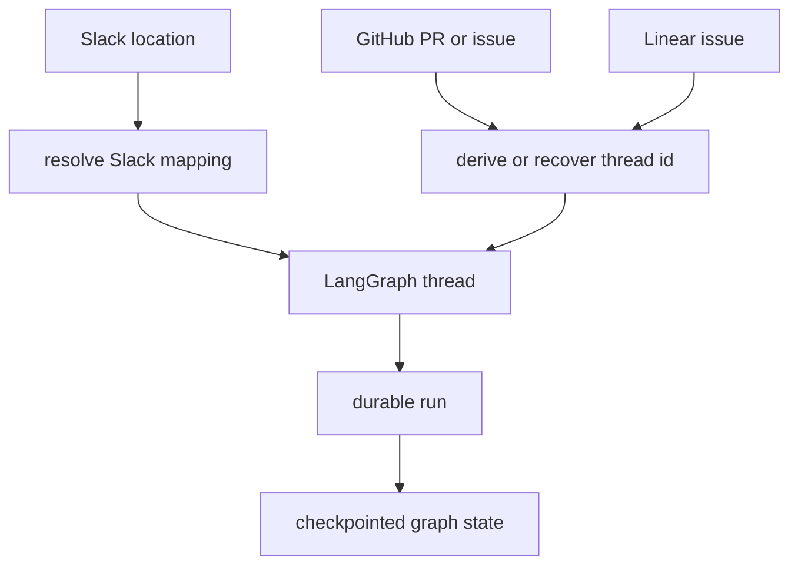
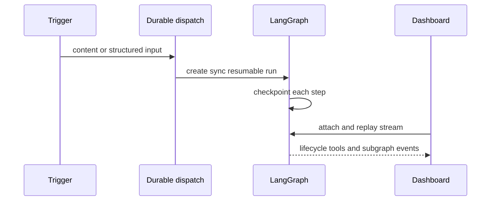

# Threads, Run State, and Durable Dispatch

A LangGraph thread is Open SWE's continuity boundary. It holds checkpointed graph state and carries metadata that identifies the conversation's source, participants, sandbox, settings, and dashboard state. A follow-up must target the same thread to continue its history; a run is a discrete execution on that thread.

Thread IDs, metadata, `configurable`, and input messages have separate ownership. IDs route a trigger to a durable thread. Metadata records durable thread facts. `configurable` is the permissive per-run contract passed through graph execution. Input messages serialize the immediate author and context for the model. Keeping those boundaries intact is essential when adding a trigger or continuation path.

## Identity and routing

`agent/thread_ids.py` owns deterministic derivation. These formulas are persisted routing contracts, not implementation details: webhook handlers, the dashboard, and reviewer re-derive them from external identifiers. Changing a key format or namespace makes existing threads unreachable by new triggers.

| Use | Derivation |
| --- | --- |
| Slack location | UUIDv5 key `slack:{channel}:{timestamp}:{nonce}` |
| PR agent thread | UUIDv5 key `{owner}/{repo}/pr/{number}` |
| PR reviewer thread | UUIDv5 key `{owner}/{repo}/pr/{number}/reviewer` |
| Review style and baby-sit lock | UUIDv5, separately namespaced keys |
| Linear or GitHub issue | UUID-shaped SHA-256 of an issue-specific key |

For an Open SWE-created PR, GitHub recovers the UUID embedded in its branch before falling back to the PR-keyed thread. Thus comments on that PR return to the thread that made the branch. Reviewer IDs intentionally use a distinct `/reviewer` suffix, and reviewer metadata has `kind = "reviewer"`; that marker drives reviewer-specific completion, accounting, findings, and dashboard listings.

Thread routing converges external events onto one LangGraph thread and its retained state.

### Slack mapping and code-channel sessions

Slack first resolves an explicit Store mapping under `("slack_thread_map", channel)` and timestamp. If absent, it searches thread `source_context` for the normalized Slack location, rejects ambiguity, then derives and binds an ID. Binding refuses a conflicting ID and verifies persistence, establishing one active Open SWE thread per Slack location. Detaching an association writes a fresh nonce so future deterministic fallback cannot collide with the retired thread.

A Slack code channel is one channel-wide agent session rather than a normal reply thread. It uses `CODE_CHANNEL_SESSION_TS = "0"`, binds the agent thread at `(channel_id, "0")`, and treats that sentinel as the switch from `conversations.replies` to whole-channel `conversations.history`. Its Slack session status (`processing`, `active`, `suspended`, or `closed`) is separate from LangGraph run/thread status.

## Durable metadata and source ownership

Thread metadata is the durable, queryable description of a thread. Important fields include `source`, classification fields, repository and environment selection, `source_context`, participant maps, `sandbox_id`, thread settings, title, resolution state, and the latest run/view markers used by the dashboard. Metadata updates are patches; callers should preserve fields they do not own.

`SourceContext` represents where a thread originated: Slack location and permalink, Linear or GitHub issue reference, and PR number. It is deliberately forward-compatible: unknown keys round-trip without defaults being injected, and malformed metadata produces an empty context instead of failing a run. The webhook metadata upsert preserves a nonempty existing context, so later activity cannot repoint a thread away from the source that opened it; it enriches a missing Slack permalink opportunistically.

Participants are stored as `participant_logins` and `participant_emails` objects keyed by normalized person rather than lists. This supports JSONB containment queries for one participant and lets the dashboard find a user's threads. Dashboard-created threads initialize source/classification, participants, model selection, timestamps, and optional repository, environment, and admin markers before any run begins.

Thread-level model and repository settings are resolved on the first run and snapshotted in `agent_settings`; later profile edits do not alter the thread unless an explicit rewrite, such as a per-run model override, occurs. Settings are validated, cached for five minutes, and fail soft so a metadata/settings outage does not stop an agent run.

The sandbox binding is another thread-owned fact. The server reconnects using metadata `sandbox_id`; it records a new ID only after sandbox creation and initialization, preventing a later run from adopting a half-built sandbox. See [Sandbox lifecycle](../architecture/sandbox-lifecycle.md).

## Per-run contracts: `configurable` and input

`RunConfig` gives the otherwise untyped `RunnableConfig.configurable` mapping a resilient boundary. It has optional fields for provenance, actor, repo, source references, review inputs, model choices, UI behavior, evaluation, and background jobs, but permits unknown keys. Parsing drops only invalid fields, including booleans where an integer would otherwise silently become `1`; `dump()` retains only supplied fields and extras. Consequently, callers can parse, enrich, and forward configuration without destroying fields introduced by another trigger or a newer deployment.

The immediate model input is built separately in `agent/input_messages.py`:

- The authored message is an escaped `<input-message>` envelope with namespaced sender (and optional channel), surface, and human/system kind. Multimodal non-text blocks remain in their original order.
- Person, channel, and system introductions are serialized as hashed `<dynamic-context>` messages. Channel topic and purpose are explicitly marked untrusted.
- Hashes prevent repeatedly injecting the same identity context. If summarization has hidden earlier messages behind its cutoff, only context still visible to the model counts as injected, allowing required identities to be introduced again.

`dispatch_agent_run` normally derives input identity from source and `RunConfig`: Slack supplies verified sender and channel information, GitHub identity is used when available, Linear can use email, and otherwise a system sender represents automation. Callers that already constructed a structured input may provide it, but cannot also mix in raw content or identities.

## Durable dispatch, interruption, and streams

All agent/reviewer triggers should pass through `dispatch_agent_run` and `create_durable_run`, rather than calling `runs.create` with local defaults. The helper adds a `prepare_run_id`, forces the event-streaming-v2 configurable marker, merges supplied run metadata, and creates the run with:

- `durability="sync"`, preserving a checkpoint before each graph step;
- default `multitask_strategy="interrupt"`, so a new follow-up interrupts active work and resumes from durable state with its history; background work such as baby-sit may choose `enqueue`;
- Protocol v2-compatible stream modes, `stream_subgraphs=True`, and resumable streaming by default; and
- an optional completion webhook only when a secret exists and `COMPLETION_WEBHOOK_URL` is absolute and non-loopback. Invalid/local webhook configuration warns and disables callbacks rather than making every run creation fail.

A durable run is created with checkpointing and a replayable Protocol v2 event stream.

The checkpointer deletes expired state: `langgraph.json` sets a 43,200-minute default TTL with a 60-minute deletion sweep. Durability therefore supports crash/recycle continuation within retention, not indefinite recovery.

Webhook triggers use interruption instead of an in-process busy lock. The remaining Store FIFO queue is dashboard-specific: `send_dashboard_message` accepts a post only while the thread is active, updates durable dashboard/participant state, and queues the follow-up payload; it retains the newest 100 messages and drops older ones on overflow. When a dashboard stop interrupts every pending/running run, it starts a replacement durable run if messages remain queued.

The dashboard derives display status from both thread and newest run: interrupted wins while cancellation propagates; busy/pending/running becomes running; failed/error/timeout becomes error; and success becomes finished. It refreshes cached latest-run metadata best-effort. It marks a non-running thread viewed against its latest run, while a running thread remains unviewed. Cancellation deliberately enumerates live runs by thread instead of trusting a cached `latest_run_id`, so it can stop work initiated from Slack, Linear, GitHub, or another browser.

## Store failure policy and operating invariants

`agent/store.py` is the sanctioned Store access layer. A missing record is `None`; non-404 failures raise, so an outage is never misreported as empty state. Critical paths that elect to continue must catch their own exception. `TypedStore` validates values with a Pydantic model: a requested unreadable record raises, while searches log and skip malformed records to preserve a listing.

Safe changes preserve these invariants:

- Do not change deterministic ID formulas or external key strings without a migration strategy.
- Do not overwrite an established `source_context`; it is durable origin identity and Slack routing evidence.
- Treat thread metadata as a shared patch surface and preserve unknown/future fields in `SourceContext` and `RunConfig`.
- Do not replace the durable dispatch helper with a bare run create; doing so can remove checkpoints, interrupt semantics, stream replay, subgraph activity, or safe webhook behavior.
- Account for checkpoint TTL: a dormant thread may retain metadata while its graph checkpoint state has expired.

## Focused verification

The targeted tests document the contracts most likely to regress: `tests/agent/test_thread_ids.py` checks derivation stability; `test_dispatch.py` checks durable defaults, Protocol v2 markers, structured input, and webhook validation; `test_input_messages.py` checks escaping, multimodal ordering, trust labels, deduplication, and summarized context; `test_run_config.py` and `test_source_context.py` check loss-tolerant forward-compatible parsing. `tests/dashboard/test_dashboard_thread_api_activity.py` verifies dashboard status refresh and viewed-state behavior.
