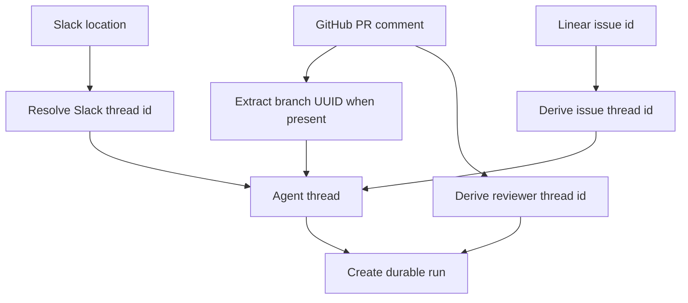
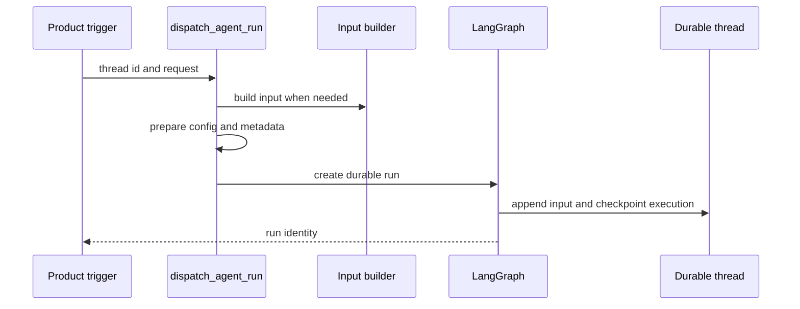

# Threads, Invocations, and Durable State

A LangGraph thread is Open SWE's unit of conversational continuity. Its stable `thread_id` selects checkpointed graph state and history; a run is one execution against that thread. Thread metadata is a small, queryable cross-surface index; the LangGraph Store is separately namespaced application storage; PostgreSQL holds relational product records. These owners are complementary, not interchangeable.

## Identity is a persistence contract

`agent/thread_ids.py` is the single home for deterministic thread-id derivation. The exact namespace and input string are durable routing contracts: webhooks, the dashboard, and reviewers independently derive an ID from external identifiers. Changing a formula makes live state unreachable through normal entrypoints.

| Conversation or purpose | Derivation key |
| --- | --- |
| Slack location | `slack:{channel}:{timestamp}:{nonce}` |
| PR comment on a non-Open-SWE branch | `{owner}/{repo}/pr/{pr_number}` |
| Reviewer for a PR | `{owner}/{repo}/pr/{pr_number}/reviewer` |
| Per-user review chat | `{owner}/{repo}/pr/{pr_number}/chat/{login.lower()}` |
| Repository review style | `{owner}/{repo}/review-style` |
| Linear issue | `linear-issue:{issue_id}` |
| GitHub issue | `github-issue:{issue_id}` |
| Baby-sit lock | `open-swe:baby-sit-lock:{key}` |

Slack, PR, reviewer, review-chat, review-style, and baby-sit IDs are URL-namespace UUIDv5 values. Linear and GitHub issue IDs use a SHA-256-derived UUID. Reviewer and PR-agent keys intentionally differ, preventing those conversations from colliding. For an Open SWE branch, the GitHub PR-comment webhook first recovers the UUID embedded in its branch name, falling back to the PR key only when no UUID is present. Linear delivery uses the issue ID, so redeliveries converge on one thread.

Thread identity lets separately triggered work converge on a durable conversation.

### Slack mappings support moves and retirement

A Slack location has a Store-backed explicit mapping in namespace `("slack_thread_map", channel)`, keyed by its timestamp. `resolve_slack_thread_id` checks it first; otherwise it searches thread metadata for an exact `source_context` location. Multiple matches are an error. One matching thread, or the deterministic Slack fallback, is then bound and read back. Binding validates location syntax and refuses to overwrite a different thread, enforcing one active Open SWE thread per Slack location.

Detaching a location writes a fresh nonce rather than merely erasing the map. A later deterministic fallback therefore differs from the retired thread. This supports moves such as code-channel creation without accidental reuse.

A Slack code channel is one channel-wide agent session, identified by `CODE_CHANNEL_SESSION_TS = "0"`, not a reply thread. `manage_code_channel` binds the agent thread to `(channel_id, "0")`, updates `source_context`, and detaches the previous location. The sentinel switches context retrieval from `conversations.replies` for an ordinary thread to channel-wide `conversations.history`. Its Slack session statuses—`processing`, `active`, `suspended`, and `closed`—are Slack UI lifecycle state, not LangGraph thread status.

## State owners and durable metadata

Use each persistence surface for what it owns:

| Owner | Purpose and examples | Do not use it as |
| --- | --- | --- |
| LangGraph thread and checkpointer | Conversation state, message history, thread status, and checkpoint lineage | A relational product database |
| Thread metadata | Small durable index: source, title, participants, visibility, repository/workspace hints, `sandbox_id`, and settings snapshot | An arbitrary large-record store |
| LangGraph Store | Namespaced application records and short coordination data, including Slack mappings and dashboard queues | Thread checkpoint state or metadata |
| PostgreSQL | Transactional relational records: users and provider identities, repositories, pull requests, PR-to-thread links, reviews, and workspace bindings | A replacement for LangGraph conversation history |

`source_context` in thread metadata describes the original Slack, Linear, GitHub, or PR source. Its model preserves unknown supplied fields, returns an empty context for malformed historical data, and dumps only supplied fields. Metadata upsert logic preserves an existing opening context and title rather than allowing later activity to repoint a conversation. Participant logins and emails are key-per-person objects such as `{"octocat": true}` rather than lists, because metadata JSONB containment can match an object entry.

Reviewer threads carry `kind = "reviewer"`; metadata searches and completion handling use it to distinguish reviewer state from normal agent Slack work. Dashboard visibility and ownership are also metadata-enforced: private threads are readable by their immutable owner or an administrator, while posting to private threads remains owner-only.

The Store wrapper is the sanctioned access path. Missing items read as `None`; any other Store failure raises, so an outage cannot masquerade as absent data. `TypedStore` validates records on read: a direct unreadable `get` raises, while list operations log and skip malformed entries so one old record does not take down a listing. The Store's namespace search is prefix-based; callers that must distinguish direct entries from descendants use `search_all_entries` and its reported actual namespace.

PostgreSQL is configured by `POSTGRES_URI`, uses the `open_swe` schema, and applies migrations under a PostgreSQL advisory transaction lock. It contains durable relations that need database constraints: notably a PR has at most one `primary` thread link, while it may have any number of secondary links. This relation complements—rather than derives from—thread metadata and avoids ambiguous metadata searches when navigating from a PR to its authoritative thread.

## Settings, input, and invocation metadata

Thread-level model and repository settings are resolved once and snapshotted under metadata key `agent_settings`. Model, effort, subagent settings, model-routing flag, and repository instructions belong there; sender identity, personal instructions, and PR preferences remain per-message. A later profile edit does not affect an established thread unless an explicit per-run model override rewrites the snapshot. Settings are strictly normalized, cached for five minutes, and read/write failures fail soft so metadata trouble does not stop a run.

Each run contributes a new input; the graph retains thread state. `build_run_input` serializes the authored request in an escaped `<input-message>` envelope with validated sender, surface, kind, optional channel, and structured data. It can prepend hashed person, channel, and system `<dynamic-context>` introductions. Existing hashes suppress duplicate introductions; contexts hidden behind the summarization cutoff are eligible for reintroduction because the model no longer sees them.

`configurable` is per-run transport metadata, not durable thread state. `RunConfig` tolerates unknown keys, emits only supplied values, and drops only invalid fields during parsing. This lets independent webhook, dashboard, and graph hops add data without erasing fields they do not own. Dispatch also assigns one invocation ID and start time to both `configurable` and run metadata, providing a cross-hop correlation identity distinct from the durable thread and platform run IDs.

## Durable dispatch and checkpoints

`dispatch_agent_run` is the common trigger boundary for agent and reviewer runs. It either accepts a prebuilt input or builds one from content and source identities—never both—and selects the graph with `assistant_id`. It delegates to `create_durable_run`, which merges metadata, adds the invocation correlation values, and creates the LangGraph run.

A trigger creates a run on the selected durable thread rather than creating a replacement conversation.

The default `multitask_strategy="interrupt"` stops an active run with its synchronous checkpoint preserved, then starts the follow-up against history plus the new input. Background work can request `enqueue`. `durability="sync"` checkpoints before each step, enabling recovery from the latest checkpoint after a crash or recycle. Webhook triggers consequently need no in-process busy lock.

Runs are configured for resumable v3 event streaming: `stream_resumable=True`, the `__event_streaming_v2` compatibility marker, v3 stream modes (`values`, `updates`, `messages`, `custom`, `tasks`, and `checkpoints`), and subgraph streaming. This lets a dashboard attach after a Slack, Linear, or GitHub launch and replay events instead of appearing idle until the next event.

A deliberate Store FIFO remains for dashboard injection into a busy run and Slack message edits. It deduplicates a supplied `queue_id`, caps `pending_messages` at 100, and drops oldest messages beyond that cap. Completion callbacks are optional: dispatch adds one only when `RUN_COMPLETE_WEBHOOK_SECRET` is set and `COMPLETION_WEBHOOK_URL` is absolute, HTTP(S), and non-loopback; invalid configuration warns and omits the webhook instead of making every `runs.create` fail. Platform checkpointer TTL is deletion-based: dormant checkpoints expire after 43,200 minutes and are swept hourly.

For the desktop app, `agent/local_checkpointer.py` supplies an SQLite `AsyncSqliteSaver` so every checkpoint is committed rather than relying on the development server's periodic in-memory pickle. On first use it safely imports legacy pickle checkpoints once: the completion marker is written only after successful upsert-based copying, so an interrupted import retries on the next startup.

## Sandbox association and recovery boundary

A thread's metadata `sandbox_id` links durable conversation state to its working tree. `ensure_sandbox_for_thread` reuses a cached backend or reconnects to that ID, creating only if no sandbox exists. A deleted sandbox is replaced, because its stale ID would otherwise brick future runs. An existing but unreachable agent sandbox raises `SandboxUnreachableError` rather than being silently replaced: replacement could discard uncommitted work. `allow_replacement` permits that risk only for re-derivable read-only reviewer checkouts.

Creation ordering is intentional: Open SWE creates and initializes the sandbox, then writes `sandbox_id` to thread metadata, and finally publishes the backend to the thread-keyed proxy cache. A failure before binding leaves no half-built ID for a future run to adopt; a failure before publication cannot expose a partially initialized backend. Explicit recreation likewise prepares a distinct replacement before rebinding metadata.

## Change and test checklist

- Treat new ID derivations and Slack mapping changes as migrations of a persisted routing contract; test mapping conflicts, metadata fallback, duplicate matches, and retirement nonce behavior.
- Test `create_durable_run` defaults, interruption versus enqueue, v3 resumable stream settings, and invalid completion-webhook degradation.
- Test Store failure semantics separately from missing records, and verify relational PostgreSQL constraints rather than recreating PR-to-thread authority in metadata.
- Test input escaping, identity validation, dynamic-context de-duplication, and reintroduction after summarization.
- Test sandbox create/bind/publish ordering and the distinct unreachable-versus-gone paths. See [Sandbox Lifecycle](../architecture/sandbox-lifecycle.md).

For surrounding flows, see [Invocation](../workflows/invocation.md), [Follow-up Messages](../workflows/follow-up-messages.md), and [Models, Profiles, and Instructions](./models-profiles-instructions.md).
