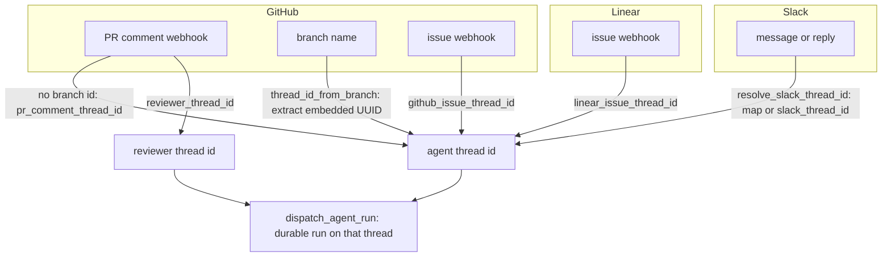
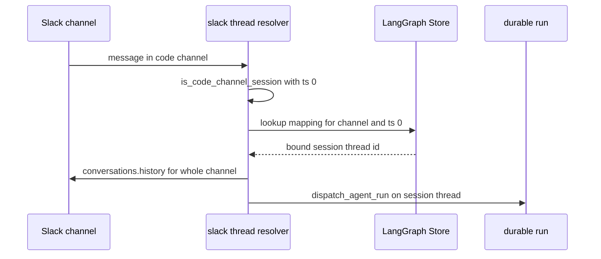

# Threads, Thread IDs & Persistence

A LangGraph *thread* is the unit of continuity in Open SWE: it holds the message
history, the checkpointed run state, and the metadata (settings, participants,
`sandbox_id`, source context) that lets a follow-up resume work rather than
start over. Because the same external conversation can be re-entered from a
webhook, the dashboard, or the reviewer, Open SWE never invents a random thread
id at trigger time — instead it *re-derives* the same id from stable external
identifiers, so every surface converges on one thread.

This page explains three related mechanisms:

1. **Deterministic thread-id derivation** per surface (GitHub, Linear, Slack,
   reviewer), so follow-ups route to the same run.
2. **Per-thread state persistence** — thread metadata, `sandbox_id`, settings,
   participants, and the Store — plus the durable-run contract
   (`durability="sync"`, checkpointer TTL).
3. **Slack code-channel session keying**, where the whole channel is one session
   keyed by `(channel_id, CODE_CHANNEL_SESSION_TS)`.

Related reading: [workflows/invocation](../workflows/invocation.md) for how a
trigger becomes a run, [architecture/sandbox-lifecycle](../architecture/sandbox-lifecycle.md)
<!-- openwiki: broken internal link [./auth.md] file "./auth.md" does not exist. Fix the href or restore the target, then delete this comment. -->
for the sandbox bound to each thread, and [concepts/auth](./auth.md) for how a
run's participants are verified.

## Deterministic thread-id derivation

`agent/thread_ids.py` is the single home for every thread-id formula. Each id is
a **cross-process routing contract**: webhooks, the dashboard, and the reviewer
all re-derive the same id from the same inputs to find an existing thread, so the
exact input strings and UUID namespaces are part of the persisted data model —
changing a formula orphans live threads.

Two derivation techniques are used:

- **URL-namespaced UUIDv5** (`uuid.uuid5(NAMESPACE_URL, key)`) for
  Slack, PR-comment, reviewer, review-style, and baby-sit-lock ids.
- **SHA-256-derived UUID** (`_sha256_uuid`) for Linear and GitHub *issue* ids,
  which formats the first bytes of a SHA-256 digest into UUID shape.

| Surface / purpose | Function | Stable key |
| --- | --- | --- |
| Slack thread | `slack_thread_id(channel, ts, nonce)` | `slack:{channel}:{ts}:{nonce}` |
| GitHub PR (not branched by Open SWE) | `pr_comment_thread_id(owner, repo, pr)` | `{owner}/{repo}/pr/{pr}` |
| Reviewer thread for a PR | `reviewer_thread_id(owner, repo, pr)` | `{owner}/{repo}/pr/{pr}/reviewer` |
| Review-style thread | `review_style_thread_id(owner, repo)` | `{owner}/{repo}/review-style` |
| Linear issue | `linear_issue_thread_id(issue_id)` | `linear-issue:{issue_id}` |
| GitHub issue | `github_issue_thread_id(issue_id)` | `github-issue:{issue_id}` |
| Baby-sit lock | `baby_sit_lock_thread_id(key)` | `open-swe:baby-sit-lock:{key}` |

### Routing across surfaces

Deterministic thread-id routing: each surface re-derives one stable thread id so
a follow-up resumes the existing run.

### GitHub: recover the id embedded in the branch

For a PR that Open SWE itself created, the agent embeds the thread's UUID in the
branch name. On a PR-comment webhook the handler calls `thread_id_from_branch`,
which scans the branch name for a UUID and returns it, so the comment routes back
to the original agent run. Only when the branch carries no id (a PR Open SWE did
not branch) does it fall back to `pr_comment_thread_id`, keyed by the PR itself.

### Linear and GitHub issues

The Linear webhook derives its thread id with `linear_issue_thread_id(issue_id)`,
and GitHub issue handling uses `github_issue_thread_id`. Both use the SHA-256
derivation so the same issue always maps to the same thread across redeliveries.

### Slack: explicit mapping first, deterministic id as fallback

Slack resolution is a two-step process in `resolve_slack_thread_id`
(`agent/utils/slack.py`). It first looks up an **explicit** stored mapping in the
Store namespace `(_SLACK_THREAD_MAP_NAMESPACE, channel)` keyed by timestamp. If
none exists, it searches existing threads by `source_context` metadata for the
Slack location; only if nothing matches does it fall back to the deterministic
`slack_thread_id(channel, ts, nonce)` and then bind that id. `bind_slack_thread_id`
refuses to overwrite a location already mapped to a *different* thread and
verifies the write persisted, so a Slack location maps to at most one thread.
Detaching a location (`delete_slack_thread_associations`) rewrites the mapping
with a fresh `nonce`, which changes the *next* deterministically derived id so a
reused location does not collide with the retired thread.

### Reviewer threads are tagged, not just keyed

Reviewer runs get their own thread id via `reviewer_thread_id(owner, repo, pr)`,
distinct from the agent thread for the same PR. Reviewer threads are also
**tagged** in metadata with `kind = REVIEWER_THREAD_KIND` (`"reviewer"`, defined
in `agent/review/findings.py`). That tag is how the rest of the system tells
reviewer threads apart: webhook handlers, run-completion handling, usage
accounting, and the review dashboard APIs all branch on
`metadata.get("kind") == REVIEWER_THREAD_KIND`, and the review dashboard *lists*
reviewer threads by searching metadata for that kind.

## Per-thread state persistence

Open SWE persists two kinds of durable state: **thread metadata** (attached to a
LangGraph thread, updated with `client.threads.update`, merged rather than
overwritten) and the **LangGraph Store** (a namespaced key/value store accessed
through `agent/store.py`).

### Thread metadata

Thread metadata carries the long-lived, per-thread facts:

- **`sandbox_id`** — the sandbox bound to the thread. On each run the server
  reads `sandbox_id` from metadata (`get_sandbox_id_from_metadata`) and
  reconnects to the existing box; only when there is no cached backend and no
  stored id does it create a new sandbox. The thread is bound to the new
  `sandbox_id` **only after** the sandbox is created and initialized, so a run
  that dies early leaves no half-built id to adopt. See
  [architecture/sandbox-lifecycle](../architecture/sandbox-lifecycle.md).
- **`source_context`** — the Slack/Linear/GitHub origin, used to re-find a thread
  (Slack resolution) and to resolve participants.
- **participant maps** — `participant_logins` / `participant_emails`, stored as a
  key-per-person object so a JSONB-containment metadata search can match a single
<!-- openwiki: broken internal link [./auth.md] file "./auth.md" does not exist. Fix the href or restore the target, then delete this comment. -->
  participant. See [concepts/auth](./auth.md).
- **reviewer fields** — `kind`, `pr`, `head_sha`, `last_reviewed_sha`, `watch`,
  and `findings` written by the reviewer's `store_thread_metadata`.
- **thread settings** — the profile snapshot under `agent_settings` (below).

### The Store: one read/write path

`agent/store.py` is the single sanctioned way to touch the LangGraph Store, and
it enforces one error policy everywhere: **a missing item reads as `None`, and
every other failure raises**. A store outage is deliberately *not* collapsed into
"empty record", so data loss cannot hide behind an empty dashboard; call sites on
the agent's critical path that must survive an outage wrap their own
`try`/`except` to make the swallow visible. `TypedStore` binds a namespace to a
Pydantic model so reads come back validated; `get` raises on an unreadable
record (the caller asked for that one), while `search`/`search_all` skip and log
a bad record so one corrupt entry cannot take down a whole listing.

### Thread settings snapshot

Threads are multi-party and long-lived, so thread-level model and repository
settings are resolved once on the first run and **snapshotted** onto the thread
metadata under `agent_settings` (`agent/utils/thread_settings.py`). Later profile
edits by any participant do *not* reach the thread unless something explicitly
rewrites the snapshot (today, a per-run model override). `normalize_thread_settings`
strips out settings that are now resolved per message (PR preferences, personal
instructions, commit identity, display name) so only genuinely thread-level
fields persist. Reads are cached for five minutes via `ttl_cache`, and both
read and write fail soft (returning `{}` / silently skipping) so settings never
break a run.

## Durable runs and checkpointing

Every trigger goes through one dispatch contract, `dispatch_agent_run` →
`create_durable_run` in `agent/dispatch.py`, which applies Open SWE's durable
LangGraph defaults rather than calling `runs.create` per site:

- **`durability="sync"`** — checkpoint before each step, so a crash or recycle
  resumes from the last checkpoint instead of losing all work.
- **`multitask_strategy="interrupt"`** (default) — a follow-up halts the active
  run (progress preserved by the sync checkpoint) and resumes the agent with full
  history plus the new message; on an idle thread it just starts. Background
  follow-ups such as `/baby-sit` can opt into `enqueue` instead.
- **completion webhook** — attaches `COMPLETION_WEBHOOK_URL` so the platform
  signals completion or failure even if the agent process died; it is attached
  only when `RUN_COMPLETE_WEBHOOK_SECRET` is set and the URL is a non-loopback
  absolute URL, degrading to no webhook (with a warning) otherwise so a rejected
  webhook cannot poison every `runs.create`.
- **`stream_resumable=True`** plus the Protocol v2 run shape — the event stream is
  retained and marked so a client (the dashboard) that attaches to a run it did
  not start can replay events and see it as running.

Because `multitask_strategy="interrupt"` makes the platform handle in-flight
follow-ups, webhook triggers no longer need a busy-check or an in-process lock
(`agent/utils/thread_ops.py`). The Store-backed FIFO queue in that module is
retained only for the dashboard's deliberate "inject a follow-up into a run
that's already in flight" path, capped at `MAX_QUEUED_MESSAGES`.

### Checkpointer TTL

Durability keeps every step, so checkpoints must be swept. `langgraph.json`
configures the checkpointer with a TTL: `strategy="delete"`,
`default_ttl=43200` minutes (30 days), and a `sweep_interval_minutes=60`. Expired
checkpoints are deleted on the hourly sweep, bounding how long a dormant thread's
checkpointed state survives.

## Slack code-channel session keying

A Slack **code channel** (a channel Slack has marked as an agent channel;
`is_code_channel`) is treated as *one* agent session spanning the whole channel,
not a per-thread conversation. Because there is no single Slack thread timestamp
for the channel, Open SWE keys the session with a sentinel timestamp
`CODE_CHANNEL_SESSION_TS = "0"` (`agent/utils/slack_code_channels.py`).
`is_code_channel_session(thread_ts)` returns true exactly when `thread_ts` is
that sentinel.

This sentinel flows through the same `(channel_id, thread_ts)` keying used for
normal Slack threads:

- **Thread binding** — `manage_code_channel` binds the derived agent thread to
  `(channel_id, CODE_CHANNEL_SESSION_TS)` via `bind_slack_thread_id`, so every
  message in the channel resolves to the one session thread.
- **Context source selection** — when Open SWE fetches conversation context
  (`fetch_slack_thread_messages`, `fetch_slack_thread_message_by_ts`), a code
  channel session reads the **whole channel** with `conversations.history`,
  whereas a normal Slack thread reads only that thread with
  `conversations.replies` (which requires the thread `ts`). The sentinel is what
  switches the API method.
- **Session lifecycle** — a code channel session has its own status
  (`processing` / `active` / `suspended` / `closed`) set through
  `set_session_status`, distinct from LangGraph thread status.

Code-channel session keying: the `"0"` sentinel selects channel-wide history and
one bound session thread.

## Invariants and failure semantics

- A deterministic thread id is stable for its inputs; changing a formula in
  `agent/thread_ids.py` orphans existing threads and is a data-model change.
- A Slack location maps to at most one Open SWE thread; binding refuses to
  overwrite a conflicting mapping and verifies the write persisted, and
  `resolve_slack_thread_id` raises if two threads match one location.
- The sandbox binding is written only after the sandbox initializes, so a failed
  early run does not leave a broken `sandbox_id` for the next run to adopt.
- Store reads distinguish "missing" (returns `None`) from "outage" (raises);
  callers that must survive an outage swallow explicitly.
- Thread settings are a first-run snapshot; later profile edits do not propagate
  unless the snapshot is explicitly rewritten.
- Durable runs checkpoint synchronously and are swept by the checkpointer TTL,
  so a crash resumes from the last step but dormant state expires after the TTL.
