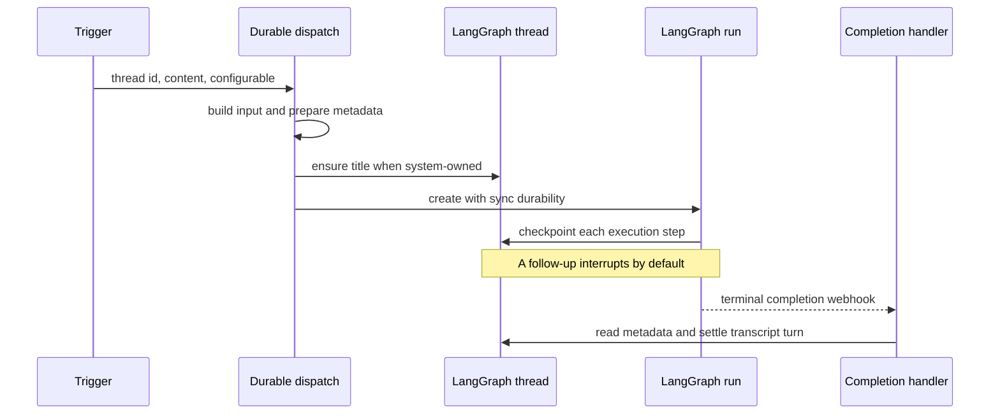

# Threads, runs, messages, and artifacts

A **thread** is the durable identity of an Open SWE conversation. It selects LangGraph checkpoints and state, holds durable metadata used for routing and the dashboard, and can outlive individual **runs**. A run is one graph execution on that thread: it adds input and advances its existing state rather than replacing it. Application records that do not belong in thread metadata—such as plans and queued messages—are persisted separately in the LangGraph Store or PostgreSQL.

This separation is important for integrations. A webhook, dashboard action, or automation must find or derive the existing `thread_id`, provide a new input, and choose an appropriate multitask strategy. It must not create a random identity for a follow-up or treat an unavailable workspace as a new conversation.

## Stable identities and thread creation

`openswe/thread_ids.py` is the canonical home for deterministic IDs. Its strings and UUID algorithms are persistence and routing contracts: webhooks, dashboard features, and review flows independently derive the same ID to locate live threads. Changing a formula or namespace would strand threads under their old IDs.

| Purpose | Derivation key | Algorithm |
| --- | --- | --- |
| Slack location | `slack:{channel}:{timestamp}:{nonce}` | URL-namespaced UUIDv5 |
| PR-comment agent thread | `{owner}/{repo}/pr/{pr_number}` | URL-namespaced UUIDv5 |
| PR reviewer | `{owner}/{repo}/pr/{pr_number}/reviewer` | URL-namespaced UUIDv5 |
| PR review scout | `{owner}/{repo}/pr/{pr_number}/review-scout` | URL-namespaced UUIDv5 |
| Per-user PR review chat | `{owner}/{repo}/pr/{pr_number}/chat/{login.lower()}` | URL-namespaced UUIDv5 |
| Linear or GitHub issue | `linear-issue:{id}` or `github-issue:{id}` | SHA-256-derived UUID |
| Baby-sit lock | `open-swe:baby-sit-lock:{key}` | URL-namespaced UUIDv5 |

The reviewer namespace is intentionally distinct from the regular PR-comment namespace. A branch created by Open SWE embeds its agent thread UUID; `thread_id_from_branch` recovers that value before a PR-comment flow needs to fall back to the PR-derived identity.

Threads that people can open are created through `create_thread`, which requires a nonblank title. `if_exists="do_nothing"` leaves an existing thread's metadata unchanged. System-owned threads use `ensure_titled_thread`: it creates the thread if absent and updates a generated title unless `title_locked` records that a person renamed it. Short-lived lock threads are a distinct use of a thread identity: `create_lock_thread` uses `if_exists="raise"` and a TTL as a mutex.

### Source context and visibility

`source_context` in thread metadata records the origin route—Slack location, Linear or GitHub issue, PR number, and integration-specific extras. `SourceContext` preserves unknown supplied fields and parses malformed legacy context as empty rather than breaking a run. Follow-up configuration reconstructs source context and workspace from metadata so system-started work returns to the same thread context.

Metadata also drives the dashboard's access and presentation decisions:

- Listed agent threads come from the recognized dashboard, GitHub, Slack, Linear, schedule, and API sources. `unlisted` and review-chat threads remain directly accessible but do not appear in lists.
- A private thread is promptable only by its immutable owner. It is readable by that owner and workspace admins; review chats are readable only by their owner.
- Threads started by an allowlisted Slack bot are dashboard read-only, even to admins, so users steer them in Slack.
- Dashboard status is derived from both thread and newest-run status: pending/running or a busy thread renders as `running`; `interrupted` wins during asynchronous cancellation; errors and timeouts render as `error`; success as `finished`.

## Input context and `RunConfig`

Each run supplies a new `RunInput`; history and checkpointed graph state remain on the thread. `build_run_input` serializes authored content into an escaped `<input-message>` envelope with a validated namespaced sender ID, surface, kind, optional channel, and structured fields. It can prepend `<dynamic-context>` introductions for a channel or system. These blocks are content-hashed and omitted if already injected. After summarization hides messages before its cutoff, only hashes visible after that cutoff count as present, allowing necessary identity context to be reintroduced.

`configurable` is the per-run transport contract, not a replacement for thread metadata. `RunConfig` is intentionally forward compatible: unknown keys survive, only supplied fields are emitted, and parsing drops only invalid fields iteratively so one malformed value does not discard usable fields such as `thread_id`. It carries provenance, actor, repository and source references, PR/reviewer data, model choices, behavior flags, and workspace selection according to the trigger.

## Durable dispatch and follow-ups

`dispatch_agent_run` is the common entry point for Slack, Linear, GitHub, dashboard, and other agent triggers. It either accepts a prebuilt `RunInput` or constructs one from content and identities—never both—and dispatches either the `agent` graph or a selected graph such as `reviewer`. `create_durable_run` can first ensure a title, merges run metadata, resolves a user for trace metadata when possible, and creates the LangGraph run.

```mermaid
sequenceDiagram
  participant Trigger as Trigger
  participant Dispatch as Durable dispatch
  participant Thread as LangGraph thread
  participant Run as LangGraph run
  participant Complete as Completion handler

  Trigger->>Dispatch: thread id, content, configurable
  Dispatch->>Dispatch: build input and prepare metadata
  Dispatch->>Thread: ensure title when system-owned
  Dispatch->>Run: create with sync durability
  Run->>Thread: checkpoint each execution step
  Note over Run,Thread: A follow-up interrupts by default
  Run-->>Complete: terminal completion webhook
  Complete->>Thread: read metadata and settle transcript turn
```
Durable dispatch creates a run on the existing thread; sync checkpoints preserve progress when a follow-up or failure ends an execution.

The normal defaults are `multitask_strategy="interrupt"`, `durability="sync"`, `if_not_exists="create"`, `stream_resumable=True`, Protocol-v3-compatible stream modes, and subgraph streaming. Interrupting preserves the prior sync checkpoint and makes the new message run with the conversation history. Work that must wait, such as plan-comment submission, can opt into `enqueue`. Resumable streaming lets a dashboard attaching after a Slack, Linear, or GitHub trigger replay events and observe an already-running run.

Dispatch attaches a completion webhook only when a completion secret is configured and the URL is an absolute non-loopback HTTP(S) URL. Invalid or local URLs degrade to no webhook with a warning rather than making every `runs.create` fail. The completion endpoint itself fails closed when its secret is absent or its token does not match. Terminal `error` and `timeout` can produce a best-effort source-specific failure reply; `interrupted` is deliberately not a failure because it is the normal result of a superseding follow-up. Completion also settles an open transcript turn idempotently, preferring the turn owned by the reported run so an older completion cannot close a later turn.

LangGraph checkpointer TTL uses the `delete` strategy with a 43,200-minute default and hourly sweeps. Thus a stable thread ID is not a promise that its dormant checkpoint state remains indefinitely available.

### Deliberate in-flight queue

Webhook follow-ups no longer need a process-local busy lock because dispatch interruption handles concurrency. The dashboard retains a different mechanism for deliberately injecting a message into an in-flight run: `QueuedMessage` persists each follow-up as a PostgreSQL row. Writers only insert, while consumers delete only rows they consumed, avoiding a read-modify-write overwrite race. Rows are FIFO by identity `seq`; a per-thread cap of 100 drops oldest excess messages. An optional `queue_id` is unique per thread, so a retried dashboard send is not queued twice. Queue mutations invalidate the thread's UI queue topic, and previews expose waiting content and, when resolvable, sender information.

## UI-visible state, artifacts, and workspace

Thread summary code turns durable thread metadata and current run state into UI state. Titles use metadata, with a reviewer-specific PR-derived fallback and `Untitled agent` as the normal fallback. A code-channel session is represented by the Slack timestamp sentinel `"0"`; it links to the channel rather than a message and has separate Slack session lifecycle state from the LangGraph run status.

A plan is a versioned artifact with two durable representations:

- The published dashboard snapshot is stored under the LangGraph Store namespace `['plan', 'content']`, keyed by thread ID. It holds HTML and/or Markdown, status, revision UUID, and optional sandbox file path.
- The agent/dashboard plan file is mirrored under `/workspace/plans` in the thread sandbox. Sandbox writes are best effort, so a missing sandbox does not prevent publishing the dashboard artifact.

Publishing a plan updates `plan_status` and approval metadata on the thread and normally clears old review comments. Each comment is an individual Store item under `['plan', 'comments', thread_id]`, so it can be listed, deleted, and ordered independently. Dismissal records the dismissed revision, hiding only that revision's inline preview. Dashboard readers require thread readability; edits and comments require prompt permission; submitting comments requires post permission and launches an `enqueue` follow-up so the agent receives comments after current work.

Workspace file browsing is live sandbox access, not an artifact snapshot. The files API requires readable metadata **and** prompt permission, which prevents an admin who can view a private thread from reading its files. It reconnects to the `sandbox_id`, resolves the repository checkout when known, and runs a bounded workspace-path helper. Missing workspace produces 404, connection failure 503, malformed sandbox output 502, and a helper-reported path failure 404.

The transcript is an append-only event log separate from graph message state. A turn moves through requested/running and then completed, failed, or interrupted. Middleware normally closes it; completion and cancellation code are a safety net. Commands have deterministic IDs and receipts, so competing settlement writers deduplicate. A completion with a run ID settles only that run's still-open turn; only an unreported run may fall back to an unassigned open turn. This prevents an old completion from closing the next queued turn.

## Change and test focus

When evolving this area, preserve the identity formulas and test behavior at the boundary:

- Verify deterministic derivation and branch UUID recovery before adding a new trigger.
- Test invalid configurable fields, retained unknown fields, input escaping, and dynamic-context reintroduction after summarization.
- Test dispatch's prebuilt-input exclusivity, interrupt versus enqueue, resumable stream settings, and invalid completion-webhook degradation.
- Test FIFO queue ordering, queue-ID deduplication, the 100-message cap, and UI invalidation.
- Test dashboard access separately for public, private, review-chat, and bot-triggered threads; treat workspace file reading as prompt-level access.
- Test plan publication/comment revision semantics and transcript settlement races by run ID.

For surrounding contracts, see [Invocation](../workflows/invocation.md), [Follow-up Messages](../workflows/follow-up-messages.md), [Dashboard UI](../integrations/dashboard-ui.md), and [Persistence, Workspaces, and Tasks](../architecture/persistence-workspaces-and-tasks.md).
