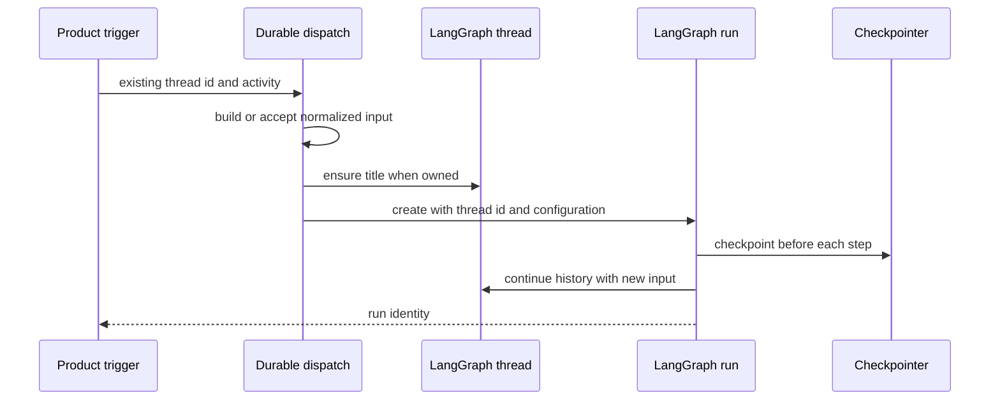

# Threads, Durable Runs, and State

A LangGraph thread is Open SWE's unit of continuity. Its stable `thread_id` selects graph state and checkpoints; the thread's metadata stores durable, queryable conversation facts; and the LangGraph Store holds separately namespaced application records. A run executes on a thread—it does not replace it. Consequently, an integration follow-up must find the existing identity and add normalized input rather than minting an arbitrary ID or overwriting the opening context.

## Identity is a persistence contract

`agent/thread_ids.py` is the single home for deterministic IDs. The exact stable key is a cross-process routing contract: webhooks, the dashboard, and review features independently re-derive an ID from external identifiers. Changing a formula or namespace leaves existing conversations reachable only by a legacy ID, effectively orphaning them from normal entrypoints.

| Purpose | Stable key | Derivation |
| --- | --- | --- |
| Slack location | `slack:{channel}:{timestamp}:{nonce}` | URL-namespace UUIDv5 |
| Agent PR comments | `{owner}/{repo}/pr/{pr_number}` | URL-namespace UUIDv5 |
| PR reviewer | `{owner}/{repo}/pr/{pr_number}/reviewer` | URL-namespace UUIDv5 |
| Review scout | `{owner}/{repo}/pr/{pr_number}/review-scout` | URL-namespace UUIDv5 |
| Per-user PR review chat | `{owner}/{repo}/pr/{pr_number}/chat/{login.lower()}` | URL-namespace UUIDv5 |
| Review style | `{owner}/{repo}/review-style` | URL-namespace UUIDv5 |
| Linear or GitHub issue | `linear-issue:{issue_id}` or `github-issue:{issue_id}` | SHA-256-derived UUID |
| Baby-sit lock | `open-swe:baby-sit-lock:{key}` | URL-namespace UUIDv5 |

The `/reviewer` namespace intentionally differs from the agent PR-comment namespace, so those two PR activities cannot collide. A GitHub PR-comment handler recovers an Open SWE-created branch's embedded UUID before falling back to the PR-comment formula; Linear deliveries derive from the Linear issue ID, keeping redeliveries on one thread. The optional Slack nonce is a deliberate retirement mechanism: rotating it changes the derived ID for the same Slack location.

### Slack location binding

Slack resolution adds a Store-backed mapping to the deterministic fallback. `resolve_slack_thread_id` checks the explicit per-channel mapping keyed by timestamp, then searches thread metadata for matching `source_context`; it rejects an ambiguous metadata match. If neither exists, it derives and binds the Slack fallback. Binding refuses a location already assigned to another thread and reads the write back, enforcing one Open SWE thread per Slack location. Detaching an association writes a fresh nonce instead of merely erasing the record, so reusing that location gets a new fallback identity rather than colliding with the retired conversation.

A code channel is the exception to reply-thread granularity: it is a whole-channel session with `CODE_CHANNEL_SESSION_TS = "0"`. The code-channel tool binds the agent thread to that sentinel location and updates `source_context`. When reading context, the sentinel selects Slack `conversations.history` without a thread timestamp; a normal Slack conversation uses `conversations.replies` for its timestamp. Its Slack-facing `processing`, `active`, `suspended`, and `closed` status is separate from LangGraph's thread status.

## What durable state owns

### Checkpoints, metadata, and Store records

LangGraph checkpoints hold graph state, including conversation messages, and are selected by `thread_id`. The checkpointer is configured to delete dormant checkpoints after a default TTL of 43,200 minutes, with a 60-minute sweep. Thread metadata is instead the durable cross-surface index and small thread-scoped state: title, ownership and visibility, participants, source context, settings, and sandbox binding are examples.

`SourceContext` records where the thread originated, including Slack, Linear, GitHub issue, or PR references. It preserves unknown supplied fields and returns an empty context when old or malformed metadata cannot be parsed. Metadata upsert preserves an existing opening context rather than repointing a conversation on later activity, and preserves an existing title (first message wins). System-maintained titles can still be refreshed until a user marks the title locked.

Participant logins and emails are key-per-person maps, for example `{"octocat": true}`, rather than lists. That makes an individual participant searchable using JSONB containment. Thread-level settings are another metadata value, `agent_settings`: model and repository settings are resolved once for the first run, while sender identity and personal instructions remain message context. Reads are cached for five minutes; read and ordinary write failures fail soft, so a settings outage does not prevent a run. The stored value is strictly validated against the declared thread schema, dropping an invalid or obsolete snapshot.

The LangGraph Store is not thread metadata. `agent/store.py` centralizes namespaced key/value access: a missing record is `None`, but other failures propagate so an outage is not misrepresented as absent data. `TypedStore` applies a Pydantic model at the namespace boundary. A requested malformed record makes `get` raise; search methods log and skip malformed records so one historical entry does not fail a listing.

## Attributed input and `RunConfig`

A run supplies a new input while the thread supplies accumulated state. `build_run_input` wraps authored text (or text blocks in structured content) in an escaped `<input-message>` envelope containing a validated namespaced sender ID, surface, kind, optional channel, and optional structured data. Invalid entity IDs and invalid structured-data names fail fast. Dispatch derives a canonical sender from Slack, GitHub, Linear, or a system source before building that input.

`build_input_messages` can prefix channel and system `<dynamic-context>` introductions. Each introduction is hashed from its canonical XML; hashes already recorded for the conversation are suppressed. When summarization has hidden pre-cutoff messages from the model, `visible_dynamic_context_hashes` considers those introductions no longer visible, allowing them to be supplied again. This prevents state-level deduplication from withholding context the model can no longer see.

`configurable` is the tolerant per-run transport contract, not durable thread state. `RunConfig` permits unknown keys and dumps only supplied fields, allowing independent producers to enrich and round-trip it. Parsing never raises for a mapping: it drops only invalid fields iteratively, preserving the remaining valid and extra values. All declared fields are optional because agent, reviewer, dashboard, and automation runs require different subsets.

## Durable dispatch and follow-ups

`dispatch_agent_run` is the common path for Slack, Linear, GitHub, dashboard, and automation triggers. It either accepts a prebuilt input or builds one from content and identities—never both—and selects the `agent` or `reviewer` graph. It then calls `create_durable_run`, which can ensure a titled thread exists and prepares common metadata and configuration.

```mermaid
sequenceDiagram
  participant Trigger as Product trigger
  participant Dispatch as Durable dispatch
  participant Thread as LangGraph thread
  participant Run as LangGraph run
  participant Checkpoint as Checkpointer

  Trigger->>Dispatch: existing thread id and activity
  Dispatch->>Dispatch: build or accept normalized input
  Dispatch->>Thread: ensure title when owned
  Dispatch->>Run: create with thread id and configuration
  Run->>Checkpoint: checkpoint before each step
  Run->>Thread: continue history with new input
  Run-->>Trigger: run identity
```
A follow-up becomes a durable run on the existing thread; synchronous checkpoints preserve progress between execution steps.

The default is `multitask_strategy="interrupt"` with `durability="sync"`: a follow-up stops an active run with its checkpoint preserved and starts with history plus the new input. Background work can choose `enqueue`. This removes the need for webhook-specific in-process busy locks. Separately, dashboard follow-up injection retains a Store FIFO at `("queue", thread_id) / "pending_messages"`; it deduplicates a supplied `queue_id`, caps the list at `MAX_QUEUED_MESSAGES` (100), and drops oldest entries beyond the cap.

Dispatch adds or reconciles an invocation ID in both `configurable` and run metadata, timestamps it, adds Slack channel metadata when available, and enables the v3 event-stream compatibility marker. Runs use resumable streams, v3 stream modes, and subgraph streaming by default so the dashboard can attach to externally triggered work and observe its events. A caller may opt out of resumability. Run attribution resolves a known user from the source identity; a background-task completion deliberately carries no user ID.

A completion webhook is attached only when `RUN_COMPLETE_WEBHOOK_SECRET` is set and `COMPLETION_WEBHOOK_URL` is absolute HTTP(S) and non-loopback. Invalid or local URLs cause a warning and no webhook instead of causing every `runs.create` request to be rejected.

## Sandbox continuity is intentionally conservative

Thread metadata's `sandbox_id` connects graph continuity to a working tree. `ensure_sandbox_for_thread` first uses a cached backend for that ID or reconnects to it; it creates only when no binding exists. It refreshes managed proxy access and git identity on an existing managed sandbox.

An existing but unreachable sandbox raises `SandboxUnreachableError` rather than being silently replaced, because replacement could discard uncommitted work. A `SandboxGoneError` is replaced because the stored ID would otherwise permanently brick the thread. `allow_replacement` also permits replacing an unreachable sandbox for callers, such as the read-only reviewer, whose checkout is re-derivable.

For a newly created or replacement sandbox, the implementation persists `sandbox_id` only after creation succeeds, provisions the tool URL, and publishes the backend last to the thread-keyed proxy cache. Thus neither a later run nor a middleware-held proxy can adopt or expose a half-initialized backend. A local-machine bridge ID is handled as a separate bound-sandbox path rather than booting a managed sandbox.

## Change and test guide

When changing this area, test the contracts at their boundaries:

- Treat thread-ID key changes as data migrations. Cover deterministic rederivation, branch UUID recovery, Slack mapping conflict and retirement, and code-channel sentinel behavior.
- Cover malformed historical metadata and Store records separately from transport failures; an empty result and an unavailable Store have different meanings.
- Test envelope escaping and ID validation, dynamic-context de-duplication, and reintroduction after summarization.
- Test dispatch defaults and explicit overrides: sync durability, interrupt versus enqueue, webhook validation, stream replay configuration, invocation-ID conflict, and user attribution.
- Test sandbox creation, metadata binding, and cache publication failure ordering, plus unreachable versus gone replacement behavior. `tests/sandbox/test_sandbox_publish_ordering.py` specifically asserts that initialization failures publish no backend.

See [Sandbox Lifecycle](../architecture/sandbox-lifecycle.md), [Invocation](../workflows/invocation.md), [Follow-up Messages](../workflows/follow-up-messages.md), and [Models, Profiles, and Instructions](./models-profiles-instructions.md) for the adjacent lifecycle, request, and profile concerns.
