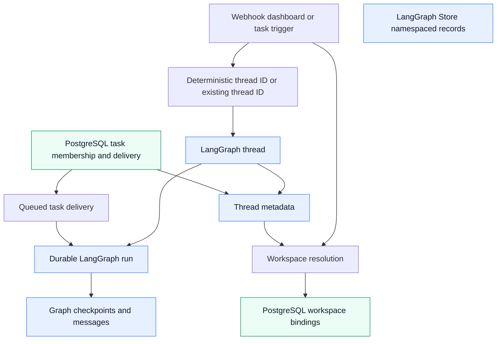

# Threads, Durable Runs, Workspaces, and Task State

A **thread** is the durable LangGraph conversation identity: its ID selects checkpointed graph state, messages, status, and thread metadata. A **run** is one execution against that thread. New messages create runs; they do not create a new conversation or replace its state. Thread IDs therefore form a persistence and routing contract between webhooks, the dashboard, reviewers, and background work.

Open SWE deliberately has more than one state authority. LangGraph owns graph checkpoints, threads, run records, thread metadata, and its namespaced Store. PostgreSQL owns relational workspace bindings and task-coordination records. Metadata may carry denormalized task or workspace facts for the runtime, but it is not authoritative for the relationships that PostgreSQL enforces.

```mermaid
flowchart TD
  Trigger["Webhook dashboard or task trigger"] --> Identity["Deterministic thread ID or existing thread ID"]
  Identity --> LGThread["LangGraph thread"]
  Trigger --> Route["Workspace resolution"]
  Route --> WorkspaceDB["PostgreSQL workspace bindings"]
  LGThread --> Run["Durable LangGraph run"]
  Run --> Checkpoint["Graph checkpoints and messages"]
  LGThread --> Metadata["Thread metadata"]
  TaskDB["PostgreSQL task membership and delivery"] --> TaskRun["Queued task delivery"]
  TaskRun --> Run
  TaskDB --> Metadata
  Metadata --> Route
  LGStore["LangGraph Store namespaced records"]

  classDef lg fill:#e7f0ff,stroke:#3b82f6,color:#111827
  classDef pg fill:#ecfdf5,stroke:#059669,color:#111827
  class LGThread,Run,Checkpoint,Metadata,LGStore lg
  class WorkspaceDB,TaskDB pg
```
This depicts the authoritative-store boundary: LangGraph retains conversational execution state; PostgreSQL enforces workspace and task relationships.

## Canonical thread identity

`openswe/thread_ids.py` is the sole definition of deterministic IDs. Its formulas, including the exact stable-key strings and UUID namespace, must not change: independently running entrypoints re-derive the ID to locate live threads, so a formula change strands existing conversations.

| Purpose | Stable key and derivation |
| --- | --- |
| Slack conversation | URL-namespace UUIDv5 of `slack:{channel}:{timestamp}:{nonce}` |
| External PR-agent conversation | UUIDv5 of `{owner}/{repo}/pr/{pr_number}` |
| Autonomous PR reviewer | UUIDv5 of `{owner}/{repo}/pr/{pr_number}/reviewer` |
| Review scout | UUIDv5 of `{owner}/{repo}/pr/{pr_number}/review-scout` |
| Per-user review chat | UUIDv5 of `{owner}/{repo}/pr/{pr_number}/chat/{login.lower()}` |
| Review style | UUIDv5 of `{owner}/{repo}/review-style` |
| Baby-sit lock | UUIDv5 of `open-swe:baby-sit-lock:{key}` |
| Linear or GitHub issue | SHA-256-derived UUID of `linear-issue:{issue_id}` or `github-issue:{issue_id}` |

The reviewer, scout, chat, and external-PR keys intentionally occupy distinct namespaces. `thread_id_from_branch` can recover a UUID embedded in an Open SWE-created branch, allowing an event on that branch to return to its original agent thread.

Thread creation is centralized in `openswe.threads.creation`. Person-openable threads require a nonblank title. `create_thread(..., if_exists="do_nothing")` preserves the existing thread and metadata, while `ensure_titled_thread` updates a system-generated title only until `title_locked` records a user rename. Short-lived lock threads instead use `if_exists="raise"` and a TTL as a mutex.

## Durable runs and per-run configuration

`dispatch_agent_run` is the normal entrypoint for Slack, Linear, GitHub, dashboard, and task-triggered agent work. It either builds a validated input from content and source identities or accepts prebuilt input, but rejects combining both. It then delegates to `create_durable_run`, which optionally ensures a titled thread before creating a run on the selected graph.

The durable defaults are:

- `multitask_strategy="interrupt"`: a follow-up interrupts active work while its synchronous checkpoint remains available. Callers that must wait their turn, including task delivery, choose `enqueue`.
- `durability="sync"`: checkpoints are written before each step so a crash or recycle resumes at the latest checkpoint.
- `if_not_exists="create"`, resumable streaming, all v3 stream modes, subgraph streaming, and the `__event_streaming_v2` compatibility marker. Those settings let an attaching dashboard replay an already-started run and see tool, task, checkpoint, and subgraph events.
- A resolved run `invocation_id`, copied into both configurable data and metadata, plus an invocation start time. Existing compatible metadata is merged rather than discarded.

A completion webhook is included only when a completion secret exists and `COMPLETION_WEBHOOK_URL` is absolute HTTP(S) and non-loopback. Invalid or local URLs degrade to no webhook with a warning, rather than making every `runs.create` fail. The configured LangGraph checkpointer deletes inactive checkpoint data after the 43,200-minute default TTL, swept every 60 minutes; durable continuity is thus not indefinite retention.

`configurable` is transport for a single run, not the durable thread record. `RunConfig` tolerates future keys, preserves extras when dumping only supplied fields, and iteratively removes only invalid fields when parsing. This prevents a malformed optional field from losing a usable `thread_id` or unrelated context. It also resolves `workspace` before legacy `environment`; follow-up configuration copies that workspace under both keys for compatibility and includes the thread's source context.

## Metadata, access, and Store semantics

Thread metadata is the small, queryable cross-surface record attached to a LangGraph thread. It carries such facts as title, owner identity, visibility, source, repository, workspace, model selection, sandbox relationship, and source context. It is not a substitute for authorization: dashboard readers fetch the thread and apply `assert_thread_readable`; actions requiring a GitHub token explicitly require the current user's token rather than an installation-token fallback.

`openswe.store` is the sanctioned wrapper for the separate LangGraph Store key/value API. Its failure policy is intentional: a missing item is `None`, but transport and other failures propagate. Callers that can safely degrade must make that decision explicitly. `TypedStore` validates retrieved records with its Pydantic model: a requested malformed record raises, while search operations log and skip malformed records so a historical bad record does not break an entire listing. Store namespaces can be prefix-searched, so callers that care about nested namespaces use entries that retain each item's actual namespace.

## Workspace selection and persistence

Workspace routing is centralized in `resolve_workspace`; callers should not reproduce the precedence. First match wins:

1. a workspace already recorded on the thread;
2. a valid opening-message `workspace:<slug>` tag (with `env:<slug>` accepted by tag extraction);
3. the Slack channel's bound workspace;
4. the repository's owning workspace;
5. the user's valid default workspace; then
6. the instance `default` workspace.

A channel outranks a repository because a workspace's channel must remain in that workspace even when its messages name a repository owned elsewhere. On later Slack messages, the stored thread workspace is reused, avoiding a route change after sandbox construction. The `default` workspace is therefore an explicit operational fallback, not evidence that a binding was successfully read.

The `workspace`, `workspace_repository`, and `workspace_slack_channel` relational records are PostgreSQL-owned. A repository is assigned to exactly one workspace, and unique constraints protect workspace slugs, repository bindings, and Slack-channel bindings. Routing distinguishes an unowned repository from an unreadable binding: `repo_is_routable` propagates lookup failure so a GitHub webhook can return 5xx and be retried instead of permanently dropping an event under the `ignore` policy. Resolution used to choose where work runs instead logs an error and returns `default`.

## Coordinator and worker task invariants

Task coordination is relational PostgreSQL state. `Task` has one coordinator thread and workspace; `TaskMembership` maps each thread to one task and role (`coordinator` or `worker`); `TaskDelegation` binds a worker thread to its task, permanent coordinator, instructions, selected model/effort, cancellation, and launch error. `Task.reserve_worker` serializes delegation by an advisory transaction lock keyed to the coordinator thread, creates the coordinator membership on first delegation, and rejects a worker identity already tied to another task.

A worker ID is deterministic: `uuid5(NAMESPACE_URL, "open-swe:task-worker:{coordinator_thread_id}:{request_id}")`. Stable tool-call `request_id` therefore makes reservation idempotent. Delegation additionally requires a configured completion webhook, enabled task coordination, a user-owned and authorized coordinator, an attached sandbox, and a resolved workspace. Workers and sandbox guests cannot spawn siblings; workers can message only their permanent coordinator, while a coordinator must explicitly select one of its own workers.

Launching a reserved worker creates a new LangGraph thread that inherits only selected coordinator metadata, including ownership, visibility, repository context, sandbox ID, participant data, and token repository scope. It stamps task ID, coordinator sandbox host, workspace, and explicit chosen model. The service reads the persisted worker back and rejects a conflicting identity before recording the assignment. This makes PostgreSQL reservation authoritative even if a launch fails partway through; launch errors are retained and only retryable failures may be retried.

Task messages are persisted before dispatch. Their deterministic message ID and `(thread_id, delivery_id)` conflict handling make recording idempotent. Delivery holds a per-recipient advisory lock, rebuilds all still-owed messages from graph state, records delivery attempts, and starts a durable `enqueue` run. It does not deliver to a busy thread under enqueue, stops after three attempts, and marks messages delivered only after their event-match IDs appear in graph messages. If dispatch fails after recording, the API reports pending rather than inviting a duplicate resend.

## Change and test focus

Changes here should preserve identity and ownership rather than merely make a run start:

- Test deterministic thread formulas and branch-ID recovery before changing an integration's routing.
- Test run creation arguments, interrupt versus enqueue behavior, replayable streaming, and invalid-webhook degradation.
- Test workspace precedence with a channel and repository owned by different workspaces, and test lookup-failure behavior separately for GitHub routability and ordinary resolution.
- Test task reservation idempotency, cross-task worker rejection, coordinator-only control, inherited worker identity checks, queued delivery, and cancellation. `tests/test_task_threads.py` covers these boundaries; `tests/test_thread_ops.py` covers queue de-duplication.

See [Invocation](../workflows/invocation.md), [Follow-up Messages](../workflows/follow-up-messages.md), [Collaborative Tasks](../workflows/collaborative-tasks.md), and [Sandbox Lifecycle](../architecture/sandbox-lifecycle.md) for surrounding flows.
