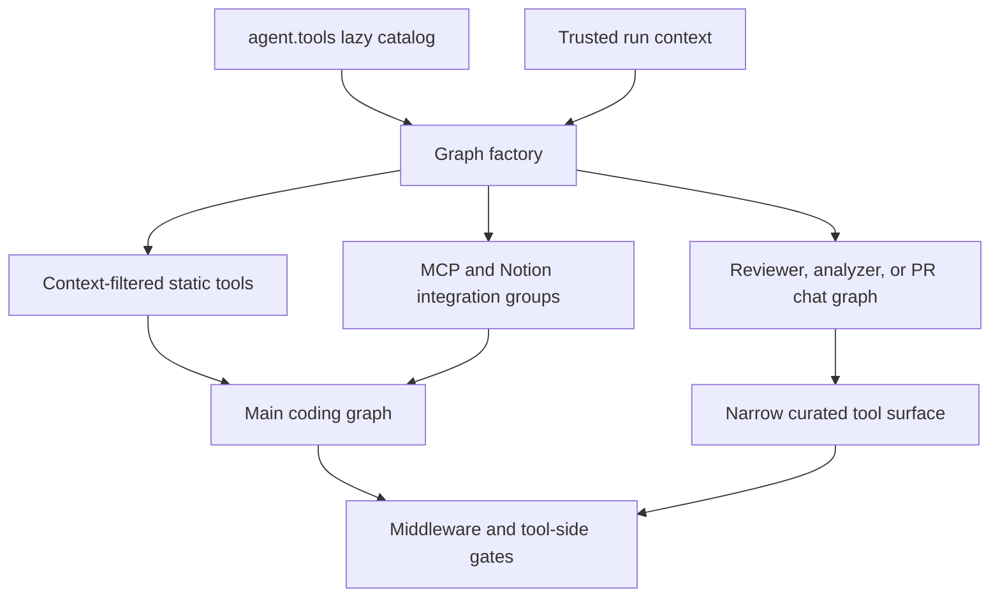
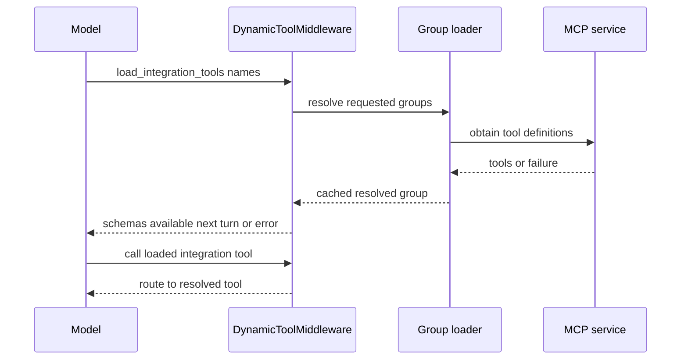

# Tool Capability and Authorization Model

A tool being importable is not a capability grant. Open SWE separates the curated `agent.tools` catalog, each Deep Agents graph's explicit `tools` list, run-context filtering, and tool-local authorization. The layers are complementary: graph assembly is least privilege, while a sensitive tool must independently trust runtime identity and scope rather than model input.

## From catalog to a run-specific surface

`agent.tools` is a lazy facade over curated local, GitHub, Slack, and incident tools. `_TOOL_MODULES` maps public names to modules; the facade imports and caches a value only when accessed. Its custom module type prefers an export over an identically named module attribute installed by `importlib`, avoiding a submodule shadowing its public callable. Exporting therefore makes a tool available for factories to import, but does not wire it into an agent.

The main `get_agent` factory gives the coding graph a baseline of web access, plan lifecycle, background work, personal settings and skills, thread and baby-sit operations, PR work, sandbox helpers when enabled, scheduling, issue reporting, feedback, and Slack/incident operations. Deep Agents adds its filesystem, shell, and delegation primitives; the main and general-purpose subagent exclude the built-in `grep` tool.

This shows that the catalog, graph assembly, and runtime enforcement are distinct capability layers.

### Context gates in the main factory

The static list is subsequently narrowed or augmented from trusted run state:

- `ADMIN_TOOLS`—automation, workspace, and organization-skill management—are attached only when `admin_thread` is both stamped and the current actor still passes the administrator check. `read_only_sql` additionally requires a private admin surface (dashboard or Slack DM).
- Signed sandbox download/service tools are present only when their feature gate is enabled. Personal settings and skill mutation tools disappear when no credential owner is available. Channel-history reading (`slack_read_channel_messages`) is available only on a private thread, because retrieved history enters the shared transcript.
- Slack tools are removed without enabled Slack context; a Slack DM also loses reactions. Expedited PR approval is removed for local runs, absent bot credentials, or disabled workspace support. Automatic incident turns receive an even more restrictive exclusion set.
- Desktop `local_run` deliberately collapses to `http_request`, `fetch_url`, and `web_search`; `stop_summary` collapses to Slack-thread reading and reply. Both bypass integration discovery. The general-purpose subagent receives the applicable static set except background execution and feedback, then separately filters tools that depend on parent source context.

## Dynamic integration loading

For eligible non-local, non-summary runs with known credential scope, the factory resolves workspace MCP tools and personal Notion tools concurrently. MCP sources are layered instance, workspace, then user, with a later same-named connection replacing an earlier one. The resulting `MCPs` and `Notion` groups are passed to `DynamicToolMiddleware`; names collide neither with `load_integration_tools`, Deep Agents primitives, nor the selected static tools.

The model initially sees only `load_integration_tools` and a catalog of names. It must request names before their schemas are added on a subsequent model call. A direct integration call before loading is a recoverable tool error. Group resolutions are lock-serialized and cached per middleware instance, including an empty result after failure; run state is reset to no loaded integration names before every run.

The deferred path prevents credential round trips and MCP handshakes from delaying the first model call or exposing every integration schema by default.

Notion is a more restrictive personal integration. Its loader offers tools only when the designated login is the private thread's credential owner and has a connection. Every wrapper requires `on_behalf_of`, resolves that person as a thread participant, checks that person is the private owner, and obtains a fresh access token before it invokes the hosted Notion MCP tool. Discovery/load failures degrade to an empty group; an invocation with no current authorization fails normally and is handled by the graph's tool-error middleware.

## Specialist graphs are intentionally narrow

| Graph | Curated surface and boundary |
| --- | --- |
| Main coding agent | Context-filtered static tools, Deep Agents primitives, and optionally loaded integration tools. |
| Reviewer | `fetch_review_diff`, finding create/update/list/publish/resolve/reply, plus `web_search`, `fetch_url`, and `http_request`; it does not expose `open_pull_request`. |
| Analyzer | Only `save_review_style_prompt` and `read_finding_outcomes` as curated tools for review-style guidance. |
| PR chat | GitHub-API-backed `read_repo_file` and `search_repo_code`, `list_review_findings`, and web tools. It has no sandbox; review context is virtual `/pr/` files and it uses a repository-scoped GitHub App token. |

PR chat also explicitly removes filesystem writes and shell execution. Its delegated subagent uses an allowlisted filesystem middleware containing only `read_file`, `ls`, `glob`, and `grep`, so the Deep Agents default subagent cannot reintroduce mutation.

## Plan mode is dynamic safety gating

`PlanModeMiddleware` is always installed for the main graph. Before a run it overwrites persisted `plan_mode` with that run's configured initial value, preventing an earlier planning state from leaking into later implementation. It recomputes the model-visible tools on every call, so `enter_plan_mode` takes effect on the next model turn.

When active, `PLAN_MODE_EXCLUDED_TOOLS` hides delegation, background work, mutable HTTP access, PR/review actions, thread and baby-sit mutation, sandbox-service URLs and recreation, personal-skill mutation, Slack moving/new-thread actions, workspace mutation, and automation mutation. Loaded MCP tools are also added to the exclusion set. `list_threads`, `get_thread`, plan approval, and Deep Agents `read_file`, `write_file`, `edit_file`, and `execute` remain visible. File and shell behavior is restricted by the plan prompt rather than a technical prohibition; `task` is excluded because its separately compiled subagent would otherwise bypass the parent plan-mode gate.

## Authorization and failure behavior

Tool wiring is not the authorization boundary. `read_user_settings` takes no caller-supplied user or thread identity: it resolves verified participants from the active run configuration and returns a limited profile projection, instructions, Notion connection status, and an unresolved-participant count—never credentials.

Automation tools are an example of defense in depth. They re-run `require_admin`; scheduled executions are accepted only if their saved schedule authorization is valid. Creation attributes the operation to the trusted administrator identity. Updates reject mutually contradictory set/clear arguments, and anticipated dashboard/service exceptions become `{ "ok": false, "error": ... }` results rather than escaping the tool call.

`ToolErrorMiddleware` is the common last-resort behavior for unhandled tool exceptions: it supplies a structured error `ToolMessage` so the model can self-correct rather than terminating the run. A transient sandbox connection rejection becomes a retry-oriented error stating that no command ran. An unreachable sandbox is different: the middleware notifies the user and re-raises, ending the run, because further sandbox calls would repeatedly fail and reconnecting could silently replace a working tree.

The main graph places generic error normalization outside the configured retry wrapper for `task`; the retry middleware may retry that operation up to two times with bounded delay before an error is normalized.

## Safely extending this model

1. Add a curated implementation and lazy export only if it belongs in the shared catalog; then wire it explicitly to the graph(s) that need it.
2. Decide all run-context constraints: admin and private-thread boundaries, credential owner, Slack/DM behavior, desktop and summary modes, incident policy, subagent inheritance, and plan-mode exclusion for a mutation.
3. Use an `IntegrationGroup` for optional or expensive credentials/MCP setup. Reserve every dynamic name against static and built-in names, and make load failure actionable and recoverable.
4. Revalidate actor, resource, and credential scope inside sensitive tools. Derive them from runtime configuration or trusted stores; never trust a model-supplied identity, and keep tokens server-side.
5. Add focused tests. Existing coverage exercises selected-schema loading and unavailable groups (`tests/middleware/test_dynamic_tools.py`), factory ordering and MCP plan-mode filtering (`tests/agent/test_factory_tool_loading.py`), Notion refresh and ownership checks (`tests/tools/test_notion_mcp_tools.py`), automation authorization (`tests/tools/test_automations.py`), and sandbox error distinctions (`tests/sandbox/test_sandbox_recovery.py`).

## Related pages

- [Agent graph](../architecture/agent-graph.md) — graph factories and runtime assembly.
- [Middleware stack](../architecture/middleware-stack.md) — ordering and cross-cutting middleware.
- [Authorization and security](auth-and-security.md) — trust boundaries and credentials.
- [Observability and MCP](../integrations/observability-and-mcp.md) — MCP operations and configuration.
- [PR creation](../workflows/pr-creation.md) — PR workflow behavior.
