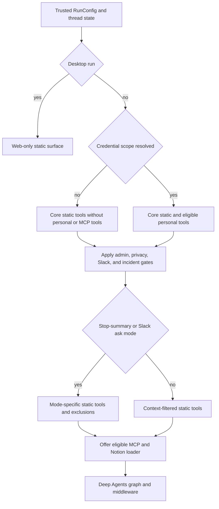

# Tool Surfaces and Capability Gating

Open SWE treats a tool export as a catalog entry, not a grant of authority. A capability becomes usable only after the graph factory selects it for a trusted run context; connected tools also pass the dynamic-loader boundary, and sensitive tools enforce authorization or scope again at invocation. This layered model is important because a model can choose arguments, but it must not choose its actor, private credential scope, thread visibility, sandbox identity, or administrative status.

## Gates are evaluated before tool families

`build_agent` constructs the main coding surface from `RunConfig` and verified runtime state. It first resolves the credential scope for non-desktop runs. If that resolution fails, it deliberately omits MCP tools; personal settings tools are also removed when no private credential owner is available. The factory determines whether an admin thread remains authorized through `actor_has_admin_context`, whether a thread is private before offering channel-history reads, and whether Slack context is enabled. These are selection gates, not prompt conventions.

Run mode further narrows the surface:

- A desktop run replaces the normal static list with `http_request`, `fetch_url`, and `web_search`.
- A stop-summary run replaces it with `slack_read_thread_messages` and `slack_reply`, and excludes mutating Deep Agents built-ins such as `write_file`, `edit_file`, `delete`, `execute`, and `task`.
- Slack-disabled runs lose Slack tools; direct-message runs additionally lose `slack_add_reaction`; a Slack `/oswe` ask keeps writes but removes thread-bound Slack operations. Channel-history reading is offered only to a private thread.
- An automatic incident run removes a named set of external, workflow, Slack, workspace, automation, and delegation actions. The `ExcludeToolsMiddleware` applies the resulting excluded built-in names to the Deep Agents surface.

The following flow shows the selection order used by the main factory. It shows capability selection, rather than a complete middleware stack.

*Capability selection in `build_agent`: trusted identity, credential, source, privacy, and run-mode gates determine the static surface before optional connected tools are attached.*

These factory checks do not replace tool-side checks. For example, `require_admin` rechecks a current configured administrator, or a schedule carrying saved administrator authorization. Tools that require the more restrictive private admin surface also require both an admin stamp and a dashboard or Slack-DM origin. This prevents an admin actor from making other participants administrators merely by sharing a thread.

## Static catalog and main-agent surface

`agent.tools` is a lazy curated facade: `_TOOL_MODULES` maps public tool names to local or external implementation modules, and access imports and caches the requested export. `_LazyToolsModule` prefers that public export when Python has installed a same-named imported submodule on the package. The catalog mixes local tools with GitHub, Slack, and incident implementations; exporting a name alone does not put it in any graph.

For a normal main run, the factory starts with web access; background work; plans and personal instructions/skills; thread, baby-sit, PR, sandbox-recovery, reporting, scheduling, feedback, Slack, and incident operations. LangSmith sandbox file download, iframe, and port-exposure helpers are conditional. `ADMIN_TOOLS`—automation, workspace lifecycle, and organization-skill mutation—is appended only to an authorized admin thread. `read_only_sql` and review-approval policy management require the still narrower private admin surface.

Deep Agents contributes filesystem, shell, and delegation primitives. `DEEP_AGENT_TOOL_NAMES` reserves `delete`, `edit_file`, `execute`, `glob`, `grep`, `ls`, `read_file`, `task`, and `write_file` so static and connected tools cannot collide with them. The normal main graph hides `grep`; it uses `ExcludeToolsMiddleware` for the mode and automatic-incident exclusions. A general-purpose subagent receives the applicable static tools but has an explicit guard that denies parent-only, thread-bound, Slack, background, user-settings, incident, and SQL capabilities. Because subagents compile separate graphs, the main factory explicitly supplies dynamic-tool middleware and its model/PR guards where appropriate.

## Connected services: deferred MCP and Notion tools

The main graph creates dynamic groups named `MCPs` and `Notion` only for non-desktop, non-stop-summary runs with a known credential scope. MCPs load in precedence order from instance, workspace, and then the private user source, where a later same-named connection replaces an earlier one. The loaders run concurrently during factory construction and are protected by a timeout/cache wrapper that returns an empty result on timeout or error.

`DynamicToolMiddleware` initially exposes only `load_integration_tools` and a catalog of tool names. It rejects names colliding with the loader, reserved Deep Agents names, static names, or another group. When the model requests names, the middleware resolves the corresponding group, records the names in `loaded_integration_tools`, and adds resolved schemas only on the next model turn. Calling a connected tool before loading it returns a recoverable error. Each group has a lock and caches both success and failure, while the loaded-name state is reset at the start of a top-level run but preserved for a forked subagent context. Load errors degrade to an unavailable-tool message rather than terminating the agent.

Notion is a personal-service boundary. The initial loader returns no tools unless the requested login is the verified private thread owner and has a connection. Each exposed schema requires `on_behalf_of`, resolves that value to a thread participant, verifies that the participant is the private owner, obtains a fresh Notion token, rebuilds the hosted MCP tool, and invokes it without forwarding `on_behalf_of`. Thus the displayed schema may be cached, but credentials are not reused at call time.

Workspace MCP tools are dynamically named and allowlist-filtered. Their invocation reloads connection policy and credentials, so disabling, deleting, or changing the allowlist revokes a previously loaded tool; one broken server does not hide tools from other connections. New connections expose nothing until an administrator selects allowed tools.

## Sandbox capability surface

A sandbox can discover and invoke the thread's agent tools over `/dashboard/api/sandbox-tools`, but it receives a capability rather than general dashboard credentials. The server issues an HS256 JWT bound to a `thread_id` and `sandbox_id`, with the dedicated audience `open-swe-sandbox-tools`; it provisions the endpoint through a proxy rule or, outside LangSmith sandboxes, writes a protected URL file. Authentication checks the JWT signature, audience, required claims, and current thread metadata binding, so a sandbox rebind revokes an old token.

The sandbox API reconstructs the saved run context and current thread state, rebuilds the agent, and prepares a `ToolSurface`. Discovery resolves connected tools and omits excluded built-ins plus `load_integration_tools`. Invocation accepts only a catalogued tool and schema-declared arguments, then runs the graph's tools node without a model call. Connected tools are marked loaded for that isolated invocation, so the sandbox can invoke a discovered integration directly while still using the normal middleware chain. The HTTP routes set `no-store` and `no-referrer`, cap request bodies at 1 MiB, and convert unexpected invocation failures to a generic server error.

## Administrative and personal tools

Automation tools are catalogued alongside normal tools but wired only through `ADMIN_TOOLS`. Every automation operation repeats `require_admin`; it returns a structured denial instead of relying on graph composition. Creation derives the acting identity from runtime configuration or an authorized scheduled record, passes it to the schedule store, and only scheduled invocations use workspace credentials. Updates reject simultaneous set and clear values for repository or Slack channel fields, retain omitted values, and service exceptions become `{ok: false, error: ...}`. Trigger and delete use the same authorization/error contract.

`read_user_settings` has no user or thread argument. It resolves the private credential owner when possible and returns that user's expanded profile settings and preferences; otherwise it resolves verified thread participants and returns a restricted profile subset for each. Both cases include instructions and a redacted Notion connection status, never an access token. Failure to verify the requester or participants is returned as a safe error result.

## Specialist graph surfaces

The main agent is not the only graph, and its broad surface must not be inferred for the others.

| Graph | Capability surface |
| --- | --- |
| Reviewer | Review diff and finding lifecycle tools, plus `web_search`, `fetch_url`, and `http_request`; it does not receive `open_pull_request`. |
| Analyzer | Only `save_review_style_prompt` and `read_finding_outcomes` for review-style guidance. |
| PR chat | GitHub-API-backed `read_repo_file` and `search_repo_code`, `list_review_findings`, and web read tools. It has no sandbox; PR overview, diff, and findings arrive as virtual `/pr/` files. |

PR chat excludes mutating filesystem and shell built-ins. Its explicit delegated subagent filesystem allowlist contains only `read_file`, `ls`, `glob`, and `grep`; preparation obtains a repository-scoped GitHub App installation token for its repository-read tools rather than a user credential.

## Extension and test guidance

When adding a capability, first decide its authorization and run-mode boundaries, then its graph surface—do not start by adding an export. Add a curated export only if consumers need the facade; wire it into the minimal graph list; reserve its name against Deep Agents and connected names; and make privileged tools derive identity and resource scope from runtime context. Put expensive or credentialed integrations behind an `IntegrationGroup`, with recoverable loading failure. Consider the sandbox API separately: a tool available to the main graph can become sandbox-callable when its thread context is saved and its name is not excluded.

Focused tests document the critical contracts: `tests/middleware/test_dynamic_tools.py` covers deferred schemas, collisions, recovery, caching, aliases, and fork state; `tests/tools/test_notion_mcp_tools.py` covers private-owner and fresh-token behavior; `tests/tools/test_workspace_mcp_tools.py` covers filtering and revocation; `tests/sandbox/test_thread_tools.py` covers capability binding, context restoration, schema validation, direct connected invocation, and HTTP limits; and `tests/tools/test_automations.py` verifies repeated administrator authorization and identity propagation.

## Related pages

- [Agent graph](../architecture/agent-graph.md) — graph factories and runtime assembly.
- [Middleware stack](../architecture/middleware-stack.md) — ordering and behavior of main-agent middleware.
- [Observability and MCP](../integrations/observability-and-mcp.md) — connected-service configuration and operations.
- [PR creation](../workflows/pr-creation.md) — PR workflow behavior.
