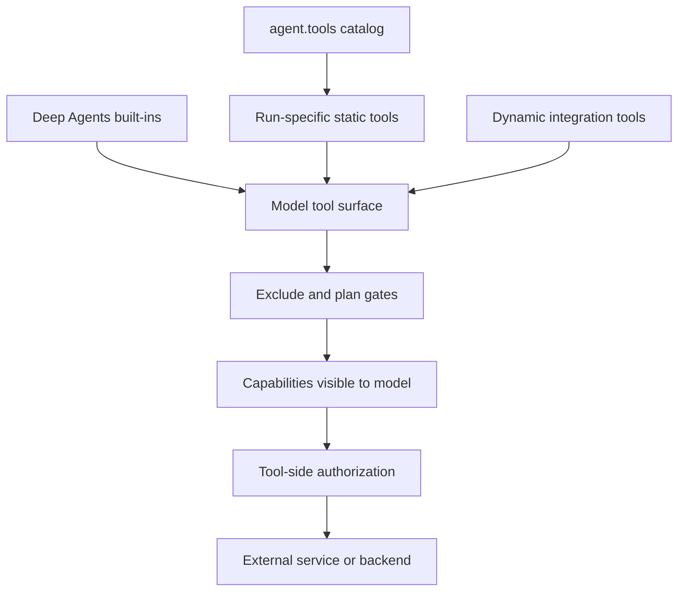
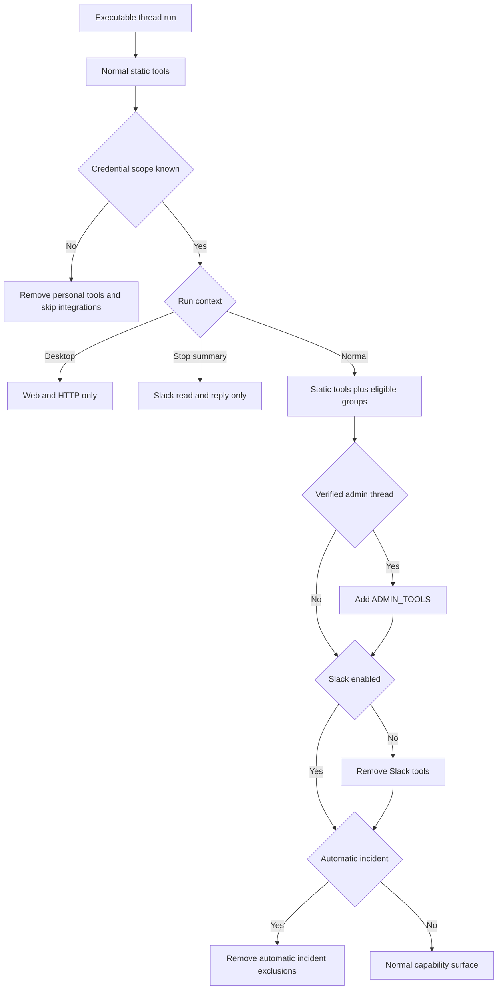

# Tool and Skill Capability Model

Open SWE treats an importable tool, a tool shown to the model, and a tool authorized to act as separate things. `agent.tools` is a lazy curated catalog; `get_agent` chooses a run-specific static surface; Deep Agents supplies filesystem and delegation built-ins; middleware then adds or removes capabilities per model call. Sensitive tools also validate trusted runtime context at invocation time.

## Capability layers

`agent.tools` maps public names to flat local modules and selected GitHub, Slack, and incident modules. Access imports an export on demand and caches it. Its custom module type ensures a same-named submodule placed on the package by `importlib` cannot shadow the public export. Catalog membership is therefore not a grant: a factory must still pass a tool to `create_deep_agent`.

Deep Agents contributes `delete`, `edit_file`, `execute`, `glob`, `grep`, `ls`, `read_file`, `task`, and `write_file`. `DEEP_AGENT_TOOL_NAMES` reserves those names when dynamic groups are constructed. The main graph always hides `grep`; stop-summary mode also hides file mutation, shell execution, deletion, and delegation after Deep Agents has injected them. `ExcludeToolsMiddleware` must run after tool-injecting middleware precisely so it can remove injected built-ins.

This diagram shows that graph wiring, model visibility, and tool-side authorization are independent capability boundaries.

## Main-agent assembly and contextual gates

For executable runs with a thread ID, `agent.server:get_agent` starts or reconnects a sandbox backend and builds the main Deep Agent. Its normal static surface includes web access, plan lifecycle, background work, personal-instruction and skill mutations, dashboard thread and notification operations, PR/recovery/scheduling helpers, safe settings lookup, Slack and incident tools, feedback, and—only for an approved admin thread—workspace administration. Sandbox file-download and service-URL helpers are conditional on run configuration.

The surface is then narrowed by trusted context:

- A desktop/local run is limited to `http_request`, `fetch_url`, and `web_search`; a stop-summary run is limited to Slack thread reading and reply. Neither mode loads MCP or Notion definitions.
- Slack tools are removed unless trusted Slack context enables them. If credential scope cannot be resolved, personal instructions/skills/settings tools are removed and MCP loading is skipped rather than assuming access.
- `admin_thread` is effective only when the flag is set **and** the triggering user is currently an administrator. Scheduled work instead requires saved authorization for that schedule. `ADMIN_TOOLS` then adds sandbox reset, automation management, environment management, and organization-skill mutations.
- An automatic incident turn receives a stricter research-oriented surface: it additionally loses incident control, Slack posting/reaction tools, PR, HTTP, and delegation capabilities. An explicit authorized responder request restores the normal set.

This is the factory-time gating path. It reduces what can be offered, while sensitive operations retain their own checks.

## Deferred MCP and Notion tools

The factory concurrently obtains workspace MCP tools and, where a verified private credential owner exists, personal Notion definitions. These become `MCPs` and `Notion` groups in `DynamicToolMiddleware`, not static schemas. Workspace MCPs are always candidates; a private owner also permits that owner's user-MCP source. The factory's cached Notion loader has a five-minute cache, and cached loader failures or timeout resolve to an empty list.

Only integration names—not full schemas—appear initially through `load_integration_tools`. The model requests names (also accepting `Group:name` and `Group: name` aliases); the middleware resolves each backing group, records `loaded_integration_tools` in run state, and exposes resolved tools on the next model turn. A direct call before loading, an unknown name, or an unavailable resolved name returns a recoverable error telling the model to continue.

`DynamicToolMiddleware` rejects duplicates against the loader, static tools, and Deep Agent reserved names. It resets loaded names for every run, locks each group while it resolves, and caches both a successful result and a failed empty result for that middleware instance. Plan mode removes every loaded workspace MCP tool as well as its named exclusions, so a dynamically added MCP tool cannot evade the plan gate.

Notion is deliberately more restrictive than a generic MCP bridge. Loading is allowed only for the verified private owner. Each exposed schema adds required `on_behalf_of`; invocation resolves that thread participant, verifies that it is the private owner, obtains a fresh access token, reconnects to Notion's hosted MCP endpoint, and invokes the matching tool. Tokens remain server-side and are not retained in the sandbox.

## Skills and composite backends

Skills are files exposed through a `CompositeBackend`, separate from the sandbox default backend. Bundled skills are always read-only. A normal private thread adds read-only organization skills and a read-only user-skill route scoped to the verified credential login. A public or unknown-credential thread receives organization and bundled sources only; a desktop run receives snapshotted state-backed user skills plus bundled skills. Routes reject writes, preventing skill files from being poisoned through the agent filesystem.

`WorkspaceSkillsMiddleware` replaces Deep Agents' `SkillsMiddleware` at its normal stack position for public/unknown-scope non-desktop runs. Before agent execution and each model call it filters retained `skills_metadata` to configured sources and clears load errors. This prevents a public checkpoint that once carried personal skill metadata or diagnostics from leaking that context into a resumed prompt.

The general-purpose subagent is a separately compiled graph, not a child wrapped by all parent middleware. It receives the filtered static list (without background execution or feedback), excludes Slack, thread, incident, settings, and other parent-context tools, and receives dynamic-tools, workspace-skills when needed, workflow, offloading, and model-guard middleware explicitly. This is why `task` is excluded in plan mode: delegated work would otherwise have a separately assembled surface that does not inherit the parent plan gate.

## Stateful plan-mode gate

`PlanModeMiddleware` is installed unconditionally and resets `plan_mode` to the initial value resolved for each run. That prevents a `True` left in persisted thread state by a previous run from constraining an approved implementation run. Conversely, `enter_plan_mode` updates tracked run state, and the middleware filters every subsequent model request, so self-activation takes effect on the next turn.

When active, it hides `task`, background work, sandbox service/recovery, mutating HTTP, baby-sit/thread/PR actions, personal skill mutations, Slack moves/new threads, environment mutations, and automation mutations. `read_file`, `write_file`, `edit_file`, and `execute` remain technically available so the agent can draft a plan under `/workspace/plans/`; prompts, rather than the middleware, require non-mutating shell behavior and prohibit changing cloned repositories. This is a safety boundary for external effects, not a complete filesystem sandbox.

## Tool-side authorization and failure behavior

Administrative graph wiring is defense in depth, not sufficient authorization. `require_admin` rechecks normal invocations against configured administrators and schedule invocations against their saved authorization. Automation tools use it for every operation, derive creation/update identity from runtime context, reject conflicting clear/set update arguments, and convert expected authorization or service exceptions into structured `{ok: false, error: ...}` results. Scheduled automation execution can use workspace credentials only after its saved authorization is verified.

`read_user_settings` accepts no user identity argument. It resolves verified active-thread participants, concurrently reads their profile settings, instructions, and Notion connection status, and returns only an allowlisted profile subset plus an unresolved-participant count. It returns an error before any settings reads when participant verification fails; connection tokens and unrelated profile fields are not returned.

## Change checklist and focused tests

When adding a capability:

1. Add the implementation to `agent/tools/` and `_TOOL_MODULES`, but wire it only into the graph that needs it.
2. Decide factory gates: run source/mode, Slack, credential scope, admin thread, incident behavior, and whether a subagent may receive it.
3. For MCP-like or costly integrations, use an `IntegrationGroup`, reserve names, defer schemas, and make discovery/load failure recoverable.
4. Put identity, resource-scope, and credential checks inside any sensitive tool; derive them from runtime context rather than model arguments.
5. For a mutation, add it to `PLAN_MODE_EXCLUDED_TOOLS` when planning must not expose it, and consider whether an independently compiled subagent could bypass the policy.
6. Test the narrow contract: dynamic schema visibility/routing and unavailable groups (`tests/middleware/test_dynamic_tools.py`); factory mode, scope, skill-route, and parent/subagent composition (`tests/agent/test_agent_assembly_context.py`, `tests/agent/test_factory_tool_loading.py`); plan transitions; and tool authorization/redaction (`tests/tools/test_automations.py`, `tests/agent/test_read_user_settings.py`).

## Related pages

- [Agent graph](../architecture/agent-graph.md) — graph factories and execution lifecycle.
- [Middleware stack](../architecture/middleware-stack.md) — ordering and cross-cutting middleware responsibilities.
- [Authorization and security](auth-and-security.md) — identity and credential trust boundaries.
- [Observability and MCP](../integrations/observability-and-mcp.md) — MCP operations and configuration.
