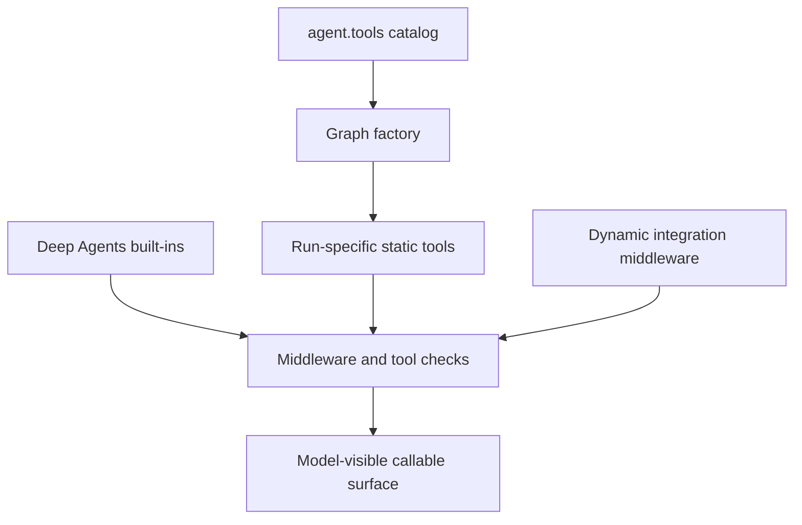
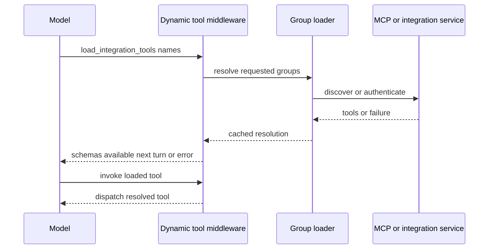

# Tooling and Capability Boundaries

Open SWE separates **availability** from **permission**. A Python export is merely a curated implementation catalog; a graph factory decides whether it is offered for a run; middleware can hide or route it at model-call time; and sensitive tools must still validate trusted runtime identity and scope when invoked. Consequently, neither the contents of `agent/tools/` nor an individual graph’s current list should be treated as a stable public API or as sufficient authorization.

## From catalog to executable surface

`agent.tools` is a lazy export facade. `_TOOL_MODULES` maps public names to local, GitHub, and Slack implementations, loading and caching an export only when accessed. Its custom module type ensures an imported submodule with the same name does not replace the public callable. Exporting does **not** enable a capability: graph factories explicitly pass selected tools to `create_deep_agent`.

Deep Agents independently injects filesystem and delegation tools (`read_file`, `write_file`, `edit_file`, `delete`, `ls`, `glob`, `grep`, `execute`, and `task`). The main factory reserves these names when it constructs dynamic integrations so integrations cannot collide with built-ins or static tools. It hides `grep` from normal main-agent model calls, while stop-summary runs also hide mutable filesystem, shell, and delegation built-ins.

This shows the successive decisions between an importable implementation and a model-visible capability.

## Main-agent composition and run modes

`agent.server:get_agent` is the main coding-agent entrypoint. In a normal eligible run it supplies web access, planning lifecycle, background work, personal instructions and skills, thread and notification operations, PR operations, sandbox recovery, scheduling, safe settings lookup, issue reporting, and Slack operations. Sandbox download, iframe, and service URL helpers are appended only when sandbox file downloads are enabled. If there is no resolved private credential owner, the personal-instructions, personal-skill, and settings tools are removed; Slack tools are separately removed unless trusted Slack context enables them.

The factory then replaces—not supplements—the normal static list for constrained modes:

- A desktop `local_run` receives only `http_request`, `fetch_url`, and `web_search`.
- A `stop_summary` run receives only `slack_read_thread_messages` and `slack_thread_reply` and uses the stronger built-in exclusion set.
- An admin-thread request gets `ADMIN_TOOLS` only if the `admin_thread` flag **and** a trusted current-admin or authorized-schedule check succeed. This set covers sandbox reset, automation management, environment management, and organization-skill changes.

The general-purpose subagent is compiled as its own graph rather than inheriting parent middleware. It starts from applicable static tools but removes background tools and parent-context-dependent Slack, thread, notification, and settings operations. The factory explicitly gives it the dynamic-integration middleware and its own exclusion and workflow-push protections. This boundary matters when adding a parent policy: a separately compiled subagent needs an intentional equivalent rather than assuming wrapping middleware propagates.

## Deferred integrations: MCP, Notion, and browser

For non-local, non-summary runs with a known credential scope, the main factory concurrently obtains workspace/personal MCP tools and Notion definitions; its cache wrapper bounds each loader by `TOOL_LOADER_TIMEOUT_SECONDS` (default five seconds) and turns timeout or loader failure into an empty result. Browser tools are offered only when the sandbox-local Stagehand configuration is valid. The groups are passed to `DynamicToolMiddleware` as `MCPs`, `Notion`, and, when enabled, `Browser`.

The middleware initially exposes only `load_integration_tools` and a catalog of names/group labels—not every remote schema. A model loads selected names, after which the middleware records `loaded_integration_tools`; it builds the relevant group and adds resolved schemas to the **next** model request. A direct call before loading gets a recoverable error. Unknown names, unavailable tools, and group-loading failures likewise become error tool messages that tell the model to continue without the tool.

This is the explicit-load path; tool names can be advertised without paying connection or credential costs before they are needed.

Integration names must be unique and cannot collide with the loader, static tools, or Deep Agents names. The middleware resets loaded names for every run, serializes a group’s first load with a per-group lock, and caches both a successful resolution and a failed empty resolution for that middleware instance. It accepts `Group:name` and `Group: name` aliases for catalog selection.

MCP availability is itself policy-controlled by the connection runtime: workspace sources are always considered, while a private credential owner can add personal sources. Connection-provided tools are namespaced and allowlisted, and invocation refreshes connection configuration so disabling, deleting, or changing the allowlist revokes an already-loaded tool. Plan mode additionally excludes the current MCP tool names.

Notion is a distinct credential boundary. Its hosted-MCP definitions are offered only for the private thread owner with a connection. Every wrapped schema requires `on_behalf_of`, resolves that value as a thread participant, then reacquires the owner’s access token and underlying MCP tool at invocation time. It therefore does not retain an access token in the sandbox or accept an arbitrary participant identity.

Browser automation is sandbox-local Stagehand rather than a browser credential integration. It is enabled only for the `langsmith` sandbox type with an API key and supported model provider; each operation obtains the current thread sandbox and communicates with its local Stagehand runtime. Browser operations that interact with or extract from a page are plan-mode excluded, whereas `browser_close` remains visible so an existing session can be closed.

## Skills are read-only context routes

Skills are not a grant to mutate the skill store. The main agent constructs a composite backend that mounts bundled skills and, depending on run type and credential ownership, organization and user skill routes as `ReadOnlyBackend`s. Desktop runs use user and bundled routes plus separate artifact routes; other runs can read organization and bundled skills and, with a credential owner, user skills. `WorkspaceSkillsMiddleware` limits preserved skill metadata to its configured source prefixes and clears inherited load errors, avoiding cross-route state leakage.

Mutation is separately exposed through static personal-skill tools or, for organization skills, the admin-only static surface. As with every sensitive tool, that surface selection is not a replacement for its own authorization review.

## Specialist graph boundaries

| Graph | Tool boundary |
| --- | --- |
| Main coding agent | Context-dependent static tools, applicable Deep Agents built-ins, read-only skill routes, and explicitly loaded dynamic groups. |
| Reviewer | Review diff and finding lifecycle operations plus `web_search`, `fetch_url`, and `http_request`; it does not wire `open_pull_request`. |
| Analyzer | Only `save_review_style_prompt` and `read_finding_outcomes`, with a skills route for review-style guidance. |
| PR chat | GitHub-backed `read_repo_file` and `search_repo_code`, `list_review_findings`, and web reading. It has no sandbox. |

PR chat receives overview, diff, and findings as virtual `/pr/` files, so its built-in read tools operate on supplied review context. Its preparation middleware obtains a repository-scoped GitHub App installation token for the GitHub read tools, rather than passing a user credential. Both its primary graph and delegated subagent exclude write and shell capability; the delegated filesystem middleware allowlists only `read_file`, `ls`, `glob`, and `grep`.

## Enforcement layers and failure behavior

`ExcludeToolsMiddleware` is a general model-surface filter designed to run after tool-injecting middleware, so it can remove Deep Agents built-ins as well as curated tools. It does not itself authorize a call; it prevents the model from being offered a named tool on each request.

Plan mode is another model-surface control, not a complete sandbox immutability guarantee. `PlanModeMiddleware` is installed for every main graph and resets `plan_mode` at run start to that run’s configured initial value, avoiding stale state from a prior run. It reevaluates state before every model request, so `enter_plan_mode`’s command takes effect on the following turn; `approve_plan` can persist approval and issue a command that clears the state.

When active, the plan gate hides delegation, background execution, browser interaction/extraction/navigation/observation, mutable HTTP requests, thread and baby-sit mutation, PR actions, sandbox reset/recreation, user-skill changes, Slack moves/new threads, environment mutation, automation mutation, and all MCP tools loaded for the run. Read-only thread lookup, plan approval, and filesystem editing tools remain available so a plan artifact can be drafted under `/workspace/plans/`. `execute` also remains technically available and is constrained by prompt discipline rather than an execution-level read-only restriction; `task` is excluded because a delegated graph would otherwise bypass the parent plan gate.

Other middleware constrains particular bypass paths. The PR-creation guard blocks direct `gh`, GitHub API, or curl PR creation and directs the model to `open_pull_request` so attribution is preserved. The workflow-push guard separately inspects workflow-file changes and controls push approval. `ToolErrorMiddleware` normalizes ordinary tool exceptions into structured error `ToolMessage`s so the model can recover; transient sandbox rejections are reported as not-started operations, while an unreachable sandbox is notified and re-raised because later sandbox calls cannot succeed.

## Tool-side authorization

Tool wiring is least privilege, not authorization. `read_user_settings`, for example, takes no user or thread selector. It resolves verified participants from runtime configuration and returns selected normalized profile settings, instructions, Notion connection status, and an unresolved-participant count—never credentials.

Automation tools repeat an admin check at invocation. Interactive calls check the current configured admin identity; scheduled calls require saved authorization for that specific schedule. They return structured `{ok: false, error: ...}` results for denials and anticipated service failures, derive creation identity from trusted configuration, reject contradictory clear/set update arguments, and preserve omitted update fields. This is the model for a privileged extension: derive actor and resource scope from trusted runtime data, keep secrets server-side, and make expected operational failures actionable without trusting model-supplied authority.

## Safe extension checklist

1. Implement and export a tool only as a catalog step; wire it deliberately into the appropriate graph and run modes.
2. Decide its availability boundaries: local and summary modes, Slack context, credential ownership, admin threads, subagents, and plan mode. Reserve its name against static and Deep Agents surfaces.
3. For a remote or expensive integration, use an `IntegrationGroup` with a unique advertised catalog, recoverable loading behavior, and server-side credential handling.
4. Enforce authorization, identity, resource scope, and destructive-action confirmation inside the tool or integration runtime. Do not rely only on visibility filtering or metadata flags.
5. Add focused tests for composition and mode filtering, deferred loading and failures, authorization denial, credential refresh/revocation, and plan-mode behavior for every new mutation. Existing focused coverage lives around dynamic middleware, factory tool loading, plan mode, Notion, and workspace MCP tools.

## Related pages

- [Agent graph](../architecture/agent-graph.md) — graph factories and runtime assembly.
- [Middleware stack](../architecture/middleware-stack.md) — ordering and broader middleware responsibilities.
- [Authorization and security](auth-and-security.md) — trust boundaries and credentials.
- [Observability and MCP](../integrations/observability-and-mcp.md) — MCP configuration and operations.
- [PR creation](../workflows/pr-creation.md) — attributed PR creation and its guard.
