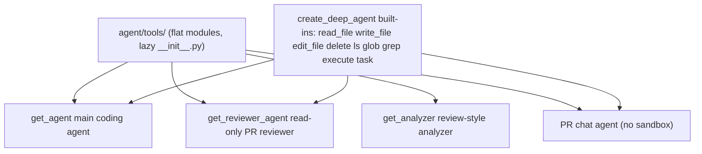

# Agent Tools (Curated Toolset)

Open SWE deliberately keeps a **small, curated toolset** rather than accumulating
tools. Stripe's insight that "tool curation matters more than tool quantity" is a
stated product principle: GitHub work happens through `gh` in the sandbox, content
search uses `rg` through `execute`, and only capabilities that genuinely need a
first-class tool get one.

Every tool lives in `agent/tools/` and is exposed through `agent/tools/__init__.py`.
The graph factories (`get_agent`, `get_reviewer_agent`, `get_analyzer`, and the PR
chat agent) each import the subset of tools they wire in, alongside the built-in
tools that `deepagents.create_deep_agent` contributes.

## Where tools live and how they are imported

All tool modules sit flat under `agent/tools/`, and `agent/tools/__init__.py`
re-exports them. The package uses **lazy imports**: `_TOOL_MODULES` maps each
exported name to its submodule, and a custom `_LazyToolsModule` / `__getattr__`
loads the module on first attribute access. This keeps import cost off the hot
path — importing `agent.tools` does not eagerly import every tool's dependencies.
A single symbol can be re-exported from a shared module (for example both
`background_execute` and `background_task` come from `.background_execute`, and the
four `environments` tools all live in `.environments`).

## Toolsets per graph

The tools a run sees depend on which graph is running and on run configuration.
The important distinction is between statically wired tools, built-in deepagents
tools, and the several toolsets that differ by graph.

Curated tools flow from `agent/tools/` into each graph, while deepagents contributes built-in filesystem, shell, and subagent tools.

### Built-in deepagents tools (do not duplicate)

`create_deep_agent` itself adds the file, shell, and subagent tools:
`read_file`, `write_file`, `edit_file`, `delete`, `ls`, `glob`, `grep`,
`execute`, and `task` (subagent spawning). These names are tracked in
`server.py:DEEP_AGENT_TOOL_NAMES` and must not be re-implemented as curated tools.
The default agent excludes `grep` (`DEEP_AGENT_EXCLUDED_TOOLS`), and the "stop
summary" mode strips the mutating built-ins.

### Main agent (`get_agent`)

`agent/server.py:get_agent` assembles the main agent's tools from a `static_tools`
list plus dynamically loaded groups. The static list spans web tools
(`http_request`, `fetch_url`, `web_search`), planning (`approve_plan`,
`enter_plan_mode`, `save_plan`), background execution (`background_execute`,
`background_task`), Linear tools, thread tools (`list_threads`, `get_thread`,
`manage_thread`), `manage_baby_sit`, `open_pull_request`, `request_pr_review`,
`schedule_thread_wakeup`, Slack tools, and user-facing helpers such as
`save_user_instructions`, `save_user_skill`/`delete_user_skill`,
`read_user_settings`, `recreate_sandbox`, and `report_platform_issue`.

The list is not fixed. Admin threads gain `ADMIN_TOOLS` (`sandbox_reset`,
environment management, organization-skill management); sandbox file-download tools
(`output_iframe`, `create_sandbox_file_download_url`) are added only when enabled;
Slack tools are dropped when Slack is not enabled for the run; `local_run` collapses
to just web tools, and `stop_summary_mode` collapses to Slack read/reply only.
Optional integration groups (observability, Currents, Notion, Corridor, browser
tools) are loaded through `DynamicToolMiddleware` and gated by authorization.

### Reviewer (`get_reviewer_agent`)

`agent/reviewer.py:get_reviewer_agent` wires a **read-only** toolset with no
commit/push/PR-opening tools: `fetch_review_diff`, `add_finding`, `update_finding`,
`list_findings`, `publish_review`, `resolve_finding_thread`,
`reply_to_finding_thread`, plus the shared web tools `web_search`, `fetch_url`, and
`http_request`. The reviewer publishes exactly one review per PR via `publish_review`.

### Analyzer (`get_analyzer`)

`agent/analyzer.py:get_analyzer` runs a minimal graph with just two tools:
`save_review_style_prompt` (the `save_review_style` module's export) to emit the
per-repo review-style prompt, and `read_finding_outcomes` used in continual mode to
refine that prompt from the reviewer's own historical finding outcomes.

### PR chat agent

`agent/chat.py` builds a separate, sandbox-less "chat with this PR" agent for the
review UI. It uses GitHub-API-backed read tools (`read_repo_file`,
`search_repo_code`), `list_review_findings`, and the web tools `web_search` /
`fetch_url`, operating over PR context seeded as virtual `/pr/` files.

## Tool groups by domain

- **Sandbox / repo.** `background_execute` / `background_task` run non-blocking
  commands in the thread sandbox; `read_repo_file` and `search_repo_code` read
  repository source over the GitHub contents/code-search API for the sandbox-less
  chat agent; `environments` provides admin environment management
  (`list_environments`, `save_environment`, `capture_environment_snapshot`,
  `delete_environment`); `sandbox_reset` and `recreate_sandbox` manage sandbox state.
- **Planning.** `enter_plan_mode`, `save_plan`, and `approve_plan` drive the
  plan/approve lifecycle.
- **GitHub / PR.** `open_pull_request` opens PRs, `request_pr_review` requests a
  reviewer run, and `fetch_review_diff` materializes the current review diff into
  the reviewer's sandbox.
- **Linear.** `linear_comment`, `linear_create_issue`, `linear_delete_issue`,
  `linear_get_issue`, `linear_get_issue_comments`, `linear_list_teams`,
  `linear_search_issues`, `linear_update_issue`.
- **Slack.** `slack_add_reaction`, `slack_read_thread_messages`,
  `slack_start_new_thread`, `slack_thread_reply`, `slack_attach_html`,
  `slack_move_thread`, and `manage_code_channel` (the channel-per-task session).
- **Findings / review.** `add_finding`, `update_finding`, `list_findings`,
  `list_review_findings`, `publish_review`, `resolve_finding_thread`, and
  `reply_to_finding_thread`.
- **Scheduling / baby-sit.** `schedule_thread_wakeup` schedules a future wake of the
  thread, and `manage_baby_sit` controls opt-in PR CI monitoring.
- **Web.** `http_request`, `fetch_url`, and `web_search` reach the public network.
  These process attacker-influenced content and are treated as a residual-risk class.

## Parent-agent-only tools and plan-mode restrictions

`list_threads`, `get_thread`, and `manage_thread` (all in `agent/tools/threads.py`)
are parent-agent-only thread-management tools. Rather than trusting thread metadata,
each derives the acting user from trusted run configuration, rechecks
allowed-organization membership, and preserves the dashboard's owner/participant/admin
authorization checks — so an agent cannot act on a thread on behalf of an
unauthorized user.

Plan mode is enforced by `PlanModeMiddleware` with `PLAN_MODE_EXCLUDED_TOOLS`. It is
installed unconditionally and is state-aware, so it also restricts tools after a
mid-run `enter_plan_mode` call, not only when a run starts in plan mode. The excluded
set removes mutating/side-effecting tools during planning — including `task`,
`background_execute`/`background_task`, `http_request`, `open_pull_request`,
`request_pr_review`, `manage_thread`, `manage_baby_sit`, `sandbox_reset`,
`recreate_sandbox`, the mutating Linear tools, and environment mutations. The two
read-only thread tools (`list_threads`, `get_thread`) remain available in plan mode;
`manage_thread` does not.

## Agent/UI parity principle

Agent/UI parity is a product principle: anything a user can do in the dashboard UI
should generally also be possible through an agent tool, subject to the same
authorization and safety boundaries. When a UI capability is added, the
corresponding curated tool should be added or extended unless there is a documented
reason not to. This is why thread management, plan approval, environment management,
and code-channel operations exist as tools that reuse the dashboard's authorization
checks.

## Adding a tool

The process (see `AGENTS.md` conventions) is:

1. Add the tool module under `agent/tools/`.
2. Export it from `agent/tools/__init__.py` (add to `_TOOL_MODULES`, `__all__`, and
   the `TYPE_CHECKING` imports so the lazy loader and type checker both see it).
3. Wire it into the `tools=[...]` list in `agent/server.py:get_agent` (or into
   `agent/reviewer.py` for reviewer-only tools, or the relevant graph factory).

Because the app is async-only, implement the async variant; do not add sync/async
dual implementations.

## Related pages

- `architecture/agent-graph` — how the graph factories, middleware stack, and
  sandbox lifecycle assemble a run around these tools.
- `concepts/auth` — GitHub/user-token and organization-membership checks the
  thread and integration tools reuse.
- `testing/overview` — the `tests/tools/` suite that exercises individual tools.
