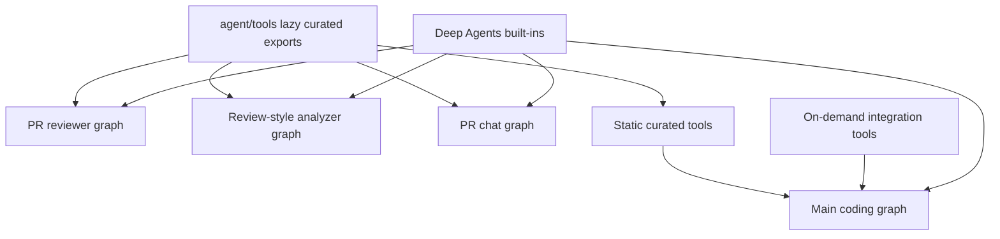

# Agent Tools (Curated Toolset)

Open SWE deliberately keeps its first-class tool surface small. Repository work normally uses `gh` and shell commands in the sandbox, rather than adding a specialized tool for every GitHub action; similarly, code search normally uses shell tooling. Curated tools exist where a capability needs application state, dashboard parity, an integration boundary, or safety and authorization logic that shell access cannot provide.

## Tool package and composition model

Curated tools are flat modules in `agent/tools/`. `agent.tools` is a lazy export facade: `_TOOL_MODULES` maps public names to modules; `_load_export` imports and caches a tool only when it is accessed; and `_LazyToolsModule` ensures a same-named imported submodule does not shadow the public function. A module may therefore provide several exports, such as `background_execute` and `background_task`, or the four environment-management operations.

A graph factory passes curated tools to `deepagents.create_deep_agent`. Deep Agents separately supplies its filesystem, shell, and delegation capabilities: `read_file`, `write_file`, `edit_file`, `delete`, `ls`, `glob`, `grep`, `execute`, and `task`. `DEEP_AGENT_TOOL_NAMES` reserves these names, so a dynamic or curated tool must not collide with them. The main agent hides `grep`; stop-summary mode also hides the mutating built-ins `delete`, `edit_file`, `execute`, `task`, and `write_file`.

Curated exports are selected by each graph factory, while `create_deep_agent` adds its own built-in capabilities to every executing graph.

## Main coding agent: static and conditional tools

`agent.server:get_agent` builds the main graph's `static_tools` list. It includes:

- **Web and research:** `http_request`, `fetch_url`, and `web_search`.
- **Planning and personal configuration:** `enter_plan_mode`, `save_plan`, `approve_plan`, `save_user_instructions`, `save_user_skill`, and `delete_user_skill`.
- **Sandbox and work tracking:** `background_execute`, `background_task`, `recreate_sandbox`, `schedule_thread_wakeup`, and `report_platform_issue`.
- **Project systems and threads:** the Linear tools; `list_threads`, `get_thread`, `manage_thread`; `manage_baby_sit`; `notify_automation_channel`; `open_pull_request`; and `request_pr_review`.
- **Slack:** `manage_code_channel` and the Slack message, reaction, attachment, and move tools.

The factory then changes this surface for the run context. An admin thread adds `sandbox_reset`, environment administration (`list_environments`, `save_environment`, `capture_environment_snapshot`, and `delete_environment`), and organization-skill administration. Sandbox download support conditionally adds `output_iframe`, `create_sandbox_file_download_url`, and `create_sandbox_service_url`. Slack tools are removed when Slack is disabled. `local_run` is intentionally only the three web tools; `stop_summary` is only Slack thread read/reply before Slack disabling is applied.

The main graph also creates a general-purpose subagent. It receives the static tools except the two background-execution aliases. Parent-context-dependent tools are excluded from subagents, including Slack, thread management, `manage_code_channel`, `notify_automation_channel`, and user-settings access; the parent agent must relay those interactions.

### On-demand integration groups

When the run is neither local nor stop-summary, the server gathers browser tools plus Observability, Currents, and Notion integration tools. If configured, Corridor is represented by a static name catalog with a deferred MCP loader. These integration groups are mediated by `DynamicToolMiddleware`, not appended directly to the initial static list:

1. The model initially sees `load_integration_tools` and a catalog of group-qualified names.
2. It must request exact names with that loader.
3. The middleware builds the required group once, under a per-group lock, stores the successfully resolved tools, and records loaded names in graph state.
4. Later model calls receive only the requested resolved tools. Calling an integration tool before loading it, or requesting one unavailable after loading, returns an error tool message and tells the agent to continue without it.

The middleware rejects duplicate names across groups and collisions with the built-in/static reserved names. This defers expensive MCP handshakes and credential reads until a tool is actually wanted, rather than putting them on the first model-call critical path.

## Specialist graphs

The factories deliberately give specialist graphs different curated surfaces; their Deep Agents built-ins still come from `create_deep_agent` unless middleware removes them.

| Graph | Curated tools and operational boundary |
| --- | --- |
| Main (`get_agent`) | The configurable surface described above, plus Deep Agents built-ins and optional integrations. |
| Reviewer (`get_reviewer_agent`) | `fetch_review_diff`, finding lifecycle tools (`add_finding`, `update_finding`, `list_findings`, `publish_review`, `resolve_finding_thread`, `reply_to_finding_thread`), and `web_search`, `fetch_url`, `http_request`. It does not wire `open_pull_request` as a curated tool, but it is still a Deep Agents graph with a reviewer sandbox; do not equate the curated list alone with a complete capability/security boundary. |
| Analyzer (`get_analyzer`) | `save_review_style_prompt` and `read_finding_outcomes`, used to produce/refine a per-repository review-style prompt. |
| PR chat (`get_chat_agent`) | `read_repo_file`, `search_repo_code`, `list_review_findings`, `web_search`, and `fetch_url`. It has no sandbox backend; middleware excludes `execute`, `write_file`, `edit_file`, and `delete`, and its delegated subagent allowlists only `read_file`, `ls`, `glob`, and `grep`. |

The dashboard review-chat backend mints private chat threads scoped to a viewer, repository, and PR. On the first run it seeds virtual `/pr/overview.md`, `/pr/diff.patch`, and `/pr/findings.md` files (truncating a diff at 400,000 characters). It validates this ownership/scope on every proxied thread access. `PrepareChatRunMiddleware` acquires a GitHub App installation token and supplies it as `chat_github_token`; the chat read tools use that token with the Contents and code-search APIs. `read_repo_file` defaults to the PR head and caps returned file bytes; `search_repo_code` is explicitly default-branch indexed, so it locates symbols but cannot search an arbitrary PR ref.

## High-value tool behaviors

- **Outbound HTTP:** `http_request` allows arbitrary methods but uses safe redirect handling. It treats returned web data as untrusted and offloads a serialized response larger than 100,000 characters to sandbox JSONL, returning a path and size instead of inlining it. Its contract tells agents to use sandbox `gh`, not this tool, for GitHub API calls.
- **Background commands:** `background_execute`/`background_task` launch non-blocking shell work tracked below `/tmp/open-swe-background-tasks`. The runner bounds active tasks to four, output to 1 MiB, and timeout to at most 24 hours; task state and output are durable sandbox files with a one-week TTL.
- **PR opening:** `open_pull_request` is for a new already-pushed branch. For dashboard, Slack, and Linear triggers it prefers the triggering user's OAuth token so the PR is attributed to that user, falling back to the GitHub App token. It returns an existing branch PR rather than duplicating it; ordinary PR updates remain `gh` work.
- **Review diff:** `fetch_review_diff` materializes the selected review range in the reviewer sandbox and returns a path plus bounded changed-file metadata. The reviewer can inspect the local artifact using built-ins rather than placing the full diff in a tool result.
- **Wakeups and CI watching:** `schedule_thread_wakeup` creates a one-shot LangGraph cron after 1–1,440 minutes, persists a generation/count budget, and refuses more than ten system wakeups between human messages. `manage_baby_sit` starts/stops a durable PR watch or records a flaky retry; it verifies a canonical PR URL, executable thread, repository match, open PR/head information, and GitHub App installation before starting a watch.

## Parent-only authorization and dashboard parity

`list_threads`, `get_thread`, and `manage_thread` implement dashboard-equivalent operations, not trust in caller-provided thread metadata. They derive an actor from trusted run configuration (with the current state identity able to supersede it), enforce allowed-organization membership, then call dashboard operations that apply owner/participant/admin rules. Cross-user listing and `admin_cancel` require an admin; destructive deletion requires `confirm=true`. These tools are also excluded from the general-purpose subagent because they depend on parent source context.

This is an example of the agent/UI parity principle: a dashboard feature should normally have a curated agent interface, but it must preserve the same authorization and confirmation boundaries rather than exposing a raw backend primitive.

## Plan-mode safety and lifecycle

Plan mode is stateful. `enter_plan_mode` persists `planning` status when it has a thread ID and returns a LangGraph `Command` setting `plan_mode=True`; `approve_plan` requires active mode and a non-shared plan, persists approval with approver identity, and returns a command setting it false. `PlanModeMiddleware` is always installed and reads state, so it applies when the tool turns plan mode on mid-run as well as when a later run starts with configuration carrying the flag.

`PLAN_MODE_EXCLUDED_TOOLS` removes delegation and explicit side effects: `task`, background execution, `create_sandbox_service_url`, `http_request`, baby-sit, thread mutation, PR opening/review request, sandbox reset/recreation, user-skill mutation, Slack moves/new threads, mutating Linear actions, and environment mutations. Read-only thread lookup remains available, as do `approve_plan`, `read_file`, `write_file`, `edit_file`, and `execute`.

That final distinction is important: plan mode's no-repository-mutation rule for shell and file built-ins is **prompt discipline**, not a complete technical prohibition. `task` is removed because its separately compiled subagent would otherwise bypass the parent exclusion. Safety-sensitive changes must preserve both the middleware exclusion list and the plan-mode prompt guidance.

## Adding or changing a tool

1. Add an async implementation under `agent/tools/`.
2. Add its module mapping, public export, and type-checking import in `agent/tools/__init__.py`.
3. Wire it into the appropriate graph factory—usually `get_agent`, but reviewer, analyzer, and chat have intentionally separate surfaces.
4. Decide whether it is static, conditionally exposed, parent-only, plan-mode-excluded, or an on-demand integration. Reserve names to avoid collisions with Deep Agents and existing tools.
5. Add focused tests. The existing suite exercises HTTP redirect safety, background task limits/lifecycle, wakeup scheduling/budgets, thread authorization/actions, baby-sit validation, reviewer findings/diff behavior, PR chat ownership and read access, plan-mode transitions/exclusions, and factory tool-loading concurrency.

## Related pages

- [Agent graph](../architecture/agent-graph.md) — graph factories and runtime assembly.
- [Middleware stack](../architecture/middleware-stack.md) — enforcement order and graph middleware.
- [Authorization and security](auth-and-security.md) — user and organization authorization boundaries.
- [Observability and MCP](../integrations/observability-and-mcp.md) — integration configuration.
- [PR creation](../workflows/pr-creation.md), [PR review](../workflows/pr-review.md), and [scheduling and baby-sit](../workflows/scheduling-and-baby-sit.md) — user-facing workflows.
- [Testing overview](../testing/overview.md) — test-suite organization.
