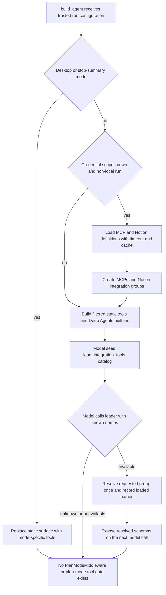

# Tool Surfaces and Dynamic Loading

Open SWE distinguishes a **tool catalog** from an executable agent surface. `agent.tools` is a lazy import facade, but an export is not automatically available to a model. Each graph factory selects its curated tools, Deep Agents injects its own filesystem/delegation tools, and middleware removes or adds tools for the current run. Sensitive tools also enforce their own trusted-context checks; registration is therefore not an authorization grant.

## Catalog, graph, and built-ins

`agent.tools` maps public names to implementation modules in `_TOOL_MODULES`. Resolving an export imports its module only then and caches the exported value. The custom module type ensures that an imported submodule with the same name cannot shadow the public tool export. The catalog deliberately includes local tools and selected GitHub, Slack, and incident tools; it is not limited to files immediately below `agent/tools/`.

Deep Agents supplies `delete`, `edit_file`, `execute`, `glob`, `grep`, `ls`, `read_file`, `task`, and `write_file`. The main agent normally suppresses `grep`; this is a model-surface exclusion, not removal of the underlying backend capability. `ExcludeToolsMiddleware` filters every model request after tool-injecting middleware has run, allowing the factory to hide Deep Agents built-ins without rebuilding the graph.

The following graph-specific choices are intentional:

| Graph | Curated surface |
| --- | --- |
| Main coding agent | Static tools selected from trusted run context, plus eligible deferred integration schemas and Deep Agents built-ins. |
| Reviewer | Diff and review-finding lifecycle tools (`fetch_review_diff`, finding create/update/list/publish/resolve/reply), plus `web_search`, `fetch_url`, and `http_request`. It does not receive `open_pull_request`. |
| Analyzer | Only `save_review_style_prompt` and `read_finding_outcomes` for review-style guidance. |
| PR chat | GitHub-backed `read_repo_file` and `search_repo_code`, review findings, web tools, and proposal tools. It has no sandbox; its virtual `/pr/` files provide PR context. |

PR chat removes `execute`, `write_file`, `edit_file`, and `delete`, and gives its delegated subagent only `read_file`, `ls`, `glob`, and `grep`. Before a chat run, its preparation middleware obtains a repository-scoped GitHub App installation token; the GitHub read tools therefore do not receive a user credential.

## Main-agent composition and contextual filtering

`build_agent` is the main entrypoint. Its initial static list spans web access, background work, plans and user skills/settings, thread and baby-sit management, PR actions, sandbox recovery, scheduling, notifications, Slack, and feedback. Optional sandbox download helpers are included only for supported hosted-sandbox runs. `ADMIN_TOOLS`—automation, workspace, and organization-skill management—are appended only when `_admin_thread` validates the current actor's admin context. Private admin surfaces additionally receive `read_only_sql` and review-approval-policy management.

The factory subsequently narrows that list rather than trusting caller-selected metadata:

- Without a verified private credential scope, personal settings/instructions/skills tools are removed. `slack_read_channel_messages` requires a private thread; other Slack tools require trusted Slack source context, and concierge DM runs remove DM-inapplicable tools.
- Desktop local runs are replaced with exactly `http_request`, `fetch_url`, and `web_search`. Stop-summary runs are replaced with Slack thread reading and reply. Neither mode loads MCP or Notion tools.
- Expedited-review tools require a non-desktop run, a Slack bot token, and workspace enablement. Incident sessions can add their own tools and automatic incident runs apply a further exclusion set.
- The general-purpose subagent receives a separately compiled graph, so it gets explicit middleware and a tool-call guard. That guard rejects parent-only operations such as Slack/thread operations, background work, personal settings, and feedback, while leaving source-free Slack channel reading available.

### Eligibility, deferred loading, and the former plan-mode boundary

This flow shows that run mode and credential scope determine whether integration groups exist, while their schemas remain deferred until the model explicitly loads them. The current repository contains no `PlanModeMiddleware`, `PLAN_MODE_EXCLUDED_TOOLS`, or plan-mode state gate: planning is represented by the normal `save_plan` tool rather than a separate runtime capability mode. Mode-specific exclusions above are the active tool gates and must not be described as plan-mode enforcement.

## Dynamic integration middleware

`DynamicToolMiddleware` has one initially visible tool, `load_integration_tools`. An `IntegrationGroup` advertises only tool names at construction time and can defer costly construction—such as credential lookup or an MCP handshake—until requested. The middleware rejects names colliding with the loader, supplied reserved names, or another group. The main factory reserves both Deep Agents and selected static names, preventing ambiguous dispatch.

A loader call accepts plain names or `group:name` aliases. Unknown names return an error `ToolMessage`. For recognized names, the middleware resolves each requested group, marks the successfully requested names in `loaded_integration_tools`, and tells the model to call them on the next turn. A direct call before loading is rejected. Group resolution is serialized by a per-group lock, and both successful and failed results are cached for the middleware instance; failures become an empty result and a recoverable unavailable-tools error rather than aborting the run. The middleware resets loaded names at the beginning of every non-forked run, so persisted state does not leak a prior run's loading decision.

For ordinary providers, loaded schemas are appended to the model request. For selected Anthropic and OpenAI Responses models that support an in-conversation addition, the middleware instead inserts provider-native tool-addition content at the load-result anchor, preserving prompt-cache continuity; unsupported schemas remain in the regular tools list.

### MCP and Notion boundaries

The main agent builds two dynamic groups when eligible: `MCPs` and `Notion`. MCP connections are gathered in precedence order—instance, workspace, then the private credential owner's connections—where a later connection with the same name replaces an earlier one. A missing or failed source yields no MCP tools rather than silently falling back to a lower-precedence scope. Discovery is time-bounded and cached by source namespace, connection name, and revision; remote tool names are wrapped in generated, collision-safe names.

At invocation, an MCP wrapper re-resolves its connection and rejects a changed scope, disabled/disconnected connection, changed URL/transport, or newly disallowed remote tool. Calls use the connection's headers and OAuth configuration server-side, time out after 30 seconds, and redact unexpected connection failures into a generic actionable tool error.

Notion is stricter: initial discovery is allowed only for the verified private owner with a connected Notion account. Each exposed schema adds required `on_behalf_of`, but invocation resolves that participant and then requires it to be the same private credential owner. It fetches a fresh Notion access token and reconnects to the hosted MCP server for that invocation; no token is embedded in the tool schema or retained for later calls.

## Authorization is repeated at the tool boundary

Admin graph wiring is a least-privilege measure, not a sufficient guard. `actor_is_admin` accepts either a configured administrator determined from the runtime identity or a scheduled run carrying an authorized-admin schedule record. `require_admin` is called again by every automation operation. Automation errors—including authorization and schedule-service failures—are returned as structured `{ok: false, error: ...}` values. Creation uses the verified actor identity; updates reject contradictory `clear_repo`/`repo` and `clear_slack_channel`/`slack_channel_id` arguments while preserving omitted values.

`read_user_settings` takes no user or thread argument. It first tries to establish a private credential owner and returns that person's fuller safe settings; otherwise it resolves verified thread participants. It returns selected profile settings, instructions, preferences where appropriate, and Notion connection status—not access tokens or credentials—and reports an unresolved participant count.

## Sandbox tool API

The sandbox-facing tool runtime builds a separate `ToolSurface` from the compiled graph. Its catalog resolves dynamic tools for authenticated discovery but does not expose `load_integration_tools`; it applies the same mode exclusions. Invocation rejects unavailable names and unexpected argument keys. For a discovered integration tool it marks that name loaded in the one-call execution state, so the tool-node invocation passes the dynamic middleware's normal loaded-name gate. This API is a controlled execution surface, not a bypass around dynamic-loading or graph filtering.

## Safely extending a surface

1. Add a tool to the lazy catalog only if it should be importable across agent factories; then wire it explicitly into each intended graph.
2. Account for desktop, stop-summary, private credential, Slack, admin, incident, and subagent filters. Add an exclusion when a Deep Agents built-in must be hidden from the model.
3. For external tools, reserve all static and built-in names, use a dynamic group when schemas or discovery are expensive, and make availability failures recoverable.
4. Revalidate actor, scope, and mutable resource authority inside the tool. Keep credentials in server-side resolution paths and return redacted, structured errors.
5. Test the outcome that carries the safety property: unauthorized automation denial and trusted identity use; Notion token refresh and owner enforcement; MCP precedence and changed-scope denial; dynamic loader unknown/unavailable behavior; and the intended mode-specific surface.

## Related pages

- [Agent graph](../architecture/agent-graph.md) — factories and graph assembly.
- [Middleware stack](../architecture/middleware-stack.md) — ordering and cross-cutting middleware.
- [Observability and MCP](../integrations/observability-and-mcp.md) — MCP integration configuration.
- [PR creation](../workflows/pr-creation.md) — PR workflow controls.
