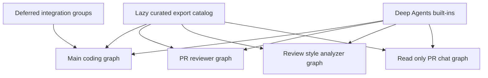

# Agent Tools (Curated Toolset)

Open SWE keeps its first-class tool surface deliberately small. Routine repository work uses `gh`, shell commands, and `rg` in the sandbox rather than a specialized tool for every GitHub operation or content search. Curated tools are reserved for capabilities that require application state, dashboard parity, integration credentials, or enforceable authorization and safety boundaries.

## Exports are a catalog, not a universal capability set

Curated modules live flat under `agent/tools/`. `agent.tools` is a lazy facade: `_TOOL_MODULES` maps public names to modules, `_load_export` imports and caches the requested export, and `_LazyToolsModule` prevents an imported same-named submodule from shadowing that export. One module can provide several public names: `background_execute` and `background_task` share a module; environment operations share `.environments`; and automation operations share `.automations`.

That catalog does **not** mean every export is available to every agent. A graph factory passes a selected curated list to `deepagents.create_deep_agent`; Deep Agents supplies a separate built-in filesystem, shell, and delegation surface (`read_file`, `write_file`, `edit_file`, `delete`, `ls`, `glob`, `grep`, `execute`, and `task`). `DEEP_AGENT_TOOL_NAMES` reserves those names so curated or dynamic tools cannot collide. The main graph hides `grep`; stop-summary also hides mutating built-ins `delete`, `edit_file`, `execute`, `task`, and `write_file`.

This shows source catalog ownership versus the graph-specific execution surfaces; integrations are only a possible main-graph surface.

## Main coding graph

`agent.server:get_agent` builds the main graph's `static_tools` list. In a normal eligible run, it covers web (`http_request`, `fetch_url`, `web_search`); plan lifecycle; background execution; user instructions, skills, and `read_user_settings`; Linear; dashboard threads; baby-sit, notifications, PR creation/review, sandbox recovery, scheduling, and Slack operations.

The factory applies runtime context before compiling the graph:

- An authenticated **admin thread** adds `sandbox_reset`, automation management (`list_automations`, `create_automation`, `update_automation`, `trigger_automation`, `delete_automation`), environment administration, and organization-skill administration. The `admin_thread` flag is rechecked against configured admin identity, so it cannot confer capability to a later non-admin participant.
- Signed sandbox-download support adds `output_iframe`, `create_sandbox_file_download_url`, and `create_sandbox_service_url` only when the backend/run supports it.
- A desktop `local_run` is only `http_request`, `fetch_url`, and `web_search`. `stop_summary` initially limits the list to Slack thread reading/replying. Slack tools are then removed unless the trusted source and Slack channel/thread context are present.
- The general-purpose subagent receives the applicable static tools except the two background aliases, and removes parent-context-dependent Slack, thread, notification, code-channel, and user-settings tools. Parent middleware does not wrap separately compiled subagent graphs, which is why the boundary is explicit.

`read_user_settings` itself accepts no supplied user, thread, or source identity. It derives verified thread participants from trusted runtime context and returns only safe profile settings, custom instructions, and connected/not-connected metadata for Notion, LangSmith, and Currents—not credentials, tokens, or browser-local preferences.

### Deferred integration groups

Outside local and stop-summary runs, the server gathers browser tools and candidates for Observability, Currents, and Notion. Configured Corridor is a static name catalog with a deferred MCP loader. `DynamicToolMiddleware` exposes those as integration groups instead of attaching their operational schemas to the initial model call.

1. The model sees `load_integration_tools` plus group-qualified catalog entries.
2. It requests exact names (group-prefixed aliases are accepted) and calls the resolved tool on a later model turn.
3. The middleware builds the needed group once under a per-group lock, caches its resolved tools, and records successfully loaded names in graph state.
4. A direct pre-load call, an unknown name, or an unavailable loaded tool produces an error tool message that directs the agent to continue without it.

The middleware rejects duplicate integration names and collisions with its loader, built-ins, or static names. Deferred construction keeps credential reads and MCP handshakes off the first model-call path; a group load failure is contained as unavailable tools rather than terminating the run. Observability candidates are additionally selected per triggering user: team data requires explicit authorization, while organization members may receive the appropriate LangSmith scope.

## Specialist graph surfaces

Each specialist factory intentionally selects a different set; do not infer that a tool exported by `agent.tools` is executable there.

| Graph | Curated execution surface |
| --- | --- |
| Main (`get_agent`) | The context-dependent static and optional deferred surface above, plus applicable Deep Agents built-ins. |
| Reviewer (`get_reviewer_agent`) | `fetch_review_diff`; finding lifecycle tools `add_finding`, `update_finding`, `list_findings`, `publish_review`, `resolve_finding_thread`, `reply_to_finding_thread`; and `web_search`, `fetch_url`, `http_request`. `open_pull_request` is not a reviewer curated tool. |
| Analyzer (`get_analyzer`) | Only `save_review_style_prompt` and `read_finding_outcomes`, for producing or refining per-repository review-style guidance. |
| PR chat (`get_chat_agent`) | `read_repo_file`, `search_repo_code`, `list_review_findings`, `web_search`, and `fetch_url`, plus a read-only virtual-file surface. |

PR chat has no sandbox backend. Its parent excludes `execute`, `write_file`, `edit_file`, and `delete`; its replacement general-purpose subagent allowlists only `read_file`, `ls`, `glob`, and `grep`. The review-chat proxy seeds `/pr/overview.md`, `/pr/diff.patch`, and `/pr/findings.md`, and validates every client thread belongs to the requesting login and the same repository/PR. `PrepareChatRunMiddleware` obtains a repository-scoped GitHub App installation token as `chat_github_token`; `read_repo_file` and `search_repo_code` use it with GitHub Contents/code-search APIs. The file reader defaults to the PR head; code search is default-branch indexed, so it can locate symbols but not search an arbitrary PR ref.

## Important tool-level boundaries

- **HTTP and background work:** `http_request` uses URL-safety redirect handling, treats web content as untrusted, and writes large serialized results to sandbox JSONL rather than inlining them; its contract directs GitHub API use to sandbox `gh`. `background_execute`/`background_task` launch non-blocking sandbox commands with four active tasks, 1 MiB output, and bounded timeout, storing state below `TASK_ROOT`.
- **PR and review artifacts:** `open_pull_request` prefers a triggering user's OAuth token for Slack, Linear, and dashboard calls, falls back to the GitHub App token, and returns an existing branch PR instead of duplicating it. `fetch_review_diff` writes the selected diff to the reviewer sandbox and returns a path plus bounded metadata, so the reviewer uses filesystem tools to inspect it.
- **Scheduling and watching:** `schedule_thread_wakeup` uses a bounded LangGraph SDK future invocation and caps consecutive system wakeups between human messages. `manage_baby_sit` rejects non-configured repositories and requires an executable thread, open PR/head, GitHub authentication, and an app installation before starting a watch.
- **Threads and parity:** `list_threads`, `get_thread`, and `manage_thread` derive the actor from trusted run configuration, recheck allowed-organization membership, and preserve dashboard owner/participant/admin checks; deletion requires `confirm=true`. This implements the agent/UI parity principle without trusting thread metadata.
- **Admin automations:** automation tools are admin-gated wrappers over the dashboard schedule service. Creation validates the admin identity and schedule payload; update preserves omitted fields while forbidding contradictory clear/set arguments; trigger can test a paused automation; delete is described as requiring user confirmation. These tools are both admin-thread-only and plan-mode-excluded.

## Plan mode: stateful tool gating

`enter_plan_mode` tries to persist planning status and returns a `Command` setting `plan_mode=True`; it instructs the agent to produce a dated HTML artifact under `/workspace/plans/`, publish it with `save_plan`, and stay read-only in the target repository. `approve_plan` verifies active state, rejects shared content as an implementation plan, records approver identity, and returns a command setting `plan_mode=False`.

`PlanModeMiddleware` is installed for every main graph and recomputes filtering on each model request. At run start it resets state to the configured initial value, preventing stale state from silently re-enabling planning; an in-run `enter_plan_mode` call then changes the next model turn immediately.

`PLAN_MODE_EXCLUDED_TOOLS` removes `task`, both background aliases, `create_sandbox_service_url`, `http_request`, baby-sit, thread mutation, PR creation/review request, sandbox reset/recreation, user-skill mutation, Slack moves/new threads, mutating Linear actions, environment mutations, and all automation mutations. `approve_plan`, read-only thread lookup, and built-ins including `read_file`, `write_file`, `edit_file`, and `execute` remain visible. The latter file/shell access is constrained by prompt discipline—plan files belong outside cloned repositories—not a complete technical no-mutation barrier. `task` must be excluded because its independently compiled subagent would otherwise bypass the parent restriction.

## Extending safely

1. Implement an async tool under `agent/tools/`, then map and type-export it through `agent/tools/__init__.py`.
2. Select it in the intended graph factory; package export alone never grants availability.
3. Classify its runtime conditions: static, admin-only, source-dependent, parent-only, plan-mode-excluded, or deferred integration. Avoid Deep Agents and existing-tool name collisions.
4. Preserve authorization at the tool boundary and add focused tests. The suite includes automation, background execution, HTTP safety, thread authorization, baby-sit validation, wakeups, sandbox URL/reset/recreation, Corridor/observability/Currents, and plan-mode coverage.

## Related pages

- [Agent graph](../architecture/agent-graph.md) — graph factories and runtime assembly.
- [Middleware stack](../architecture/middleware-stack.md) — middleware ordering and enforcement.
- [Authorization and security](auth-and-security.md) — authorization boundaries.
- [Observability and MCP](../integrations/observability-and-mcp.md) — integration configuration.
- [PR creation](../workflows/pr-creation.md) and [scheduling and baby-sit](../workflows/scheduling-and-baby-sit.md) — user-facing workflows.
