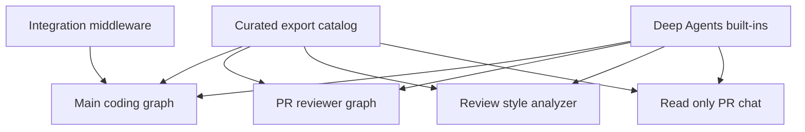
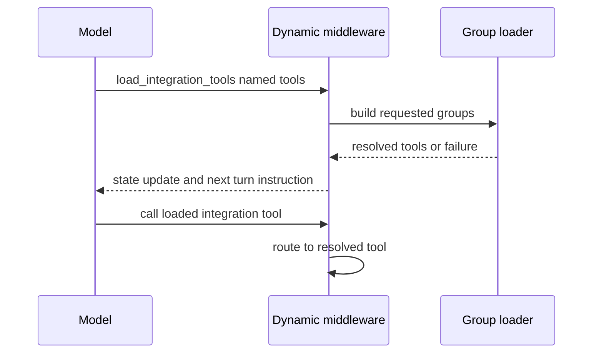

# Tool capability model

A tool export is not a grant of authority. Open SWE uses `deepagents.create_deep_agent` to compile several graphs, each with an intentionally selected tool surface and backend. Curated tools exist where repository shell work is insufficient—for example, dashboard state, a credentialed service, a user-visible workflow, or a server-enforced authorization check. Routine repository and GitHub work instead uses the sandbox filesystem, shell, and `gh` proxy.

## Capability sources and graph wiring

`agent.tools` is the curated catalog, not a universal capability set. Modules are flat below `agent/tools/`; the package maps public names to modules, imports an export on first access, caches it, and ensures an imported submodule cannot shadow an export of the same name. A module can provide multiple exported operations, such as both background-task aliases or the automation operations.

Every Deep Agents graph also receives its own built-ins: `read_file`, `write_file`, `edit_file`, `delete`, `ls`, `glob`, `grep`, `execute`, and `task`. `DEEP_AGENT_TOOL_NAMES` reserves those names against curated and integration collisions. The main graph normally removes `grep`; stop-summary mode additionally removes mutating filesystem/shell/delegation built-ins.

This shows that the catalog and built-ins are inputs to graph-specific capability surfaces; integration tools are only attached to the applicable main-agent turns.

### Main coding graph

`get_agent` starts or reconnects the thread sandbox, builds the selected tool lists, and compiles the main graph. Its normal `static_tools` cover web access; plan lifecycle; foreground/background execution; user instructions and skills; Linear; thread and notification workflows; PR creation/review; sandbox recovery; scheduling; and Slack. `read_user_settings` is a normal static tool. The graph backend is a composite: the thread sandbox is the default, while bundled, organization, and (when applicable) user skills are mounted read-only.

The factory changes that surface before graph construction:

- An `admin_thread` adds `ADMIN_TOOLS`: sandbox reset, automation administration, environment administration, and organization-skill administration. The factory checks both the flag and the currently triggering user's configured-admin identity; a thread marked admin cannot transfer that capability to a later non-admin speaker.
- Signed sandbox-download helpers (`output_iframe`, `create_sandbox_file_download_url`, and `create_sandbox_service_url`) exist only for non-desktop, non-stop-summary LangSmith sandbox runs.
- Desktop `local_run` is reduced to `http_request`, `fetch_url`, and `web_search`. Stop-summary starts with Slack read/reply only. In all modes, Slack tools are removed unless the source is `slack` or `schedule` and trusted channel and thread identifiers are present.
- The general-purpose subagent is a separately compiled graph. It receives the applicable static tools except `background_execute` and `background_task`, and explicitly removes Slack and other parent-context-dependent tools (`list_threads`, `get_thread`, `manage_thread`, notification, code-channel, and user-settings operations). It gets the same dynamic-tool middleware when present, because parent middleware does not automatically wrap it.

### Specialist graph surfaces

| Graph | Curated capability surface | Sandbox boundary |
| --- | --- | --- |
| Main (`get_agent`) | Context-conditioned static tools, optional integration groups, and Deep Agents built-ins. | Thread sandbox, with read-only skill routes. |
| Reviewer (`get_reviewer_agent`) | `fetch_review_diff`, finding lifecycle operations, `web_search`, `fetch_url`, and `http_request`. `open_pull_request` is deliberately absent. | Reviewer sandbox. |
| Analyzer (`get_analyzer`) | `save_review_style_prompt` and `read_finding_outcomes` only. | Sandbox plus a state-backed skills route. |
| PR chat (`get_chat_agent`) | `read_repo_file`, `search_repo_code`, `list_review_findings`, `web_search`, and `fetch_url`. | No sandbox; read-only PR virtual files and GitHub API access. |

PR chat is the strongest isolation example. The dashboard supplies PR overview, diff, and findings as `/pr/` files. The parent hides `execute`, `write_file`, `edit_file`, and `delete`, while its replacement subagent allowlists only `read_file`, `ls`, `glob`, and `grep`. `PrepareChatRunMiddleware` obtains a repository-scoped GitHub App token, rather than passing a user credential to the GitHub-backed read tools.

## Dynamic integration tools

`DynamicToolMiddleware` separates discovery from schema exposure. It presents a single `load_integration_tools` tool whose description lists names and integration groups, but not each integration schema. The model must load exact names (or `Group:name` / `Group: name` aliases), then call the newly exposed tool on the following model turn. Loaded names are held in `loaded_integration_tools` state, reset at the start of each agent run; the middleware adds the resolved schemas only to subsequent model requests and routes calls to the resolved tool.

This shows the required two-turn loading protocol for an integration capability.

The middleware validates its catalog at construction: names cannot duplicate each other, `load_integration_tools`, static names, or Deep Agents names. Per-group locks and a resolved cache prevent concurrent or repeated construction. A direct call before loading, an unknown catalog name, or an unavailable tool produces an error `ToolMessage`; load failures are logged and become “continue without it” errors rather than terminating the agent run.

The main graph offers Observability, Currents, Notion, and—when configured—Browser groups. Tool definitions for the first three are discovered by bounded, cached loaders during eligible main-graph construction, then their schemas remain deferred by the middleware. Corridor differs: it advertises a static allowlist (`analyzePlan`) and defers the MCP handshake itself until requested. Local and stop-summary runs skip these groups.

Integration credentials remain server-side. Currents tools resolve an API key for a named, verified thread participant. LangSmith tools similarly resolve a participant's credentials per call and are read-only; only an observability-authorized triggering user gets team Datadog/LangSmith tools, while an allowed organization member may get the appropriate LangSmith surface. Notion's wrapper requires `on_behalf_of`, resolves that participant, and refreshes the participant's MCP tool/token at invocation. Corridor reads its deployment token from environment configuration and validates its hosted MCP URL. These mechanisms prevent the sandbox from receiving the corresponding service secrets.

## Tool safety and authorization boundaries

Tool selection reduces accidental reachability, but sensitive actions must also validate at invocation time. For example, `read_user_settings` accepts no caller-supplied user, thread, or source identity: it resolves verified thread participants from runtime configuration and returns a limited profile subset, instructions, connection status, and an unresolved-participant count—not tokens or credentials.

Automation operations illustrate defense in depth. They are attached only through `ADMIN_TOOLS`, re-check admin status with the runtime login/email, and return structured errors instead of propagating dashboard-service exceptions. Creation derives the identity from trusted runtime configuration; updates preserve omitted values and reject conflicting clear/set arguments; triggers can start a paused automation. The server also excludes their mutating operations in plan mode.

`http_request` is intentionally powerful enough to be a plan-mode-excluded external-write boundary: callers can select an HTTP method and body. It follows the safe-redirect helper, reports HTTP failures as structured results, and offloads serialized responses above 100,000 characters to sandbox JSONL. Its contract directs GitHub API work to sandbox `gh`, where GitHub authentication is handled by the sandbox proxy. Background commands also belong to the sandbox boundary; their runner limits active tasks to four, caps captured output at 1 MiB, and stores task state under `TASK_ROOT`.

## Plan mode is a stateful capability filter

Plan mode is not just prompt guidance. `PlanModeMiddleware` is installed unconditionally on the main graph and filters every model request according to the run state's `plan_mode`. Before the agent runs it resets that state to the initial value resolved for this run, avoiding stale persisted state; a successful mid-run `enter_plan_mode` command changes the next model turn.

`PLAN_MODE_EXCLUDED_TOOLS` removes delegation and background work, browser actions, external HTTP, service URL creation, PR/review and thread mutation, baby-sit, sandbox reset/recreation, user-skill, Slack, mutating Linear, environment, and automation operations. `task` is excluded specifically because its subagent has an independently compiled surface. `approve_plan`, read-only thread lookup, and file/shell built-ins remain available so the agent can create a plan artifact; the no-repository-mutation restriction on `write_file`, `edit_file`, and `execute` is prompt-enforced discipline, not a full technical sandbox policy.

## Safe extension contract

To introduce a capability without accidentally granting it everywhere:

1. Add an async implementation under `agent/tools/`.
2. Export it explicitly from `agent/tools/__init__.py`; the lazy export makes it importable but does **not** expose it to a graph.
3. Wire it explicitly into the applicable factory—normally `agent/server.py`, or `agent/reviewer.py` for review-only behavior—and decide whether a subagent should receive it.
4. Review the authorization and execution boundary: trusted runtime identity, participant checks, admin recheck, credentials staying server-side, sandbox requirements, source context, plan-mode exclusion, and collisions with built-in or dynamic names.
5. For a credentialed/large schema integration, use an `IntegrationGroup` and test load-before-call, collisions, unavailable loading, and repeated/concurrent resolution. Otherwise add focused behavior tests at the graph and tool boundary.

The repository's guidance is explicit: tools must be added under `agent/tools`, exported, wired into the relevant graph, and reviewed for authorization rather than accumulated as unused catalog entries.

## Related pages

- [Agent graph](../architecture/agent-graph.md) — factories, graph lifecycle, and backend composition.
- [Middleware stack](../architecture/middleware-stack.md) — ordering and cross-cutting enforcement.
- [Authorization and security](auth-and-security.md) — identity and secret-handling boundaries.
- [Observability and MCP](../integrations/observability-and-mcp.md) — integration configuration and operations.
- [PR creation](../workflows/pr-creation.md) — PR workflow behavior.
