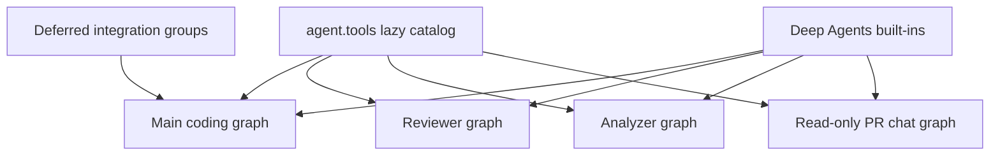
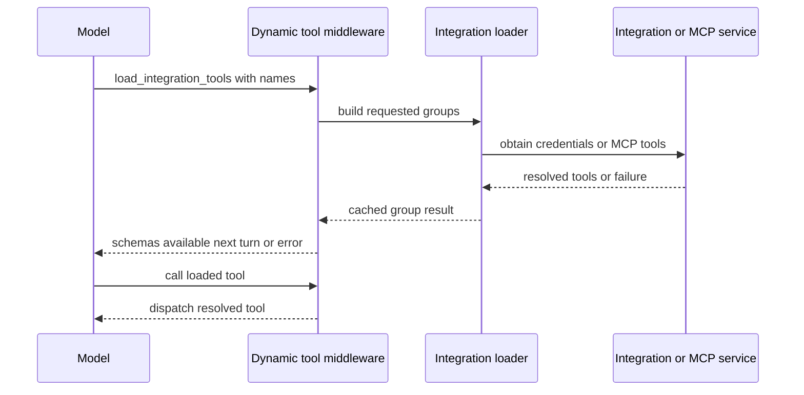

# Tool Catalog and Authorization

Open SWE does not treat the tools package as a universal capability grant. A tool must be exported, deliberately wired into a particular graph, and—where appropriate—protected again at its own boundary. This separation keeps credentials, administrative actions, and graph-specific operations out of tool surfaces that do not need them.

## Catalog versus executable surface

`agent.tools` is the curated export facade. `_TOOL_MODULES` maps public names to their implementation modules; access lazily imports and caches the export. Its module subclass deliberately prefers a public export over an identically named submodule that `importlib` placed on the package. Several names can share an implementation, such as the two background-task aliases and the automation operations.

The facade includes local curated modules as well as selected GitHub, Linear, and Slack tools. Exporting a name only makes it importable: each graph factory supplies its own list to `create_deep_agent`.

Deep Agents separately supplies filesystem and delegation tools: `read_file`, `write_file`, `edit_file`, `delete`, `ls`, `glob`, `grep`, `execute`, and `task`. `DEEP_AGENT_TOOL_NAMES` reserves these names, preventing static or dynamic integrations from colliding with them. The main graph hides `grep`; stop-summary mode additionally hides the mutating filesystem, shell, and delegation built-ins.

This diagram distinguishes the import catalog from the graph-specific execution surfaces; deferred integrations are attached only to eligible main-agent runs.

## Main coding agent assembly

`agent.server:get_agent` constructs the normal `static_tools` list. It includes web access; plan lifecycle; background execution; user instructions and skills; Linear; dashboard thread, notification, and baby-sit operations; PR creation and review request; sandbox recovery; scheduling; safe user-settings lookup; platform-issue reporting; and Slack tools. Signed sandbox download/service helpers are included only when the run configuration enables them.

The final list depends on trusted run context:

- An `admin_thread` receives `ADMIN_TOOLS`: sandbox reset, automation management, environment management, and organization-skill mutations. The factory accepts the flag only after checking the triggering identity against the configured administrators, so metadata cannot transfer admin capability to a later participant.
- A desktop `local_run` receives only `http_request`, `fetch_url`, and `web_search`. A `stop_summary` run initially receives only Slack thread reading and reply. In both cases, integration groups are not collected.
- Slack operations are removed unless trusted Slack context enables them. This filtering occurs after the mode-specific list is chosen.
- The general-purpose subagent gets the applicable static list except `background_execute` and `background_task`; separately compiled subagent graphs do not inherit parent middleware. Dynamic integration middleware is explicitly passed to it.

## Deferred integration tools

Eligible normal runs construct candidate groups for Observability, Currents, Notion, and browser tools; a configured Corridor group advertises its fixed allowlist and postpones its MCP connection. `DynamicToolMiddleware` presents one loader, `load_integration_tools`, with the catalog of group-qualified tool names rather than placing all operational schemas on the first model call.

This is the deferred loading path: a successful loader call updates run state, so the requested schema becomes available on the next model turn.

Names must be unique across groups and must not collide with the loader, built-ins, or static tools. The middleware resets `loaded_integration_tools` at the start of each run. It uses one lock and one cached resolution per group; loading failures become an empty group and a tool error instructing the model to continue. Direct integration calls before loading receive the same kind of recoverable error.

Integration loading is also a credential boundary. Corridor accepts only its configured HTTPS endpoint and allowlisted tool names, puts its bearer token on the server-side MCP connection, and degrades to no tools when configuration or the service fails. Notion schemas require an `on_behalf_of` thread participant; each invocation resolves that participant and refreshes that participant's token rather than retaining one in the sandbox. LangSmith tools similarly resolve a participant credential at call time, can use team credentials only where allowed, and are read-only. Observability availability is selected only for an explicitly authorized/admin triggering identity.

## Specialist surfaces

| Graph | Curated tools and intent |
| --- | --- |
| Main | Context-dependent static tools, eligible dynamic groups, and applicable Deep Agents built-ins. |
| Reviewer | `fetch_review_diff`; finding creation, update, listing, publication, resolution, and reply; plus `web_search`, `fetch_url`, and `http_request`. It does not receive `open_pull_request`. |
| Analyzer | Only `save_review_style_prompt` and `read_finding_outcomes`, supporting repository review-style guidance. |
| PR chat | `read_repo_file`, `search_repo_code`, `list_review_findings`, `web_search`, and `fetch_url`, with a read-only virtual-file surface. |

PR chat intentionally has no sandbox. It excludes shell and write built-ins, and its delegated subagent allowlists only `read_file`, `ls`, `glob`, and `grep`. The chat preparation middleware acquires a repository-scoped GitHub App installation token for the GitHub-backed read tools; PR overview, diff, and findings are supplied as virtual `/pr/` files by the review-chat API.

## Tool-side authorization and safe responses

Graph wiring is a convenience and least-privilege measure, not the sole authorization control. `read_user_settings` takes no caller-provided user, thread, or source identifier. It derives verified participants from runtime configuration and returns mapped profile settings, instructions, connection status metadata, and an unresolved count—never connection tokens or credentials.

Automation operations repeat their authorization with `require_admin`, which checks the runtime identity. They wrap the dashboard schedule service and return structured `{ok: false, error: ...}` responses for authorization and service failures. Creation records the verified admin identity; update preserves omitted fields while rejecting simultaneous clear/set values for repository or Slack destination; test triggering is allowed for paused automations. The delete tool's contract requires user confirmation before permanent removal.

This pattern is required for tools with sensitive side effects: validate trusted runtime identity and resource scope inside the tool, do not rely on model arguments or thread metadata, and turn anticipated operational failures into actionable tool results.

## Plan mode is stateful tool gating

Plan mode is a deliberately partial safety control, not simply a different prompt. `PlanModeMiddleware` is installed on every main graph and resets `plan_mode` to the run's configured initial value before execution; this prevents a persisted state from a previous run from silently affecting a later one. It recalculates the tool list on every model call, so an in-run `enter_plan_mode` command takes effect on the next turn.

When active, `PLAN_MODE_EXCLUDED_TOOLS` removes side-effecting external and administrative tools: delegation, background execution, browser interaction, mutable HTTP requests, baby-sit and thread mutation, PR actions, sandbox reset/recreation, user skills, mutable Linear actions, Slack moves/new threads, environment mutation, and automation mutation. Read-only thread lookup, plan approval, and `read_file`, `write_file`, `edit_file`, and `execute` remain available. The latter filesystem and shell capabilities are constrained by planning instructions to plan artifacts outside cloned repositories, rather than being technically prevented from changing files; `task` is excluded precisely because its independent subagent would bypass the parent gate.

## Safely extending a tool

1. Implement an async tool in `agent/tools/`, map it in `_TOOL_MODULES`, and add its type-checking export.
2. Wire it only into the graph(s) that need it. Decide whether desktop, stop-summary, Slack, admin-thread, or subagent filtering applies.
3. Reserve the name against Deep Agents built-ins and static/dynamic integration names. For expensive or credentialed integrations, use an `IntegrationGroup` and make loading failure recoverable.
4. Put authorization and scope checks at the tool boundary; derive actor and resource identity from trusted runtime context where possible. Keep secrets server-side and return redacted status/error data.
5. Add focused behavior tests: catalog/graph composition and mode filtering, authorization denial, credential/scope handling, success and failure results, and plan-mode exclusion for each new mutation. Run only the relevant pytest target, as repository guidance requires.

## Related pages

- [Agent graph](../architecture/agent-graph.md) — graph factories and runtime assembly.
- [Reviewer and analyzer](../architecture/reviewer-and-analyzer.md) — specialist graph responsibilities.
- [Authorization and security](auth-and-security.md) — trust boundaries and credentials.
- [Observability and MCP](../integrations/observability-and-mcp.md) — integration configuration.
- [PR creation](../workflows/pr-creation.md) — PR workflow behavior.
