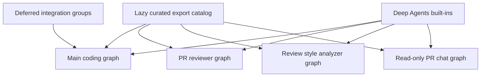
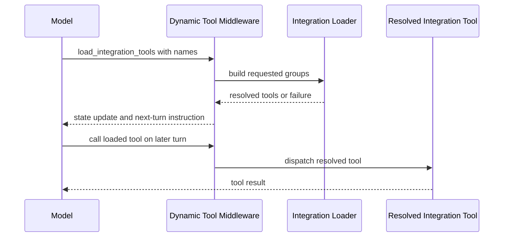

# Curated Tools and Capabilities

`agent.tools` is a catalog, not a grant of agent privileges. Curated tools exist where ordinary sandbox commands are insufficient: they bridge application state, dashboard services, user-scoped credentials, integrations, or protected operations. Each graph factory chooses its own subset; middleware can further add, hide, or transform the model-visible surface for a particular run.

## Catalog, graph surface, and built-ins

Curated exports are registered in `agent/tools/__init__.py`. `_TOOL_MODULES` maps a public name to its implementing module; the lazy module facade imports on first access, caches the value, and prefers the value over an importlib-created same-named submodule. A module may provide multiple names, such as the two background aliases, environment operations, or automation operations.

The catalog also spans adjacent tool packages: Linear, Slack, and GitHub read tools are re-exported through the same facade. Adding an entry makes an implementation importable; it does **not** put it on any graph.

`create_deep_agent` separately supplies filesystem, shell, and delegation tools: `delete`, `edit_file`, `execute`, `glob`, `grep`, `ls`, `read_file`, `task`, and `write_file`. `DEEP_AGENT_TOOL_NAMES` reserves those names so static and dynamic curated tools cannot collide. The main graph normally removes `grep`; stop-summary mode also removes the mutating built-ins.

This distinguishes an importable export from the graph-specific capability surfaces; deferred integrations are only attached to the main graph.

## Main coding graph

`agent.server:get_agent` returns an empty, sandbox-less Deep Agent when there is no executable thread. For executable threads it creates a sandbox-backed main graph and starts with a static list containing web access; plan lifecycle; background work; user instructions and skills; Linear; threads; baby-sit and notifications; PR creation/review; recovery; scheduling; reporting; and Slack operations.

The factory narrows or expands that list using trusted run context:

- An `admin_thread` receives `ADMIN_TOOLS`: sandbox reset, automation management, environments, and organization-skill administration. The flag is rechecked against configured administrator identity, preventing thread metadata from transferring that power to a later non-admin sender.
- Sandbox download support contributes `output_iframe`, `create_sandbox_file_download_url`, and `create_sandbox_service_url` only when enabled.
- A desktop `local_run` exposes only `http_request`, `fetch_url`, and `web_search`. `stop_summary` initially exposes only Slack read/reply. Slack tools are removed unless Slack is enabled for the trusted context.
- The general-purpose subagent receives applicable static tools except the background aliases and excludes tools that rely on parent source context, including Slack, thread, notification, and user-settings operations. Parent middleware does not automatically wrap separately compiled subagent graphs.

`read_user_settings` has no caller-controlled user, thread, or source parameter. It resolves verified human participants from runtime configuration and returns a selected profile-settings allowlist, saved instructions, and redacted connected-status metadata for Notion, LangSmith, and Currents. Credentials and tokens never leave the server through this tool.

## Deferred integrations

The main graph treats Observability, Currents, Notion, and available Browser tools as integration groups. Corridor is added only when configured, with a static allowlist (`analyzePlan`) and a deferred MCP loader. Names, rather than full schemas or live clients, appear in the initial tool catalog.

The deferred-loading sequence keeps credential reads and MCP handshakes off the first model-call path.

`DynamicToolMiddleware` validates that integration names do not duplicate each other, its loader name, Deep Agent names, or selected static names. It accepts `Group:name` aliases, builds each group at most once behind a per-group lock, caches the resolved tool map, and tracks successfully loaded names in graph state. State is reset before every agent run. A direct call before loading, an unknown requested name, or a tool missing after a failed load returns an error tool message rather than crashing the run. The normal model wrapper adds only loaded, successfully resolved tools to that turn.

Corridor configuration requires a token and an HTTPS `app.corridor.dev/api/mcp` endpoint. Its bearer token is held by the LangGraph server process, not the sandbox; connection failures degrade to no Corridor tools.

## Specialist graph surfaces

A curated export is not implicitly available outside the main graph.

| Graph | Curated surface |
| --- | --- |
| Main (`get_agent`) | Context-dependent static tools and the optional deferred groups above, plus applicable Deep Agent built-ins. |
| Reviewer (`get_reviewer_agent`) | `fetch_review_diff`, finding lifecycle tools (`add_finding`, `update_finding`, `list_findings`, `publish_review`, `resolve_finding_thread`, `reply_to_finding_thread`), and `web_search`, `fetch_url`, `http_request`. It does not include `open_pull_request`. |
| Analyzer (`get_analyzer`) | Only `save_review_style_prompt` and `read_finding_outcomes`. |
| PR chat (`get_chat_agent`) | `read_repo_file`, `search_repo_code`, `list_review_findings`, `web_search`, and `fetch_url`. |

PR chat explicitly strips sandbox-mutating built-ins (`execute`, `write_file`, `edit_file`, and `delete`). Its replacement general-purpose subagent has a filesystem allowlist of `read_file`, `ls`, `glob`, and `grep`, preserving read-only delegation rather than relying on the absence of a sandbox.

## Safety controls at the tool boundary

Tool selection is only one control layer:

- **Tool input repair:** `SanitizeToolInputsMiddleware`, installed on main, reviewer, analyzer, and chat graphs, repairs malformed `read_file.offset` and `read_file.limit` strings by extracting a leading integer before schema validation. It deliberately leaves other calls unchanged.
- **Web requests:** `http_request` and `fetch_url` use safe redirect handling. Tests cover rejecting non-HTTP schemes and private/metadata addresses, including redirects; connections are pinned to the validated public address. `http_request` offloads serialized responses exceeding 100,000 characters to sandbox JSONL and tells the agent to treat web content as untrusted. It directs GitHub API work to sandbox `gh`, where the proxy handles authentication.
- **Automations:** automation operations are statically exported but attached only through `ADMIN_TOOLS`. Each rechecks administrative identity and returns structured errors. Creation uses the verified identity; update rejects contradictory clear/set fields; triggering can run a paused automation. The tools delegate schedule storage and validation to the dashboard schedule service.
- **Generic exclusion:** `ExcludeToolsMiddleware` filters named tools on every model request and must follow tool-injecting middleware, so it can hide built-ins introduced by filesystem or subagent middleware.

## Plan mode is a stateful visibility gate

Plan mode is not a separate graph. `PlanModeMiddleware` is installed unconditionally on the main agent, resets `plan_mode` to the run's configured initial value before execution, and filters every model request while the state is active. This avoids a persisted state from a prior run silently applying to a later run, while an in-run `enter_plan_mode` command takes effect for the next model call.

`PLAN_MODE_EXCLUDED_TOOLS` hides external or operational mutation: delegation (`task`), background work, browser actions, service URL creation, arbitrary HTTP, baby-sit and thread mutation, PR creation/review request, sandbox recovery/reset, user-skill mutation, Slack thread moves/creation, mutating Linear actions, environment changes, and automation changes. `list_threads`, `get_thread`, plan approval, and filesystem tools including `write_file`, `edit_file`, and `execute` remain model-visible so a plan can be drafted under `/workspace/plans/`. Consequently, repository/shell read-only behavior in plan mode is partly prompt discipline, not a comprehensive kernel-enforced mutation barrier; excluding `task` is necessary because subagent graphs do not inherit the parent filter.

## Adding a tool without widening privileges

1. Implement the tool under `agent/tools/` (or the appropriate integration package) and add its export mapping and type-only import in `agent/tools/__init__.py`.
2. Choose each intended graph explicitly. Do not treat export registration as authorization. Check names against Deep Agent built-ins and existing static/dynamic names.
3. Decide the capability class: universally static, admin-thread-only, context/source-dependent, parent-only, plan-mode-excluded, or deferred integration. For integration tools, define the catalog names and make loading safe to retry/fail.
4. Put authorization and identity derivation at the tool boundary, not only in graph assembly. Do not accept caller-supplied identity where trusted runtime context is available.
5. Add focused tests for the failure and privilege boundaries: name collisions/loading errors for dynamic tools, context-gated graph construction, authorization rejection, input validation, and relevant SSRF or service failure behavior. Existing focused suites cover dynamic loading, input sanitization, plan-mode exclusions, Corridor, automations, HTTP safety, background work, threads, baby-sit, wakeups, sandbox helpers, Currents, observability, and browser tooling.

## Related pages

- [Agent graph](../architecture/agent-graph.md) — graph factories and runtime assembly.
- [Middleware stack](../architecture/middleware-stack.md) — middleware ordering and enforcement.
- [Observability and MCP](../integrations/observability-and-mcp.md) — integration configuration.
- [PR creation](../workflows/pr-creation.md) and [PR review](../workflows/pr-review.md) — tool-driven workflows.
