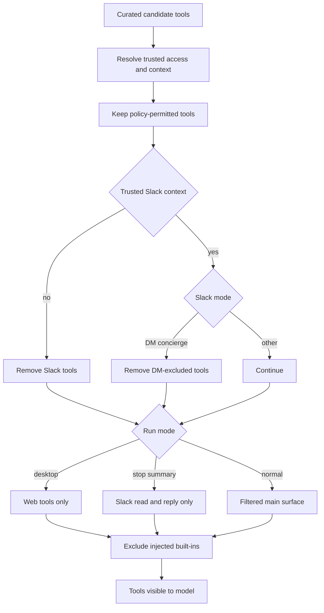

# Tool Surfaces and Dynamic Availability

A tool export is not a capability grant. Open SWE first assembles a graph-specific tool list, applies trusted-context filters, then uses middleware and tool-local policy checks while the agent runs. This keeps specialist agents read-only where required, avoids exposing unavailable integrations in the initial model request, and treats expected tool failures as model-visible results rather than run failures.

## Catalog, graph surfaces, and built-ins

`agent.tools` is the import facade for curated tool functions. `_TOOL_MODULES` maps each public name to either a local module or a selected GitHub, Slack, or incident implementation. Lookup imports on demand, caches the function on the package, and deliberately prefers that public function over an identically named submodule attribute left by `importlib`. The catalog is therefore an implementation boundary, not a list of tools automatically given to every agent.

Each graph factory passes its own curated list to `create_deep_agent`. Deep Agents also injects filesystem and delegation tools (`read_file`, `write_file`, `edit_file`, `delete`, `ls`, `glob`, `grep`, `execute`, and `task`). `DEEP_AGENT_TOOL_NAMES` reserves these names when integrations are registered. The main graph normally removes `grep` after injected tools have been added; `ExcludeToolsMiddleware` exists specifically to make that post-injection filtering reliable.

The focused specialist surfaces are intentionally narrower:

| Graph | Curated capability surface |
| --- | --- |
| Main coding agent | Web, task and thread operations, user settings and skills, PR/review flows, sandbox helpers, Slack, eligible admin/workspace operations, and MCP/Notion integration groups subject to the gates below. |
| Reviewer | Review diff, finding lifecycle tools, and `web_search`, `fetch_url`, and `http_request`; it does not receive `open_pull_request`. |
| Analyzer | Only `save_review_style_prompt` and `read_finding_outcomes` for review-style guidance. |
| PR chat | Repository reads, review findings, web reads, and proposal tools. It has no sandbox and excludes shell and filesystem mutations. |

PR chat receives PR overview, diff, and findings as virtual `/pr/` files. Its GitHub read tools use a repository-scoped GitHub App installation token, while its explicitly declared subagent exposes only `read_file`, `ls`, `glob`, and `grep`. These are structural read-only boundaries rather than prompt-only conventions.

## Main-agent selection

`build_agent` builds the main surface from a broad candidate list, then applies `permitted` using an `Access` value resolved from validated thread metadata, actor identity, source, and writer state. Tools with a declared `Policy` are omitted when the run does not meet the policy; unannotated tools remain eligible. The same policy is evaluated again for every decorated tool call, so a change such as another writer joining a thread is not protected only by the factory-time decision.

```mermaid
flowchart TD
    Candidate["Curated candidate tools"] --> Access["Resolve trusted access and context"]
    Access --> Permit["Keep policy-permitted tools"]
    Permit --> Slack{"Trusted Slack context"}
    Slack -->|"no"| NoSlack["Remove Slack tools"]
    Slack -->|"yes"| SlackMode{"Slack mode"}
    SlackMode -->|"DM concierge"| DmFilter["Remove DM-excluded tools"]
    SlackMode -->|"other"| Optional["Continue"]
    NoSlack --> Mode{"Run mode"}
    DmFilter --> Mode
    Optional --> Mode
    Mode -->|"desktop"| Desktop["Web tools only"]
    Mode -->|"stop summary"| Summary["Slack read and reply only"]
    Mode -->|"normal"| Main["Filtered main surface"]
    Desktop --> Exclude["Exclude injected built-ins"]
    Summary --> Exclude
    Main --> Exclude
    Exclude --> Model["Tools visible to model"]
```

This is the verified main-agent selection path; policy filtering occurs before source and mode filters, and `ExcludeToolsMiddleware` filters Deep Agents' injected tools on each model request.

The meaningful context gates are:

- A desktop/local run replaces the static list with `http_request`, `fetch_url`, and `web_search`. A stop-summary run replaces it with `slack_read_thread_messages` and `slack_reply`; its built-in exclusions also remove shell, mutation, and delegation tools.
- Slack tools require a trusted Slack source and a sufficiently populated thread context. Concierge DMs remove reactions; Slack ask and “by the way” modes use additional exclusions for operations that require a thread. If no Slack bot token is configured, human-review tools and expedited-review actions are also removed.
- An automatic incident session adds its session tools but removes its explicit side-effect list, including background execution, PR actions, thread mutation, Slack posting/replying, and automation mutation. This permits analysis without treating automated triage as an interactive operator.
- The general-purpose subagent is separately compiled, so it receives an explicit subagent middleware stack. A call guard rejects parent-only tools such as thread/user-setting operations, background execution, and most Slack operations. It may receive the dynamic-integration middleware explicitly.
- Client-provided tools replace same-named server tools. The factory removes colliding server tools from the main list and adjusts exclusions so the graph and endpoint agree about which side executes a call.

## Access policies and administrative actions

`Policy` separates the trusted location (`anywhere`, `private`, `admin_thread`, or `admin_surface`) from the required actor (`anyone`, `owner`, or `admin`). A policy may allow a sole writer in a shared thread but project the result to an acknowledgement, preventing sensitive returned data from being disclosed to thread readers. `@access` re-resolves this state at invocation, returns a structured refusal if it no longer permits the call, and applies that result projection when necessary.

Admin operations are part of the broad candidate list but declare `admin_thread` and admin-actor policies. `ADMIN_TOOLS` includes automation and workspace administration plus organization-skill mutation. Automation reads require admin-thread access; writes additionally use an acknowledgement projection in sole-writer contexts. The implementation derives its acting identity from runtime configuration (or an authorized scheduled record), passes it to the schedule service, and returns `{ok: false, error: ...}` for identity or service errors. Updates reject contradictory repository or Slack-destination clear/set arguments. These checks remain meaningful even if a tool is called through another exposure path.

`read_user_settings` is private-owner-only. It obtains either the verified private credential owner or verified participants from the run, returns selected profile settings, instructions, and Notion connection status, and does not return connection tokens. A private owner receives their own preference fields; participant reads use the reduced profile setting set and report any unresolved participant count.

## MCP and deferred integration tools

The main factory loads MCP definitions before graph assembly only when the run is neither desktop nor stop-summary and private credential scope can be resolved. Connection sources are applied in precedence order: instance, workspace, then user; a later source replaces a connection of the same name. An unavailable or explicitly disabled higher-precedence personal record does not fall back to the lower-precedence connection. The resulting MCP tools and eligible Notion tools become the `MCPs` and `Notion` groups of `DynamicToolMiddleware`.

The middleware exposes only `load_integration_tools` initially. It advertises group-qualified names, requires the model to load requested names first, stores successfully loaded names in `loaded_integration_tools`, and makes their schemas available on the following model turn. Calling an integration before loading, requesting unknown names, or encountering an unavailable load returns an error `ToolMessage` telling the model to continue. Group names must not collide with the loader, built-ins, static tools, or one another. Resolution is lock-serialized and cached per middleware instance, including failure as an empty result.

The current factory supplies already-built MCP and Notion tool sequences, which the middleware wraps as eager groups. `IntegrationGroup` also provides the extension point for a genuinely deferred loader, such as an expensive handshake or credential round trip. For compatible Anthropic and OpenAI Responses models, newly loaded schemas can be attached as provider-native additions at the point of the loader result; other models receive them in the normal request tool list.

Notion has an additional credential boundary. It is offered only when the resolved private owner has a connected Notion status. Its wrappers add required `on_behalf_of` input, resolve the named thread participant, confirm that person is the private owner, retrieve a fresh token, and re-create the underlying hosted-MCP tool for each invocation. Failure to obtain the current authorization is an invocation error rather than use of an old token.

## Error semantics and safe extension

`ToolErrorMiddleware` surrounds tool calls in the main, reviewer, analyzer, and chat graphs. It converts ordinary exceptions and transient sandbox failures into `ToolMessage` payloads with `status="error"`, allowing the model to adapt instead of terminating the run. Cancellation is re-raised. A confirmed unreachable sandbox is also re-raised after a user notification because subsequent sandbox calls would repeat the same failure and notification. Slow calls are logged.

When adding a capability:

1. Add a curated export only if the tool should be importable through `agent.tools`; avoid names reserved by Deep Agents or existing static/dynamic tools.
2. Choose the smallest graph surface and declare a tool-local `Policy` for sensitive location, actor, direct-run, or disclosure constraints. Do not rely only on factory wiring.
3. Decide the behavior in desktop, stop-summary, Slack, incident, client-tool, and subagent contexts. Add an exclusion or subagent guard when an injected or inherited tool would violate the intended surface.
4. Use `IntegrationGroup` for optional integrations, keep credentials server-side, and make unavailable integrations recoverable to the model.
5. Test the security boundary and error result, not merely importability: automation tests cover admin rechecks and acknowledgement projection; MCP tests cover source precedence, scope revocation, and unavailable higher-precedence sources; Notion tests cover fresh-token invocation.

## Related pages

- [Agent graph](../architecture/agent-graph.md) — graph factories and runtime assembly.
- [Middleware stack](../architecture/middleware-stack.md) — middleware ordering and graph interception.
- [Observability and MCP](../integrations/observability-and-mcp.md) — MCP connection operations.
- [PR creation](../workflows/pr-creation.md) — PR tool workflow.
