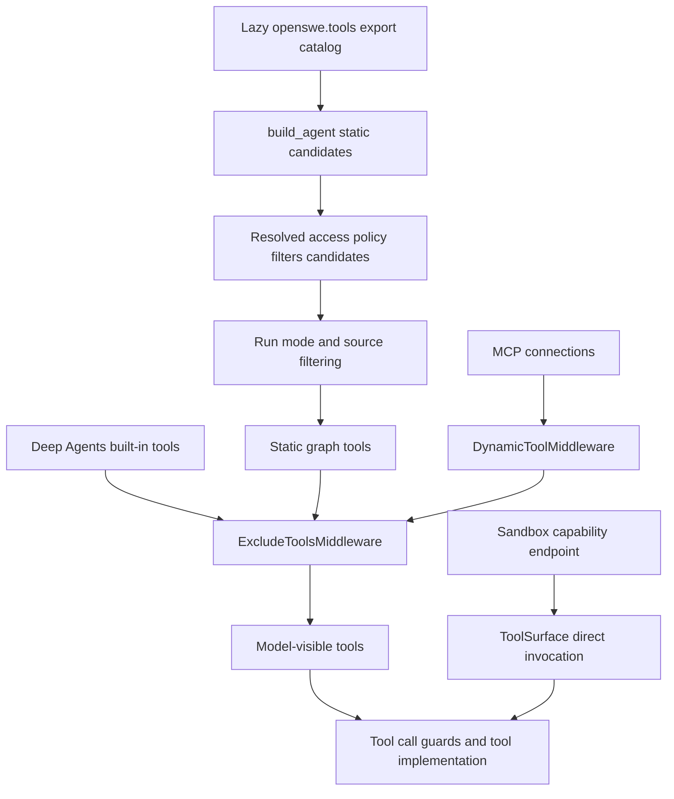
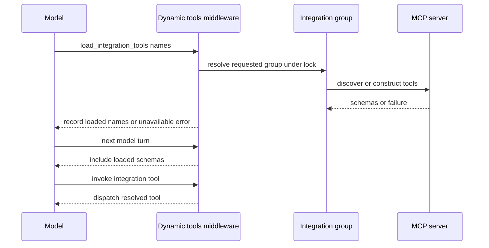

# Tool Surfaces, Dynamic Loading, and Authorization

A tool implementation is not automatically a model capability. Open SWE separates the import catalog, the static tools selected for a run, deferred MCP integrations, model-request exclusions, and tool-side authorization. The separation is intentional: graph composition implements least privilege and usability, while call-time checks protect against a changed thread, connection, or actor after a graph has been built.

## From catalog to an executable surface

`openswe.tools` is a lazy export facade, not a universal grant. `_TOOL_MODULES` maps public names to local and selected GitHub, Slack, and incident modules. Lookup imports the implementation on demand and caches its export; `_LazyToolsModule` also prevents an import-created submodule with the same name from shadowing that public callable. Graph factories choose which exports to pass to `create_deep_agent`.

`build_agent` in `openswe.server` creates the primary static list: web and HTTP access, background work, planning and personal-instruction tools, thread and PR operations, review/human-review actions, sandbox helpers where supported, scheduling and event tools, Slack operations, feedback, and selected administrative capabilities. `permitted(static_tools, tool_access)` removes every decorated tool whose policy does not match the resolved run access before the graph is built. This is the principal main-agent surface; individual capabilities may then be removed by run mode or middleware.

```mermaid
flowchart TD
  A["Lazy openswe.tools export catalog"] --> B["build_agent static candidates"]
  B --> C["Resolved access policy filters candidates"]
  C --> D["Run mode and source filtering"]
  D --> E["Static graph tools"]
  F["Deep Agents built-in tools"] --> G["ExcludeToolsMiddleware"]
  E --> G
  H["MCP connections"] --> I["DynamicToolMiddleware"]
  I --> G
  G --> J["Model-visible tools"]
  J --> K["Tool call guards and tool implementation"]
  L["Sandbox capability endpoint"] --> M["ToolSurface direct invocation"]
  M --> K
```

This decision flow distinguishes advertised model tools from the separately authenticated sandbox endpoint; both ultimately invoke the graph's tool implementations.

The tool list is narrowed further by trusted runtime context:

- A desktop (`local_run`) agent exposes only `http_request`, `fetch_url`, and `web_search`; a stop-summary run exposes only `slack_read_thread_messages` and `slack_reply` as static tools. MCPs are not collected for either mode.
- Slack tools are removed when the run lacks enabled Slack context, except that scheduled work retains channel listing/posting so it can report to a channel. Human-review and expedited-review operations also require the relevant Slack configuration and workspace setting.
- Automatic incident runs remove a named set of mutating, delegation, PR, Slack, workspace, and automation tools. A client tool with the same name replaces a server tool, and sandbox-preferred runs remove tools that the sandbox endpoint replaces.
- `ExcludeToolsMiddleware` applies after Deep Agents injects built-ins, so it can hide those as well as static tools on every model request. Its position after tool-injecting middleware is an invariant.

The factory reserves the static names plus `DEEP_AGENT_TOOL_NAMES` when it constructs dynamic tools. That prevents an integration from colliding with a built-in, the integration loader, or a selected static capability.

## Access policy is checked twice

A decorated tool declares a `Policy`: trusted location (`anywhere`, `private`, `admin_thread`, or `admin_surface`), optional actor requirement (`anyone`, owner, or admin), and optionally a result projection permitted to a sole writer in a shared thread. `resolve_access` derives the access object from validated persisted thread metadata and the trusted triggering identity. It rejects invalid scope metadata and private system-owned threads rather than assuming access; it computes administrative status separately and treats a scheduled run as administrative only when the schedule carries an authorized-admin record.

At assembly, `permitted` binds only tools whose policy has a mode. The `@access` wrapper resolves access again for each call. This is important when a thread gains a second writer or its sharing/ownership changes while a compiled graph remains in use. In a sole-writer fallback, a tool can return only an acknowledgement projection because all readers of the shared thread can see the result; it is not equivalent to private access.

Administrative automation tools demonstrate this defense in depth. They require an admin-thread policy with an admin actor, are exposed to the administrative MCP surface, derive their identity from runtime configuration (or an authorized schedule), and convert expected scheduling-service failures to `{ok: false, error: ...}`. Writes in a sole-writer context disclose only the acknowledgement and automation ID. `read_user_settings` is separately private-and-owner gated: it resolves the private credential owner when available, otherwise verified thread participants, and returns selected profile settings and instructions rather than credentials.

## Deferred MCP integrations

MCP tools are intentionally not all sent to the first model request. `DynamicToolMiddleware` initially gives a model-visible agent one loader named `load_integration_tools`; its description lists names and group membership but not individual tool schemas. The model requests one or more names, receives a `Command` that records `loaded_integration_tools`, and can call the resulting schemas on its next model turn. Direct calls before loading, unknown names, and names that failed to resolve return recoverable error `ToolMessage`s.

Each integration group is built at most once per middleware instance. A per-group lock serializes concurrent requests, and both a successful tool map and a failure-as-empty map are cached. Constructor validation rejects duplicates across groups and names reserved by the loader or factory. This controls startup cost such as an MCP handshake or credential fetch and avoids ambiguous dispatch.

For models that support mid-conversation additions, compatible Anthropic and OpenAI Responses models receive provider-native additions placed after the loader's result, preserving the prompt-cache history. Other models receive the loaded tools in the ordinary request tool list. The loaded-name state still controls routing in either case.

```mermaid
sequenceDiagram
  participant Model
  participant Dynamic as Dynamic tools middleware
  participant Group as Integration group
  participant Remote as MCP server
  Model->>Dynamic: load_integration_tools names
  Dynamic->>Group: resolve requested group under lock
  Group->>Remote: discover or construct tools
  Remote-->>Group: schemas or failure
  Dynamic-->>Model: record loaded names or unavailable error
  Model->>Dynamic: next model turn
  Dynamic-->>Model: include loaded schemas
  Model->>Dynamic: invoke integration tool
  Dynamic-->>Model: dispatch resolved tool
```

This is the model path; setting `model_visible=False` removes the loader and leaves the integration reachable only through the authenticated sandbox tool API.

### MCP connection lifecycle and authorization

`load_mcp_tools` combines ordered `MCPSource` objects. Later sources replace earlier connections with the same connection name entirely; an enabled-but-empty or disabled higher-precedence override therefore suppresses the lower connection rather than falling back. If any source listing fails, loading returns no tools, avoiding accidental exposure from a lower scope. Catalog cache keys include the source namespace, connection name, and connection revision, isolating owners and invalidating a changed connection; fresh catalogs live for ten minutes and may be served stale for up to 24 hours while refreshed.

Discovery initializes a bounded 30-second MCP session, follows paginated listings, and rejects repeated cursors or duplicate remote names. Remote tool wrappers receive a generated safe local name and, at every invocation, reauthorize the relevant source and reread the connection. They reject a removed/disabled connection, a changed source scope, URL/transport drift, or a tool removed from the allowlist before forwarding arguments. Failures are reduced to safe diagnostics rather than echoing request headers or credential-bearing URLs.

## Sandbox-routed tool calls

A hosted sandbox can call the thread tool API without receiving a user credential. `issue_tool_access` mints an HS256 JWT with an audience, host-thread ID, and sandbox ID only when the dashboard JWT secret and an HTTPS dashboard API base URL are configured. Shared sandboxes carry their creator thread's capability, not that of a guest. Provisioning adds the endpoint to proxy rules as an opaque header and, for non-LangSmith sandboxes, writes the tokenized URL to a mode-`0600` temporary file that is atomically moved into place.

Every route authenticates this capability, verifies required claims and audience, confirms the host thread still names the token's sandbox ID, disables caching/referrers, and caps request bodies at 1 MiB. The list endpoint constructs a `ToolSurface` from the saved thread tool context and supports bounded search/pagination. Invocation rejects unavailable tools and unexpected argument keys, then executes a one-node graph containing the existing agent tool node. It does not run the model.

`ToolSurface.prepare` obtains static graph tools and eagerly catalogs dynamic integrations for this authenticated discovery surface. It excludes loader and task-coordination controls. For an integration invocation it adds that integration name to state so dynamic middleware can route the call; this is the endpoint's authenticated alternative to a model first calling `load_integration_tools`.

## Graph-specific read-only and guard surfaces

The review chat graph is deliberately sandbox-less. It starts with `read_repo_file`, `search_repo_code`, `list_review_findings`, web tools, and the proposal tools `propose_review_comment` and `propose_pr_review`. `ExcludeToolsMiddleware` removes shell and filesystem mutations; its explicit general-purpose subagent has only `read_file`, `ls`, `glob`, and `grep`. Run preparation obtains a repository-scoped GitHub App installation token, while the review proxy seeds overview, diff, and findings as virtual `/pr/` files. This permits review discussion without transferring a user credential or a writable sandbox.

PR creation has an execution guard in addition to normal tool selection. On non-desktop main and subagent graphs, `PullRequestCreationGuardMiddleware` intercepts `execute` and `background_execute`. It tokenizes nested shell invocations (with a bounded expansion depth) and blocks `gh pr create`, POST/body `gh api .../pulls`, and direct `curl` creation of GitHub pull requests. It returns a structured, non-recoverable error directing the agent to `open_pull_request`, which retains user attribution; it does not silently allow a shell fallback when that tool fails.

## Extension and regression guidance

When adding a capability:

1. Implement and map the public tool export, then choose the smallest graph-specific static surface. Do not mistake exportability for authorization.
2. Decorate sensitive tools with an appropriate access policy and validate identity/resource scope inside the implementation. Treat assembly-time filtering as usability and least privilege, not the final security check.
3. Account for desktop, stop-summary, Slack, incident, client-replacement, sandbox-preferred, and subagent surfaces. Add a name to exclusions when it must not survive Deep Agents built-ins.
4. For remote integrations, supply an `MCPSource`/group with stable namespace and revision semantics; reserve names, defer loading, and revalidate scope, connection configuration, and allowlist at invocation.
5. For sandbox reachability, preserve capability binding to the host thread and sandbox, route through `ToolSurface`, and exclude model-only coordination controls.
6. Add focused tests: `tests/middleware/test_dynamic_tools.py` covers deferred schemas and routing; `tests/tools/test_mcp_sources.py` covers precedence and revocation; `tests/tools/test_mcp_catalog.py` covers cache refresh and secret-safe errors; `tests/tools/test_automations.py` covers admin rechecks; and `tests/tools/test_cli_mcp_tools.py` covers MCP administrative-session exposure and invocation.

## Related pages

- [Agent graph](../architecture/agent-graph.md) — primary graph composition and mode-specific assembly.
- [Middleware stack](../architecture/middleware-stack.md) — ordering and error behavior around tool calls.
- [Observability and MCP](../integrations/observability-and-mcp.md) — MCP configuration and operational context.
- [PR creation](../workflows/pr-creation.md) — attributed pull-request workflow and approvals.
