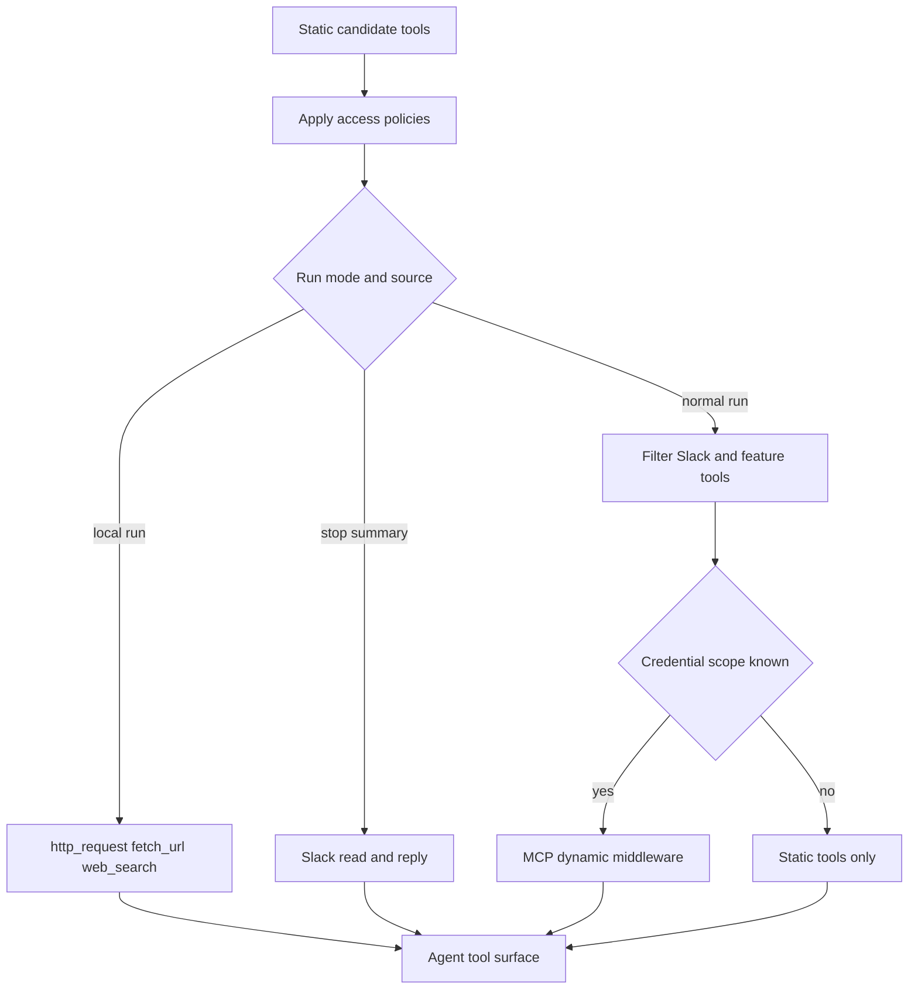

# Tool surfaces and dynamic capability policy

Open SWE treats the importable tool catalog, an agent's offered tools, the sandbox's callable tools, and a client's locally executed tools as separate surfaces. A tool is not a capability merely because it is exported: the factory must bind it for the run, policy may remove it, and the tool may recheck authorization at invocation.

## Catalogs are not execution grants

`openswe.tools` is a lazy facade over curated local, GitHub, Slack, and incident tools. `_TOOL_MODULES` maps public names to implementation modules; the package loads and caches a named export on first access. Its custom module class ensures an import-created submodule cannot shadow a same-named public function.

The main factory builds a broad static candidate list—web, background work, plans and user settings, threads, pull requests and review assistance, sandbox helpers, scheduling, events, Slack, administration, and selected operational tools—then calls `permitted()` before applying source and mode filters. Thus catalog membership is deliberately distinct from what a given model sees.

`@access(Policy(...))` is the primary declarative gate for sensitive tools. The factory omits a policy-bound tool when `Access.mode()` is unavailable, but the decorator resolves access again for every call. This matters when a thread's visibility or writers change while a run is in progress. A policy can allow full results in a trusted place, allow a sole writer only a projected/redacted result, require a direct user run, and constrain the actor to the owner or an administrator.

## Main-agent eligibility

The normal surface is context-dependent rather than a fixed list. Trusted run configuration determines whether the factory loads MCP tools, enables Slack, includes downloads, or reduces the tool list for special runs. Admin tools are candidates only in an admin thread and still have their own access policies. A local desktop run is reduced to `http_request`, `fetch_url`, and `web_search`; a stop-summary run is reduced to Slack thread reading and reply. MCP discovery is skipped in both modes.

```mermaid
flowchart TD
    Candidate["Static candidate tools"] --> Policy["Apply access policies"]
    Policy --> Source{"Run mode and source"}
    Source -->|"local run"| Local["http_request fetch_url web_search"]
    Source -->|"stop summary"| Summary["Slack read and reply"]
    Source -->|"normal run"| Normal["Filter Slack and feature tools"]
    Normal --> MCP{"Credential scope known"}
    MCP -->|"yes"| Dynamic["MCP dynamic middleware"]
    MCP -->|"no"| Static["Static tools only"]
    Local --> Offered["Agent tool surface"]
    Summary --> Offered
    Dynamic --> Offered
    Static --> Offered
```

This reflects the factory's ordering: access policies produce the baseline, special modes replace it, and only eligible normal runs obtain the MCP surface.

Slack tools require trusted Slack source context, with limited channel-list/post exceptions for scheduled runs. File-download/port helpers are offered only for an eligible LangSmith sandbox, not a bridged, desktop, or stop-summary run. Human-review and expedited-review tools also require their corresponding Slack/configuration conditions. Client-supplied tool names replace server tools of the same name so the graph and the client-execution endpoint agree on ownership.

Subagents compile as independent graphs, so they do not automatically inherit the parent middleware. The main factory explicitly gives the general-purpose subagent provider guards, an optional dynamic middleware, and a `_SubagentToolGuard` that rejects parent-only operations such as thread management, background work, user settings, and most Slack calls.

## Deferred MCP tools

MCP connections are assembled in precedence order from instance, workspace, user, and optionally the user's managed gateway; a later tier replaces an earlier same-named connection. The factory passes their loaded tools as the `MCPs` group to `DynamicToolMiddleware`, reserving static and Deep Agents built-in names to prevent collisions.

Initially, a model-visible dynamic middleware exposes only `load_integration_tools` and a catalog of tool names grouped by integration—not the full schemas. Loading validates every requested name, resolves only the needed group, records `loaded_integration_tools` in graph state, and tells the model to call the newly added schemas on the next turn. A direct call before loading returns a recoverable tool error. Group resolution is lock-serialized and cached, including a failed resolution; exceptions become an unavailable-tools error rather than ending the run.

For supported Anthropic and OpenAI Responses model families, the middleware inserts provider-native tool-addition content immediately after the load result, preserving the preceding prompt cache. Other models receive loaded schemas through the ordinary `tools` field. When `model_visible=False`, no loader is offered to the model: integrations can instead be reached through the authenticated sandbox endpoint.

## Direct sandbox execution

A sandbox can discover and invoke the thread's tools without a model turn at `/dashboard/api/sandbox-tools`. Provisioning issues a signed HS256 JWT containing the sandbox's host thread and sandbox ID, restricts the proxy rule to the dashboard host, and supplies the URL through `OPEN_SWE_TOOLS_URL`. Authentication validates token size, signature, audience, typed claims, and that the claimed sandbox remains bound to the host thread; rebinding revokes an old capability.

The endpoint rebuilds the graph from saved thread configuration, obtains the current graph state, and prepares a `ToolSurface`. Preparation reads the graph's `ToolNode`, resolves dynamic integrations for cataloging, and excludes coordination/model-only tools including `load_integration_tools`, `spawn_worker`, `control_worker`, and `message_task_thread`. Invocation accepts only declared schema properties, marks an integration as loaded in the temporary execution state, and executes the normal tool node so injected state, configuration, and store behave as they do in a graph run. It never accepts caller-provided thread context or extra parameters.

The API returns a searchable/paginated catalog and normalized `{status, content}` results. It uses no-store and no-referrer response headers, caps request bodies at 1 MiB, returns `404` for unavailable tools and `422` for unexpected arguments, and converts unexpected invocation exceptions to a logged `500` response. This is an authenticated capability interface, not a way to bypass tool or access-policy checks.

## Client-executed tools

`ClientToolsMiddleware` turns each configured `ClientToolSpec` into a schema-only `StructuredTool`. When the model calls one, it emits a placeholder `ToolMessage` tagged with `PENDING_ARTIFACT_KEY` and a deterministic result-message ID, then jumps to the end before another model call. The client supplies the real result in the next run under that ID, replacing the placeholder in place; the model can then continue with the result. The placeholder coroutine raises if ever invoked, making an accidental server-side execution visible rather than silently performing it.

## Review and approval constraints

The reviewer is a separate code-review graph. Its curated tool surface is `fetch_review_diff`, finding creation/update/listing/publication/thread operations, plus web tools; it deliberately excludes commit, push, and PR-opening tools. Preparation creates or reconnects a reviewer sandbox, mints a repo-scoped bot token, prepares the checkout and diff before the first model call, and provides the changed-line set so finding creation can validate locations early.

Repository review approval guidance is read at the pull request's base SHA, so the change under review cannot rewrite the policy used to judge it. Publishing consults that prepared policy and the repository approval mode. Separately, `WorkflowPushGuardMiddleware` intercepts standalone pushes that modify `.github/workflows`: it records a fingerprinted pending approval, surfaces an approval URL/Slack controls, and requires a retry after approval rather than pushing the changed workflow immediately.

## Failure conventions and focused tests

The system favors usable tool failures over collapsing an agent run: dynamic loader failures become `ToolMessage(status="error")`, unloaded dynamic calls explain how to load or access them, direct sandbox invocation normalizes unexpected failures to HTTP 500, and client calls pause for a result. Authorization denial from `@access` is a structured `{ok: false, error: ...}` result; sole-writer policies project results to prevent disclosure in a readable shared thread.

When changing a tool surface, test the layer that owns the invariant:

- `tests/middleware/test_dynamic_tools.py` covers deferred schemas, direct-call rejection, provider-specific additions, name collisions, and failed group loading.
- `tests/middleware/test_client_tools.py` verifies pause-and-resume replacement for client tools.
- `tests/sandbox/test_thread_tools.py` covers capability binding/revocation, sandbox discovery/invocation, parameter rejection, and request-size limits.
- Tool-specific tests should cover both factory-time omission and invocation-time policy recheck for protected operations.

## Related pages

- [Agent graph](../architecture/agent-graph.md) — graph factories and middleware assembly.
- [Middleware stack](../architecture/middleware-stack.md) — ordering and graph interception.
- [Observability and MCP](../integrations/observability-and-mcp.md) — connected MCP configuration.
- [PR creation](../workflows/pr-creation.md) — pull-request workflow and push behavior.
