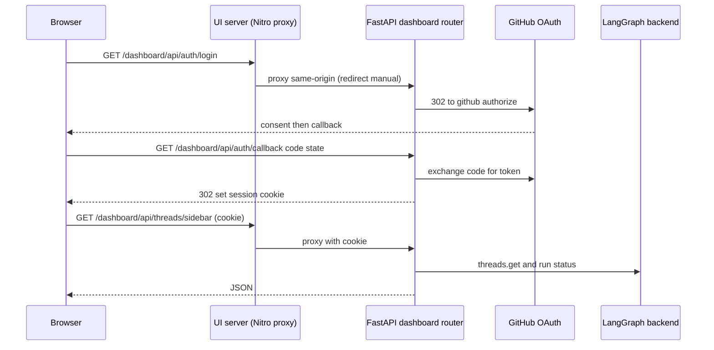

# Dashboard API & Web/Desktop UI

The dashboard is the human-facing surface of Open SWE. It has two halves: a
FastAPI router (`agent/dashboard/`) that the LangGraph backend serves under
`/dashboard/api`, and a React single-page app (`ui/`) built on TanStack Router /
TanStack Start that renders the Agents workspace, PR reviews, admin, usage,
integrations, and settings. An experimental Electron wrapper (`desktop/`)
repackages the very same UI and talks to the same dashboard API.

## The dashboard router and where it is mounted

The dashboard is a single `APIRouter` created in `agent/dashboard/routes.py` with
`prefix="/dashboard/api"`, and it is mounted onto the composed FastAPI app in
`agent/api/app.py` via `app.include_router(dashboard_router)` alongside the plan,
workflow-approval, webhook, and health routers. `agent/dashboard/__init__.py`
exposes `router` through a lazy PEP 562 `__getattr__` so that importing a small
dashboard submodule (for example from middleware) does not pull in FastAPI and
every API/job module; only the webapp that actually mounts the router pays that
import cost.

The router owns the full dashboard feature set: GitHub OAuth login/callback/
logout, per-user profiles and credentials, admin endpoints (user mappings,
reviewer evals, thread cancellation), team settings/credentials and defaults,
enabled review repositories, review-style management, agent instructions and
skills, usage leaderboards, schedules, and the Agents chat thread API (list/
detail/stream/commands, plus a cloud terminal WebSocket).

Diagram: browser login and an authenticated thread request, both routed through the same-origin UI proxy to the dashboard API and on to GitHub and LangGraph.

## Authentication and CSRF

Login is a GitHub App OAuth flow. `GET /auth/login` issues a signed `state`
(with a hashed nonce stored in a short-lived state cookie) and redirects to
GitHub's authorize URL; `GET /auth/callback` validates the state nonce against
the cookie, exchanges the code, fetches the GitHub user, enforces an
organization login gate, persists the access token, and issues a signed session
JWT stored in the session cookie. Session cookie `Secure`/`SameSite` flags are
derived from the API scheme: production (HTTPS, cross-site dashboard origin) uses
`Secure; SameSite=None`, while local `http://localhost` falls back to
`SameSite=Lax` without `Secure`.

Every mutating request is guarded by a router-level dependency,
`require_same_origin_for_mutations`: safe methods (GET/HEAD/OPTIONS) and requests
whose only credential is an explicit bearer token pass, but a cookie-authenticated
mutation must carry an `Origin`/`Referer` in the dashboard allowlist or it is
rejected with a CSRF error. Read/write endpoints depend on `require_session`,
which decodes the session cookie or returns 401. Admin-only endpoints additionally
check `is_admin`, and a few CI-facing endpoints accept an Actions OIDC token or an
admin's GitHub PAT in lieu of a session cookie.

## The Agents thread API

Thread endpoints in `agent/dashboard/thread_api.py` back the Agents workspace.
They are a thin, authorized layer over LangGraph: `get_dashboard_thread` reads
thread metadata via the LangGraph client, and the stream/commands/history/state
endpoints proxy directly to the LangGraph run APIs. `POST
/threads/{id}/stream/events` and `GET /threads/{id}/stream` return
`text/event-stream` responses; the proxy performs auth and content-type preflight
before the SSE body starts so failures surface as real HTTP errors rather than
mid-stream. The client SDK hydrates the transcript itself (reading
`GET …/state`), so the detail endpoint returns metadata only and does no
server-side message conversion.

Authorization is enforced by metadata predicates: `_assert_thread_readable`
returns 404 for threads the caller may not see, and `_assert_thread_postable`
additionally requires admin for `admin_thread`s. Thread status is normalized from
LangGraph run status by `_run_status_to_agent_status`, where `interrupted` wins
over a momentarily-`busy` thread because cancellation is asynchronous.

A cloud terminal is exposed as `POST /threads/{id}/terminal/connect` (which
returns a WebSocket URL, subprotocol, and a short-lived signed ticket) plus the
`WS /threads/{id}/terminal` endpoint. The terminal requires a LangSmith sandbox,
is capacity-bounded by a semaphore, and bridges the browser to a PTY shell in the
thread's sandbox.

## The ui/ TanStack-router app

`ui/` is a TanStack Start app whose file-based routes live in `ui/src/routes/`.
Key routes include `agents` (the chat workspace, with nested threads, local
sessions, environments, instructions, and sandbox routes), `review` and
`$owner.$repo.pull.$number` (PR reviews), `admin` and `admin_.evals`, `usage`,
`cloud-agents` (cloud defaults/profile settings), `my-settings`, and `login`. The
`integrations` route is now a redirect to `my-settings` because integrations were
folded into Profile Settings. Feature code is organized under `ui/src/features/`
into `agents`, `automations`, `reviews`, and `settings` areas.

### How the UI reaches the backend

The browser always calls `/dashboard/api/*` as a **same-origin relative** path so
the session cookie is sent with the request; the UI server, not the browser,
forwards those calls to the Python backend. In a deployed build this is
`ui/server/backend-proxy.ts`, a Nitro handler registered for `/dashboard/api/**`
and `/webhooks/**` that reads `DASHBOARD_API_URL` per request and proxies with
`redirect: "manual"` so OAuth 3xx hops stay intact. In dev, `ui/vite.config.ts`
sets up equivalent route rules that proxy the backend prefixes in-process
(defaulting to `http://localhost:2024`), and an optional mock-harness proxy fronts
the local E2E harness. There is deliberately no hard-coded production backend
default; the proxy throws if `DASHBOARD_API_URL` is unset. On the server side,
`dashboard-fetch.ts` copies the incoming `cookie` header onto forwarded requests
because `credentials: "include"` is meaningless during SSR.

## Experimental desktop Electron wrapper

The `desktop/` package is an experimental Electron app that ships the compiled
web UI; the web UI remains the recommended client. The bundled UI runs at an
internal `open-swe://app` origin, and Electron's `serveBundledUi` proxies
`/dashboard/api/*` requests to the user-configured backend so the browser never
sees a LangSmith key or calls the raw LangGraph API. GitHub login reuses the same
signed dashboard session as the web UI, redeemed through a PKCE-bound desktop
handoff (`/auth/login?desktop=…` → `/auth/callback` → `POST /auth/desktop/
exchange`) rather than a browser cookie.

Desktop additionally offers **This Mac** local runs: Electron supervises a
loopback-only LangGraph server started from `langgraph.desktop.json`, whose graph
uses the local filesystem backend defined in `agent/desktop.py`. `agent/desktop.py`
gates local runs to an allowlisted `local_project_path`
(`resolve_desktop_project`) and builds a `LocalShellBackend` over that project
with a minimal shell env, keeping the agent's scratch/artifact files out of the
user's repository. Local threads use the same streaming protocol, graph, tools,
subagents, and middleware as cloud threads; only the filesystem backend and
unavailable cloud integrations differ.

## Agent/UI parity and extension points

Agent/UI parity is a product principle: anything a user can do in the dashboard UI
should generally also be possible through an agent tool, subject to the same
authorization and safety boundaries. When adding a dashboard capability, add or
extend the corresponding curated agent tool unless there is a documented reason
not to.

New dashboard HTTP endpoints are added in `agent/dashboard/routes.py`, wiring the
route decorator to a handler in a focused module (for example `thread_api.py`,
`review_api.py`, `schedules.py`) and depending on `require_session` (or the admin
gate) so the router-level CSRF guard and session enforcement apply uniformly.

## Related

- Authentication, session cookies, and CSRF: see `concepts/auth-and-security`.
- PR review flow that the review endpoints surface: see `workflows/pr-review`.
- Backend URLs, allowed origins, and deployment env vars: see
  `operations/configuration`.
