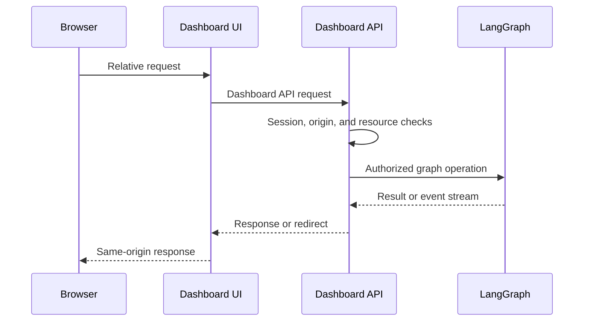
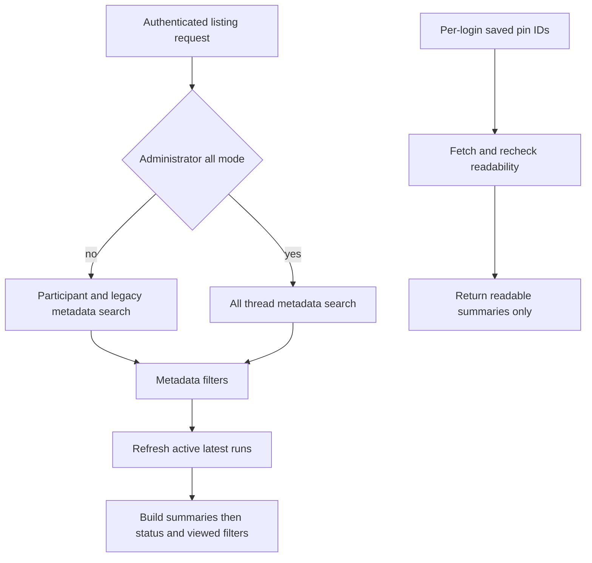
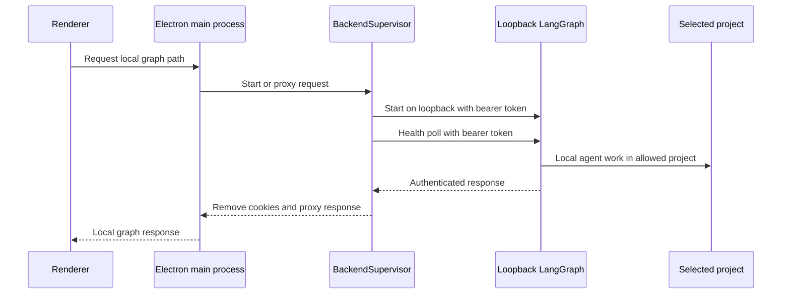

# Dashboard, Web UI, and Desktop Integration

The dashboard is the human-facing integration layer for Open SWE. Its FastAPI router is the policy boundary for GitHub identity, session- and role-based authority, dashboard records, and controlled access to LangGraph. The React UI and experimental Electron client deliberately reach that boundary through same-origin or local proxies rather than exposing deployment credentials or calling a raw graph endpoint.

## Composition and security boundary

`create_app()` includes the dashboard router at `/dashboard/api`, includes the adjacent plan and workflow-approval APIs, and finally invokes `mount_dashboard_ui(app)`. The dashboard package exposes `router` lazily: importing an individual dashboard helper does not import FastAPI routes and every feature module; the web application mounting it does.

The dashboard router applies `require_same_origin_for_mutations` to every route. Safe HTTP methods pass; a mutation authenticated solely with an explicit bearer token passes because it is not ambient browser authority. Cookie-authenticated mutations require an allowed `Origin` or `Referer`, and WebSockets always undergo the origin check. Endpoint-level authorization remains separate: sessions are required where applicable, admin endpoints additionally check `is_admin`, and selected CI administration paths accept a GitHub Actions OIDC token or an administrator GitHub token. `DASHBOARD_ALLOWED_ORIGINS` configures credentialed CORS, and the application rejects `*` because credentials are enabled.

Diagram: the web UI is a presentation and proxy boundary; the dashboard API authorizes work before it reaches LangGraph.

### Login and cookie behavior

GitHub login issues signed state containing a hash of a nonce held in a short-lived, HTTP-only state cookie, then redirects to GitHub. The normal callback validates that state, exchanges the code, resolves and organization-gates the GitHub identity, persists its token response, and issues a signed session cookie. Desktop handoff uses the same identity checks but redirects a PKCE-challenge-bound code to the local listener without setting a browser session; `POST /auth/desktop/exchange` requires the verifier and returns the desktop session.

Session cookie flags reflect the deployment topology: HTTP uses non-Secure `SameSite=Lax`; same-origin HTTPS uses `Secure; SameSite=Lax`; split-origin HTTPS uses `Secure; SameSite=None`. This is why proxy topology and `DASHBOARD_BASE_URL` are security-relevant configuration, not merely routing choices.

## Thread experience and controlled graph access

Threads are graph-owned objects whose dashboard visibility is determined by metadata. Only surfaced sources (`dashboard`, `github`, `slack`, `linear`, and `schedule`) are shown. Public surfaced threads are readable by authenticated users; private threads are readable by their immutable owner or workspace administrators. Prompting and shell access to a private thread remain owner-only; posting to an automation or `admin_thread` additionally requires an administrator. Failed or unauthorized lookups deliberately appear as `404`.

Discovery is narrower than readability. Ordinary listings search participant metadata and legacy creator fields; `all=true` is for administrators. Metadata filters run before constructing summaries, then potentially active latest runs are refreshed with a limit of eight concurrent refreshes; status and viewed filters run against the resulting summaries. Pins are stored per login and each saved thread is fetched and re-authorized, so a pin cannot preserve access after visibility changes.

Diagram: discovery selects candidates, while summary state and pinned-thread access are separately evaluated.

`GET /threads/{thread_id}` returns a metadata-derived summary rather than converting messages. The client stream SDK hydrates the transcript through the corresponding `state` endpoint. Reading a finished thread normally records viewed metadata, but `mark_viewed=false` opts out; running threads are not marked and a metadata-write failure is non-fatal. A temporarily busy thread whose latest run was interrupted is reported as interrupted.

The generic graph protocol is not exposed unguarded. Dashboard stream, commands, state, and history endpoints first validate the relevant thread access and proxy to LangGraph with the backend API key. Commands require JSON; only an initial `run.start` may create a missing dashboard thread, after which it stamps ownership and run metadata. This lets the browser use the SDK protocol while retaining dashboard authorization and attribution.

Cloud terminal access is also two-step. `POST /threads/{id}/terminal/connect` validates promptability and sandbox readiness, then returns a no-store WebSocket URL, `open-swe-terminal` subprotocol, and a short-lived signed ticket. The WebSocket revalidates ticket, origin, access, and sandbox; it is restricted to LangSmith sandboxes, limited by a 20-session semaphore, and bridges the browser to a PTY until disconnect.

## Review, configuration, and automation surfaces

The review UI reads reviewer-thread state—PR identity, findings, watch state, and head SHA—and augments it with live GitHub PR and diff data using the App installation token. GitHub absence is `404`; upstream GitHub failures become `502` (while writes preserve GitHub 4xx responses). It supports dashboard-triggered re-review and inline comments made with the caller's token.

“Chat with this PR” is a distinct sandbox-less `chat` graph. It is available only when the reviewer thread exists; conversations are scoped to the signed-in login plus repository and PR metadata. On a first run it seeds PR overview, diff, and findings as virtual files, then proxies the SDK commands, SSE stream, state, and history protocol while pinning the assistant to `chat` and enforcing that scope. Review chat is therefore separate from both the durable reviewer thread and normal agent threads.

Repository instruction records normalize `owner/repo`; non-empty instructions for a run’s resolved repository are appended to the agent prompt, with lookup failures treated fail-soft. Review styles are repository-access-controlled records with `idle`, `running`, `completed`, and `failed` lifecycle states. Retrieval reconciles active analysis, concurrent analysis returns `409`, and a saved prompt lets a terminal or missing analysis run resolve as completed.

Personal skills are virtual `SKILL.md` records isolated by GitHub login. Organization skills are shared, cursor-paginated and count-bounded, readable by all sessions, and writable only by administrators. Schedule listing requires a session; creating, changing, triggering, and deleting schedules requires administration. Schedules are workspace-scoped records with cron configuration separate from run state. Creation rolls the stored record back with `502` if LangGraph cron creation fails. An enabled change creates a replacement cron before deleting the previous cron, whereas disabling removes it. Before a scheduled launch, repository access is rechecked; loss of access records an unauthorized state rather than launching, while success creates an automation thread and durable resumable run.

## Web UI routing, serving, and deployed proxy

`ui/` is a React/TanStack Start application. Its generated route tree maps product routes such as `/agents`, `/review`, `/integrations`, `/admin`, agent threads, local sessions, schedules, and reviews. `routeTree.gen.ts` is generated and must not be hand-edited. The Agents layout permits an unauthenticated desktop-local-only experience solely at `/agents` and `/agents/local/{sessionId}`; its stream provider selects local transport for a local session and cloud transport otherwise.

The browser API layer constructs relative `/dashboard/api/*` URLs and uses cookie credentials. In development, Vite proxies backend prefixes to `DASHBOARD_API_URL` or `http://localhost:2024`, preserving the browser's UI origin. `DASHBOARD_DEV_SERVER_URL` provides the converse topology: the Python backend reverse-proxies all non-reserved UI traffic to Vite so login and API traffic stay on the backend origin; Vite HMR connects directly to Vite's configured port.

For a bundled deployment, `mount_dashboard_ui` serves `DASHBOARD_STATIC_DIR` or the in-repository `ui/.output/public` build. It serves immutable cached hashed assets at `/assets`, uses a no-cache `_shell.html` for HTML navigation, and declines reserved server paths or unknown non-HTML paths. The catch-all must be registered last; later route registration must call `keep_dashboard_ui_last`. A mount prefix requires a matching `DASHBOARD_BASE_PATH` build.

In split web deployments, Nitro registers `backend-proxy.ts` for `/dashboard/api/**` and `/webhooks/**`. It reads `DASHBOARD_API_URL` per request and fails when absent, preserving the fact that backend selection is deployment configuration. The handler streams bodies, strips hop-by-hop and invalid reframing headers, retains separate `Set-Cookie` headers, and uses `redirect: "manual"` so OAuth redirects reach the browser. During SSR the fetch layer instead targets `DASHBOARD_API_URL` directly and copies the incoming cookie header, because server-side `credentials: "include"` cannot carry browser cookies.

## Electron local handoff and supervision

The experimental Electron client serves the compiled UI from `open-swe://app`. It proxies dashboard requests to a configured hosted backend and local graph requests to an Electron-owned loopback backend, keeping LangSmith credentials and the loopback port out of the renderer.

Diagram: Electron owns the credentialed loopback connection; the renderer only sees the stable `/local-graph` route.

`BackendSupervisor` starts lazily, shares an in-progress readiness promise, reserves a `127.0.0.1` port, and generates a random bearer token. Development starts `uv run langgraph dev` using `langgraph.desktop.json`; packaged builds run the bundled Python runtime and configuration. It requires a projects allowlist and worktree directory, passes them and an out-of-project artifact directory to the child, then health-polls the authenticated loopback server for up to 60 seconds and retains child logs for startup failure diagnostics. Its stable public configuration is `{ apiUrl: "/local-graph", graphId: "agent" }`. Local proxying removes renderer cookies, injects the supervisor token, and shutdown escalates from `SIGTERM` to `SIGKILL` after five seconds.

For `configurable.source == "desktop"`, the agent selects `LocalShellBackend` rather than a cloud sandbox. The project must be an existing allowlisted directory or a desktop-managed worktree. Desktop runs use local model defaults and state-backed user skills, disable cloud sandbox downloads, and place sanitized per-thread scratch artifacts outside the project. This preserves the graph interface while constraining the agent’s filesystem authority and avoiding scratch-file pollution in the selected repository.

## Change and test boundaries

Changes to UI routing belong in `ui/src/routes/` and are reflected by regeneration of `ui/src/routeTree.gen.ts`, not direct edits to the generated file. Changes to SDK protocol proxying must preserve access preflight, JSON validation, streaming behavior, and OAuth/set-cookie semantics. Changes to desktop proxying must retain cookie stripping, loopback token injection, health checks, and shutdown behavior.

Focused dashboard thread tests cover image/model compatibility, run-start metadata stamping, summary privacy, terminal readiness, recovery patch limits, and the rule that only `run.start` creates a missing thread. Activity tests cover latest-run refresh, readable finished-thread viewing, the opt-out, and the rule that running threads are not marked viewed.

## Related

- [Architecture overview](../architecture/overview.md)
- [Auth and security](../concepts/auth-and-security.md)
- [Threads and state](../concepts/threads-and-state.md)
- [Deployment](../operations/deployment.md)
- [Invocation](../workflows/invocation.md)
