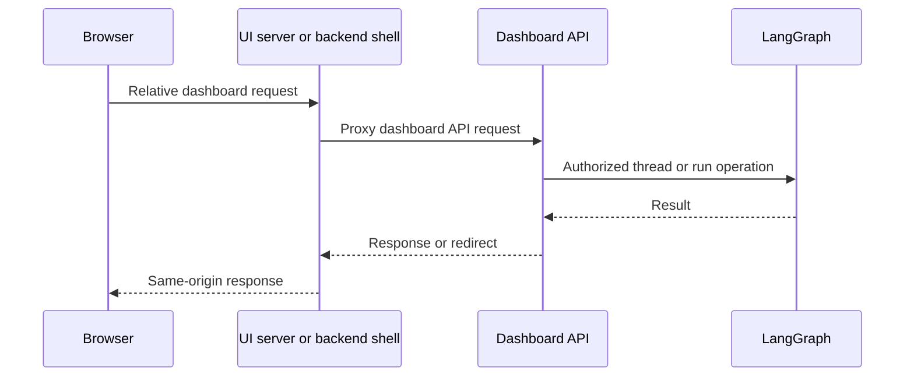
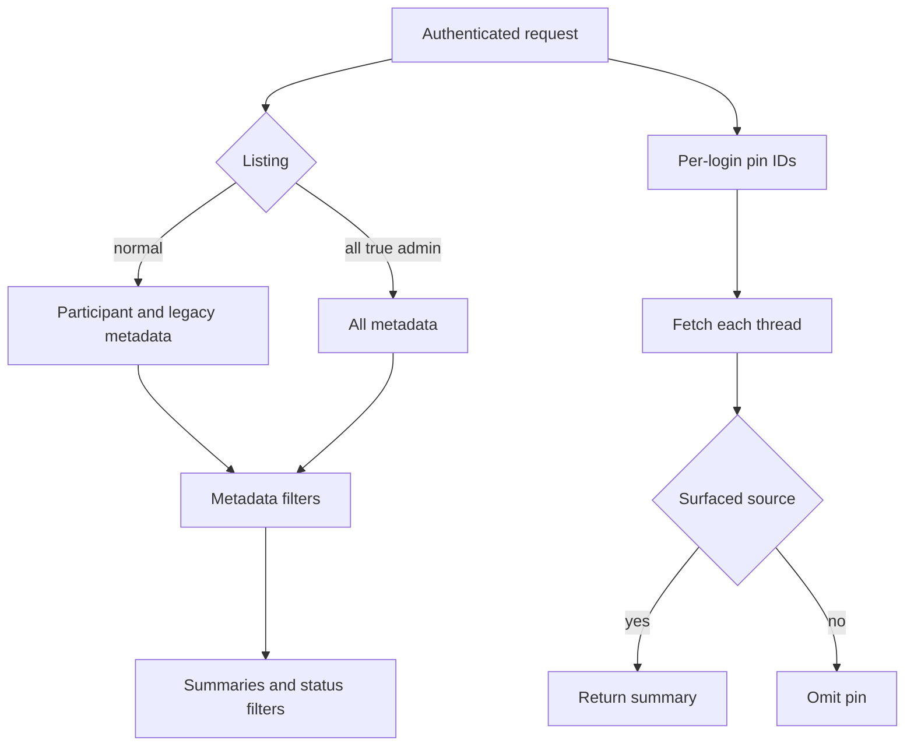

# Dashboard and Desktop Clients

The dashboard is the human-facing surface around the agent: a FastAPI router, a React application built with TanStack Start, and an experimental Electron client. The dashboard API is the policy boundary for sessions, GitHub-derived authority, dashboard records, and LangGraph operations; the browser-facing clients use proxies rather than exposing server credentials or calling a raw LangGraph deployment directly.

## Composition, serving, and mount paths

`agent.api.app.create_app()` includes the dashboard router, then calls `mount_dashboard_ui(app)`. The router has the `/dashboard/api` prefix and a router-wide mutation-origin dependency. `agent.dashboard` exports that router lazily with `__getattr__`; helper imports consequently do not pull in FastAPI, routes, and the feature modules unless the web app mounts the router.

When a dashboard build is available, `agent.utils.dashboard_ui` mounts immutable hashed assets at `/assets` and serves `_shell.html` for HTML navigation requests. It deliberately declines API, webhook, health, LangGraph, docs, metrics, and asset prefixes; a non-HTML request for an unknown UI route is likewise left for the underlying server to return as a 404. The shell is `no-cache` so it can reference a new asset manifest, while hashed assets can be cached for a year. With `DASHBOARD_DEV_SERVER_URL`, the backend instead reverse-proxies non-reserved traffic to Vite, preserving the backend origin and redirect responses. The catch-all is registered last; code which subsequently adds a route must call `keep_dashboard_ui_last`.

`DASHBOARD_STATIC_DIR` selects an explicit build; otherwise the in-repository `ui/.output/public` build is used when present. A build served under a LangGraph mount prefix must be built with the matching `DASHBOARD_BASE_PATH`. The UI router uses Vite's `BASE_URL` as its `basepath`, so client navigation follows that mount.

Diagram: normal web traffic reaches the dashboard API through either the UI server proxy or the backend's same-origin shell.

## Session and request security

GitHub login creates signed state containing a hash of a nonce placed in a short-lived, HTTP-only state cookie, then redirects to GitHub. The callback verifies the state cookie for normal browser login, exchanges the authorization code, resolves the GitHub user, applies the organization login gate, persists the token response, and redirects with a signed session cookie. A desktop handoff is different: after the same identity checks it returns a PKCE-challenge-bound code to the desktop loopback listener without setting a browser session; `POST /auth/desktop/exchange` requires the matching verifier before minting the desktop session.

Cookie security is derived from the API URL and whether UI and API share an origin: HTTP is non-secure and `SameSite=Lax`; same-origin HTTPS is `Secure; SameSite=Lax`; split-origin HTTPS is `Secure; SameSite=None`. `require_session` turns a missing or invalid session cookie into `401`. Admin routes additionally enforce `is_admin`; CI admin operations may authenticate with an Actions OIDC token or an administrator GitHub PAT.

The router-wide CSRF guard permits safe methods and a request authenticated only with an explicit bearer token. Cookie-authenticated mutations require an allowed `Origin` or `Referer`; WebSockets always receive the origin check. This control protects the ambient cookie, not business authority: individual endpoints still enforce administrator status, repository access, or thread postability. At app construction, credentialed CORS may be configured from `DASHBOARD_ALLOWED_ORIGINS`, but `*` is rejected because it is unsafe with credentials.

## Threads: discovery, reading, and terminal access

Thread discovery and thread readability are intentionally different. Normal listings search participant login/email metadata, including legacy creator metadata. `all=true` is restricted to administrators. The paginated endpoint clamps `limit` to 1–100, normalizes negative offsets, validates `repo` as `owner/name`, and rejects `repo` together with `ownerless`. Metadata filtering occurs before summary construction; viewed/status filtering requires summaries. Potentially active latest runs are refreshed with a concurrency limit of eight.

Any authenticated organization member can read a thread whose source is surfaced; unsurfaced threads return `404`. Posting applies that readable check and additionally requires an administrator for automation and `admin_thread` threads. `/threads/{thread_id}` returns a metadata-derived summary, not converted messages: the client stream provider obtains the transcript from the LangGraph state endpoint. A finished detail read normally writes viewed metadata but supports `mark_viewed=false`, never marks a running thread viewed, and treats metadata-write failure as non-fatal. An interrupted latest run is reported as interrupted even while the thread itself briefly remains busy.

Projects are metadata-only groups of matching configured repositories, keyed case-insensitively and sorted by latest update; they omit ownerless work and default to excluding resolved and automation threads. Pins are stored per login, not in thread metadata. Pinning verifies readability; loading pins retrieves every saved ID independently and omits missing, failed, or no-longer-readable threads. Thus a pin never bypasses present access checks.

Diagram: discovery is participant/admin scoped, whereas each pinned item is fetched and rechecked for current readability.

The cloud terminal uses a two-step contract. `POST /threads/{id}/terminal/connect` checks readable thread and ready sandbox, returns a no-store WebSocket URL, the `open-swe-terminal` protocol, and a signed ticket. The WebSocket expects protocol plus ticket, validates its thread-bound ticket and origin, then repeats readable/sandbox validation. It only operates for a LangSmith sandbox, permits 20 concurrent sessions, and closes with `1013` when full. It bridges bounded input and resize messages to a PTY shell and kills the handle when the connection ends.

## Dashboard-managed configuration and automation

Repository instruction records normalize `owner/repo`; route handlers filter lists and guard direct access through current repository authority. For a run's resolved repository, non-empty instructions are appended to the main prompt (and lookup failure is fail-soft). Review styles use similarly repository-guarded records with `idle`, `running`, `completed`, and `failed` states. A read reconciles an in-progress analyzer; a concurrent analysis returns `409`; a saved prompt allows a terminal or missing analyzer run to become completed.

Personal skills are virtual `SKILL.md` files isolated by GitHub login. Organization skills are shared, cursor-paginated, limited to 1,000 records, readable by every session, and writable by administrators only. Schedule listing requires a session, while create, update, trigger, and delete require administration. Workspace-scoped schedule records keep cron configuration separate from run state. Creation writes the record before creating a LangGraph cron and removes it with `502` if creation fails; enabled changes create the replacement cron before deleting the old one, while disabling deletes the cron. Before launch, repository access for the recorded owner is rechecked; failure records an unauthorized run state rather than launching. Successful launch creates an automation thread and resumable durable agent run.

## React UI and deployment proxy

`ui/` is a React/TanStack Start application with TanStack Router, React Query SSR integration, and a Vite/Nitro server build. The browser API layer forms relative `/dashboard/api/*` URLs and uses `credentials: "include"`. In development, Vite proxies backend prefixes (with a localhost default); deployed Nitro explicitly sends `/dashboard/api/**` and `/webhooks/**` to `ui/server/backend-proxy.ts` and requires `DASHBOARD_API_URL` at runtime.

The production proxy retains OAuth redirects with `redirect: "manual"`, forwards request bodies and headers, removes hop-by-hop and reframed response headers, and appends each `Set-Cookie` separately. Server rendering targets `DASHBOARD_API_URL` directly and explicitly forwards the incoming `cookie` header because server-side `credentials: "include"` cannot do so. The Agents layout permits an unauthenticated desktop-local-only mode only at `/agents` and `/agents/local/...`; its shared stream provider chooses local transport only for a local thread and cloud transport otherwise.

## Electron local client and execution boundary

The experimental Electron package bundles the compiled UI at `open-swe://app`. It proxies dashboard API traffic to a user-configured compatible backend and `/local-graph` traffic to a private loopback graph. This separation prevents the renderer from receiving LangSmith credentials or using a raw LangGraph API. Packaged builds have no hosted backend default; changing the configured backend clears that deployment's local session data. The desktop package builds the UI and packages both it and the local backend runtime.

`BackendSupervisor` starts the local graph lazily and shares the in-progress readiness promise. It reserves a `127.0.0.1` port, creates a random bearer token, verifies required project/worktree paths, and starts `uv run langgraph dev` with `langgraph.desktop.json` in development or the bundled Python runtime/configuration when packaged. It passes the token, project allowlist, worktree directory, and an out-of-project artifact location to the child. Startup polls the authenticated loopback root for up to 60 seconds and includes retained child logs in failures. The stable renderer configuration is `{ apiUrl: "/local-graph", graphId: "agent" }`; the proxy strips renderer cookies, injects the bearer token, and does not expose the actual port. Shutdown clears supervisor state, sends `SIGTERM`, and escalates to `SIGKILL` after five seconds.

A `source == "desktop"` run selects `LocalShellBackend`, not a cloud sandbox. `local_project_path` must resolve to an existing allowlisted project directory or a desktop-managed worktree. The local factory uses local model defaults and state-backed user skills, disables cloud sandbox file downloads, and routes `large_tool_results` and conversation history into sanitized per-thread artifact directories outside the project. This preserves the graph protocol while limiting filesystem authority to the selected project and preventing agent scratch files from appearing in its working tree.

## Focused verification

Dashboard thread tests cover image/model compatibility; `run.start` creation metadata; configured-repository display privacy; terminal sandbox readiness; recovery-patch behavior and limits; and the missing-thread command constraint. Activity tests cover run-status refresh, viewing by an authenticated reader, opt-out viewing, and the prohibition on marking a running thread viewed. Desktop changes should also retain the loopback token boundary, health polling, proxy cookie stripping, and termination escalation; UI proxy changes must preserve individual `Set-Cookie` headers and un-followed OAuth redirects.

## Related

- [Architecture overview](../architecture/overview.md)
- [Auth and security](../concepts/auth-and-security.md)
- [Deployment](../operations/deployment.md)
- [Invocation](../workflows/invocation.md)
