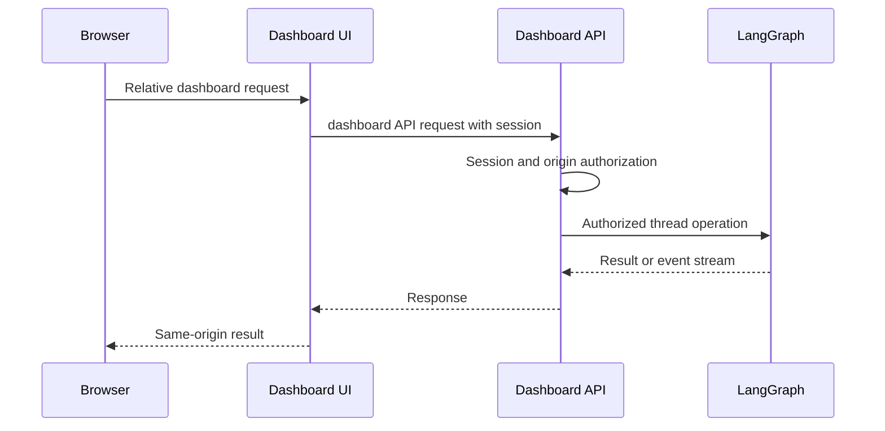
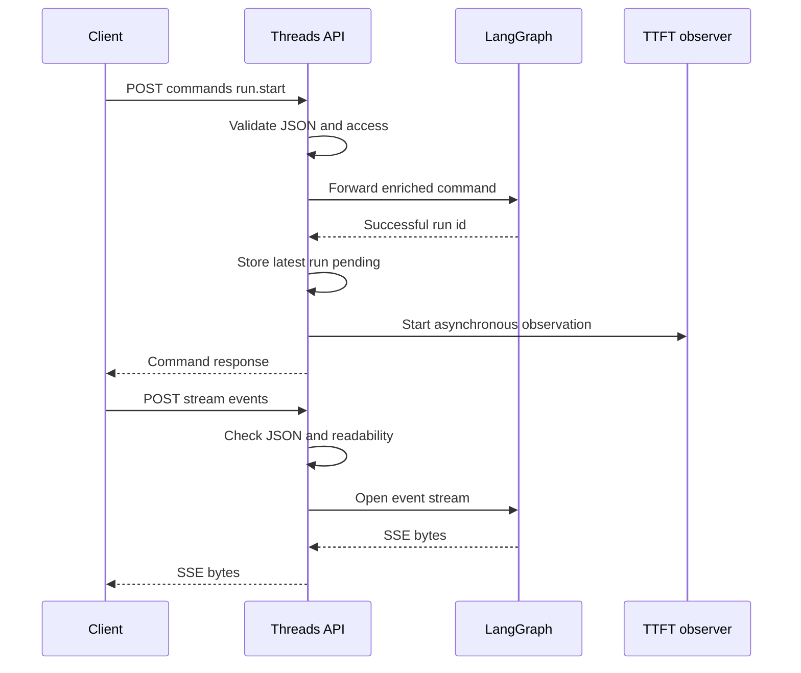
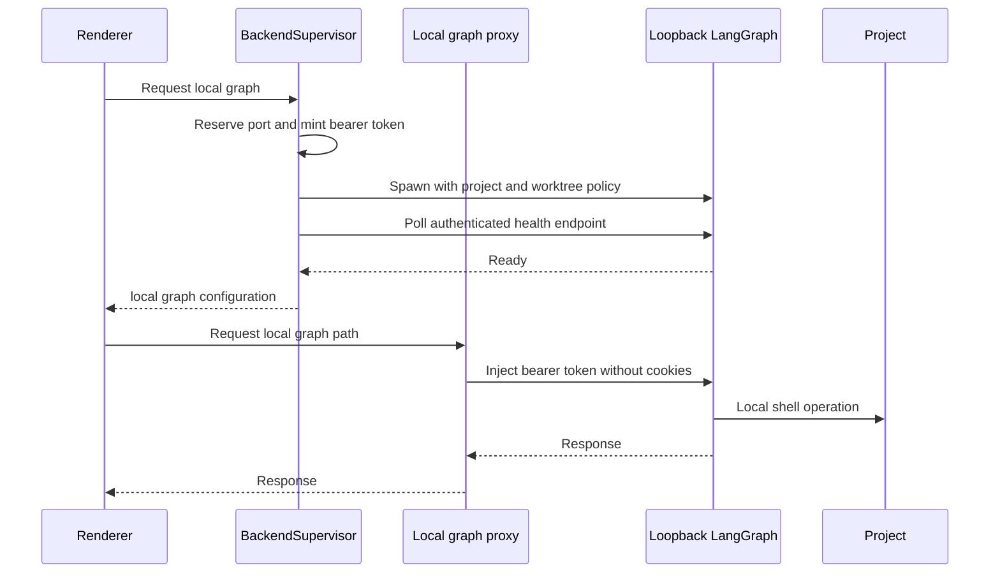

# Dashboard, Web UI, and Desktop Integration

The dashboard is the human-facing integration layer around the agent. Its FastAPI API owns browser-session policy and authorizes dashboard operations before delegating to LangGraph; the React UI and Electron renderer deliberately speak to dashboard or local proxy endpoints rather than holding backend credentials.

## API composition and security boundary

`create_app()` includes the aggregate dashboard router at `/dashboard/api` before mounting the UI. The aggregate router joins auth, profiles, repositories, environments, review, skills, schedules, analytics, incidents, MCP, Slack, and threads, and applies `require_same_origin_for_mutations` to all of them. `agent.dashboard` exposes that router lazily, avoiding the cost of importing all FastAPI routes for code that only needs a dashboard helper.

Authentication is GitHub OAuth. `/auth/login` signs state containing a hash of a nonce held in a state cookie. The callback validates that binding for a normal browser flow, exchanges the code, resolves and gates the GitHub user, stores the token response, and sets a signed session cookie. A desktop handoff instead redirects to the desktop loopback callback with a PKCE-bound code and no browser session; `POST /auth/desktop/exchange` needs the verifier and returns the desktop session and its expiry.

`require_session` rejects absent sessions with `401`; endpoint-specific dependencies add administrator or repository authority where appropriate. The router-wide CSRF guard passes safe methods and bearer-only requests, but rejects cookie-authenticated mutations without an allowed `Origin` or `Referer`; it also checks WebSockets. Configuring `DASHBOARD_ALLOWED_ORIGINS` enables credentialed CORS, and `*` is rejected. This guard protects cookie use, not authorization: handlers must still verify the requested thread, repository, or action.

Diagram: browser requests stay at a dashboard-facing origin while the API is the authorization boundary before LangGraph.

## Threaded-run contract

The threads router provides listing, detail, state, run control, messages, commands, history, diffs, and stream endpoints under `/dashboard/api/threads`. A thread detail response is dashboard-derived state; `GET /threads/{id}/state` is the state endpoint. The API is not a transparent LangGraph proxy: it checks readable or postable access before proxying.

For `POST /threads/{id}/commands`, JSON is required. A missing thread is accepted only for `run.start`, which initializes and attributes it; any other command receives `404`. On an existing thread, post commands require postability and other operations require readability. Successful `run.start` records pending latest-run metadata and starts a best-effort time-to-first-text observer. `POST /threads/{id}/stream/events` performs content-type and readability checks *before* returning an SSE response, then relays the LangGraph event stream. This ordering ensures authorization failures are HTTP errors rather than late stream events.

Diagram: run start is enriched and recorded before streaming; stream authorization happens before headers commit.

The cloud terminal is a separate capability path. `POST /threads/{id}/terminal/connect` checks that the caller may prompt the thread and that its sandbox is ready, then returns a no-store WebSocket URL, `open-swe-terminal` subprotocol, and a thread-bound signed ticket. The WebSocket reads that ticket from the offered subprotocols, checks the sandbox and caller again, and only supports LangSmith sandboxes. A semaphore limits it to 20 concurrent PTY sessions; saturation closes with `1013`. Input is bounded, resize dimensions are validated, and the shell handle is killed when the session finishes. This is deliberately stricter than ordinary readable-thread access because a terminal can modify the owner’s sandbox.

Focused tests exercise shell serving/proxy precedence, origin defenses, terminal ticket binding and readiness, run-start creation restrictions, and activity behavior such as refreshing run status and not marking a running thread viewed.

## Web UI serving and reverse proxies

The browser API layer creates relative `/dashboard/api/*` requests and uses credentials. In a bundled backend deployment, `mount_dashboard_ui()` serves a configured `DASHBOARD_STATIC_DIR` build or `ui/.output/public` when its `_shell.html` exists. Assets under `/assets` are immutable for one year; the navigation shell is `no-cache`. The catch-all declines server-owned prefixes such as dashboard API, LangGraph endpoints, webhooks, health, docs, and assets. It serves the shell only to requests accepting HTML, so incorrect API-style paths remain 404s. Register it after API routes; `keep_dashboard_ui_last()` restores that ordering if another route is added later.

`DASHBOARD_DEV_SERVER_URL` replaces static serving with a reverse proxy to Vite. It keeps the browser on the backend origin, streams request and response bodies, preserves redirects, and returns a diagnostic `502` if Vite is unavailable. Vite’s HMR WebSocket is direct to Vite’s configured port, not carried by this proxy. `DASHBOARD_BASE_PATH` must match a LangGraph mount prefix when producing a build for that mount.

For a standalone deployed UI, Nitro routes `/dashboard/api/**` and `/webhooks/**` to `backend-proxy.ts`. The handler reads `DASHBOARD_API_URL` per request and fails without it; it forwards bodies and end-to-end headers, does not follow OAuth redirects, removes hop-by-hop and reframed headers, and emits each upstream `Set-Cookie` separately. During SSR, the fetch layer calls `DASHBOARD_API_URL` directly and copies the incoming cookie header because server-side `credentials: "include"` does not forward cookies.

The generated route tree establishes the product routes, including the Agents layout, administration, settings, reviews, incidents, integrations, and agent subroutes for threads, skills, automations, plans, and local sessions. The Agents layout requires a session except for desktop local mode at `/agents` or `/agents/local/:sessionId`; its stream provider selects local transport only for a local session and cloud transport otherwise.

## Desktop local-agent boundary

Electron bundles the UI at `open-swe://app`. Its renderer uses proxy endpoints rather than an exposed local LangGraph port. `BackendSupervisor` starts a local graph only when needed, reserves a loopback `127.0.0.1` port, creates a random bearer token, requires an allowlist file and worktree directory, then launches either `uv run langgraph dev` with `langgraph.desktop.json` in development or the packaged Python runtime and configuration. It passes the token, local-project allowlist, worktree directory, and an out-of-project artifact location to the child.

Diagram: Electron keeps the port and bearer credential behind a local proxy while the graph operates within a selected project boundary.

Startup shares an in-progress readiness promise, polls the authenticated loopback root for up to 60 seconds, and includes retained child logs in failure output. The renderer receives only `{ apiUrl: "/local-graph", graphId: "agent" }`. Requests to that prefix trigger startup, strip `host` and `cookie`, inject the bearer token, and keep redirects manual; the real port is never published. Shutdown clears supervisor state, sends `SIGTERM`, then escalates to `SIGKILL` after five seconds.

A desktop run uses `LocalShellBackend`. Its `local_project_path` must resolve to an existing registered project or a desktop-managed worktree, preventing arbitrary filesystem roots. Agent scratch routes for `large_tool_results` and `conversation_history` use sanitized per-thread directories under the configured artifact root or a temp-directory fallback, outside the selected project; this avoids scratch output being swept into a project working tree.

## Related

- [Architecture overview](../architecture/overview.md)
- [Deployment](../operations/deployment.md)
- [Follow-up messages](../workflows/follow-up-messages.md)
- [Invocation](../workflows/invocation.md)
