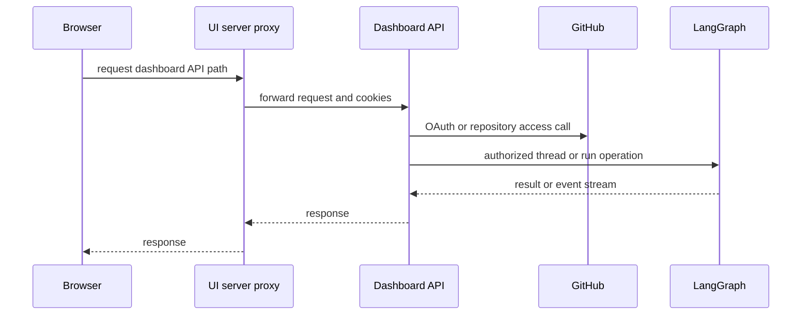
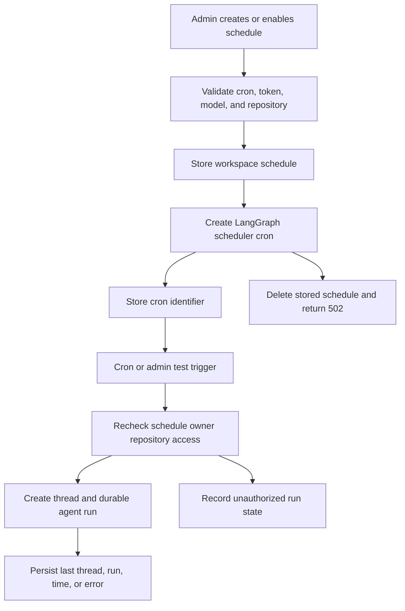

# Dashboard API & Web/Desktop UI

The dashboard is the human-facing integration surface: a FastAPI API served with the agent backend, a TanStack Start web application, and an experimental Electron wrapper. The API is a policy layer over stored configuration, GitHub credentials, and LangGraph; browser clients do not call LangGraph directly.

## Mounting and request path

The dashboard backend is a single router at `/dashboard/api`, mounted on the composed FastAPI application. Its package exports that router lazily, avoiding the cost of importing the routes and their feature modules when another backend component imports a dashboard helper.

Diagram: authenticated browser traffic reaches the dashboard API through the UI proxy; the API, rather than the browser, integrates with GitHub and LangGraph.

The router includes login and profile operations, team and repository configuration, review features, thread APIs, usage, skills, and schedule administration. Add a new dashboard HTTP capability in `agent/dashboard/routes.py`, with focused modules owning substantive behavior. The project’s agent/UI-parity principle means a dashboard capability should generally have a corresponding curated agent-tool path under the same authorization and safety constraints.

## Authentication and mutation protection

GitHub login signs state containing a nonce hash, stores the nonce in a short-lived state cookie, and redirects to GitHub. The callback validates that state for normal browser login, exchanges the code, applies the organization gate, persists the GitHub token, then issues the signed dashboard session cookie. HTTPS API deployments use `Secure; SameSite=None`; local HTTP uses non-secure `SameSite=Lax` cookies.

All router mutations are covered by the same-origin dependency. Safe HTTP methods pass; a request authenticated only by an explicit bearer token also passes, but a cookie-authenticated mutation must provide an allowed `Origin` or `Referer`. `require_session` makes normal dashboard reads and writes authenticated, while selected administrative CI interfaces can authenticate with an Actions OIDC token or an administrator GitHub PAT.

This does **not** make every authenticated user an administrator. The following distinctions are deliberate:

- Repository-scoped configuration endpoints require the caller to have access to that repository.
- Creating, changing, testing, or deleting a schedule requires an admin session; listing schedules only requires a session.
- Anyone with a valid dashboard session may read a *surfaced* thread, while posting is more restrictive for automation and admin threads.
- Organization-skill reads require a session, but organization-skill writes require an admin session.

## Repository instructions, review styles, and skills

### Repository-scoped prompts

`/agent-instructions` manages one instruction record per normalized `owner/repo`. Its user-authored text is appended to the main agent system prompt for runs targeting that repository. Lists are filtered by current repository access; get, create, update, and delete also check access. An empty instruction is meaningful as an update value and is omitted when the run-time prompt lookup returns an empty string.

`/review-styles` similarly stores per-repository review style profiles. A profile holds the editable synthesized prompt, sampling metadata, and an analysis lifecycle (`idle`, `running`, `completed`, or `failed`). Starting analysis rejects a concurrently still-running run with `409`; fetching a running profile reconciles its LangGraph run status. If a run finishes, fails, or disappears, a saved prompt permits completion; otherwise the record becomes failed with retry guidance. Review prompt lookup deliberately fails soft, so a store outage removes the supplement rather than failing the review itself.

### Skills

`/skills` is private to the signed-in GitHub login. Skills are persisted as virtual `/{name}/SKILL.md` records with generated frontmatter; names are lowercase hyphenated identifiers and descriptions/instructions are size-bounded. The user API has offset pagination and standard create/update/delete behavior, including `409` for duplicates and `404` for absent skills.

`/organization-skills` is shared: authenticated users can list it with an opaque name cursor, while only administrators can create, change, or remove entries. The store enforces an organization-wide maximum, so an over-limit list or creation fails rather than silently truncating the shared catalog.

## Schedule administration and lifecycle

Schedules are workspace-scoped records, not private per-user reminders. They contain a five-field cron expression, prompt, optional repository/model/effort, optional Slack channel and notification mode, owner identity, enabled state, and a separate last-run state. The API exposes authenticated `GET /schedules` but admin-only create, patch, manual test trigger, and delete endpoints.

Diagram: schedule creation is rolled back when scheduler-cron creation fails; every execution rechecks access before starting a durable run.

Creating a schedule first verifies the creator has a usable dashboard GitHub token, normalizes model choices, resolves repository configuration, writes the record, then creates a LangGraph cron. Failure to create that cron deletes the stored record and returns `502`. Changes that alter the cron expression or re-enable a schedule create the replacement cron before deleting the old one; disabling deletes the cron and clears its identifier. Deletion removes both schedule and run-state records.

A scheduled execution creates a fresh thread marked as an automation with schedule metadata and starts a resumable durable agent run. It rechecks the owner’s repository access at execution time, recording an unauthorized outcome rather than running with stale authority. A manual trigger is a test run; it maps unavailable repository access to an HTTP authorization error and other startup failures to `502`. Slack `always` mode creates a root Slack thread before the run, whereas `on_action` tells the agent to notify exactly once only after taking a concrete action.

## Surfaced threads: read access versus posting authority

The thread API adapts LangGraph threads, runs, state, history, commands, and streaming to the dashboard. A dashboard login is organization-gated, and any metadata source in the surfaced-source set is readable by authenticated users. This permits teammates to open shared “Open in Web” links, including surfaced Slack work, without implying they own the thread or can mutate it. Unsurfaced threads are deliberately hidden as `404`.

Posting first requires readable metadata. In addition, only administrators can post to an `admin_thread` **or any automation thread**. Administrators alone can request the broad `all=true` listing; ordinary listings search relevant participant metadata. The sidebar separates active and resolved threads, omits automations unless requested, and retains readable pinned entries. The page endpoint supports pagination and filters for status, source, viewed/resolved state, scope, automation ID, text, and ordering.

Thread summaries classify work as interactive, pull request, issue, or automation and normalize run status. In particular, `interrupted` wins over a temporarily `busy` thread so asynchronous cancellation is not displayed as still running. Opening a non-running thread may record its viewed timestamp and latest run ID; a failed metadata update does not fail the read. Thread detail returns metadata only: the client stream provider hydrates transcript messages through the state endpoint.

Commands can create a missing thread only for `run.start`; other commands against a missing thread are `404`. On creation, the API stamps dashboard origin, participant, prompt-derived title, repository, model, and run configuration metadata, making later listing and authorization meaningful. Image-bearing messages are rejected for text-only models rather than forwarding an unsupported payload.

For a cloud terminal, the API first verifies readable thread metadata and a ready sandbox, then returns a no-store WebSocket URL, protocol, and signed short-lived ticket. The WebSocket accepts only that protocol/ticket, requires a LangSmith sandbox, uses a bounded semaphore, and bridges browser input/output to a PTY in the thread workspace. Capacity exhaustion closes with a retryable WebSocket status.

## Web UI and proxy boundary

`ui/` is a TanStack Start file-based-router app. The Agents layout requires a session except for desktop local-only routes and supplies the shared stream provider; related routes cover agent threads, local sessions, automations, skills, environments, instructions, sandbox, reviews, settings, admin, usage, and login. Integrations redirects to Profile Settings.

Browser fetches use the relative `/dashboard/api` path with `credentials: "include"`. Deployed Nitro code handles `/dashboard/api/**` and `/webhooks/**`, reads `DASHBOARD_API_URL` for each request, and uses `redirect: "manual"` so an OAuth redirect reaches the browser rather than being consumed by the proxy. A missing deployment backend URL is an error, not a fallback to an unintended backend. During SSR, the fetch layer instead targets `DASHBOARD_API_URL` and copies the incoming `cookie` header because server-side `credentials: "include"` does not forward browser cookies.

## Electron and local execution boundary

The experimental Electron client serves the compiled UI at `open-swe://app`, proxies dashboard API paths to its configured backend, and separately proxies `/local-graph` to its loopback local LangGraph server. It keeps LangSmith credentials out of renderer code and does not expose raw LangGraph calls to the browser. Desktop OAuth uses a PKCE-bound handoff: the browser callback receives a code bound to a verifier retained by the desktop app, and `POST /auth/desktop/exchange` mints the desktop session only after verifier validation.

“This Mac” runs are distinct from cloud threads. Electron owns a `BackendSupervisor` which starts the local server on demand for `/local-graph`, reserves a random loopback port on `127.0.0.1`, and generates a new random bearer token for that child. It launches either source-development `uv run langgraph dev` with `langgraph.desktop.json` or the packaged Python runtime, then polls its authenticated health endpoint for up to 60 seconds. The UI only receives the stable `{ apiUrl: "/local-graph", graphId: "agent" }` configuration: the supervisor removes renderer cookies and injects the bearer token when forwarding to loopback. Startup failure includes retained child logs; an unexpected child exit is remembered as a failure, and application shutdown sends `SIGTERM` before escalating to `SIGKILL` after the stop timeout.

The desktop graph uses `agent.local_auth:auth` and disables its own UI. A run with `configurable.source == "desktop"` accepts a project only when the real path of `local_project_path` is an existing directory listed in `OPEN_SWE_LOCAL_PROJECTS_FILE`. It then creates a non-virtual `LocalShellBackend` rooted at that directory with only a small shell-environment allowlist. The main agent factory takes that branch instead of creating a cloud sandbox; it also uses local defaults and routes user skills to state, while omitting organization skills. Agent artifacts and evicted history are routed to a sanitized per-thread directory under `OPEN_SWE_LOCAL_ARTIFACTS_DIR` (or an OS temporary fallback), outside the repository, to avoid polluting user changes. Thus the graph protocol can be shared while filesystem authority remains explicitly local and allowlisted.

## Focused verification

`tests/dashboard/test_dashboard_thread_api.py` exercises the policy edges that are easy to regress: model-selection precedence and image rejection, metadata stamped on lazy `run.start` creation, thread-summary classification and privacy-sensitive source links, terminal sandbox readiness, recovery-patch validation, and the rule that only `run.start` creates an absent thread. Schedule changes should additionally preserve creation rollback, replacement-cron ordering, execution-time repository reauthorization, and the difference between schedule reads and admin mutations.

## Related

- Authentication and CSRF: [Auth and security](../concepts/auth-and-security.md)
- Prompt/profile concepts: [Models, profiles, and instructions](../concepts/models-profiles-instructions.md)
- Thread semantics: [Threads and state](../concepts/threads-and-state.md)
- Review workflow: [PR review](../workflows/pr-review.md)
- Automation operations: [Scheduling and baby-sit](../workflows/scheduling-and-baby-sit.md)
- Test strategy: [Testing overview](../testing/overview.md)
