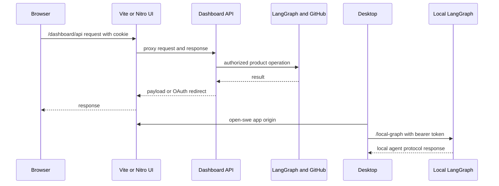

# Dashboard, web UI, and desktop clients

The dashboard is the human-facing product boundary. A FastAPI router mediates authenticated access to GitHub, dashboard settings, LangGraph threads, and review data; the web UI reaches it through a same-origin proxy. The experimental Electron client packages that UI, can connect it to a configured dashboard backend, and additionally supervises a private local LangGraph backend for work on a Mac. Neither browser nor renderer is a trusted route to raw backend credentials or unrestricted local filesystems.

## Deployment and request boundaries

`agent.api.app` composes the application and mounts the dashboard router at `/dashboard/api`. The package exports that router lazily, so imports of individual dashboard helpers do not force FastAPI routes and their feature modules to load. The router applies same-origin mutation protection globally; endpoint dependencies then add session, administrator, repository, or thread authority as appropriate.

Diagram: web traffic reaches the dashboard through its UI proxy, while the desktop's local graph is a separate authenticated loopback boundary.

The `ui/` package is a TanStack Start application built with Vite and Nitro. Browser dashboard calls use a relative `/dashboard/api` base, preserving the session cookie at one origin. During development, Vite/Nitro route rules proxy backend prefixes; deployed Nitro explicitly sends `/dashboard/api/**` and `/webhooks/**` to `server/backend-proxy.ts`. That handler reads `DASHBOARD_API_URL` for every request and has no production fallback. It forwards request data, retains OAuth redirects with `redirect: "manual"`, filters hop-by-hop and reframed response headers, and emits each upstream `Set-Cookie` separately. Server rendering is different: it resolves the API URL directly and explicitly copies the incoming `cookie` header because server-side `credentials: "include"` cannot do that.

## Login, CSRF, and authority layering

GitHub login signs state containing a hash of a new nonce and places the nonce in a short-lived, HTTP-only state cookie. The callback verifies the nonce for ordinary browser login, exchanges the code, applies the organization gate, persists the GitHub credential, then issues a signed session JWT cookie. Cookie posture follows `DASHBOARD_API_BASE_URL`: HTTPS selects `Secure; SameSite=None`; local HTTP selects non-secure `SameSite=Lax`.

`require_session` rejects a missing or invalid session. The router-wide `require_same_origin_for_mutations` is a CSRF defense, not authorization: safe methods and bearer-only traffic may pass, but cookie-authenticated mutations from origins or referers outside the dashboard allowlist are rejected. Individual endpoints still enforce their own authority. Administrator endpoints check `is_admin`; selected CI operations can authenticate through an Actions OIDC token or an administrator GitHub PAT. Repository routes call the current repository-access check, and thread routes distinguish readable from postable threads.

## Threads: discovery, access, and agent protocol

Thread discovery is deliberately narrower than reading. Normal lists derive candidates from participant and legacy creator metadata; `all=true` is administrator-only. Pins are per-login records and are re-fetched and checked for readability, so a saved ID neither grants access nor remains visible after access changes. A surfaced-source thread is readable by an authenticated organization user; an unsurfaced one returns `404`. Posting additionally refuses non-administrators on administrator and automation threads.

The paginated list filters metadata before constructing summaries, refreshes potentially active latest runs with bounded concurrency, then applies viewed and status filters. Status normalization gives an interrupted latest run precedence over a temporarily busy thread. `GET /threads/{thread_id}` returns dashboard metadata only: the client SDK hydrates the transcript from the thread state endpoint. A non-running read may mark the thread viewed, but failures to persist that mark do not fail the read and callers can opt out.

The dashboard proxies the LangGraph command, stream, state, and history protocol rather than trusting client-supplied execution context. A missing dashboard thread may be created only by `run.start`; the API stamps dashboard metadata and resolves run configuration at that boundary. The cloud terminal has an additional two-step boundary: `POST /threads/{id}/terminal/connect` yields a short-lived signed ticket and WebSocket details, and the WebSocket revalidates its ticket, readability, ready sandbox, and LangSmith sandbox type before bridging the browser to a PTY. A 20-slot semaphore bounds simultaneous terminals.

## Reviews and review chat

Reviewer threads (`metadata.kind == "reviewer"`) retain PR identity, findings, watch state, and head SHA. The review API combines that durable state with live GitHub PR information, diff data, and checks using the GitHub App installation token. Review listing pages through reviewer threads newest first and continues scanning when inaccessible records would otherwise consume the page; the optional “mine” filter is pushed into the metadata search. Individual review, diff, image, re-review, trace-resolution, and comment routes all require access to the addressed repository. User-created GitHub review comments use the signed-in user's token, preserving user attribution; blank comment bodies are rejected.

PR chat is a separate sandbox-less `chat` graph, not a general thread escape hatch. A chat conversation is scoped in its metadata to a viewer login and one owner/repository/PR; every client-supplied chat thread ID is checked against all of those values and mismatches deliberately return `404`. The first `run.start` creates the per-user thread, derives a title, pins the assistant to `chat`, and seeds virtual overview, diff, and findings files. Existing conversations reseed when the PR head moves; if a refresh fails after a prior seed, they continue using the last context, whereas a fresh chat reports the failure. Before the initial run, state and history convert LangGraph's missing-thread `404` to an empty idle state/history for SDK hydration.

## Settings and scheduled product configuration

The router is also the product API for profile settings, user credentials and instructions, team settings and credentials, environments, repository instructions, review styles, personal and organization skills, and schedules. These features share a pattern: normalize repository identity, filter lists by current repository access, and check it again for direct access or mutation. Repository instruction text is appended to the main agent prompt only for runs targeting that repository.

Review styles are repository-access-controlled records whose analysis is `idle`, `running`, `completed`, or `failed`; a running analysis is reconciled on retrieval and concurrent analysis is rejected. Personal skills are login-isolated virtual `SKILL.md` records. Organization skills are shared, cursor-paginated and count-bounded; sessions may read them but only administrators may change them.

Schedule listing requires a session; creation, update, trigger, and deletion require administrator authority. A schedule is persisted before its LangGraph cron is created and rolled back with `502` if cron creation fails. An enabled change creates a replacement cron before deleting the previous one. At execution time, repository access is rechecked: loss of access records an unauthorized run state rather than starting an automation thread and durable run.

## Electron local execution: supervision and filesystem authority

Electron serves the compiled UI from `open-swe://app` and proxies `/dashboard/api/*` to a user-configured backend. Desktop login is a PKCE-bound handoff: GitHub's browser callback returns a handoff code to the local listener, then `POST /auth/desktop/exchange` mints the session only for the matching verifier. This reuses dashboard identity without handing a LangSmith key or raw LangGraph access to renderer code. The app can also run in local-only mode, where account-backed cloud product areas remain unavailable.

`BackendSupervisor` starts the local graph on demand, not at Electron boot. It reserves a `127.0.0.1` port, generates a random bearer token, requires both a project allowlist file and worktree directory, then launches `uv run langgraph dev` with `langgraph.desktop.json` in development or the bundled Python runtime and configuration in a packaged application. It starts with a bounded health poll using that bearer token and retains child output to diagnose startup failure. The renderer receives only the stable configuration `{ apiUrl: "/local-graph", graphId: "agent" }`. The proxy strips renderer cookies, injects the random bearer token, and never exposes the loopback address or token. Shutdown sends `SIGTERM` and escalates to `SIGKILL` after the configured timeout.

**Filesystem invariant:** a desktop `local_project_path` is never arbitrary. `resolve_desktop_project` canonicalizes it and accepts it only if it is an existing directory registered in `OPEN_SWE_LOCAL_PROJECTS_FILE` **or** an app-created worktree beneath `OPEN_SWE_LOCAL_WORKTREES_DIR`. The local shell backend is rooted at that accepted path. Per-thread scratch artifacts—large tool results and evicted conversation history—are routed to a sanitized directory beneath `OPEN_SWE_LOCAL_ARTIFACTS_DIR` (or an OS temporary fallback), outside the repository. This prevents scratch output becoming an accidental working-tree change or `git add -A` input. Deleting a local thread is refused while the agent is running and subsequently discards its managed worktree.

## Operational checks and focused tests

The frontend package exposes `pnpm --dir ui run test` and `pnpm --dir ui run typecheck`; its build command is `pnpm --dir ui run build`. Desktop development uses `uv run langgraph dev` under Electron supervision; packaged builds bundle the UI and local backend. Required deployment settings include `DASHBOARD_API_URL` for a deployed UI proxy and dashboard API/base URLs plus allowed origins for login and cookies. Avoid treating CORS or the proxy as authorization controls.

Focused dashboard thread tests cover model/image compatibility, lazy `run.start` stamping, privacy-sensitive summaries, terminal readiness, recovery-patch limits, and the missing-thread creation rule. Activity tests cover run refresh and viewed behavior. `desktop/test/backend-supervisor.test.cjs` verifies development and packaged launch targets, credential availability reporting, creation failures, and activity polling without starting an idle backend. Changes at these seams should preserve OAuth redirect forwarding, cookie forwarding rules, per-user PR-chat ownership checks, loopback token injection, allowlisted-or-app-created worktree validation, out-of-repository artifacts, health polling, and termination escalation.

## Related

- [Architecture overview](../architecture/overview.md)
- [Auth and security](../concepts/auth-and-security.md)
- [Threads and state](../concepts/threads-and-state.md)
- [Invocation](../workflows/invocation.md)
- [Testing overview](../testing/overview.md)
