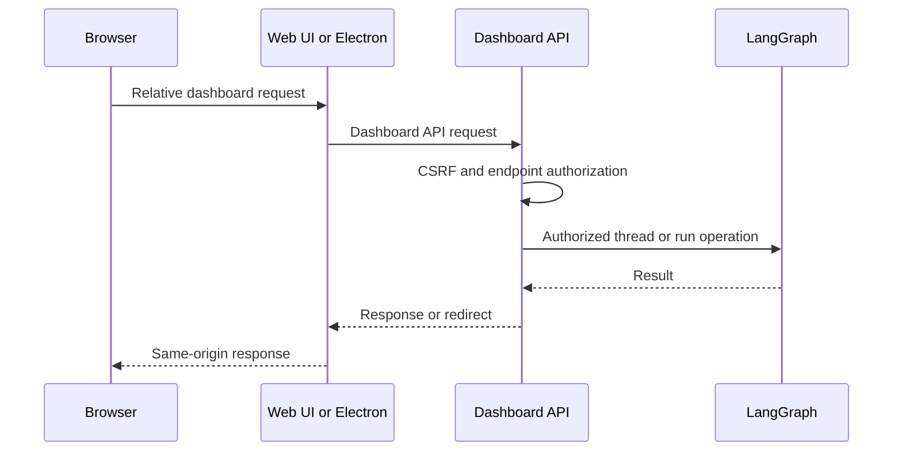
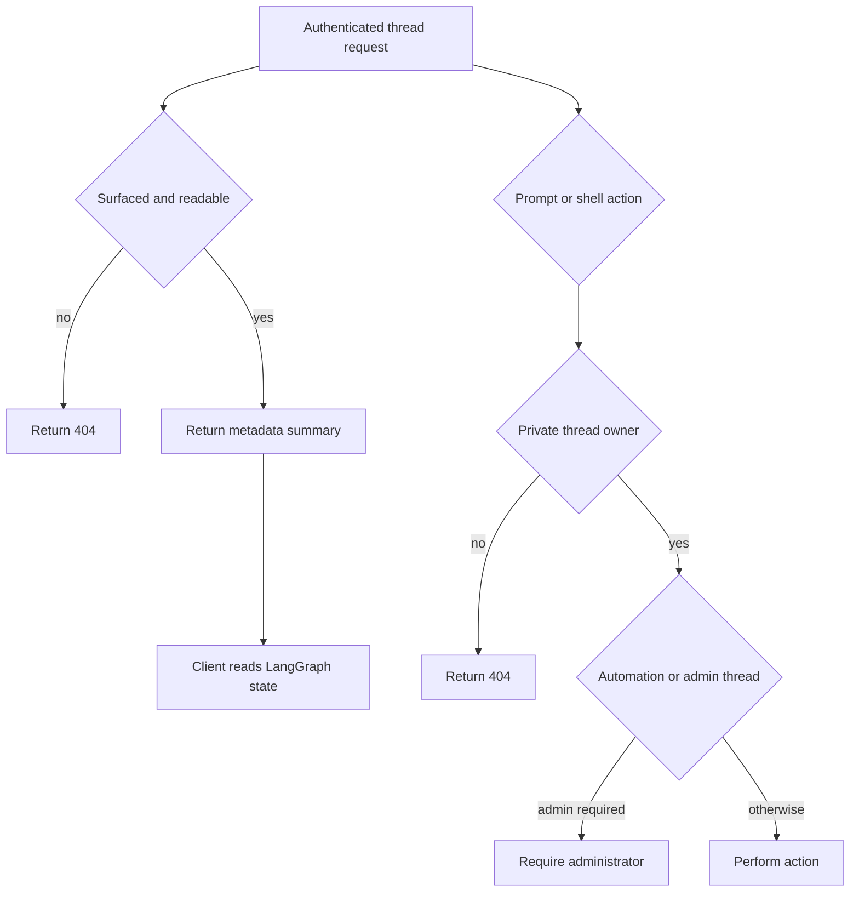

# Dashboard, Web UI, and Desktop Clients

The dashboard is the human-facing control plane for Open SWE. Its FastAPI API owns authenticated product operations and authorization checks; the React UI and experimental Electron app deliberately use that API boundary rather than exposing deployment credentials or treating raw LangGraph endpoints as a browser API.

## API composition and security boundary

`agent.api.app.create_app()` installs the dashboard aggregate router before other application routers and finally calls `mount_dashboard_ui(app)`. The aggregate is rooted at `/dashboard/api`, attaches `require_same_origin_for_mutations` once, and composes feature routers for authentication, profiles, settings, repositories and pull requests, reviews, skills, schedules, threads, workspaces, integrations, and analytics. `agent.dashboard.router` is lazy: importing a dashboard helper does not import FastAPI and every feature router; only the web application which mounts it pays that cost.

The router-wide check is CSRF protection for ambient session cookies, not authorization. It permits `GET`, `HEAD`, and `OPTIONS`; it also permits a mutation authenticated solely by an explicit GitHub bearer token. Other mutations require an allowed `Origin` or `Referer`, and WebSockets always undergo the origin check. Endpoint dependencies then establish a session, admin status, repository access, or thread capability as appropriate. At application construction `DASHBOARD_ALLOWED_ORIGINS` enables credentialed CORS; `*` is refused because credentials are enabled.

Diagram: the dashboard API remains the policy boundary between browser-facing clients and LangGraph operations.

### Login and sessions

`GET /auth/login` creates signed OAuth state carrying a hash of a newly generated nonce, places the nonce in a state cookie, and redirects to GitHub. The normal callback validates that cookie/state binding, exchanges the code, obtains the GitHub identity, applies the configured GitHub login gate, persists the token response, records the signed-in user, then redirects with an `osw_session` cookie. Missing or invalid session cookies produce `401`; admin dependencies turn a non-admin session into `403`.

Desktop login uses the same identity and organization checks but not a browser session. Its state carries a PKCE challenge and loopback port; the callback returns a short-lived handoff code to the loopback listener and leaves no session cookie in the browser. `POST /auth/desktop/exchange` requires the matching verifier to mint the session the app stores. Cookie attributes account for deployment topology: HTTP uses non-secure `SameSite=Lax`, same-origin HTTPS uses `Secure; SameSite=Lax`, and split-origin HTTPS uses `Secure; SameSite=None`.

## Threads and interactive capabilities

Thread routes sit behind `SESSION_DEP`. Discovery is participant-scoped for ordinary users, including legacy creator metadata; `all=true` is administrative. The page endpoint validates repository and ownerless filters before delegating to listing. Its implementation filters metadata before summary construction, refreshes potentially active latest-run metadata with at most eight concurrent refreshes, then applies summary-dependent viewed/status filters.

Readability and the ability to act are intentionally distinct. A thread must come from a surfaced source; public surfaced threads are readable by a signed-in user, while a private thread is readable only by its immutable owner or an administrator. An unreadable thread is represented as `404`. Prompting, shell access, and approval on a private thread are owner-only; sending to an automation or `admin_thread` additionally requires an administrator. A detail request returns a metadata-derived summary rather than converting messages: the client stream provider reads LangGraph state to hydrate the transcript. It refreshes the latest run, reports an interrupted run as interrupted even if the thread is momentarily busy, and marks a non-running thread viewed on a best-effort basis unless `mark_viewed=false`.

Diagram: reading uses surfaced-thread visibility, while interactive operations require a stronger capability for private threads and privileged thread classes.

### Cloud terminal

The cloud terminal is a ticketed two-step capability. `POST /threads/{id}/terminal/connect` verifies that the requester may open the sandbox, returns a `no-store` WebSocket URL, the `open-swe-terminal` subprotocol, and a thread-bound signed ticket. The WebSocket takes protocol and ticket through `Sec-WebSocket-Protocol`, so it does not need to receive a dashboard cookie. It validates the ticket, requires a LangSmith sandbox and current promptability, limits concurrent sessions with a semaphore, and bridges browser input, resize, output, and exit messages to a PTY shell. Capacity exhaustion closes with `1013`; the PTY handle is killed when the connection ends.

## Workspace settings ownership

Workspace settings are a separate configuration layer, not per-thread state. Effective settings resolve in this order: hardcoded defaults, an instance record, then sparse workspace overrides. Per-user profiles and thread `configurable` values may layer above them in callers that honor those settings. Reads fail soft to defaults if the store is unavailable, avoiding a store outage that prevents all agent, reviewer, and webhook runs.

The settings API allows any session to read instance or existing-workspace settings, while writes require an administrator. Workspace responses distinguish the effective values from that workspace's overrides. The update model validates supported model/reasoning-effort pairs, normalizes deprecated choices, bounds organization guidelines, and applies the Fable policy against the resolved enablement state so a workspace cannot bypass an inherited setting.

## Serving the packaged dashboard

The backend can serve one deployment as both UI and API. `DASHBOARD_STATIC_DIR` selects a build explicitly; otherwise a present `ui/.output/public` build is used. The server mounts hashed `/assets` with immutable one-year caching, serves ordinary build files, and returns `_shell.html` with `no-cache` for unknown HTML navigations. It declines reserved API, webhook, health, LangGraph, docs, metrics, and asset paths; it also declines unknown paths that do not accept HTML, allowing the underlying server to return its normal response.

`DASHBOARD_DEV_SERVER_URL` replaces the static build with a reverse proxy to Vite while retaining the backend origin, request cookies, body streaming, and redirects. The catch-all must be registered after API routes. If another route is added later, call `keep_dashboard_ui_last(app)` so that route is not shadowed. A build served under a LangGraph mount prefix must be built with `DASHBOARD_BASE_PATH`; the client router uses Vite's `BASE_URL` as its `basepath`.

## Web UI request routing

The React/TanStack Start router uses React Query SSR integration and tracks navigation before route mount for thread-load timing. Browser calls form relative `/dashboard/api/*` URLs and use the browser's same-origin cookie behavior. In local development Vite proxies backend prefixes to `DASHBOARD_API_URL` or `http://localhost:2024`; the deployed Nitro build registers `backend-proxy.ts` only for `/dashboard/api/**` and `/webhooks/**`.

The deployment proxy reads `DASHBOARD_API_URL` for each request and fails instead of choosing a hosted default. It forwards the request body and applicable headers, preserves OAuth redirect hops with `redirect: "manual"`, strips hop-by-hop and reframed response headers, and writes each upstream `Set-Cookie` as its own response header. On SSR, the dashboard fetch layer uses `DASHBOARD_API_URL` directly and manually forwards the incoming `cookie` header because server-side `credentials: "include"` cannot carry browser cookies.

The Agents layout has a deliberately narrow unauthenticated desktop-local mode: without a session it permits only `/agents` and `/agents/local/$sessionId` when that mode is enabled. Its stream provider chooses local transport for a local session and cloud transport otherwise.

## Electron client and local-agent boundary

The Electron client is experimental. It bundles the compiled UI at `open-swe://app` and proxies `/dashboard/api/*` to a user-configured compatible backend; the renderer does not receive a LangSmith key or call the raw LangGraph API. Packaged builds have no maintained hosted-backend default, and changing the backend clears session data associated with the old deployment. Local-only mode bypasses GitHub sign-in but exposes only projects and threads on the machine.

`BackendSupervisor` owns the private local graph lifecycle. A concurrent `start()` joins an existing readiness promise; the first start reserves a `127.0.0.1` port, creates a random bearer token, checks the project allowlist/worktree configuration, starts `langgraph dev` from `langgraph.desktop.json` in development or the bundled runtime/configuration when packaged, and polls the authenticated loopback root for up to 60 seconds. It retains child logs for failures. The renderer only receives `{ apiUrl: "/local-graph", graphId: "agent" }`; the proxy strips renderer cookies and injects the supervisor bearer token. Closing clears its state, sends `SIGTERM`, and escalates to `SIGKILL` after its timeout.

For `source == "desktop"`, the backend factory chooses `LocalShellBackend`. `local_project_path` must resolve to an existing user-allowlisted project or a desktop-managed worktree. Agent scratch routes for `large_tool_results` and `conversation_history` are per-thread, sanitized filesystem directories outside the project, so virtual artifact paths remain available without polluting the working tree.

## Focused verification

Dashboard UI tests exercise shell navigation, cache policy, reserved-path precedence, fall-through for non-HTML requests, mount-prefix behavior, route reordering, and dev-proxy streaming, headers, redirects, and failure reporting. CSRF tests cover origin/referer normalization and the router-wide mutation guard. Cloud-terminal tests cover ticket expiry/thread binding, protocol transport, owner/sandbox checks, and cookie-free WebSocket use. Thread tests cover activity refresh, view-marking behavior, privacy, run start, recovery patches, and terminal readiness. Desktop work should preserve loopback-only binding, bearer-token injection, readiness polling, cookie stripping, and graceful-then-forced termination.

## Related

- [Architecture overview](../architecture/overview.md)
- [Auth and security](../concepts/auth-and-security.md)
- [Deployment](../operations/deployment.md)
- [Invocation](../workflows/invocation.md)
