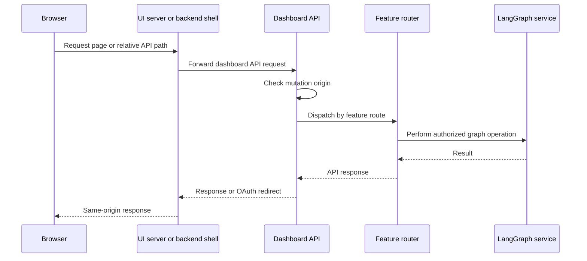

# Dashboard, Web UI, and Desktop

The dashboard is Open SWE's human-facing product surface. A FastAPI application mounts a dashboard API, the `ui/` React application uses that API through a same-origin boundary, and the experimental Electron client packages the web UI while supervising a separate loopback-only graph for local-project work. The dashboard aggregator establishes a shared prefix and cross-site-mutation policy; feature routers—not the aggregator—own the concrete API behavior.

## API composition and feature ownership

`agent.api.app.create_app()` configures credentialed CORS from `DASHBOARD_ALLOWED_ORIGINS`, refusing `*`, includes the dashboard router, then calls `mount_dashboard_ui(app)`. The dashboard package exposes its router lazily: importing a dashboard helper does not eagerly import FastAPI and the full feature-router graph.

The aggregate router at `/dashboard/api` applies `require_same_origin_for_mutations` once and mounts routers owned by their features. These include authentication, profiles and preferences, user and agent instructions, workspace settings, workspaces, repository and pull-request views, reviews, skills, schedules, threads and transcripts, analytics, incidents, Slack, Notion, and MCP. Add an endpoint to its responsible feature router; use the aggregate router only to make that router available under the common dashboard API and policy boundary.

### Request flow

Diagram: a relative browser request reaches either the deployed UI proxy or the backend shell; the aggregate router applies shared mutation policy before a feature router handles its operation.

## Session, authorization, and mutation safety

`auth_routes.py` owns login, callback, logout, session identity, and desktop-session exchange. GitHub login places a fresh nonce in a state cookie and puts its HMAC hash into a short-lived signed state. The normal callback verifies that binding, exchanges the GitHub code, enforces the configured GitHub authorization gate, persists the access token, signs the user in, and sets the session cookie. Redirect targets are constrained to relative safe paths or configured dashboard origins.

Desktop handoff uses the same identity and authorization checks but is deliberately not a browser session: the callback sends a short-lived, PKCE-challenge-bound handoff code to the fixed loopback callback, clears state, and does not set `osw_session`. `POST /auth/desktop/exchange` accepts the code and verifier to mint the desktop session. The handoff code itself is inert identity data rather than a session, which matters because it travels in a browser-visible URL.

`require_session` decodes `osw_session` or returns `401`; feature routers use `SESSION_DEP` for authenticated reads and `ADMIN_DEP` for privileged writes. The shared mutation dependency passes `GET`, `HEAD`, and `OPTIONS`; it also permits a bearer-token-only request because no ambient cookie is present. Cookie-authenticated mutations must present an allowed `Origin` or `Referer`; WebSockets always undergo the origin check. This CSRF control complements rather than replaces each feature's authorization checks.

Cookie attributes reflect deployment topology: HTTP uses non-secure `SameSite=Lax`; same-origin HTTPS uses `Secure; SameSite=Lax`; a split dashboard/API HTTPS deployment uses `Secure; SameSite=None`. The API startup allowlist check and the mutation guard are therefore operational requirements when hosting UI and API separately.

## Workspace settings as a managed surface

`workspace_settings.py` owns the settings API and resolution rules. It stores a backwards-compatible instance record under `team_settings/default` and sparse per-workspace overrides under `workspace_settings`; missing workspace fields inherit instance values. Callers may layer profile and thread configuration above those resolved defaults.

Authenticated users can read `/settings` and `/workspaces/{workspace}/settings`; administrators write them. Workspace names are slugified and must identify an existing workspace. The update model validates supported model and reasoning-effort pairs, normalizes stale model identifiers, trims review instructions, and caps those instructions at 10,000 characters. Fable disabling is a kill switch: any stored Fable defaults in the update are replaced with their non-Fable fallback rather than causing the disable operation to fail.

## React router, rendering, and proxy boundary

The `ui/` application creates a TanStack Router with a React Query context, SSR query integration, scroll restoration, intent preloading, and a Vite-base-derived `basepath`; builds served from a LangGraph mount prefix therefore route beneath that prefix. The root route resolves the session during server load, then supplies the query client, command provider, theme synchronization, route outlet, and client scripts.

In the browser, `dashboardApiUrl()` uses the page-relative dashboard API base (or an explicitly configured API base); it remains empty for the Electron `open-swe:` protocol. During server rendering, the fetch layer uses `DASHBOARD_API_URL` directly and copies the incoming `cookie` header, since server-side `credentials: "include"` does not forward browser cookies.

In development, Vite proxies backend prefixes to `DASHBOARD_API_URL` or `http://localhost:2024`, retaining redirects so OAuth navigation remains visible to the browser. In a production Nitro build, only `/dashboard/api/**` and `/webhooks/**` are handled by `backend-proxy.ts`; it reads `DASHBOARD_API_URL` per request and fails without it rather than silently targeting a default backend. The proxy streams bodies, keeps OAuth `3xx` responses manual, strips hop-by-hop request and response headers, removes stale response framing headers, and emits each upstream `Set-Cookie` as a separate response header.

The Agents layout normally requires a session. In Electron local-only mode, an unauthenticated user may access only the Agents root and `/agents/local/$sessionId`; all other routes redirect to sign-in. This confines the no-cloud-session experience to local-project threads.

## Serving the UI from the backend

`mount_dashboard_ui()` can serve a configured `DASHBOARD_STATIC_DIR` build or the in-repository `ui/.output/public` build. It mounts `/assets` with one-year immutable caching and routes HTML navigations to `_shell.html` with `no-cache`. It declines reserved API, webhook, health, LangGraph, documentation, metrics, and asset paths; it also declines unknown requests that do not accept HTML, preserving an ordinary server `404` instead of returning the application shell.

For UI development, `DASHBOARD_DEV_SERVER_URL` substitutes a reverse proxy to Vite while retaining the backend's browser origin. It streams request and response data, passes redirects back to the browser, and returns a diagnostic `502` when Vite is unreachable. The HMR WebSocket is intentionally direct to Vite's own port. Because the UI fallback is a catch-all route, it must be registered after API routes; `keep_dashboard_ui_last()` moves it behind routes added later. When serving below a LangGraph mount prefix, build with the matching `DASHBOARD_BASE_PATH`.

## Electron local graph lifecycle

The experimental Electron package serves the compiled UI at `open-swe://app`. It proxies cloud `/dashboard/api/*` traffic to a user-selected compatible backend and uses `/local-graph` for local execution, so the renderer neither obtains LangSmith credentials nor calls the raw graph endpoint. Packaged builds have no hosted-backend default; changing a configured backend clears that deployment's local session data. Desktop sign-in can exchange its PKCE-protected handoff for the same signed dashboard session as the web UI, while **Continue in local mode** leaves cloud features behind sign-in.

`BackendSupervisor` starts the private graph on demand and shares an in-progress start promise, preventing concurrent callers from spawning multiple backends. It reserves a random `127.0.0.1` port, creates a random bearer token, requires project-allowlist and worktree locations, creates required state directories, and launches `uv run langgraph dev` with `langgraph.desktop.json` in development or bundled Python plus `langgraph.json` when packaged. The child receives the token, project and worktree constraints, and—when state storage is configured—out-of-project artifacts and SQLite checkpoint locations.

The supervisor polls the authenticated loopback root for up to 60 seconds and retains recent child output to make startup failures actionable. Its public renderer configuration is stable (`{ apiUrl: "/local-graph", graphId: "agent" }`) and does not reveal the real port or bearer token. Every local-graph proxy request removes renderer `host` and `cookie` headers, injects the token, requests identity encoding, and keeps redirects manual. The local backend's authentication hook independently requires an exact bearer-token match. On shutdown the supervisor clears its state, sends `SIGTERM`, and escalates to `SIGKILL` after five seconds.

## Focused verification and safe changes

The backend UI tests cover static-build selection, reserved-path protection, shell selection, cache behavior, dev-proxy behavior, and catch-all ordering. CSRF and OAuth tests should remain the safety net when changing origin handling, cookies, redirects, or desktop handoff. `ui/server/backend-proxy.test.ts` verifies request-header framing and that event-stream chunks are delivered before the upstream closes. Local-graph changes should retain the token boundary, readiness polling, no-cookie proxy invariant, and termination escalation.

## Related

- [Architecture overview](../architecture/overview.md)
- [Auth and security](../concepts/auth-and-security.md)
- [Deployment](../operations/deployment.md)
- [Invocation](../workflows/invocation.md)
