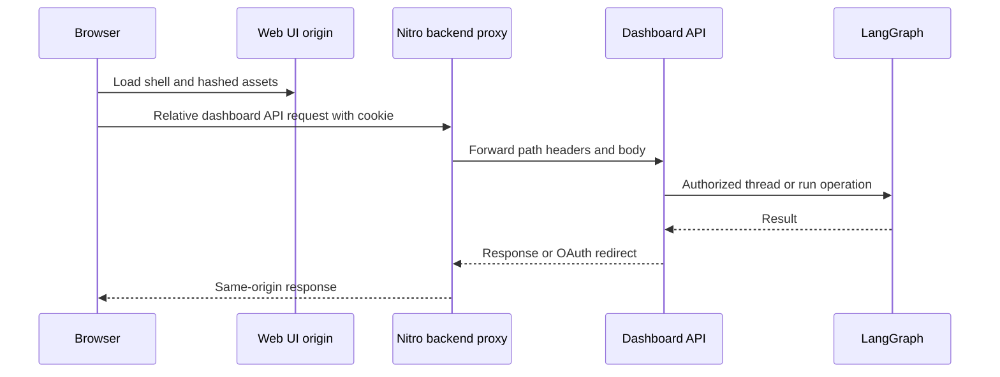

# Dashboard, Web UI, and Desktop Integration

The dashboard is the human-facing integration boundary for Open SWE. Its FastAPI API authenticates users and applies product authorization before reaching LangGraph or GitHub-backed data. The TanStack Start UI and the Electron renderer deliberately access that boundary through same-origin proxy layers; the renderer does not receive backend or local-graph credentials.

## Composition and request paths

`create_app()` installs request IDs and tracing, includes the aggregated dashboard router and selected non-dashboard routers, then mounts the UI last. The dashboard router owns `/dashboard/api` and aggregates independently implemented domain routers—authentication, workspaces, repositories, reviews, schedules, threads, transcripts, skills, and more—under a router-level mutation-origin dependency. The `agent.dashboard` package resolves its aggregate router lazily so code importing a small dashboard helper does not also load FastAPI and all API modules.

The backend can serve the compiled UI itself. `DASHBOARD_STATIC_DIR` selects a build, otherwise an in-repository `ui/.output/public` build is used when available. The catch-all leaves server-owned paths, including `/dashboard/api`, `/webhooks`, LangGraph endpoints, health, documentation, and assets alone. It serves a requested build file, or `_shell.html` only to HTML navigation requests; malformed API-like requests therefore remain 404s instead of receiving the application shell. The shell is revalidated (`no-cache`), while hashed `/assets` files are immutable for one year.

For development, `DASHBOARD_DEV_SERVER_URL` substitutes a reverse proxy to Vite for non-reserved requests. This keeps browser navigation, login callbacks, and API calls on the backend origin while Vite serves modules; redirects are returned rather than followed. Since it is a catch-all, this UI route must be registered after API routes; `keep_dashboard_ui_last()` repairs ordering if routes are added later. A build under a LangGraph mount prefix must use matching `DASHBOARD_BASE_PATH`; the client router uses Vite's `BASE_URL` as its base path.

Diagram: deployed web traffic uses the Nitro proxy to preserve the browser-facing origin while the dashboard API performs authorization before LangGraph operations.

## Authentication and authorization boundary

GitHub login signs state containing a hash of a nonce stored in a short-lived state cookie, then redirects to GitHub. The ordinary callback validates the nonce, exchanges the code, resolves and gates the GitHub identity, persists the token response, signs the user in, and sets the dashboard session cookie. Desktop login follows the same identity checks but returns a code to a desktop loopback callback without setting a browser session; the desktop app exchanges that PKCE-bound code and verifier at `POST /auth/desktop/exchange` to receive a session token.

`require_session` decodes the session cookie or returns `401`; `ADMIN_DEP` adds the configured-admin check and returns `403` for other users. The router-wide CSRF control allows `GET`, `HEAD`, and `OPTIONS`, and allows a mutation authenticated solely by explicit GitHub bearer token. Cookie-authenticated mutations must present an allowlisted `Origin` or `Referer`; WebSockets are always checked. This is distinct from business authorization: handlers additionally enforce repository access, ownership, readability, or administrator status. At application construction, `DASHBOARD_ALLOWED_ORIGINS` enables credentialed CORS, and a wildcard is rejected because credentials are enabled.

## Threads, transcript hydration, and terminal access

The thread API provides list, page, repository grouping, pins, detail, run-proxy, diff, terminal, and lifecycle endpoints. Discovery is participant-scoped for normal users, including legacy login/email metadata; `all=true` requires an administrator. The paginated endpoint validates repository filters and rejects `repo` combined with `ownerless`. Listing first applies metadata-only filters, then summarizes candidates; potentially active latest-run metadata is refreshed with a concurrency limit of eight before status or viewed filtering. Pins are stored per login and loaded only after each pinned thread is independently checked for current readability.

A thread detail read first checks surfaced-thread readability, refreshes latest-run status, and returns metadata-derived data with a `Server-Timing` header. It does not convert transcript messages: the UI's SDK stream provider hydrates state through the dashboard's thread proxy. Reading a non-running thread normally marks it viewed, but `mark_viewed=false` suppresses that update and write failures are deliberately fail-soft. Terminal access is stricter than basic readability because it opens a live sandbox shell: the initial connection endpoint validates the thread's promptability and sandbox readiness, then returns a no-store WebSocket URL, `open-swe-terminal` subprotocol, and thread-bound signed ticket.

The terminal WebSocket validates its offered ticket, requires a LangSmith sandbox, rechecks promptability and sandbox readiness, and is globally bounded to 20 sessions. It bridges browser `input` and bounded `resize` messages to a PTY shell, forwards output and exit events, and kills the shell when the connection ends. Capacity exhaustion closes with `1013`; authorization, readiness, or sandbox-type failures close with `1008`.

## Dashboard-managed configuration, reviews, and automations

Repository instruction records normalize a repository name and every list or direct operation checks current repository access. Their non-empty content can be appended to the agent prompt for that repository; lookup is intentionally fail-soft. Skills use distinct stores: personal skills are virtual `SKILL.md` records in a namespace keyed by GitHub login, while organization skills are shared, cursor-paginated, capped at 1,000, readable by sessions, and writable only by administrators.

Review styles are repository-access-filtered records with `idle`, `running`, `completed`, and `failed` analysis states. Listing reconciles a running style analysis. If an analysis reaches a terminal or missing state, a saved custom prompt permits completion; otherwise the record becomes failed. Review endpoints separately check current repository access before returning review data, diffs, previews, or proxied images.

Schedule listing requires a session; creation, update, manual trigger, and deletion require an administrator. Records are workspace-scoped and separate schedule definition from run state. A scheduled automation validates a five-field cron expression; schedule creation persists a record before creating the LangGraph cron and rolls the record back with `502` if cron creation fails. When an enabled schedule changes, the replacement cron is created before the old cron is removed; disabling it, or changing to a non-cron trigger, removes the existing cron when possible.

Before execution, the scheduler rechecks workspace repository access. Lost access is recorded as an unauthorized run result rather than launching an agent. A successful launch creates a system-owned, public, automation-classified thread and a resumable durable agent run; it records latest run bookkeeping separately so bookkeeping errors do not undo a successfully dispatched run. Schedules can also use the `github_issue_opened` trigger, which requires a repository rather than a cron expression.

## Web UI and production proxy

The `ui/` application uses TanStack Router with React Query SSR integration. Browser API calls are assembled under `/dashboard/api` from the current Vite base path, unless `VITE_DASHBOARD_API_BASE_URL` explicitly selects another backend; the `open-swe:` desktop protocol uses an empty base. Requests include credentials and attach a request ID. On server render, relative browser URLs cannot be used, so calls target `DASHBOARD_API_URL` and explicitly copy the incoming `cookie` header.

In development, Vite proxies backend prefixes to `DASHBOARD_API_URL` or `http://localhost:2024`. In a production Nitro build, `/dashboard/api/**` and `/webhooks/**` use `ui/server/backend-proxy.ts`; it reads `DASHBOARD_API_URL` per request and fails when absent instead of silently targeting a production default. The proxy streams bodies, retains OAuth redirects with `redirect: "manual"`, strips hop-by-hop and invalid reframing headers, and emits each upstream `Set-Cookie` as a separate response header.

The Agents layout requires a session except in desktop-local-only mode, which is confined to `/agents` and `/agents/local/<sessionId>` routes. It disables cloud sidebar data for that local-only view. Review chat uses a dashboard API client and `StreamProvider`, so transcript and command traffic still crosses the dashboard boundary rather than a raw LangGraph URL.

## Electron local graph and filesystem boundary

The experimental Electron app serves the compiled web UI at `open-swe://app`. The API-base helper treats that protocol as same-origin relative `/dashboard/api`, allowing Electron's main-process protocol handler to proxy dashboard traffic without exposing its configured backend or session implementation to renderer code. The desktop process also proxies `/local-graph` to a private loopback LangGraph server.

`BackendSupervisor` starts that local server lazily and coalesces concurrent starts through its readiness promise. It reserves a `127.0.0.1` port, generates a random bearer token, requires a project allowlist and worktree directory, and starts `langgraph dev`: development uses `uv` and `langgraph.desktop.json`, while packaged builds use the bundled Python runtime and configuration. It passes the token, allowlist, worktree root, and—when configured—a separate artifacts directory and checkpoint database to the child. Readiness polls the authenticated loopback root for up to 60 seconds; failures include retained child output. Its public renderer configuration remains `{ apiUrl: "/local-graph", graphId: "agent" }`, and the proxy removes renderer cookies and injects the bearer token. Shutdown clears supervisor state, sends `SIGTERM`, then escalates to `SIGKILL` after five seconds.

A run whose `source` is `desktop` uses `LocalShellBackend` rather than a cloud sandbox. Its `local_project_path` must resolve to an existing allowlisted project or to a desktop-managed worktree below `OPEN_SWE_LOCAL_WORKTREES_DIR`. The agent factory gives desktop runs state-backed user skills and bundled skills, not organization skills, and routes `large_tool_results` and `conversation_history` to sanitized per-thread directories outside the selected project. This retains the graph protocol while keeping scratch output out of the working tree and limiting shell authority to the selected local directory.

## Focused verification and safe changes

Thread tests should preserve surfaced/readable versus promptable authorization, metadata-only detail hydration, latest-run refresh behavior, viewed-write failure tolerance, and terminal ticket/capacity/sandbox checks. Schedule tests should cover validation, cron replacement ordering, rollback on create failure, and repository access loss before dispatch. Proxy tests should preserve manual OAuth redirects and independently forwarded `Set-Cookie` headers. Desktop supervisor tests should retain start coalescing, loopback token injection, cookie stripping, readiness failure diagnostics, and termination escalation.

## Related

- [Architecture overview](../architecture/overview.md)
- [Auth and security](../concepts/auth-and-security.md)
- [Deployment](../operations/deployment.md)
- [Invocation](../workflows/invocation.md)
