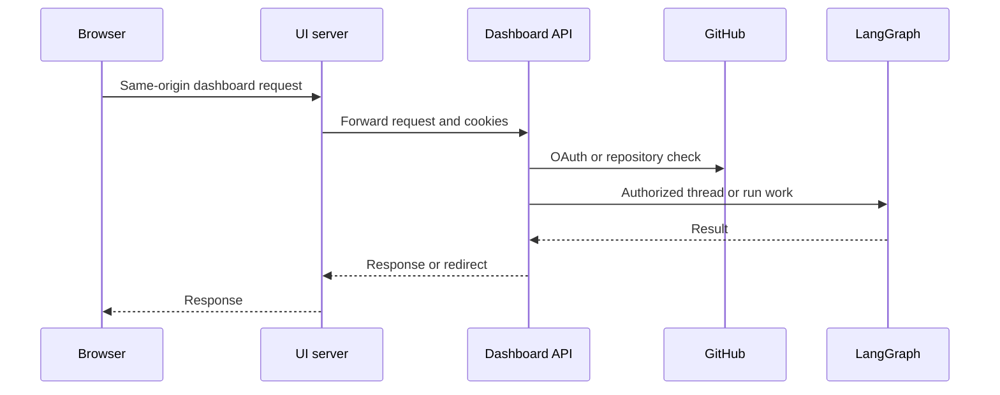
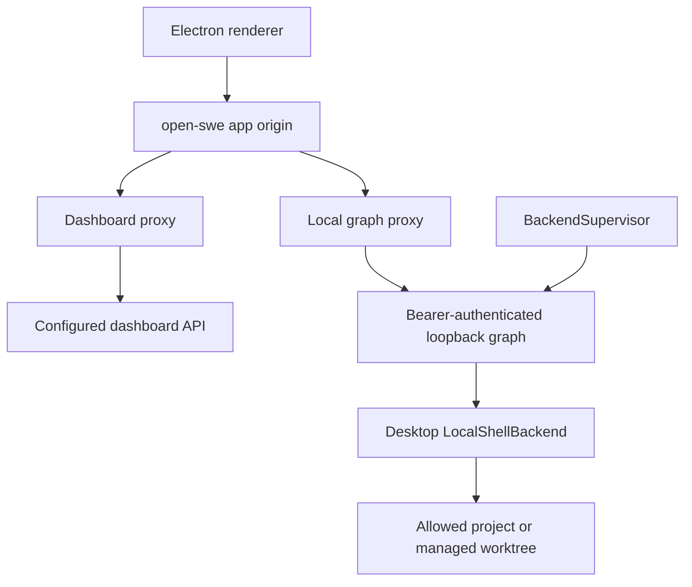

# Dashboard, Web UI, and Desktop Clients

The dashboard is the human-facing integration surface. Its Python API owns authentication, authorization, persisted user and workspace settings, and the dashboard adaptation of LangGraph threads. `ui/` is the TanStack Start client and server boundary; the experimental Electron client reuses the UI while adding an authenticated local LangGraph process. Renderer and browser code do not receive a raw LangGraph or LangSmith credential.

## API composition and policy boundary

`agent.api.app.create_app()` mounts the dashboard router at `/dashboard/api`. The `agent.dashboard.router` export is deliberately lazy: importing a dashboard helper does not load `routes.py`, FastAPI, and all feature modules; the web app that mounts the router bears that cost. `routes.py` is the HTTP composition point, while focused dashboard modules own thread, schedule, skill, credential, environment, and settings behavior.

The app enables credentialed CORS only when `DASHBOARD_ALLOWED_ORIGINS` is configured, and rejects `*` because it is incompatible with credentialed requests. The dashboard router applies `require_same_origin_for_mutations` to every route. Safe HTTP methods pass; a mutation authenticated only by an explicit bearer token passes; cookie-bearing mutations must have an allowed `Origin` or `Referer`. WebSockets are checked too. This CSRF gate is not authorization: endpoint/domain checks still decide administrator and repository authority.

Diagram: requests reach the Python policy boundary through the UI server, which preserves browser-facing redirects and cookies.

### Login and sessions

`GET /auth/login` creates signed state with a hash of a fresh nonce, stores the nonce in a short-lived state cookie, and redirects to GitHub. The callback validates the nonce for an ordinary browser flow, exchanges the code, resolves the GitHub identity, enforces the organization-login gate, stores the access token, and redirects with a signed session JWT cookie. `require_session` returns `401` when that cookie is absent or invalid. Admin routes add an admin check; selected CI administration routes also accept an Actions OIDC token or an administrator GitHub PAT.

Cookie flags follow `DASHBOARD_API_BASE_URL`: HTTPS uses `Secure; SameSite=None` for a cross-site production UI/API arrangement, while local HTTP uses non-secure `SameSite=Lax`. Required deployment configuration therefore includes `DASHBOARD_API_BASE_URL`, `DASHBOARD_BASE_URL`, GitHub OAuth configuration, and an explicit origin policy where the browser is cross-origin.

Desktop login is different: the callback issues a short-lived PKCE-bound handoff code to the desktop loopback listener and does **not** set a browser session cookie. `POST /auth/desktop/exchange` redeems that code only with the verifier matching its challenge, then returns the signed session for the app.

## Thread contract and settings domains

Thread discovery and thread readability intentionally differ. Ordinary listings derive candidates from participant metadata; `all=true` is administrator-only. A logged-in organization member may read any thread from a surfaced source, while an unsurfaced source is reported as `404`. Posting first requires readability and additionally requires admin authority for administration or automation threads. Pins are per-login stored IDs, and listing pins re-fetches and rechecks every saved ID, so a pin never bypasses current access.

`GET /threads/{thread_id}` returns a dashboard summary and metadata, not converted transcript messages: the client stream SDK hydrates state separately. Detail reads refresh latest-run metadata and, unless disabled or still running, attempt to mark the thread viewed; a metadata-write failure does not fail the read. Interrupted latest runs normalize to `interrupted` even during the short period in which a thread remains busy.

The cloud terminal requires a readable thread with a ready sandbox. `POST /threads/{id}/terminal/connect` returns a no-store WebSocket URL, `open-swe-terminal` subprotocol, and signed ticket. The WebSocket revalidates its ticket and sandbox, requires `SANDBOX_TYPE=langsmith`, bounds concurrent sessions with a 20-slot semaphore, and bridges the socket to a PTY. Capacity exhaustion closes with `1013` rather than consuming unbounded resources.

The router also exposes the dashboard's settings domains: personal profile, instructions and credentials; organization/team settings and credentials; repositories and enabled review repositories; environments and sandbox settings; repository-scoped agent instructions and review styles; personal and organization skills; and workspace schedules. Repository-scoped agent instructions normalize `owner/repo`, are filtered/guarded by current repository access, and are loaded into the agent prompt for the resolved repository. Personal skills live under the GitHub login; shared organization skills are readable by sessions but administrator-writable, cursor-paginated, and capped.

Schedules demonstrate the API's reconciliation responsibilities. Listing requires a session, while creation, changes, test triggering, and deletion require an administrator. A schedule record is stored before its LangGraph cron; failed cron creation removes the record and returns `502`. An enabled change creates a replacement cron before deleting the prior one; disabling removes it. Before execution, the system rechecks the creator's repository access. Loss of access records an unauthorized run state instead of launching; success creates an automation thread and resumable durable run.

## Web UI and proxying

The TanStack Start UI calls `/dashboard/api/*` using a relative origin. In a browser, this keeps session cookies same-origin. During server-side rendering, `dashboard-fetch.ts` instead targets `DASHBOARD_API_URL` and explicitly forwards the incoming `cookie` header because server-side `credentials: "include"` cannot do so.

In development, Vite proxies backend prefixes, with a local backend default suitable only for development. In a production build, the Nitro handler handles `/dashboard/api` and `/webhooks`, reads `DASHBOARD_API_URL` for each request, and fails rather than selecting a production fallback when it is unset. It streams the request upstream with `redirect: "manual"`, preserving OAuth redirects for the browser; it removes hop-by-hop and reframed headers while forwarding each `Set-Cookie` independently.

The Agents layout permits an unauthenticated desktop-local-only session only at `/agents` or `/agents/local/…`. Its shared stream provider uses local transport for a local session and cloud transport otherwise. Other UI routes remain behind the regular session gate.

## Electron local execution

Electron packages the compiled UI and serves it at the internal `open-swe://app` origin. Its main process proxies dashboard traffic to the configured dashboard backend and `/local-graph` traffic to a supervised loopback service. The local-graph proxy deletes renderer cookies, injects a random bearer token, and exposes only the stable configuration `{ apiUrl: "/local-graph", graphId: "agent" }`.

`BackendSupervisor` starts lazily, reserves a random `127.0.0.1` port, generates a per-process bearer token, and refuses to launch without a projects allowlist and worktree directory. Development runs `uv run langgraph dev` using `langgraph.desktop.json` (or an explicit override); packaged builds use the bundled Python runtime and configuration. It polls the authenticated loopback root for up to 60 seconds, retains recent child logs for startup errors, and on shutdown sends `SIGTERM` then escalates to `SIGKILL` after its timeout.

Diagram: Electron separates cloud dashboard requests from token-authenticated local graph execution.

A desktop run is selected by `configurable.source == "desktop"`. Its `local_project_path` must resolve to an existing directory either explicitly allowlisted in `OPEN_SWE_LOCAL_PROJECTS_FILE` or beneath the managed worktree root. The agent then uses `LocalShellBackend` rooted there rather than a cloud sandbox. Desktop runs disable cloud-sandbox file downloads, use local default models, expose state-backed user skills rather than organization skills, and route sanitized per-thread scratch artifacts outside the project so agent offloads do not become accidental repository changes.

## Verification focus

Dashboard tests cover CSRF origin behavior, OAuth and web handoff flows, surfaced-thread access and activity/viewed behavior, terminal readiness, thread metadata and recovery rules, and settings/schedule domains. Desktop supervisor unit tests cover development and packaged launch targets, credential detection, local-thread creation, and activity mapping. The end-to-end harness runs the real dashboard UI and agent code with only the LLM and external SaaS boundaries faked; browser requests are same-origin and SSR is exercised, while the desktop suite launches Electron against the local graph path.

## Related

- [Architecture overview](../architecture/overview.md)
- [Models, profiles, and instructions](../concepts/models-profiles-instructions.md)
- [Threads and state](../concepts/threads-and-state.md)
- [Deployment](../operations/deployment.md)
- [Invocation](../workflows/invocation.md)
