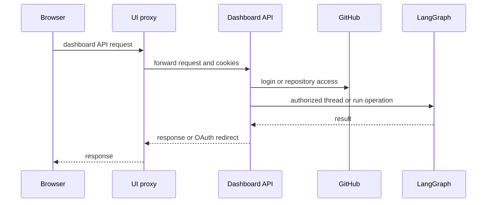
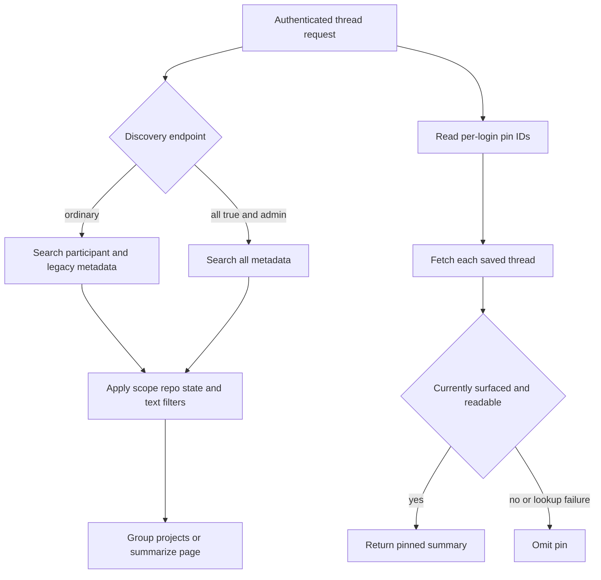

# Dashboard API & Web/Desktop UI

The dashboard is the human-facing integration surface: a FastAPI router in the agent backend, a TanStack Start web application, and an experimental Electron wrapper. The dashboard API is the policy boundary for GitHub credentials, stored configuration, and LangGraph; browser code does not directly call the raw LangGraph API.

## Mounting and request flow

`agent.api.app` mounts the lazy-exported dashboard router at `/dashboard/api`. The PEP 562 export in `agent/dashboard/__init__.py` avoids loading routes, FastAPI, and the feature modules merely because another component imports a dashboard helper. New dashboard HTTP entrypoints belong in `agent/dashboard/routes.py`; substantive behavior can remain in focused dashboard modules. The project also treats agent/UI parity as a product principle: a dashboard capability should generally be available through a curated agent tool subject to the same safety and authorization boundaries.

Diagram: browser dashboard traffic reaches the backend through the UI proxy, where the API performs external authorization and LangGraph work.

## Authentication, CSRF, and authority

GitHub login creates signed state containing a nonce hash and writes the nonce to a short-lived state cookie before redirecting to GitHub. The callback validates the nonce for ordinary browser login, exchanges the code, applies the organization login gate, persists the GitHub token, and writes a signed session JWT cookie. Cookie flags derive from `DASHBOARD_API_BASE_URL`: HTTPS uses `Secure; SameSite=None`, while local HTTP uses non-secure `SameSite=Lax`.

`require_session` decodes that cookie or returns `401`. The router-level `require_same_origin_for_mutations` is a CSRF control: it allows safe methods and bearer-only requests, but rejects a cookie-authenticated mutation whose `Origin` or `Referer` is outside the configured dashboard origins. WebSocket requests receive the origin check as well. Some CI administration endpoints can instead authenticate with an Actions OIDC token or an administrator GitHub PAT.

**Route-level validation is not mutation authority.** Passing the origin check only establishes that a request carrying an ambient cookie was not forged; it does not make the session an admin, grant repository access, or make a thread postable. Each mutation still needs its endpoint or domain authorization check. Examples include repository access for repository-scoped settings, an admin session for schedule changes and organization-skill writes, and the postability check for admin or automation threads.

## Thread discovery, grouping, filtering, and pins

### Distinct access models

Thread **discovery is participant/admin scoped**, not a general readable-thread search. Ordinary `/threads`, `/threads/page`, and `/threads/projects` searches are assembled from participant login/email metadata, including legacy creator fields for older records. `all=true` replaces those filters only for an administrator; non-admin use is rejected with `403`. The page API supports bounded pagination (`limit` clamped to 1–100), nonnegative offsets, `created_at` or `updated_at` ordering, and filters for resolved/viewed state, source, run status, text, interactive versus automation scope, automation ID, repository, and ownerless threads. It rejects a malformed repository and the mutually exclusive `repo` plus `ownerless` combination.

Project grouping is metadata-only: `/threads/projects` collapses matching threads by case-insensitive configured repository, uses the most recent update as `updatedAt`, skips ownerless threads, and by default excludes resolved and automation work. It therefore does not fetch run data or produce thread summaries. `include_resolved` and `include_automations` widen that participant/admin-scoped discovery set.

Thread **readability is separate**. Any authenticated organization member may read a thread whose source is in the surfaced-source set, enabling shared “Open in Web” links; unsurfaced threads intentionally appear as `404`. Reading is not ownership, and posting first requires readability then requires an administrator for `admin_thread` or automation threads.

Pins have a third, deliberately independent path. Pin IDs are persisted in the store namespace `thread_pins/<login>`, so they are per-login rather than thread metadata. Pinning first fetches the candidate thread and requires it to be readable. Listing `/threads/pinned` fetches each saved ID independently and returns only currently readable threads, silently omitting missing, inaccessible, or failed lookups. Consequently, a pin does not bypass current read checks, and it can surface a readable teammate thread even though the main discovery list is participant-scoped. Unpin simply removes that login’s stored ID.

Diagram: discovery derives from participants unless an administrator requests all threads, while saved pins are independently rechecked for readability.

### Summaries and lifecycle signals

The thread API adapts LangGraph threads, runs, state, commands, and streaming to dashboard summaries. A summary includes configured repository identity, classification (interactive, pull request, issue, or automation), source/origin/trigger data, pull-request metadata, viewed/resolved markers, sandbox ID, and normalized run status. For potentially active or unrecorded runs, list and detail operations fetch the latest run and best-effort persist its ID/status with bounded concurrency. An interrupted latest run takes precedence over a temporarily `busy` thread so cancellation is not displayed as running.

`GET /threads/{thread_id}` returns metadata only. The UI SDK hydrates transcript messages through the LangGraph state endpoint, so the API does no server-side transcript conversion. A non-running detail read normally records `last_viewed_at_ms` and the latest run ID; it does not mark a running thread viewed, accepts `mark_viewed=false`, and treats a metadata-update failure as non-fatal to the read.

A missing dashboard thread can be created only by a `run.start` command. Creation stamps dashboard source/origin, interactive classification, participant identities, prompt-derived title, repository, selected/resolved model and effort, and run configuration. Image input is rejected with `422` when the chosen model cannot accept images.

### Cloud terminal

`POST /threads/{id}/terminal/connect` first applies the same readable-thread check and requires a ready sandbox, then returns a no-store WebSocket URL, `open-swe-terminal` subprotocol, and a signed short-lived ticket. The WebSocket validates that ticket, repeats readable/sandbox validation, requires `SANDBOX_TYPE=langsmith`, and uses a 20-slot semaphore before bridging browser input/output to a PTY shell in the sandbox. A full semaphore closes the socket with retryable status `1013`; terminal setup failures are contained to the socket.

## Adjacent dashboard configuration

Repository-scoped agent instructions normalize `owner/repo`, filter lists by current repository access, and require access on direct operations. Non-empty instruction text is appended to the main agent prompt for runs targeting that repository.

Review styles are also repository-access-controlled. Their analysis state is `idle`, `running`, `completed`, or `failed`; retrieval reconciles a running analysis, concurrent analysis returns `409`, and a terminal or missing analysis can resolve to completed when a saved prompt exists.

Personal skills are virtual `SKILL.md` records isolated by GitHub login. Organization skills are shared and cursor-paginated: any session may read them, but only administrators may write them, and the store bounds their total count. Schedule listing needs a session, whereas creating, editing, triggering, or deleting workspace-scoped schedules requires administration. Creation persists the record before creating its LangGraph cron and rolls the record back with `502` if cron creation fails; an enabled update creates the replacement cron before removal of the old one. Before an execution, repository access is rechecked; access loss records an unauthorized run state instead of launching a new automation thread and durable run.

## Web UI and proxy boundary

`ui/` is a TanStack Start file-based-route application. Its Agents routes include thread, local, environments, instructions, and sandbox views, and the broader application includes review, admin, usage, cloud-agent, settings, and login routes. `/integrations` redirects to Profile Settings. The Agents layout permits an unauthenticated desktop-local-only session only on the root or `/agents/local/` routes; its shared stream provider uses local transport for that session and cloud transport otherwise.

Browser calls build `/dashboard/api/*` from a relative base and use `credentials: "include"`, preserving the same-origin cookie model. In development, Vite proxies backend prefixes; in a deployed build the Nitro handler proxies `/dashboard/api/**` and `/webhooks/**`. It reads `DASHBOARD_API_URL` on every request, fails if it is unset, and uses `redirect: "manual"` so OAuth 3xx responses reach the browser. SSR instead targets `DASHBOARD_API_URL` directly and copies the incoming `cookie` header, since server-side `credentials: "include"` does not forward browser cookies.

## Electron and local-execution boundary

The experimental Electron app serves the compiled UI at `open-swe://app`, proxies `/dashboard/api` to the configured backend, and separately proxies `/local-graph` to a loopback LangGraph process. This avoids exposing a LangSmith key or raw LangGraph API to renderer code. Desktop OAuth is a PKCE-bound handoff: browser completion redirects a code to the desktop loopback listener, and `POST /auth/desktop/exchange` mints a session only when the retained verifier matches its challenge.

`BackendSupervisor` starts the local process lazily. It reserves a random `127.0.0.1` port, generates a random bearer token, and launches either `uv run langgraph dev` using `langgraph.desktop.json` in development or a bundled runtime/configuration when packaged. Startup polls the authenticated loopback root for up to 60 seconds and reports retained child logs on failure. The public renderer configuration stays stable as `{ apiUrl: "/local-graph", graphId: "agent" }`; the proxy removes renderer cookies and injects its bearer token. Shutdown sends `SIGTERM` and escalates to `SIGKILL` after the timeout.

A desktop graph run is permitted only when `local_project_path` resolves to an existing directory in `OPEN_SWE_LOCAL_PROJECTS_FILE`. It uses a `LocalShellBackend` rooted at that project rather than a cloud sandbox. The desktop branch selects local model defaults, uses state-backed user skills instead of organization skills, disables cloud-sandbox downloads, and stores sanitized per-thread artifacts outside the project. The shared graph protocol therefore does not imply shared filesystem authority.

## Focused verification

`tests/dashboard/test_dashboard_thread_api.py` covers image/model compatibility, lazy `run.start` metadata stamping, summary privacy-sensitive source links, terminal sandbox readiness, recovery-patch limits, and the missing-thread command rule. Its discovery tests cover repository/ownerless filtering, case-insensitive project grouping without summary/run calls, independently rechecked pins, unreadable/missing pin omission, and creation-time sorting. `tests/dashboard/test_dashboard_thread_api_activity.py` verifies latest-run refresh, viewed-state behavior for an authenticated reader, opt-out marking, and the rule that running threads are not marked viewed. Changes to the proxy or desktop boundary should retain redirect behavior, cookie/token separation, loopback authentication, startup health polling, and termination escalation.

## Related

- [Architecture overview](../architecture/overview.md)
- [Auth and security](../concepts/auth-and-security.md)
- [Threads and state](../concepts/threads-and-state.md)
- [Follow-up messages](../workflows/follow-up-messages.md)
- [Scheduling and baby-sit](../workflows/scheduling-and-baby-sit.md)
- [Testing overview](../testing/overview.md)
