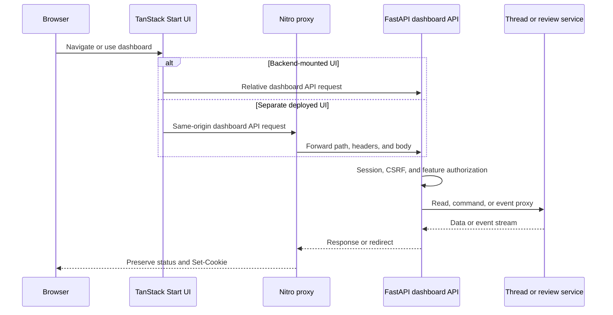

# Dashboard, web UI, and desktop surfaces

Open SWE’s human-facing product is a layered integration rather than a direct browser connection to LangGraph. The Python dashboard API owns identity, authorization, product records, and guarded proxies to thread and review services. The React/TanStack Start UI reaches that API through a same-origin path or server proxy; Electron packages that UI and adds an optional bridge from a cloud-backed thread to a local checkout.

## Composition and backend UI mounting

`openswe.api.app.create_app()` builds the FastAPI app, configures credentialed CORS and middleware, includes the dashboard router along with other server routes, then calls `mount_dashboard_ui(app)` last. The dashboard router is rooted at `/dashboard/api` and has a router-wide `require_same_origin_for_mutations` dependency. It composes feature routers for authentication, profiles and preferences, repositories and pull requests, reviews, schedules, threads and transcripts, skills, audit/analytics, bridge support, and UI invalidations. `openswe.dashboard` exports this router lazily, so importing an individual dashboard helper does not load the routes and their complete FastAPI dependency graph.

The optional backend mount makes one deployment serve both API and UI. `DASHBOARD_STATIC_DIR` selects a build explicitly; otherwise a present `ui/.output/public` build is used. It mounts `/assets` with one-year immutable cache headers, serves `_shell.html` with `Cache-Control: no-cache` for HTML navigations, and leaves reserved API, webhook, LangGraph, health, documentation, and asset paths alone. A non-HTML request to an unknown route is also declined rather than receiving the application shell. Build the UI with `DASHBOARD_BASE_PATH` when it is served beneath a LangGraph mount prefix.

For development, `DASHBOARD_DEV_SERVER_URL` replaces the static shell with a reverse proxy to Vite. This retains the backend origin for cookies, callbacks, and API traffic while Vite serves modules and hot reloads; its HMR WebSocket connects to Vite directly. Because the UI handler is a catch-all, it must remain after server routes. Call `keep_dashboard_ui_last(app)` after registering later routes.

## Browser-to-backend request path

```mermaid
sequenceDiagram
    participant Browser
    participant WebUI as TanStack Start UI
    participant Nitro as Nitro proxy
    participant API as FastAPI dashboard API
    participant Thread as Thread or review service

    Browser->>WebUI: Navigate or use dashboard
    alt Backend-mounted UI
        WebUI->>API: Relative dashboard API request
    else Separate deployed UI
        WebUI->>Nitro: Same-origin dashboard API request
        Nitro->>API: Forward path, headers, and body
    end
    API->>API: Session, CSRF, and feature authorization
    API->>Thread: Read, command, or event proxy
    Thread-->>API: Data or event stream
    API-->>Nitro: Response or redirect
    Nitro-->>Browser: Preserve status and Set-Cookie
```
Diagram: the UI keeps the browser-facing call on its own origin while FastAPI remains the policy and service-proxy boundary.

The browser request layer constructs `/dashboard/api/*` under the configured base path and sends credentials. In a normal browser build that is relative, so the session cookie accompanies the request. Server rendering instead uses `DASHBOARD_API_URL` directly and manually copies the incoming `cookie` header because server-side `credentials: "include"` does not propagate browser cookies.

In development, Vite proxies backend prefixes to `DASHBOARD_API_URL` or `http://localhost:2024`, retaining redirects so OAuth progresses in the browser. In a deployed UI, Nitro maps dashboard and webhook routes to `ui/server/backend-proxy.ts`. That handler reads `DASHBOARD_API_URL` for every request and deliberately fails without it—there is no production fallback. It streams request bodies, does not follow OAuth 3xx responses, removes hop-by-hop and invalid content framing headers, and emits every upstream `Set-Cookie` as its own header line.

## Session and origin boundary

GitHub login creates signed state containing a hash of a newly generated nonce and places the nonce in a state cookie before redirecting to GitHub. On callback, normal browser login compares the state hash to that cookie, exchanges the code, resolves and gates the GitHub user, persists OAuth credentials, and writes a signed session cookie. Missing or invalid sessions produce `401` through `require_session`.

Desktop login uses the same identity checks but a separate handoff: the signed state carries a valid PKCE challenge and loopback port, the callback redirects a PKCE-bound code to the local listener without setting a browser session, and `POST /dashboard/api/auth/desktop/exchange` redeems code plus verifier for a session token. This prevents the browser session from becoming the desktop app’s credential merely because it completed the consent flow.

The router-level CSRF control permits `GET`, `HEAD`, and `OPTIONS`, and also permits a mutation authenticated solely by an explicit bearer token. Other mutations require the request origin or referer to be among configured dashboard origins, the backend origin, or Electron’s `open-swe://app` origin; WebSocket requests always run the origin check. Endpoint-level session, admin, repository, and thread authority checks remain required after this ambient-cookie defense. `DASHBOARD_ALLOWED_ORIGINS` configures credentialed CORS, includes the Electron origin, and rejects `*` because credentials are enabled.

## Threads, live views, and reviews

Thread APIs provide both product-level operations and a protected facade over graph operations. `GET /threads` and `/threads/page` provide authenticated discovery; `all=true` is administrator-only. `POST /threads` creates a session and can immediately send a `run.start` command. The detail endpoint returns dashboard thread information, while `GET /threads/{thread_id}/state`, `POST /threads/{thread_id}/commands`, and `POST /threads/{thread_id}/stream/events` provide the state, command, and server-sent event paths required for an active agent view. The stream proxy sets `text/event-stream`, `no-cache`, and keep-alive headers.

The client also has durable transcript updates: it opens a credentialed `EventSource` against the transcript event path from its last applied version. It applies transcript or snapshot frames, treats `deleted` and `revoked` as terminal, and closes/reopens after an interruption rather than relying on `EventSource`’s stale automatic replay URL. Shared UI invalidation uses another credentialed SSE connection; it receives `hello`, `invalidated`, and `alive` frames, has a silence watchdog, and reconnects at a higher layer on failure.

Review views are repository-scoped. Listing and detail operations use the signed-in user’s accessible repository set, while individual review, diff, content, image, re-review, and scout actions require repository access. The review chat endpoint returns a chat descriptor, then proxies the SDK-shaped thread command, state, history, and event paths under `/reviews/{owner}/{repo}/{pr_number}/chat`; each route rechecks repository access. This gives PR chat the same live-agent interaction model without exposing a generic underlying graph endpoint to the UI.

## Desktop mode and local execution

The experimental Electron client serves the compiled UI at `open-swe://app` and forwards its `/dashboard/api/*` requests to a user-selected compatible backend. Packaged builds have no hosted backend default; resolution accepts command-line and environment overrides, stored configuration, and only a development default. Its trusted-proxy and permission checks accept requests from the internal app origin, and switching deployments separates local session data.

A **This Mac** thread remains an ordinary backend/cloud thread, but the desktop app opens a per-thread bridge to execute the backend’s requested operations in the selected checkout. `LocalBridges` keeps one running bridge per thread, deduplicates simultaneous opens, remembers the backend-issued bridge ID, and closes bridges on exit. If a bridge stops, the next use can reopen it; runs started while the Mac is unreachable fail as such. The desktop documentation specifies that commands use the login-shell environment with secret-shaped values removed except `GITHUB_TOKEN` and `GH_TOKEN`.

On the backend, `source == "desktop"` selects `LocalShellBackend`. `local_project_path` must resolve to an existing directory that is either explicitly allowlisted through `OPEN_SWE_LOCAL_PROJECTS_FILE` or located under `OPEN_SWE_LOCAL_WORKTREES_DIR`; arbitrary client paths are rejected. Agent scratch routes for large tool results, conversation history, and blobs are sanitized per-thread filesystem directories outside the project, avoiding accidental working-tree changes from agent artifacts.

## Operational and change guidance

- Treat `DASHBOARD_API_URL` as required runtime configuration for a separately deployed UI. The backend-mounted static build and development reverse proxy are alternatives when a single origin is desired.
- Register backend routes before mounting the UI, preserve the proxy’s manual redirects and separate cookies, and do not change the desktop OAuth handoff into a browser-cookie transfer.
- A dashboard feature router inherits CSRF policy but must declare the appropriate session/admin/repository dependency itself. Review and thread proxy routes are especially sensitive because they translate UI authority into graph-facing requests.
- Exercise both static and development UI serving when changing mounts or base paths; test the GitHub state-cookie path and desktop PKCE exchange separately; and test dropped SSE connections, authorization revocation, and bridge shutdown/reopen behavior for live UI changes.

## Related

- [Auth and security](../concepts/auth-and-security.md)
- [Threads and state](../concepts/threads-and-state.md)
- [Local bridge and remote runtime](local-bridge-and-remote-runtime.md)
- [Invocation](../workflows/invocation.md)
