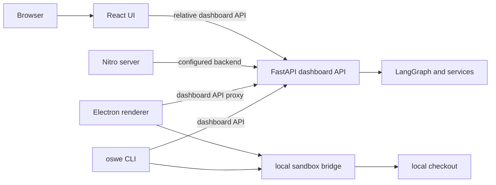
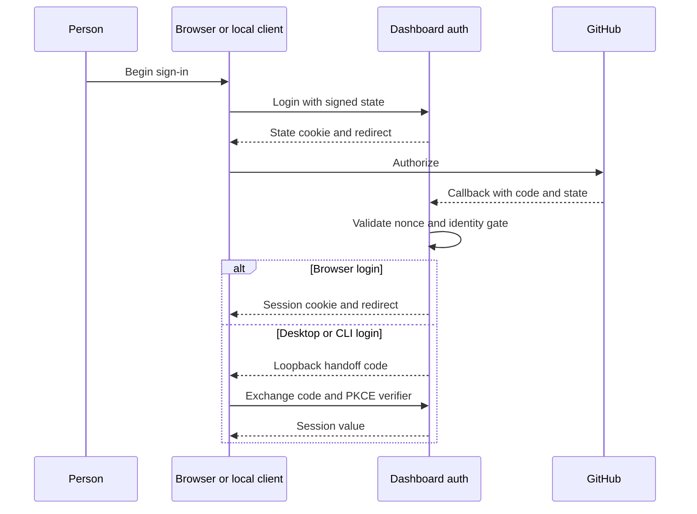

# Dashboard, Web UI, Desktop, and CLI Clients

Open SWE has one dashboard API contract under `/dashboard/api`. The browser UI, Electron application, and `oswe` CLI use that contract rather than exposing deployment credentials to a renderer or directly addressing a raw LangGraph service. They differ at the local-execution boundary: the web UI uses backend-managed sandboxes, while Electron and the CLI can keep a cloud thread but service its file and shell requests on the user's machine through a sandbox bridge.

## API composition and UI serving

`openswe.api.app.create_app()` installs credentialed CORS, request/audit middleware, the aggregate dashboard router, other server routes, and finally `mount_dashboard_ui(app)`. The dashboard router is an `APIRouter` at `/dashboard/api` with a router-wide same-origin dependency. It aggregates authentication and profile endpoints; workspace, repository, review, schedule, skill, and MCP features; threads and transcripts; bridge APIs; and operational surfaces such as audit, analytics, incidents, users, and API keys. `openswe.dashboard.router` is lazily imported with PEP 562, so importing a dashboard helper does not load FastAPI and every feature router.

The backend can serve a built UI from `DASHBOARD_STATIC_DIR`, or from `ui/.output/public` when its `_shell.html` exists. It mounts `/assets` with immutable one-year caching, serves the shell without caching for HTML navigation, and lets unknown non-HTML paths fall through as server 404s. It never treats LangGraph, dashboard API, webhook, health, docs, metrics, or asset paths as UI routes. `DASHBOARD_DEV_SERVER_URL` instead makes the backend reverse-proxy non-reserved HTTP traffic to Vite, retaining the backend origin for API cookies and OAuth; Vite HMR connects to Vite directly. The catch-all must remain last, so code adding routes after the mount must call `keep_dashboard_ui_last`.

`DASHBOARD_BASE_PATH` and Vite's `BASE_URL` must agree when the deployment uses a LangGraph mount prefix: the React router uses `BASE_URL` as its base path.

```mermaid
flowchart LR
    Browser["Browser"] --> WebUI["React UI"]
    WebUI -->|"relative dashboard API"| Api["FastAPI dashboard API"]
    Nitro["Nitro server"] -->|"configured backend"| Api
    Desktop["Electron renderer"] -->|"dashboard API proxy"| Api
    CLI["oswe CLI"] -->|"dashboard API"| Api
    Api --> Graph["LangGraph and services"]
    Desktop --> Bridge["local sandbox bridge"]
    CLI --> Bridge
    Bridge --> Machine["local checkout"]
```
Diagram: all clients converge on the dashboard API, while desktop and CLI bridges service cloud-agent work on a local checkout.

## Session boundary and mutation protection

GitHub login signs state containing a hash of a nonce placed in a short-lived state cookie and redirects to GitHub. On the ordinary callback, the backend validates that nonce, exchanges the authorization code, resolves and gates the GitHub identity, persists the token response, signs in the user, and returns a signed `osw_session` cookie. Local development can instead use the authenticated `gh` CLI identity, but only where development login is enabled.

Desktop-style login creates a different result: the browser callback returns a one-time handoff code to a loopback listener and deliberately does not set a browser session. The client proves possession of its PKCE verifier to `POST /auth/desktop/exchange`, which returns a session value and its expiry. This is used by Electron and `oswe login`; both keep the verifier outside the browser.

Cookie policy depends on the API scheme and whether dashboard and API are co-origin: HTTP uses non-`Secure`, `SameSite=Lax`; co-origin HTTPS uses `Secure`, `Lax`; split-origin HTTPS uses `Secure`, `SameSite=None`. `require_session` decodes the cookie and returns `401` when absent or invalid. Application construction rejects `*` in `DASHBOARD_ALLOWED_ORIGINS` because CORS enables credentials; it also permits the fixed `open-swe://app` renderer origin.

The router-wide CSRF defense permits safe methods and a request whose only credential is a bearer token. Cookie-authenticated mutations must have an allowed `Origin` or `Referer`; WebSockets are always origin-checked. This is not authorization: individual operations still use the session, administrator dependency, repository access checks, or a machine principal as appropriate.

```mermaid
sequenceDiagram
    participant Person
    participant Client as Browser or local client
    participant Auth as Dashboard auth
    participant GitHub
    Person->>Client: Begin sign-in
    Client->>Auth: Login with signed state
    Auth-->>Client: State cookie and redirect
    Client->>GitHub: Authorize
    GitHub-->>Auth: Callback with code and state
    Auth->>Auth: Validate nonce and identity gate
    alt Browser login
        Auth-->>Client: Session cookie and redirect
    else Desktop or CLI login
        Auth-->>Client: Loopback handoff code
        Client->>Auth: Exchange code and PKCE verifier
        Auth-->>Client: Session value
    end
```
Diagram: browser login creates a browser cookie, whereas local clients redeem a PKCE-bound handoff.

## React dashboard and production proxy

`ui/` is a React application using TanStack Router, React Query SSR integration, and a Vite/Nitro server build. Its router uses generated route definitions, restores scroll position, preloads on intent, and records navigation timing before a thread route mounts. The principal product routes include Agents and Assistant thread experiences, repository review, workspaces, integrations, incidents, usage, administration, and personal settings. Login-required route layouts redirect unauthenticated users rather than treating frontend routing as access control.

In the browser, dashboard requests use a relative `/dashboard/api` base so `credentials: "include"` stays same-origin. During SSR, the fetch layer instead targets `DASHBOARD_API_URL` and explicitly copies the incoming `cookie` header, because server-side `credentials: "include"` has no browser cookie jar. Development Vite proxies backend prefixes; deployed Nitro routes `/dashboard/api/**` and `/webhooks/**` through `ui/server/backend-proxy.ts`.

The deployment proxy reads `DASHBOARD_API_URL` for every request and fails if it is absent, rather than silently selecting a production backend. It forwards request streams and headers without hop-by-hop headers, preserves OAuth redirect responses with `redirect: "manual"`, removes response framing headers invalidated by Fetch decoding, and emits every upstream `Set-Cookie` on a separate header line.

## Threads, transcripts, and streaming

The thread API is the UI-facing authorization and adaptation layer around thread data and LangGraph calls. It supports summaries and paged discovery, pins, repository filters, state, files and diffs, resolve/share/private continuation, cancellation and deletion, session upload, and run inspection. `all=true` is administrator-only; a machine principal uses the machine-thread paths rather than a person's dashboard listing. Thread detail is timed and returns a `Server-Timing` header.

A client reads state at `GET /threads/{thread_id}/state` and posts `POST /threads/{thread_id}/stream/events` to receive an SSE stream. The API forwards the request body through its authorized proxy and returns `text/event-stream` with `no-cache` and keep-alive headers. Run creation, cancellation, history, and command transport are similarly proxied after applying dashboard authorization. The commands endpoint is deliberately the common entry point for a dashboard, API key, or federated workflow; the initiating principal determines how a missing thread is initially stamped.

When a dashboard thread is created, its model and effort resolve in priority order from workspace defaults, profile settings, and a valid explicit choice; an image request receives a supported vision fallback. The creator, visibility, source, participants, repository/workspace context, and resolved configuration are stamped into metadata. If PostgreSQL is configured, creation also appends the initial transcript event; without it, reads continue from LangGraph state.

Workspace and settings screens expose configuration rather than owning execution state. Workspace settings have an instance record plus sparse per-workspace overrides; missing workspace fields inherit the instance setting, while profile and thread configuration may layer on in callers that support them. The UI's Workspaces screen describes and links configuration for repository and Slack-channel ownership, sandbox image, and rebuild status; admin status is passed to its settings component.

## Electron desktop: hosted threads and local worktrees

Electron is experimental and bundles the compiled web UI at the privileged `open-swe://app` origin. Packaged builds require a compatible backend URL and have no hosted default; changing backend clears the old deployment's local session data. Development uses an isolated Electron profile and defaults to the local backend unless an argument, environment value, or saved URL overrides it. Electron proxies dashboard API requests to the configured backend, while the renderer receives a constrained `openSweDesktop` preload API for project, bridge, file, terminal, and update operations.

A newly created **This Mac** thread remains an ordinary cloud thread on the configured backend, but its checkout is served by one `LocalBridges` bridge per thread. The bridge is opened when the thread is started or revisited, remembers the backend-assigned bridge ID, uses the user's shell environment through the bridge client, and closes when the application quits. Consequently, the thread is readable from the web or another computer, but an agent cannot continue local work while the originating Mac's bridge is unavailable.

Users select either the current checkout or a new git worktree. A worktree gets a per-thread placeholder branch, allowing concurrent local threads without modifying the main checkout; deleting its thread removes that worktree and uncommitted changes. The desktop app refuses concurrent use of one tree and branch changes that would conflict with an agent. Its Changes view compares against a snapshot captured at session start, and its terminal and file browser operate in that checkout.

The main process validates and persists chosen projects as canonical existing absolute directories, writing the project store atomically with mode `0600`. It exposes only enumerated IPC methods from preload rather than Node/Electron internals directly to the web bundle.

Older local-only threads remain supported by a private loopback LangGraph process. Its `BackendSupervisor` lazily reserves a loopback port, creates a random bearer token, starts `langgraph dev` using development or packaged configuration, and passes the project allowlist, worktree directory, and out-of-project artifacts/checkpoint locations. It polls the authenticated loopback server for up to 60 seconds; the renderer sees only stable `/local-graph` and graph `agent` settings. The local-graph proxy removes renderer cookies and injects the bearer token. Shutdown clears supervisor state, sends `SIGTERM`, then escalates to `SIGKILL` after five seconds.

## CLI: remote agent, local bridge

`oswe` is a Bun-compiled command-line client. `oswe login` uses the same loopback PKCE handoff as desktop and stores the resulting session by backend in `~/.open-swe/config.json`; the configuration is shared with desktop. For each request it selects the first available credential in this order: `OPEN_SWE_API_KEY`, a GitHub Actions OIDC token, `OPEN_SWE_SESSION`, then the stored session. API keys and OIDC credentials are machine identities and can create only system threads; a person can choose workspace or private visibility.

`oswe run` opens a unique bridge for the current working directory, detects its Git origin when available, creates or resumes a cloud thread through `POST /threads/{id}/commands` with `run.start`, then follows `/stream/events`. The agent's shell commands, uploads, and downloads run unsandboxed with the invoking user's filesystem authority. A resumed thread is accepted only from the remembered directory and only when the existing bridge is not already served by another `oswe` process. Ctrl-C first attempts cancellation and bridge cleanup; a second interrupt exits immediately.

CLI stdout is reserved for the `cli_result` tool's `stdout`; the reported `exit_code` becomes the process status. Its SSE collector ignores replayed history until its own run becomes running, accepts only the top-level lifecycle namespace, and reconnects retryable failures with exponential backoff. A stream open for at least a minute resets the reconnect budget; otherwise it stops after ten consecutive reconnects. Missing `cli_result`, failed, or interrupted runs exit nonzero.

`oswe tools` and `oswe tool` discover and invoke the backend's CLI MCP tool catalog, while `oswe mcp` serves the same person-authorized tools on stdio. These tool paths require a person session: machine credentials cannot act as a person. The CLI deliberately does not autoload a repository `.env`; shell processes inherit the user environment with secret-shaped variables removed except `GITHUB_TOKEN` and `GH_TOKEN`, and commands are time-bounded with bounded output.

## Change and test guidance

When changing API routes, retain the aggregate-router prefix, router-level mutation defense, and catch-all ordering. Proxy changes must preserve manually handled OAuth redirects and separate `Set-Cookie` lines. Thread changes should verify both the dashboard proxy request/response contract and the client stream/replay behavior.

CLI tests cover bridge behavior, command parsing, configuration, credentials and input, MCP protocol/end-to-end behavior, and SSE parsing/reconnect semantics. Desktop tests cover backend supervision, configuration and login-server behavior, preload command exposure, project/local-thread stores, worktree Git behavior, terminals, and update state. In particular, keep the local bridge's per-thread identity and the loopback supervisor's token/cookie boundary intact.

## Related

- [Architecture overview](../architecture/overview.md)
- [Auth and security](../concepts/auth-and-security.md)
- [Threads and state](../concepts/threads-and-state.md)
- [Deployment](../operations/deployment.md)
