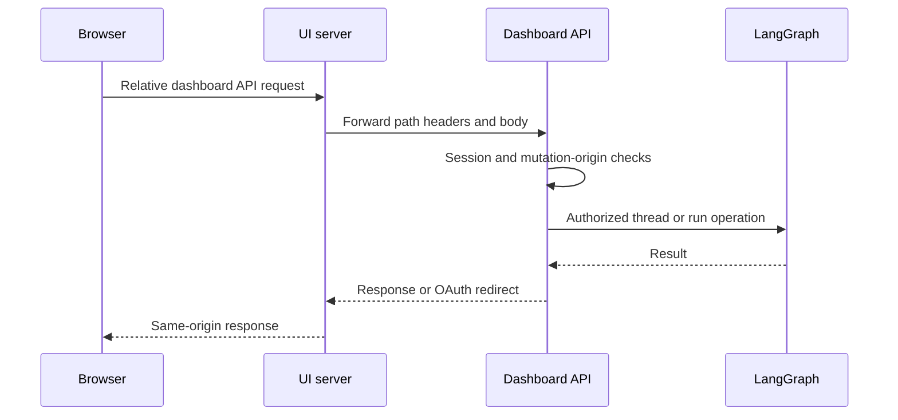

# Dashboard, Web UI, and Desktop Integration

The dashboard is the human-facing integration boundary around the agent. Its FastAPI API owns session-based access control and dashboard-specific operations; the TanStack Start UI and the Electron renderer deliberately reach it through same-origin or application-owned proxies rather than exposing backend credentials to browser JavaScript.

## API composition and policy boundary

`create_app()` builds the FastAPI application, configures credentialed CORS, includes the dashboard aggregate router and other application routers, and only then mounts the UI. The aggregate dashboard router is mounted below `/dashboard/api` and composes authentication, profiles and preferences, repositories and pull requests, threads and transcripts, schedules, skills, review, workspace settings, MCP, audit, analytics, and other product routers. `agent.dashboard.router` is lazy: importing a dashboard helper does not import FastAPI and all feature routers until the web app actually requests the router.

Every route in that aggregate receives the mutation-origin dependency. Safe HTTP methods pass. A mutation made solely with a bearer GitHub token passes because it does not rely on an ambient browser cookie; cookie-authenticated mutations require an allowed `Origin` or `Referer`. WebSockets are always origin-checked. If no dashboard origins are configured, the origin checker is intentionally a no-op for local setups. Application CORS also permits `open-swe://app`, supports credentials, and rejects a wildcard `DASHBOARD_ALLOWED_ORIGINS` configuration.

```mermaid
sequenceDiagram
    participant Browser
    participant WebUI as UI server
    participant API as Dashboard API
    participant Graph as LangGraph

    Browser->>WebUI: Relative dashboard API request
    WebUI->>API: Forward path headers and body
    API->>API: Session and mutation-origin checks
    API->>Graph: Authorized thread or run operation
    Graph-->>API: Result
    API-->>WebUI: Response or OAuth redirect
    WebUI-->>Browser: Same-origin response
```
Diagram: web API traffic remains at the UI origin from the browser's perspective while the proxy forwards it to the dashboard backend.

## Login, sessions, and desktop handoff

`GET /dashboard/api/auth/login` creates signed OAuth state whose nonce is represented in a short-lived state cookie and redirects to GitHub. The regular callback validates that nonce binding, exchanges the authorization code, resolves and authorizes the GitHub login, persists its access token, signs the user in, and issues the `osw_session` cookie. The post-login destination is constrained to relative safe paths or configured dashboard origins.

The desktop flow shares identity and authorization checks but not the browser session: OAuth state carries a validated PKCE challenge and loopback port. The callback redirects to a fixed `127.0.0.1` callback with a short-lived, PKCE-bound handoff code and clears state without setting a browser session. `POST /auth/desktop/exchange` requires the verifier before returning a session token for the desktop application. Session cookies are seven-day signed JWTs; `require_session` returns `401` for no cookie or an invalid token, while route dependencies use the session to enforce administrator-specific actions.

## Product surfaces: threads, terminal, schedules, and skills

The threads router is the dashboard facade over thread summaries, lifecycle commands, run/stream proxying, file and diff views, pins, feedback, uploads, and pull-request context. Listing is authenticated; `all=true` requires an administrator. The paginated listing rejects incompatible `repo` and `ownerless` filters and validates a repository as `owner/name`. A separate per-user pinned endpoint supports pin and unpin operations. Thread implementations, rather than the UI, remain responsible for readability and mutation authority.

Cloud terminal access is deliberately two-stage. `POST /threads/{thread_id}/terminal/connect` first verifies access to a ready terminal sandbox, then returns a no-store WebSocket URL, `open-swe-terminal` subprotocol, and a short-lived ticket bound to that thread. The WebSocket takes its ticket in the subprotocol rather than a dashboard cookie, verifies the ticket and sandbox access again, only supports a LangSmith sandbox, and uses a semaphore of 20 sessions. When saturated it closes with `1013`; it limits input size and terminal dimensions, and kills the PTY handle when the connection ends.

Schedules expose authenticated listing, but create, update, trigger, and delete require the administrator dependency. The schedule store is therefore the lifecycle owner behind the API rather than a UI-owned timer. Skills have two scopes: user skill CRUD is keyed to the signed-in GitHub login, while every authenticated user may list organization skills and only administrators may change them. This makes the route boundary explicit for settings-like data that appears in prompts or runs.

## UI routing, serving, and proxying

The React UI uses TanStack Router with `import.meta.env.BASE_URL` as its base path, allowing a build made for a LangGraph mount prefix to navigate under that prefix. Browser dashboard calls form relative `/dashboard/api/*` URLs; this keeps the session cookie same-origin. During server rendering the fetch layer instead addresses `DASHBOARD_API_URL` directly and copies the incoming `cookie` header, since server-side `credentials: "include"` cannot forward a browser cookie jar.

In development, Vite proxies backend prefixes to `DASHBOARD_API_URL`, defaulting to `http://localhost:2024`, and preserves redirects. In deployed UI builds, the Nitro handler for `/dashboard/api/**` and `/webhooks/**` obtains `DASHBOARD_API_URL` per request and fails if it is absent. It forwards the request while retaining OAuth `3xx` responses for the browser, removes hop-by-hop and reframed headers, and emits each upstream `Set-Cookie` as its own response header.

The Python backend can also serve a bundled client-only build itself. `DASHBOARD_STATIC_DIR` selects an explicit build, otherwise `ui/.output/public` is used when it contains `_shell.html`; `DASHBOARD_DEV_SERVER_URL` instead enables a reverse proxy to Vite while retaining the backend origin. The mounted catch-all refuses server-owned prefixes such as `/dashboard/api`, `/threads`, `/runs`, `/webhooks`, `/health`, and `/assets`. It serves existing files or the no-cache shell only to HTML navigation requests, so unknown non-HTML paths remain server `404`s. Hashed assets are immutable for a year. The catch-all must stay last; callers that add routes after mounting use `keep_dashboard_ui_last` to restore route precedence.

Focused UI tests verify that API routes outrank the shell, serving works beneath a mount prefix, files cannot escape the build directory, and the development proxy preserves streamed bodies, redirects, multiple `Set-Cookie` headers, and relevant response headers.

## Electron and the local graph boundary

The desktop runtime uses a `BackendSupervisor` to start a private local LangGraph server lazily. Concurrent starts share one readiness promise. It reserves a loopback-only `127.0.0.1` port, generates a random bearer token, requires a project allowlist and worktree directory, starts either development `uv run langgraph dev` using `langgraph.desktop.json` or the packaged runtime/configuration, and supplies the token and local path configuration through child environment variables. It polls the authenticated root endpoint for up to 60 seconds; startup failures include retained child logs.

The renderer receives only the stable local configuration `{ apiUrl: "/local-graph", graphId: "agent" }`, never the port or token. Requests to that prefix start the supervisor if needed, remove renderer `host` and `cookie` headers, inject the supervisor bearer token, and retain redirects manually. Shutdown clears supervisor state, sends `SIGTERM`, and escalates to `SIGKILL` after five seconds if needed. This proxy boundary lets the desktop UI speak the normal graph protocol without granting renderer code credentials for the loopback backend.

The Agents route permits an unauthenticated desktop-local mode only at `/agents` or `/agents/local/...`; other unauthenticated navigation is sent to login. That restriction keeps the special local transport separate from ordinary cloud dashboard sessions.

## Operational checklist

- Configure `DASHBOARD_JWT_SECRET` for signed state, sessions, and terminal tickets, and configure GitHub login authorization before production startup.
- Set `DASHBOARD_API_URL` for deployed UI SSR and Nitro proxying; do not rely on a production fallback.
- Use `DASHBOARD_STATIC_DIR` for an explicit built UI or `DASHBOARD_DEV_SERVER_URL` for backend-fronted Vite development. Align `DASHBOARD_BASE_PATH` with any LangGraph mount prefix.
- Preserve the desktop loopback token, cookie stripping, health polling, and forced shutdown behavior when changing desktop transport or startup code.

## Related

- [Architecture overview](../architecture/overview.md)
- [Auth and security](../concepts/auth-and-security.md)
- [Deployment](../operations/deployment.md)
- [Invocation](../workflows/invocation.md)
