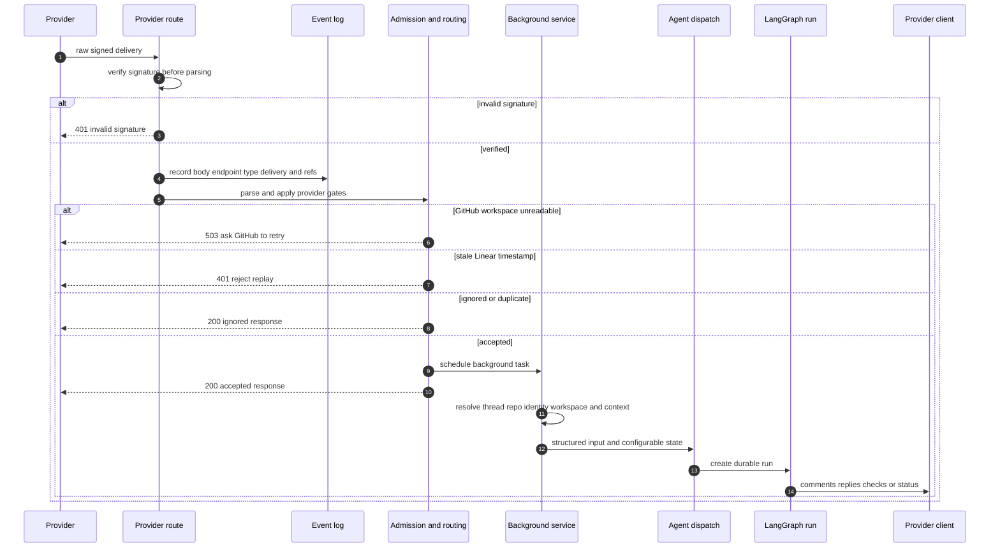

# GitHub, Slack, and Linear integration boundaries

GitHub, Slack, and Linear are provider-facing **ingress and response surfaces**, not three separate agent runtimes. Their routes verify an unparsed request body, record the delivery, perform inexpensive admission and routing checks, and normally queue background work. Provider-specific services then construct source-aware agent input, preserve or create a durable thread, resolve a workspace, and call the common run dispatcher. This separation keeps webhook acknowledgement bounded while allowing provider API calls, context collection, and agent execution to happen asynchronously.

This page covers the integration boundary. For account and credential policy, see [Auth and security](../concepts/auth-and-security.md); for continuation behavior, see [Follow-ups, interrupts, and stop control](../workflows/follow-up-messages.md); for general dispatch, see [Inbound invocation to durable run](../workflows/invocation.md); and for reviewer-specific GitHub lifecycle, see [Pull request review](../workflows/pr-review.md).

## Shared ingress contract

The application mounts the three routers at their provider-facing paths:

| Provider | Primary inbound endpoint | Verification material | Delivery identity used by the route |
| --- | --- | --- | --- |
| GitHub | `POST /webhooks/github` | `X-Hub-Signature-256` and `GITHUB_WEBHOOK_SECRET` | `X-GitHub-Delivery` |
| Linear | `POST /webhooks/linear` | `Linear-Signature` and `LINEAR_WEBHOOK_SECRET` | `Linear-Delivery` |
| Slack events | `POST /webhooks/slack` | `X-Slack-Signature`, `X-Slack-Request-Timestamp`, and `SLACK_SIGNING_SECRET` | Slack `event_id` |

Slack also exposes signed command and Block Kit interaction endpoints under `/webhooks/slack/commands`, `/webhooks/slack/code-channel-commands`, and `/webhooks/slack/interactivity`. Linear provides `GET /webhooks/linear` for setup verification.

All three main webhook routes read the raw bytes before parsing and reject an invalid signature with `401`. Verification must remain ahead of JSON/form parsing and `EventLog.record`; an unverified payload is neither dispatched nor retained through this path. Linear additionally rejects a signed payload whose integer `webhookTimestamp` differs from local time by more than 60 seconds as a replay (`401`). Slack's signature verifier receives the provider timestamp as part of verification.

The diagram shows the common verification-to-dispatch path and the provider-specific retry decisions that intentionally differ.

### Event recording is observability, not a delivery queue

After verification, routes invoke `EventLog.record` with the raw body, source, endpoint, event type, delivery id, and linkable references. The append-only PostgreSQL log resolves GitHub user/repository/PR, Slack user/channel, or Linear email to internal rows when possible; it appends an action suffix to an event type when the payload has `action`. A successful record also delivers matching event subscriptions and starts analytics recording asynchronously.

Recording is deliberately best effort: `EventLog.record` never raises and returns `False` when storage is unavailable. Its return value is not used by these provider routes to decide acknowledgement, so it must not be treated as an inbox, a deduplication mechanism, or a prerequisite for dispatch. Slack recording is further suppressed unless the referenced Slack channel exists and has `publishes_events`; this does not prevent normal Slack handling. Event-log partitions are rotated at most hourly per process and retain the current and prior day, while preparing the following day (a two-day retention window).

## Workspace routing and thread continuity

Workspace selection is owned by `openswe.workspaces.routing`, rather than by an individual webhook. For a new run, the resolver prefers a valid opening `/workspace:<slug>` tag, then a bound Slack channel, repository ownership, the triggering user's default, and finally the instance default. An existing thread's recorded workspace is preserved before those choices. This prevents an old conversation from silently moving when repository/channel ownership changes.

GitHub has one special safety boundary: before event-specific admission, a delivery that names an owner and repository calls `repo_is_routable`. An owned repository is routable; an unowned repository is routable only when `OPEN_SWE_UNASSIGNED_REPO_WORKSPACE` is `default` (the default), rather than `ignore`. Crucially, unreadable workspace ownership produces `503`, not an `ignored` `200`, because GitHub retries 5xx responses and otherwise the event could be permanently lost.

Slack routes obtain a channel context before dispatch. Channels that are external/shared or not confirmed eligible do not operate; an app mention in an external channel receives one claimed, asynchronous refusal reply, while an unverified channel gets no reply or run. Once admitted, a Slack-bound workspace outranks a repository preference: every workspace may use a repository, so a message stays with the workspace that owns its channel. Linear has no inbound workspace identifier; its worker preserves an issue thread's workspace or chooses the selected repository's preferred workspace.

## GitHub: repository events and reviewer triggers

`github_webhook` accepts only configured GitHub event families, records and invalidates a referenced PR UI topic, then applies repository routing before event-specific work. The route returns explicit `accepted`, `ignored`, or parse-error JSON; it queues accepted service work through FastAPI `BackgroundTasks`.

### What can trigger work

- **Issue events** require a supported action. An `edited` issue must change title or body, and issue text must mention an Open SWE tag. `opened` additionally starts GitHub automations in the background.
- **Issue, PR, review, and review-comment events** use supported action lists. Ordinary agent-directed comments require a registered Open SWE sender and an Open SWE mention. Exceptions are a reply to a review finding, and eligible untagged activity on an agent-opened open PR, both of which route to the existing PR thread.
- **PR events** update agent-thread PR state where relevant. `opened` and `closed` may launch automations when the repository allowlist permits it; `synchronize` notifies a review guide; close/state events settle human-review state. Auto-review first-review actions require the per-repository automatic-review setting and the public-repository organization gate.
- **Push** triggers watched-review evaluation only when automatic review is enabled. CI event types are delegated to the CI handler. Submitted or dismissed PR reviews settle human-review requests, and a submitted review is recorded.

The GitHub repository allowlist permits all repositories when both `ALLOWED_GITHUB_ORGS` and `ALLOWED_GITHUB_REPOS` are empty; otherwise an owner or exact `owner/name` must match. For public-repository triggers, an optional `PUBLIC_REPO_ORG_GATE` admits private repositories, known internal bots, or active members of that organization, and rejects other senders. These gates are admission policy; they are not a substitute for webhook signature verification.

### Service and outbound responsibilities

The GitHub service turns accepted issue/PR activity into typed system and human inputs, uses stable GitHub-derived thread identifiers, and dispatches through the shared agent dispatcher. A reviewer run is deliberately separate: it uses the canonical reviewer thread and `assistant_id="reviewer"`, stores reviewer metadata, and can create GitHub checks and temporary review-started comments. Watched pushes only re-review an open PR with a reviewer thread whose `watch` flag is true and whose new head/diff merits work; an unchanged diff advances metadata and receives a settled success check instead of launching another review.

GitHub-originated review activity can also notify a linked Slack conversation. `notify_slack_review` finds the active Slack location for the agent thread, serializes mutation with that Slack thread, and records an idempotency key before attempting the reply. A lost Slack response therefore does not cause a second notice attempt; failure is logged and the provider event remains handled.

## Linear: comments invoke work, issue events invoke automation

`linear_webhook` records every verified delivery before JSON admission. Signed `Issue` `create` and `update` payloads do **not** directly start an agent issue run: they queue `launch_linear_automations` and return `Checking Linear automations`.

The direct agent path is narrower: a `Comment` with action `create`, not authored by a bot, whose body mentions Open SWE. The route ignores its own recognizable bot response prefixes to avoid feedback loops. It requires an issue id, derives an issue URL/identifier when present, selects a repository in this order, and rejects if none is valid:

1. an explicit repository parsed from the comment;
2. the comment author's dashboard profile default repository;
3. workspace settings' default repository.

The selected repository must pass the same GitHub repository allowlist used at this boundary. The route attaches the triggering comment, comment id, and author to the issue payload, schedules `process_linear_issue`, and immediately returns an accepted message naming the issue and repository.

The worker uses `linear_issue_thread_id(issue_id)`, retains the existing thread workspace when available, otherwise selects the repository workspace, and maps the comment author email (then issue creator, then assignee) to a GitHub login. It persists Linear source context and sends a system issue description plus relevant per-author comment inputs to the shared dispatcher. If issue/comment text contains images unsupported by the selected model, it can select the configured vision fallback and fetch image blocks. This worker does not need to make an inbound Linear HTTP call to retrieve the run.

Outbound Linear notifications are intentionally separate from webhook admission. `post_linear_notification` loads the current workspace's `linear` MCP connection and invokes its `save_comment` or `create_comment` tool with a 30-second limit. It never retries a comment mutation, avoiding duplicate user-visible failure notices; an unavailable connection or unsuccessful tool result is logged and reported as undelivered.

## Slack: surface admission, idempotency, and user-visible failures

Slack carries the most interaction shapes, so the event route first parses a typed event envelope after signature verification and records it. It immediately answers Slack URL verification challenges, ignores non-event callbacks, records PR links, and lets the incident handler claim incident-specific events before ordinary message routing.

For normal messages, the route admits app mentions; DMs; code-channel messages/actions; configured kitchen-channel or permitted solo-thread follow-ups; explicitly allowed third-party bot mentions; and validated message edits. It excludes self/bot messages by default, requires an allowlisted external bot to explicitly mention Open SWE, ignores non-directed channel messages, and rejects edit events that change message identity or only add link-unfurl attachments. Watched channels may independently launch Slack automations for messages regardless of whether they address Open SWE.

A code channel is a special one-session surface: all of its messages, runtime slash commands, and supported context-bar/Block Kit actions route to the channel session thread and count as directed requests. DMs can instead use a concierge conversation thread for users with concierge mode enabled. The ordinary message path resolves a repository and the stable Slack-to-agent thread mapping before it queues `process_slack_mention`.

### Retry and deduplication semantics

Slack delivery retries are not a request to run again. The route checks `X-Slack-Retry-Num` only as an early optimization when that event id was already observed; an unseen retry header still proceeds. Before work is scheduled, `claim_slack_event` acquires deterministic, ten-minute remote lock threads for both the delivery id and—when available—the `channel_id:event_ts` message identity, with a bounded local claim cache. A competing delivery is returned as `ignored`, so concurrent cross-instance redeliveries start one run. If remote claim infrastructure cannot be read, claiming fails open rather than making Slack delivery availability depend on it.

For requests already known to address Open SWE, `answer_slack_request` converts synchronous route failures into a same-thread Slack reply containing a fresh error id and returns a normal response, so Slack does not retry a request the user has already been told failed. The background equivalent catches failures after acknowledgement and posts the same style of reply. The worker also marks an existing thread's latest run status as `error` where possible; operational failures are therefore visible to the user instead of being silently left as an accepted webhook.

The Slack worker enriches the request with channel/thread history, user identity and linked GitHub login, source context, repository, and workspace before dispatch. It dispatches explicitly tagged requests with `multitask_strategy="interrupt"` and ordinary Slack follow-ups with `"enqueue"`; this is run scheduling behavior, distinct from webhook redelivery deduplication.

## Operations and focused tests

When operating or changing these boundaries:

- Keep raw-body verification first, keep signing secrets configured, and preserve the distinct status behavior: invalid signatures are `401`, stale Linear timestamps are `401`, and unreadable GitHub workspace ownership is `503`.
- Do not infer provider retry safety from `EventLog`: it is a short-retention observability stream, not a durable work queue. Slack's claim layer is the explicit ingress dedupe control.
- Preserve stable thread and workspace precedence. Existing GitHub/Linear thread workspace wins; a Slack channel binding wins over a repository preference for a new Slack conversation.
- Treat outbound mutations as provider-specific responsibilities. In particular, avoid adding blind retries to Slack review notices or Linear comments without a provider-visible idempotency design.

Focused coverage includes GitHub unowned-repository and `503` workspace-lookup behavior in `tests/github/test_github_workspace_routing.py`; Slack cross-instance event deduplication, retry headers, and external-channel refusal in `tests/slack/test_slack_event_dedupe.py`; Linear automation and stale timestamp admission in `tests/webhooks/test_linear_automation_routes.py`; Linear author/workspace/image input construction in `tests/webhooks/test_linear_webhook_author.py`; and event-log linking, action classification, form decoding, and retention behavior in `tests/webhooks/test_event_log.py`.
