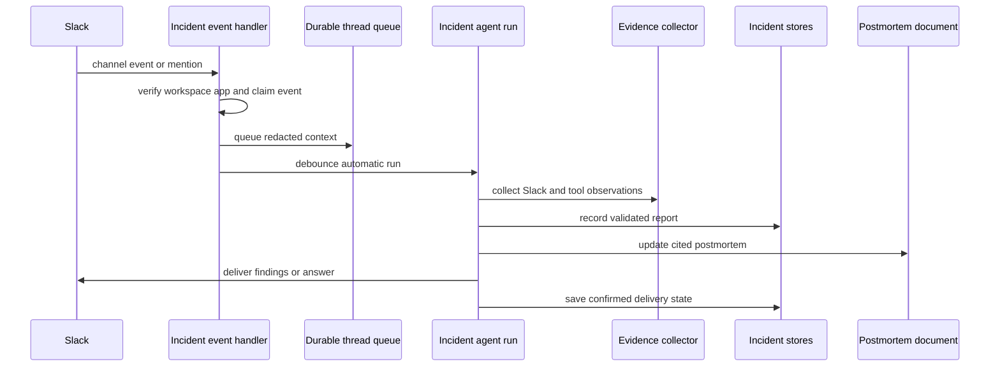
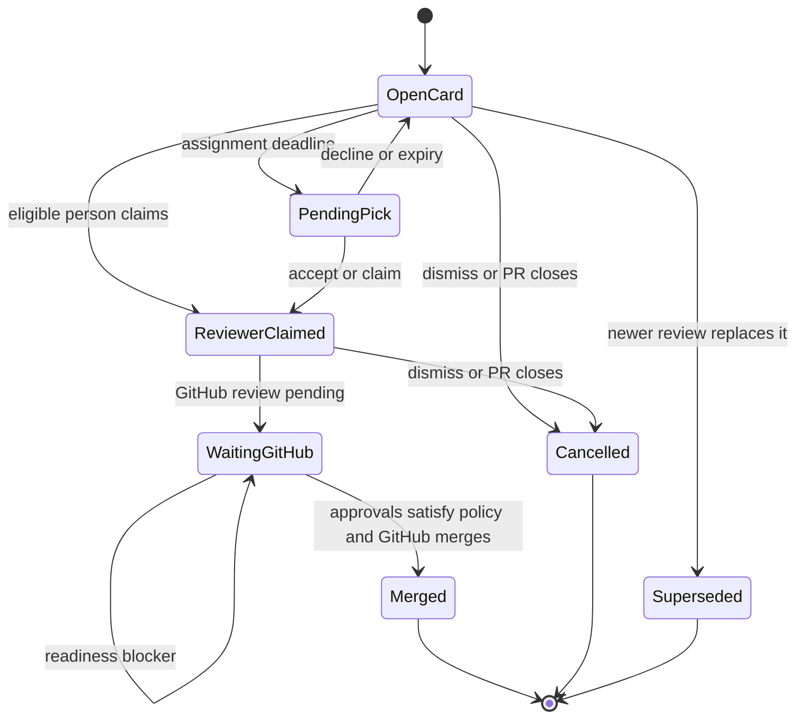

# Incident Response and Human Review Integrations

Open SWE has two separate collaboration integrations that share infrastructure but have different safety models:

- **Incidents** follows an eligible Slack channel as a system-owned, public agent session. It queues channel context, produces a cited report and postmortem, and lets responders ask questions or control the session.
- **Human review** persists one open review request per PR and uses Slack cards to collect people and decisions while GitHub remains the source of truth for review state and merge acceptance. It supports a normal reviewer workflow and a deliberately narrow expedited workflow.

Both depend on Slack delivery and identity, GitHub API access, durable agent threads, and the scheduler; neither treats a Slack message alone as authority to merge or to run with a personal identity.

## Shared boundaries

| Dependency | Incident role | Review role |
|---|---|---|
| Slack | Channel event source, responder surface, report delivery | Card/DM surface for sign-up, votes, reminders, and card updates |
| Durable agent thread | One public system-owned thread per incident channel | Origin thread can be awakened when an expedited vote arrives or a picker needs agent help |
| GitHub | Optional agent tools may contribute evidence | PR readiness, review state, permissions, and the final merge API |
| Persistent store / database | Incident policy, channel record, reports, command receipts, history | `HumanReviewRequest` and participant records, with row locks and one open request per PR |
| Scheduler | Not used to poll incidents; run-completion reschedules queued context | Delayed `human_review` deadline runs for assignment, pick expiry, snoozes, reminders, and auto-merge settlement |

Slack cards are intentionally not the final authorization point. Incident explicit questions require a Slack user linked to an Open SWE account because they unlock agent tools, while basic incident controls can be issued by channel humans. Review sign-up and expedited approval resolve a linked GitHub identity with repository write access; the final merge still uses the GitHub App and honors GitHub’s response and branch protection.

## Slack-backed incident sessions

### Enablement, enrollment, and access boundaries

An administrator enables an `IncidentPolicy`, which binds the installation’s Slack workspace and `SLACK_APP_ID` server-side, validates a channel prefix, can select a supported model, and caps a turn at 1–20 model calls. Enabling verifies Slack identity; a policy cannot be rebound to another workspace/app while incidents exist. The required bot scopes include channel discovery/join/history, mentions, posting, and user lookup.

Automatic enrollment begins only on a created or renamed channel whose name matches the prefix; a responder may also use the agent’s `manage_incident(start)` in any eligible public internal channel. Private, DM, multi-party DM, externally shared, pending-external-share, excluded, and archived channels are rejected. Enrollment joins the channel, creates and persists a public, system-owned `incidents_agent` thread rooted at the synthetic session timestamp `"0"`, posts an introduction, queues up to 100 existing contextual messages, and schedules investigation only if there is context. Failure preserves a `needs_attention` / `setup_failed` record for administrators rather than silently pretending the channel is followed.

Dashboard readers only see records in the bound workspace that Slack currently confirms the bot can read. Any signed-in dashboard user can read and command visible incidents, but settings are admin-only; all commands use a request ID plus content hash receipt so retries cannot repeat side effects or change a prior request’s content.

### Event-to-report flow

This diagram shows the incident session/report flow. Automatic work is debounced and is separate from an explicit responder question.

For an enrolled channel, non-bot contextual messages are redacted, wrapped with a Slack permalink and a `slack:<timestamp>` evidence ID, and placed on the incident thread queue. An automatic run waits 15 seconds and uses reject-on-conflict scheduling so racing events produce only one pending/running turn. If context remains after a successful run, completion schedules the next turn; error or timeout marks a watching incident `needs_attention`, records the failure once per run, and posts a retry-by-question notice.

A mention parses `pause`, `resume`, `complete`, or `reopen`; any other mention is a question. Controls run in the background. Questions require a linked account and otherwise receive an account-link prompt; explicit questions interrupt in-flight work, while automatic turns enqueue behind it. Dashboard `ask`, `investigate_again`, and lifecycle commands follow the same dispatch/control paths. Pausing or completing cancels active runs (except the run performing a tool-driven control); resuming/reopening schedules queued context. Channel archival marks the record archived and completes an unfinished incident.

### Session integrity and evidence/report contract

`load_incident_session` accepts only a saved thread whose metadata says `source="incidents_agent"`, `owner_type="system"`, and `visibility="public"`; it rejects personal GitHub/email/local-run execution identity and verifies the incident-to-thread binding. Before model calls and incident tools, the session rechecks that the policy remains enabled, the workspace/binding is current, the channel is not excluded, and automatic work has not continued after pause or completion.

The incident middleware adds incident instructions and supplies three incident-specific tools: `record_incident_report`, `search_incidents`, and `read_incident`. It observes successful ordinary tool results as evidence, records failed calls as coverage gaps, and avoids duplicating evidence already returned by incident tools. Evidence text and report fields are bounded and redacted; source URLs are retained only when they are credential-free HTTPS URLs without query strings.

The report tool is the only writer of the latest report record. Its draft claims must cite evidence IDs known to the collector: claims with absent or unknown citations are omitted and reported as a gap. It writes the postmortem document before saving the latest report record, so a document-write failure does not leave a report claiming it was persisted. The document presents findings, hypotheses, checked items, gaps/questions, and linked evidence; historical search/read is access-checked against the current incident channel rather than treating old content as universally visible.

Automatic channel delivery is intentionally restrained: the first evidence-backed (`findings`) investigation posts once; inconclusive automatic work does not consume that allowance, and later automatic runs update records/documents quietly. An explicit question can post once per run. In either case, only a confirmed Slack delivery records the digest and consumes/suppresses future delivery; Slack posting failure leaves the report current but retryable.

## Human PR review

### Request model and normal review lifecycle

A `HumanReviewRequest` has kind `standard`, `expedited`, or `posted`, and state `open`, `merged`, `rejected`, `superseded`, or `cancelled`. A partial unique constraint allows only one open request for a PR across all kinds. Participants reference internal users—not raw Slack or GitHub handles—and distinguish expedited approval/rejection, a voluntary standard reviewer, an agent pick awaiting acceptance, and an expired pick.

A normal `request_review` first obtains a repository token, refuses a closed/draft/conflicted PR or one with failed required checks, routes to an explicit or repository-configured review channel, and requires that the PR author be an Open SWE user. It records the PR/head and posts a standard Slack card. If scheduling either the unclaimed-reviewer or auto-merge deadline fails, or if Slack posting fails, it discards the just-created request; concurrent requests return the winner instead. A pre-existing expedited request must be dismissed before normal review begins, while a matching normal request is reused (and its originator may update its summary).

People claim the card only after their linked GitHub identity is confirmed to have repository write access; the author cannot self-review. Claiming adds them as a reviewer and attempts a GitHub requested-reviewer mutation. After the workspace’s auto-assignment timeout with nobody signed up, the system ranks eligible CODEOWNERS/recent authors by changed-file ownership/history and open-review load, excludes authors, bots, non-users, already-used/expired candidates, checks GitHub write access, and respects 09:00–18:00 local weekday work hours. It can wait until the earliest shift rather than picking off-hours. Picks are shown on the card, requested on GitHub, and sent accept/decline/snooze controls by DM; declining or expiry rotates the pick.

This diagram shows the standard-review decision flow; expedited voting is a separate path below.

Settlement rereads GitHub rather than trusting card state. Normally every named reviewer must have an `APPROVED` review; after two hours from request creation, at least one approval is sufficient. In either case the PR also must be otherwise ready: open, non-draft, conflict-free, checks/required checks settled, no unresolved review threads, and no current changes request. For CODEOWNERS coverage, an approval can cause selection of reviewers for still-uncovered areas. A `posted` request is observational: it reacts when approval coverage is sufficient and may seek a reviewer after a green waiting period, but it never merges or edits the user’s original post.

### Expedited review: small visible diffs and a single vote

The agent tool `expedite_pr_approval` is workspace-gated and creates a Slack card only for an open PR authored by an Open SWE user with a Slack destination. Eligibility is deliberately narrow: fewer than 100 changed files; every non-test file has a readable textual patch; and non-test additions plus deletions are at most 25 (the user-facing target is 20). Test-only files do not count against the line gate, and the fingerprint covers only the rendered non-test diff, so a test-only commit does not invalidate the vote. An expedited card stores the head SHA and fingerprint; it may render an image of the diff with a text fallback.

A draft does not solicit public approval: the author receives an author-only DM card and must mark the PR ready using their connected GitHub token. Once ready, another linked user with repository write access may approve exactly once. The system records the participant under a row lock, immediately tries to submit that person’s GitHub approval against the fingerprint-matching head, updates the card, and wakes the originating agent. If GitHub is temporarily unavailable, the vote remains recorded and merge attempts retry submission; if a later diff no longer matches, no review is submitted from the stale card.

Cards can be broadcast or copied once, but only from/to public internal, non-externally-shared channels. The chooser offers the current channel and the author’s recent eligible channels; a write-authorized user is required to send a card to another channel. Anyone who can see a card may dismiss it. Closing an unmerged expedited request attempts to dismiss its standing GitHub approvals, including retries for earlier closed cards.

`merge_approved` is agent-invoked and performs a fresh readiness snapshot before merging. It requires an open, ready non-draft PR, an expedited approval, no GitHub blockers, unchanged head during the final lock, and no unresolved review threads during the final check. A changed but still eligible non-test diff does **not** silently retain votes: the agent must explicitly provide `keep_approval_reason`, which is posted to GitHub before the stored fingerprint advances. A newly ineligible diff supersedes the card and discards its approval. Recorded approval reviews that are absent/stale are submitted before merging. The merge uses the GitHub App’s contents/pull-request write token and an allowed repository merge method; a refusal is surfaced rather than bypassing branch protection.

## Scheduler and operational behavior

The scheduler routes `task="human_review"` only when both `request_id` and `step` are present, returning `missing_request` otherwise. Delayed runs are created with `on_completion="delete"`. `run_deadline` treats closed/missing rows as harmless, reschedules a still-snoozed reviewer, sends a snooze-end reminder, handles reviewer reminders, prevents preview auto-assignment, waits until the configured unclaimed interval truly elapsed, expires picks, starts/continues assignment, and calls settlement at the auto-merge deadline. Scheduler sandbox transient failures are retried by the generic scheduler wrapper and ultimately return `sandbox_unavailable` rather than masking the condition.

There is no incident cron: incident activity is Slack-event/run-completion driven. The scheduler still recognizes the legacy expedited-review cron task solely to delete old per-approval crons, reflecting the move away from polling toward event wakeups, card actions, and explicit merge attempts.

For operations, ensure Slack bot configuration and incident scopes before enabling Incidents; configure the incident prefix/exclusions/model in the admin settings; invite the bot where cards must post; make repository review-channel configuration resolvable; and ensure GitHub App/token permissions plus linked user identities are available. Slack or GitHub failures are intentionally visible as failed enrollment, retained-but-unsent reports/votes, a card detail/error, or a non-merge result—not converted into an optimistic success.

## Focused test coverage

Incident tests cover channel eligibility/enrollment and controls, event deduplication/context scheduling, report citation and delivery semantics, redaction/evidence bounds, postmortem access/history, runtime binding checks, and completion/failure handling. Expedited tests focus on eligibility/fingerprints, readiness blockers, vote permissions and GitHub submission behavior, card rendering, and merge races/diff changes. Human-review tests exercise standard request/card behavior, posted requests, reviewer picking and work hours/coverage, deadlines, and conditional merging. These are the high-value regression seams when changing Slack event handling, persistence, permission gates, or merge conditions.
