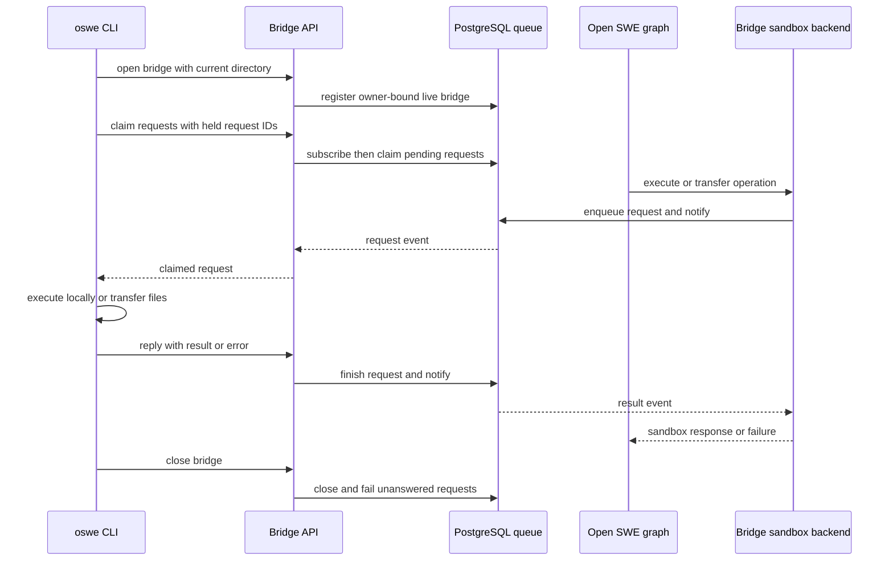
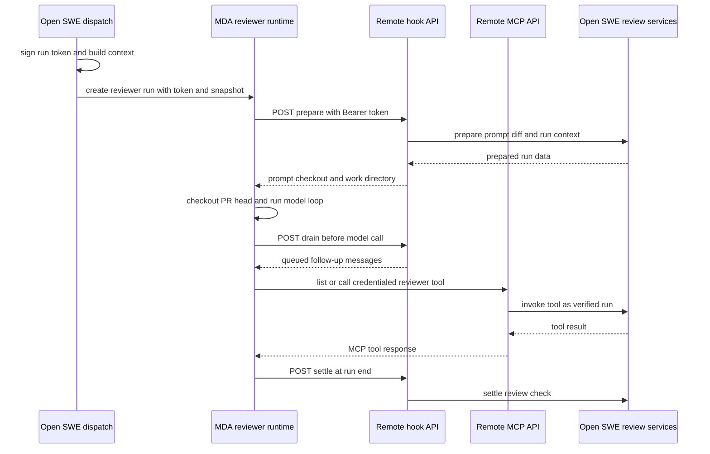

# CLI bridge and remote reviewer runtime

Open SWE has two integrations that reverse the usual location of execution. The `oswe` CLI keeps the agent graph in an Open SWE deployment but executes its sandbox operations in the user's current local checkout. The Managed Deep Agents (MDA) reviewer does the converse: its model loop, checkpoints, and sandbox run in a separate reviewer deployment, while Open SWE retains credentialed review preparation and repository-facing tools.

They are separate mechanisms with different trust boundaries. A bridge is a durable, owner-bound queue between an Open SWE graph and a machine that is polling outward; it must never silently substitute a cloud sandbox for a disconnected local machine. The remote reviewer is a callback API: Open SWE dispatch signs the identity and configuration of one review run, and the MDA deployment presents that token when it invokes backend tools or lifecycle hooks.

Related: [Sandbox and backend lifecycle](../architecture/sandbox-lifecycle.md), [Review, scout, and findings architecture](../architecture/reviewer-and-analyzer.md), [Identity, authorization, and credential scope](../concepts/auth-and-security.md), and [Dashboard UI](dashboard-ui.md).

## Local checkout execution with `oswe`

`oswe run "…"` opens a bridge for `process.cwd()`, starts a thread, and stamps the new thread with the bridge sandbox ID and detected `origin` repository. The graph subsequently resolves that `bridge:<id>` binding as a `BridgeSandboxBackend`; it does not boot a provider sandbox, configure a GitHub proxy, or change the user's Git identity. Continuing with `--thread` is allowed only from the remembered directory and reopens that thread's existing bridge. A live bridge cannot be shared by another CLI process.

The important operational consequence is that this is **not** an isolated execution environment. Commands and transfers execute locally, as the user, with the filesystem access of the shell that launched `oswe`. The CLI warns about this before starting. Its child environment removes variables whose names end in `_API_KEY`, `_TOKEN`, `_SECRET`, or `PASSWORD`, except `GITHUB_TOKEN` and `GH_TOKEN`; it sets non-interactive Git/CI/pager variables. Default command execution is 300 seconds and local command output is capped at 1 MiB by the CLI bridge client.

### Authentication and thread creation

The CLI chooses the first available credential in this order: `OPEN_SWE_API_KEY`, a GitHub Actions OIDC token, then `OPEN_SWE_SESSION` or the session saved by `oswe login`. A browser login uses the desktop PKCE handoff and stores the dashboard session in `~/.open-swe/config.json` with mode `0600`. API-key and workflow callers create `system` threads, while people create `workspace` threads unless they request `--visibility private`.

The CLI calls the dashboard API as that principal to open, heartbeat, poll, reply to, and close its bridge. Bridge routes scope every operation to `Principal.sender_id`; a caller attempting to address another owner's bridge receives `404`, rather than an existence leak. PostgreSQL is required because bridge state and graph/HTTP-worker coordination are persisted there.

### Queue protocol and long polling

A bridge registration records its owner, client, hostname, root path, label, heartbeat, and closure state. Its request queue carries four operations: `execute`, `upload_files`, `download_files`, and `worktree_handoff`. The backend adapts those replies to the deep-agent sandbox protocol; filesystem conveniences inherited from `BaseSandbox` reduce to execute and file transfer round trips.

*The local CLI polls outward because a cloud deployment cannot initiate a connection to the user's machine.*

The CLI long-polls `POST /bridges/{bridge_id}/requests/claim`, which refreshes its heartbeat, releases previously claimed IDs absent from its `held` list, then subscribes **before** its first claim. That ordering avoids a missed wake-up between observing an empty queue and waiting. Requests are stored as `pending → claimed → done | failed`; claims use `FOR UPDATE SKIP LOCKED`, so concurrent/reconnecting claimers cannot run the same request. Completion updates only unfinished rows, making a reply at most once. A response requires exactly one of a result or error.

The `held` list makes a lost poll response recoverable: a later poll returns claims the CLI never confirmed as running. A CLI restart can reopen a closed or stale bridge it owns and requeues its unanswered claimed requests; reopening a bridge that is still heartbeating yields a conflict instead of sharing execution. Postgres notifications wake local subscribers, but correctness is not dependent on delivery: the poller reclaims after wake-up or timeout, and the waiting backend rereads its request on each liveness tick.

A normal heartbeat interval is 20 seconds and a bridge is considered alive for 75 seconds. The listener's periodic prune closes stale bridges, fails pending and claimed operations as `bridge disconnected`, and wakes waiters. Explicit close is idempotent for the owner and fails unfinished operations as `bridge closed`. While awaiting an operation, `BridgeSandboxBackend` also checks liveness every 15 seconds; it reports a disconnected bridge as `SandboxUnreachableError` rather than replacing it with some other sandbox. Execute waits for its requested timeout plus a 30-second grace period; transfers use a 120-second timeout plus the same grace period.

Bridge request rows are daily partitions. Rotation retains today and yesterday (and creates tomorrow's partition), because requests are meaningful only until their waiter has read the result.

### Worktree and cross-sandbox handoff

The bridge exposes `worktree_handoff` so a desktop-capable client can move a thread into its own worktree. This operation only applies when the current backend is a bridge; it returns a structured failure for other sandbox types. If a handoff request times out or the bridge disconnects, the caller is told to verify `pwd` and `git branch --show-current`, because the local client may have moved the thread even though its reply was not received. The implementation invalidates cached work-directory resolution in all outcomes.

There is a separate, broader checkout handoff for a thread switching sandbox locations. Before a new target backend is published, `complete_handoff` checks `sandbox_handoff_from`. If repository metadata is available and the source differs from the target, it connects to the source, fetches `origin`, creates a temporary commit from copied index/worktree state, and bundles only commits absent from `origin`. The target fetches `origin`, fetches the bundle, restores the source branch or appropriate base, restores the uncommitted tree, then deletes the bundle. The source working tree and index are not modified; the marker is cleared after the one-time attempt. This allows cloud/local transitions to retain a branch, unpushed commits, staged changes, and unstaged changes.

## Separately deployed MDA reviewer

`request_pr_review(use_mda=True)` dispatches the `reviewer` graph to the deployment named by `REVIEWER_RUNTIME_URL`. The Open SWE thread remains the index used by the dashboard and webhooks, but remote run/checkpoint state belongs to that deployment. Dispatch refuses remote execution unless the URL is absolute HTTP(S), non-local HTTP uses HTTPS, and `REMOTE_RUNTIME_TOKEN_SECRET` is configured; `REVIEWER_RUNTIME_API_KEY` authenticates the backend's LangGraph client to the reviewer deployment.

The remote run context contains a signed `run_token`, optional invocation and snapshot IDs, and models selected at dispatch. The MDA factory uses the snapshot to boot its own sandbox, supplies its own `fetch_review_diff` sandbox tool, and attaches the Open SWE MCP server as `openswe`. The reviewer deployment deliberately holds no GitHub, Slack, or database credentials. Its checkout middleware receives backend preparation, clones/fetches the public repository into `/workspace`, force-checks out the requested head SHA, and materializes the trusted diff there.

### Token-authenticated callback boundary

The run token is an HS256 JWT signed with the first comma-separated `REMOTE_RUNTIME_TOKEN_SECRET`; verification accepts every configured key to permit rotation. It contains an issuer, audience, issuance and expiration times, the thread ID in `sub`, assistant ID, and the dispatch configuration. It lasts 48 hours with 60 seconds of verification leeway. Missing secrets, invalid signatures, malformed claims, wrong issuer/audience, or expired tokens are refused.

Open SWE mounts a stateless FastMCP endpoint at `/remote-runtime/mcp` and hook endpoint at `POST /remote-runtime/hooks/{hook}`. `RunTokenMiddleware` requires `Authorization: Bearer …` for every HTTP callback, verifies it once, and places the verified `RemoteRun` in request state. Catalog selection, thread identity, and configuration then come from those verified claims—not model-supplied tool arguments. Unknown assistant catalogs are denied; unknown hooks return `404`; absent or invalid tokens receive `401` with a Bearer challenge. Because the endpoints are stateless, any Open SWE replica can service a callback.

*The reviewer owns the model loop and sandbox; the backend owns authenticated preparation, tool effects, follow-ups, and review settlement.*

The reviewer catalog deliberately excludes `fetch_review_diff` from MCP because that tool writes to the remote runtime's own sandbox. All other reviewer tools are served by Open SWE. Tool invocation rejects unknown names and arguments outside the tool schema, reconstructs `RunConfig` from the token, and ensures a thread GitHub token exists on whichever backend replica received the callback. Preparation stores run context by thread in the Open SWE store; subsequent tool calls accept it only when its invocation ID matches the signed configuration, preventing stale preparation from a prior run from supplying a wrong diff.

The hooks form the remote model-loop lifecycle:

- `prepare` runs credentialed reviewer preparation in Open SWE, persists context needed by stateless later calls, and returns the rendered prompt, `/workspace` work directory, checkout details, and diff.
- `drain` runs the follow-up/message queue middleware before each model call and returns queued messages.
- `settle` runs the review-check exit middleware. The MDA middleware logs a failed settle call because Open SWE's completion webhook can settle a check left open.

The MDA middleware calls `prepare` once per invocation, checks out the returned repository before model work, prepends the prepared system prompt on every model request, drains messages before each model request, and attempts settlement after the agent. It bounds preparation, ordinary hook, and checkout calls independently. The reviewer factory also applies a 5,000 model-call limit and retries model timeouts.

## Configuration, operations, and focused tests

For the local bridge, operators need a PostgreSQL-backed backend and CLI authentication. The CLI resolves its backend from `OPEN_SWE_BACKEND_URL`, then `OPEN_SWE_DESKTOP_URL`, then shared configuration, with `http://localhost:2024` as the development fallback. It deliberately does not load a repository `.env`. A run follows the remote event stream and keeps stdout exclusively for the `cli_result` tool's `stdout`; it reconnects retryable dropped streams with exponential backoff, resetting its budget after a stream survives one minute and giving up after ten short failures. A completed run without `cli_result`, or a failed run, exits nonzero; Ctrl-C requests cancellation, closes the bridge, and a second Ctrl-C exits immediately.

For the remote reviewer, configure the backend with `REVIEWER_RUNTIME_URL`, `REVIEWER_RUNTIME_API_KEY`, and a rotatable `REMOTE_RUNTIME_TOKEN_SECRET`; configure the reviewer deployment with its public `OPEN_SWE_BACKEND_URL`, LangSmith access/sandbox credentials, and model credentials. After changing the backend-exported sandbox tool specification or subagent prompts, regenerate `open_swe_reviewer/spec.json` with `uv run python -m scripts.export_remote_reviewer_spec` before building or deploying the MDA project.

Focused bridge tests use the real migrated schema to verify an execute round trip, error propagation, and closure waking a waiter; long-poll wake-up, lost-response requeue, owner invisibility, and at-most-once replies; plus SQL-level exclusive claims, restart requeue, stale-heartbeat pruning, and partition rotation. Remote-runtime tests cover signed-token round trips, multi-key rotation, rejection of missing/expired/foreign-key tokens, middleware `401` behavior, verified-run propagation to handlers, and generated reviewer specification parity with the backend catalog.
