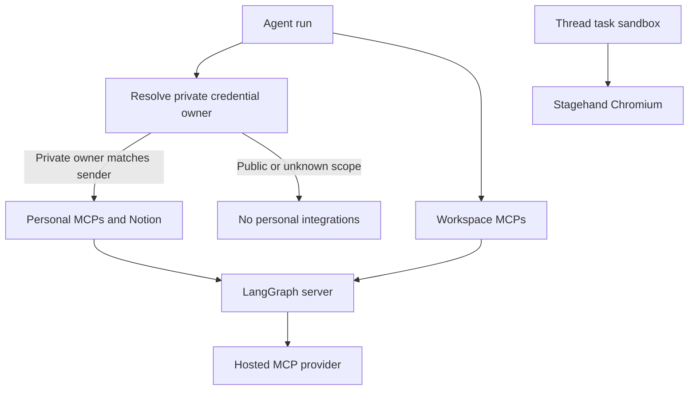
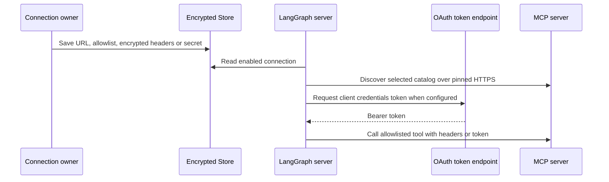
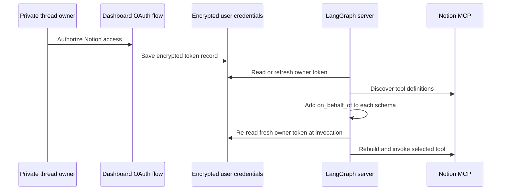

# Observability and Connected Tool Integrations

This deployment's observability integration is the optional **LangSmith LLM Gateway**: it routes model-provider traffic through LangSmith rather than exposing a LangSmith trace-inspection tool surface. Connected tools are supplied through generic MCP connections and Notion's hosted MCP service. These are optional capabilities: a connection that is absent, not selected, inaccessible, or fails discovery is not added to the run.

See [Authentication and security](../concepts/auth-and-security.md) for the wider trust model, [Tools](../concepts/tools.md) for tool availability, [Agent graph](../architecture/agent-graph.md) for agent construction, and [Configuration](../operations/configuration.md) for deployment settings.

## Boundaries and scope

Provider calls made by generic MCP and Notion tools originate in the LangGraph server process. Connection headers, OAuth client secrets, and Notion access tokens are encrypted before Store persistence and are attached only to that server-to-provider request. They are not placed in the task sandbox. The Stagehand browser is the deliberate exception: its requests run in the thread's sandbox and can operate against sandbox-local services.

There are two generic MCP ownership scopes:

- **Workspace connections** live in the `workspace_mcps` Store namespace. Administrators manage them for the deployment.
- **Personal connections** live in `user_mcps/<normalized-login>`. They are available only to the saved owner of a private thread who starts the run.

A private thread must have a saved owner and the current triggering GitHub login must match it. Public threads have no personal credential login. If scope cannot be resolved, the agent omits personal MCP and Notion tools rather than guessing an owner. Workspace connections remain a separate, deployment-wide source.

The server owns credentialed MCP calls; private ownership gates personal sources, while Stagehand stays inside the sandbox.

## Generic MCP connections

### Configure, discover, then allowlist

An MCP connection has a stable name, an HTTPS URL, either `streamable_http` or `sse` transport, an enabled flag, optional authentication headers or OAuth client credentials, and an `allowed_tools` list. A newly saved connection exposes no tools until its owner discovers the remote catalog and saves selected tool names. Discovery is available for workspace administrators and for the signed-in owner of a personal connection; it returns names and descriptions and does not execute tools.

URLs reject embedded credentials, fragments, control whitespace, and query parameters that look like credentials. Header names and values are constrained, dangerous transport-controlled headers such as `Host` are blocked, and OAuth cannot coexist with an `Authorization` header. Public dashboard representations contain header names and OAuth metadata but exclude secret values. The settings APIs use redacted validation errors so malformed submissions cannot echo credentials.

For OAuth, the only supported grant is `client_credentials`, with `client_secret_post` or `client_secret_basic`. The client secret is encrypted. Reusing a stored secret is permitted only when the connection URL, token URL, and client ID still match; changing a destination requires a replacement secret. Runtime access tokens are cached by connection namespace, name, OAuth settings, and encrypted secret. This prevents identical personal configurations owned by different users from sharing tokens, refreshes before expiry, and retries a 401 once with a replacement token.

This flow shows the server-side credential path for a configured generic MCP connection; no secret value is exposed to the model or sandbox.

### Loading, precedence, and revocation

At agent construction, the server combines the workspace source first and the authorized personal source second. A personal connection with the same name replaces the workspace connection completely—even if it is disabled or selects no tools—so a lower-precedence workspace connection cannot leak through an explicit personal override. Connection catalogs are cached for 600 seconds and isolated by source namespace and connection revision.

Remote tool names are generated as bounded, namespaced names derived from the connection and remote tool name, with a hash suffix to prevent collisions. A wrapper checks the connection again immediately before every call: it rejects a missing or disabled connection, a changed URL/transport, a scope change, or a tool removed from the allowlist. Consequently, deletion, disabling, and allowlist changes revoke an already-loaded tool; changing its endpoint or ownership requires a new run.

Every discovery and invocation has a 30-second limit. Failure of one connection does not hide usable tools from another connection, while a failure to read a higher-precedence source returns no MCP tools instead of falling back to a workspace connection. Errors exposed to users are safe, operational hints; logs omit upstream credential-bearing details.

The HTTP client enforces the configured HTTPS origin, disables redirects and environment proxy settings, validates that DNS answers are public addresses, and pins a validated address while retaining the original Host header and TLS SNI hostname. This prevents an MCP server or DNS rebinding from redirecting credentials to a different or private origin.

### Dynamic loading

MCP definitions are installed through `DynamicToolMiddleware`. The model initially receives an inventory of integration tool names plus `load_integration_tools`, not all schemas. It must request loading before calling a connected tool. Loading is serialized per integration group and cached for the agent instance; after a successful load, the selected names are stored in run state and the tools are inserted for the next model call. An unknown, unavailable, or prematurely invoked integration tool produces an error message directing the agent to continue or load it first rather than crashing the run.

For executable non-local, non-summary runs, `get_agent` loads the workspace source and, when private scope is known, the personal source and Notion definitions concurrently. Local/desktop and summary-stop runs do not load them.

## Notion hosted MCP and OAuth

Notion tools use `https://mcp.notion.com/mcp` over streamable HTTP. A dashboard login dynamically discovers OAuth metadata and registers a client with the Notion MCP host, creates a PKCE verifier and state-bound short-lived flow, then exchanges the authorization code. OAuth discovery, authorization, registration, and token endpoints are all required to be HTTPS on `mcp.notion.com`. The saved user record encrypts access and refresh tokens and any client secret; status only reports connection and timestamp/expiry metadata.

`load_notion_tools(login)` is available only when `login` is the current private credential owner and has a usable token. It uses that token to discover tool definitions, then wraps each schema with a required `on_behalf_of` field. At invocation the wrapper resolves the participant and additionally requires that resolved login still be the private owner, fetches a fresh token, rebuilds the requested remote tool, and invokes it without `on_behalf_of`. A missing token asks the user to reconnect; a removed remote tool is rejected.

This flow ensures discovery does not grant a different participant's Notion authorization. Token refresh is serialized per login; if a refresh returns `invalid_grant`, the dead connection is removed and reconnection is required. Credential lookup and refresh are intentionally fail-soft on the tool-loading path, so Notion failure removes optional tools rather than failing the run.

## LangSmith LLM Gateway

The LangSmith LLM Gateway is model routing, not a connected MCP tool. `make_model` centrally applies it to eligible models. The client authenticates to LangSmith with `LANGSMITH_GATEWAY_API_KEY` when present, otherwise `LANGSMITH_API_KEY`; LangSmith resolves the actual provider secret from workspace Provider Secrets and applies gateway policy and tracing.

A `gateway_enabled` team setting is authoritative when set. Otherwise, `LANGSMITH_GATEWAY_ENABLED` controls the deployment default; if that variable is unset, configuring a dedicated gateway key enables routing by default. `LANGSMITH_GATEWAY_BASE_URL` changes the gateway host. Only `openai`, `anthropic`, `baseten`, `fireworks`, and `google_genai` prefixes have gateway paths. Unsupported providers or absent LangSmith credentials log a warning and use direct provider routing rather than preventing model construction. OpenAI routing retains the Responses API unless `LANGSMITH_GATEWAY_OPENAI_USE_RESPONSES=false` explicitly selects Chat Completions.

## Sandbox browser boundary

Stagehand exposes navigation, action, observation, extraction, and close operations only when `SANDBOX_TYPE` is `langsmith`, the configured model uses the `anthropic` or `openai` provider, and an appropriate model API key is available. The model defaults to `anthropic/claude-sonnet-4-5`. Each browser request is base64 JSON sent to a long-lived Stagehand runtime over a Unix socket inside the sandbox; the runtime is health-checked and started when absent. Execution or malformed-response failures become structured failure results.

## Focused verification

`tests/dashboard/test_workspace_mcps.py` verifies encrypted/redacted storage, validation, admin and same-origin routes, and selection workflows. `tests/dashboard/test_user_mcps.py` checks normalized user isolation and dashboard ownership. `tests/tools/test_workspace_mcp_tools.py`, `tests/tools/test_mcp_sources.py`, `tests/tools/test_mcp_oauth.py`, and `tests/tools/test_mcp_transport.py` cover namespacing, revocation, precedence, OAuth token behavior, and network-origin protections. `tests/tools/test_notion_mcp_tools.py` covers absent credentials, loader degradation, schema wrapping, and fresh-token invocation.
