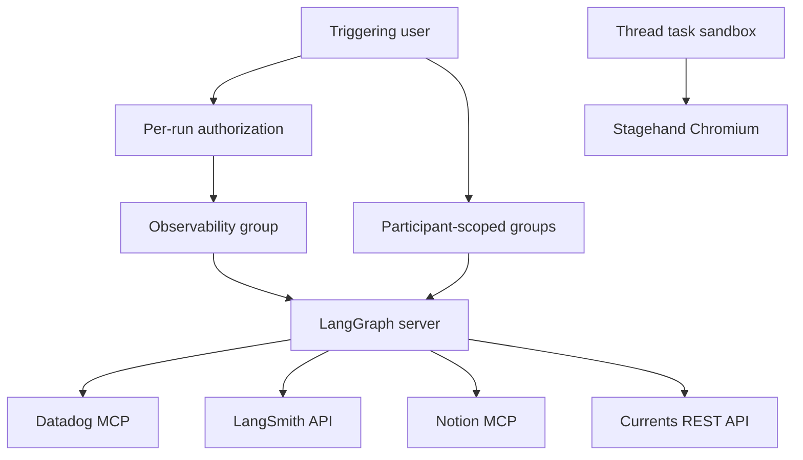

# Observability, Browser, and MCP Integrations

The agent offers several optional external tool surfaces: Datadog and LangSmith observability, Corridor security analysis, Notion MCP, Currents e2e investigation, and a sandbox-local Stagehand browser. It also can route supported model calls through the LangSmith LLM Gateway. None is a prerequisite for creating an agent: unavailable credentials, providers, or tool handshakes remove the optional surface rather than preventing the run.

See [Authentication and security](../concepts/auth-and-security.md) for the broader trust model, [Tools](../concepts/tools.md) for dynamic tool availability, [Models, profiles, and instructions](../concepts/models-profiles-instructions.md) for model selection, and [Configuration](../operations/configuration.md) for environment settings.

## Execution and credential boundary

Server-side integrations—Datadog, LangSmith tools, Corridor, Notion, and Currents—make hosted MCP or REST requests in the LangGraph server process. Their tokens are supplied on that server-to-provider connection; these integrations do not place their third-party credentials in the task sandbox. Stagehand is deliberately different: its browser operations are dispatched into the thread's sandbox.

Team Datadog and LangSmith records are kept in the separate `team_credentials` Store namespace. API keys are encrypted with `agent.encryption`; status reads expose connection metadata and last four characters rather than keys. Per-user Currents, LangSmith, and Notion records live below `user_credentials/<login>` and store encrypted secrets as well. The separation from plaintext team settings ensures an ordinary settings read does not reveal team credentials.

The server owns credentialed provider calls; only Stagehand browser automation is sent to the sandbox.

## Observability tools

### Datadog

`load_datadog_tools` obtains the team's decrypted API/application key pair and creates a `MultiServerMCPClient` using `streamable_http`. It connects to `https://mcp.<site>/api/unstable/mcp-server/mcp`, attaches `DD_API_KEY` and `DD_APPLICATION_KEY`, and requests the configured `toolsets`. `DATADOG_MCP_TOOLSETS` defaults to `core`, the query-oriented logs, metrics, traces, dashboards, monitors, incidents, hosts, services, and events set.

A Datadog connection validates and normalizes its site before storage. Only `datadoghq.com`, `us3.datadoghq.com`, `us5.datadoghq.com`, `datadoghq.eu`, `ap1.datadoghq.com`, and `ap2.datadoghq.com` are accepted, so the derived MCP host is an approved hosted-MCP site. Missing credentials or an MCP failure produces no Datadog tools.

### LangSmith run inspection

The LangSmith tool surface is intentionally read-only:

- `langsmith_get_trace` reads one run and can include child runs.
- `langsmith_list_runs` lists a project's recent runs, clamps `limit` to 1–50, and accepts an optional LangSmith filter.

Both tools resolve credentials when invoked, after resolving `on_behalf_of` to the acting participant. A connected personal LangSmith key wins; a team key is considered only when the loader created the tools with `allow_team=True`. Failures are returned as a structured `{ "success": false, "error": ... }` tool result. This is separate from the LangSmith sandbox backend.

### Authorization tiers

Team observability content is treated as attacker-influenceable: traces, logs, and run inputs/outputs can contain prompt injection. The server therefore evaluates observability access for every run, using the user who triggered that run, not a capability retained by the thread.

The check accepts configured admins (`CONFIGURED_ADMINS`) by email or GitHub login, and the explicit email allowlist (`OBSERVABILITY_AUTHORIZED_EMAILS`). It considers configured `user_email`, a Slack triggering email, the selected GitHub login, and the email resolved for that login. The resulting tool grant is tiered:

1. An explicitly authorized user receives Datadog and LangSmith with team fallback.
2. An active member of an `ALLOWED_GITHUB_ORGS` organization receives LangSmith with team fallback.
3. Everyone else receives LangSmith only if they have a personal connection; team fallback is disabled.

The authorization decision is intentionally not cached because it relies on per-run configuration. The expensive provider/credential and organization-membership work is cached separately, so cache reuse cannot carry team access from an authorized caller to an untrusted caller.

## MCP providers and participant-scoped calls

### Corridor

Corridor is a server-side MCP integration for `analyzePlan`. Configuration requires `CORRIDOR_API_TOKEN`; a legacy `token` or `api_key` query parameter in `CORRIDOR_MCP_URL` may supply the token and is removed before connecting. The URL is pinned to HTTPS `app.corridor.dev` at `/api/mcp`; an absent token or any other endpoint means Corridor is unconfigured, avoiding bearer-token delivery to an arbitrary host.

The loader uses HTTP MCP with a 30-second connection timeout, attaches `Authorization: Bearer ...`, and filters the discovered catalog to the `analyzePlan` allowlist. When configured, the server registers Corridor as an `IntegrationGroup` whose static advertised name is `analyzePlan`; the handshake is deferred until the agent requests it rather than delaying the first model call. The prompt directs the agent to use it before substantial security-sensitive code changes, but to report an unavailable tool once and continue without retrying.

### Notion

Notion uses the hosted `https://mcp.notion.com/mcp` server over `streamable_http` and a per-user OAuth bearer token. `load_notion_tools(login)` uses that login only to discover the MCP catalog. It wraps each discovered definition so every user sees the same schema, augmented with required `on_behalf_of`.

At invocation, the wrapper validates the participant, obtains that participant's current Notion access token, reconnects to retrieve the named MCP tool, and calls it. Notion credentials refresh expired tokens under a per-login lock; a reauthorization-required refresh removes the dead stored connection. Thus a catalog loaded using one person's token does not authorize calls as that person, and a missing current token produces a reconnect error.

### Currents

Currents is a server-side, read-only REST integration at `https://api.currents.dev/v1`. Its five tools list projects, retrieve a run, find a matching run, list project runs, and retrieve a spec-execution instance. Each request resolves the participant's decrypted Currents key at call time and sends it as a bearer header. The list endpoints cap page size at 50; provider errors become structured failure results.

For Currents and Notion, the triggering login merely decides whether the tool group is offered: it requires a known login with that provider connected. It does not select a permanent credential for calls.

### Participant invariant

All participant-scoped calls use `resolve_participant`. `on_behalf_of` must be nonempty, case-insensitively match the GitHub login that triggered the current run, and be among verified thread participants. Calls cannot select a different participant's connection, and uncertainty while verifying participants is rejected rather than silently accepted.

## Stagehand browser in the sandbox

The five Stagehand tools—`browser_navigate`, `browser_act`, `browser_observe`, `browser_extract`, and `browser_close`—operate through the thread's sandbox backend. They can navigate sandbox-local `localhost` services. For each request, the server encodes operation, model, headless setting, and input as base64 JSON and executes the Stagehand runtime in the sandbox. It health-checks a Unix socket, starts a long-lived runtime if necessary, then returns its JSON response; sandbox execution or malformed output becomes a failure result.

Browser tools are available only when `SANDBOX_TYPE` is `langsmith`, the selected Stagehand model has an `anthropic` or `openai` provider prefix, and a model API key can be sourced from `STAGEHAND_MODEL_API_KEY`, `MODEL_API_KEY`, or `ANTHROPIC_API_KEY`. `STAGEHAND_MODEL` defaults to `anthropic/claude-sonnet-4-5`; `STAGEHAND_HEADLESS` is enabled unless set to `0`, `false`, or `no`.

## Loading lifecycle and failures

While building an executable non-local, non-summary agent, the server concurrently loads observability and participant-scoped Currents/Notion groups. It adds browser tools under the same run restrictions. Corridor is configured into a lazy group instead. Summary-stop and local/desktop runs skip observability, Currents, Notion, browser, and Corridor integration groups.

Server loaders use a stale-while-revalidate TTL cache and a loader timeout. Datadog and Corridor cache for 600 seconds; LangSmith, Currents, and Notion caches use 300 seconds, with cache keys scoped to login and LangSmith team-fallback mode where needed. An exception or timeout returns an empty list. Credential reads on the tool-loading path also deliberately fail soft when Store access fails, whereas dashboard status reads surface Store failures. The operational invariant is that optional integration loss reduces available tools, not the ability to start a run.

## LangSmith LLM Gateway

The LLM Gateway is not the LangSmith run-inspection toolset. It is an optional model-routing layer applied centrally by `make_model`: supported provider calls go through the gateway, which authenticates with a LangSmith key and resolves real provider secrets from workspace Provider Secrets while enforcing gateway policies and tracing calls.

A team `gateway_enabled` setting overrides the deployment default; when it is unset, `LANGSMITH_GATEWAY_ENABLED` decides, or merely setting `LANGSMITH_GATEWAY_API_KEY` enables routing by default. `LANGSMITH_GATEWAY_BASE_URL` can replace the default `https://gateway.smith.langchain.com`. The gateway-specific key is preferred over `LANGSMITH_API_KEY`; it is useful when the ordinary injected key lacks `gateway:invoke` permission.

Only `openai`, `anthropic`, `baseten`, `fireworks`, and `google_genai` model prefixes have gateway paths. Unsupported providers or a missing LangSmith key log a warning and continue with direct provider routing instead of failing model construction. Gateway-routed OpenAI retains the Responses API by default; set `LANGSMITH_GATEWAY_OPENAI_USE_RESPONSES=false` only when a deployment needs Chat Completions.

## Focused verification

The relevant tests cover failure-to-empty behavior and Datadog/Notion/LangSmith wrappers in `tests/tools/test_observability_tools.py`, Corridor URL/token validation and lazy registration in `tests/tools/test_corridor_mcp.py`, Currents tool contracts in `tests/tools/test_currents_tools.py`, Stagehand sandbox dispatch and enablement in `tests/tools/test_stagehand_browser.py`, and concurrent factory loading in `tests/agent/test_factory_tool_loading.py`.
