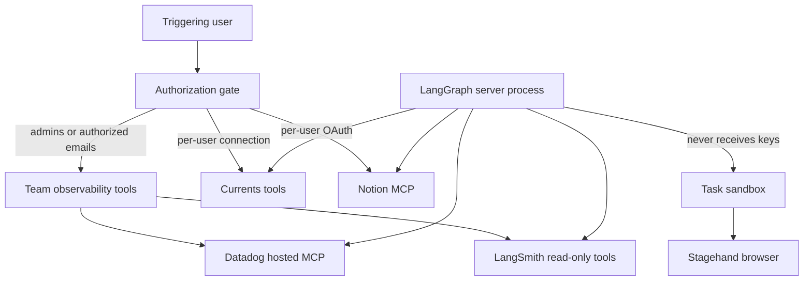

# Observability & MCP Integrations

This page documents the agent's optional third-party integrations: the team
observability tools (Datadog via a hosted MCP server, read-only LangSmith run
tools), the Corridor guardrail MCP, Notion MCP over OAuth, the read-only
Currents.dev e2e tools, and the sandbox-local Stagehand browser. It also
describes the security posture that decides who may load these tools and where
their credentials live.

These integrations are optional. Each tool loader degrades to an empty list when
its provider is not connected or its server is unreachable, so a run always
starts even when an integration is missing or failing. See
[operations/configuration](../operations/configuration.md) for the environment
variables, [concepts/auth-and-security](../concepts/auth-and-security.md) for the
broader trust model, and [concepts/tools](../concepts/tools.md) for how tools
are assembled into an agent run.

## Two credential planes: server process vs. sandbox

The defining architectural boundary is *where the integration runs and where its
credentials live*. Two integration families sit on opposite sides of this line:

- **Server-side integrations** (Datadog, LangSmith, Corridor, Notion, Currents)
  run inside the LangGraph server process. Their credentials are stored
  encrypted at rest and are attached as headers to hosted MCP/REST connections
  from the server. The task sandbox never holds these keys.
- **Sandbox-local integrations** (Stagehand browser) run *inside* the thread's
  task sandbox and use the run's model key, not a persisted third-party secret.

Team-wide observability credentials (Datadog and LangSmith) are encrypted with
`agent.encryption` and stored in a dedicated `team_credentials` Store namespace,
kept separate from the plaintext team-settings record so that reading settings
never surfaces a secret. Per-user secrets (Currents, per-user LangSmith, Notion
OAuth tokens) live in a per-login `user_credentials` namespace and are likewise
encrypted at rest.

Where each integration executes and which secrets it can reach.

## Team observability: Datadog and LangSmith

Datadog tools are backed by Datadog's hosted MCP server. `load_datadog_tools`
reads decrypted team credentials, and when present builds a
`MultiServerMCPClient` over `streamable_http` transport. The API and application
keys are attached as `DD_API_KEY` / `DD_APPLICATION_KEY` headers on the
connection opened from the server process. The MCP URL is derived from the
connected Datadog site (swapping the site host for its `mcp.` equivalent), and
the exposed toolset defaults to `core` (query-oriented logs, metrics, traces,
dashboards, monitors, incidents, hosts, services, events), overridable via
`DATADOG_MCP_TOOLSETS`. Only a fixed set of Datadog sites that expose a hosted
MCP server is accepted when connecting.

The LangSmith surface is a small, intentionally **read-only** toolset built in
`langsmith_tools.py`: `langsmith_get_trace` fetches a single run (optionally with
child runs) and `langsmith_list_runs` lists recent runs in a project (capped at
50). These tools call the LangSmith API directly from the server process using
encrypted-at-rest credentials, so the sandbox never holds a LangSmith key. A
LangSmith call resolves credentials per invocation: it prefers the acting
participant's own connected key and falls back to the team key only when
`allow_team` is set.

> Note: `agent/integrations/langsmith.py` is a different concern — it is the
> LangSmith *sandbox backend* (running code in a LangSmith sandbox), not an
> observability tool. It is unrelated to the read-only LangSmith run tools above.

### Who may load observability tools

Team observability data is attacker-influenceable content: logs, traces, and
run inputs/outputs can carry prompt-injection payloads back into the agent.
Because of that, the team's Datadog/LangSmith tools are gated so that
prompt-injected runs from untrusted contributors cannot reach the team's
observability data.

Authorization is decided per run by `is_observability_authorized`: a user is
authorized if they are a configured admin (`CONFIGURED_ADMINS`) or if their email
appears in `OBSERVABILITY_AUTHORIZED_EMAILS`. The server evaluates this against
the triggering user's identities (config `user_email`, Slack triggering email,
GitHub login, and the email resolved for that login).

The tool set granted depends on the outcome:

- **Authorized** users get the full team observability set (Datadog + LangSmith
  with team fallback).
- Users who are members of an allowed GitHub org (`ALLOWED_GITHUB_ORGS`) but not
  explicitly authorized get LangSmith tools with team fallback.
- Everyone else gets only LangSmith tools **without** the team key fallback, so
  they can reach LangSmith only via their own connected credentials.

The authorization check itself is uncached because it reads per-run config; only
the credential and org-membership lookups behind it are cached.

## Corridor guardrail MCP

Corridor is a security-analysis MCP the agent is instructed to call before
generating code. Its config comes from environment variables:
`load_corridor_mcp_config` reads a bearer token from `CORRIDOR_API_TOKEN` /
`CORRIDOR_MCP_TOKEN` / `CORRIDOR_TOKEN` (or a `token`/`api_key` query parameter
stripped out of the URL) and attaches it as an `Authorization: Bearer` header.

Corridor is deliberately locked down in three ways:

- **Host/path pinning.** The MCP URL must be `https`, host `app.corridor.dev`,
  and path `/api/mcp`; any other URL is rejected and the integration is treated
  as unconfigured. This prevents a misconfigured or hostile URL from receiving
  the bearer token.
- **Tool allowlist.** Only the `analyzePlan` tool is exposed; every other tool
  the server advertises is filtered out after the handshake.
- **Lazy loading.** Because Corridor's exposed catalog is a static allowlist, its
  tools are registered as a lazy integration group and the MCP handshake is
  deferred until the agent actually requests the tool, rather than running before
  every first model call.

The system prompt instructs the agent to run `analyzePlan` before generating
code, and to report Corridor as unavailable once and continue if loading or
calling it fails, rather than retrying or treating it as a blocker.

## Notion MCP (OAuth, act-on-behalf-of)

Notion tools are backed by Notion's hosted MCP server at
`https://mcp.notion.com/mcp` and authenticated with a per-user OAuth access
token. `load_notion_tools` uses a login only to read the server's tool list, so
the tool *schemas* are identical for every user and the agent's tool surface
does not change when a different participant replies.

Each Notion tool is wrapped as a `_RefreshingNotionMCPTool`. The wrapper adds a
required `on_behalf_of` argument (a GitHub login) to every tool's input schema.
At call time it resolves that participant, fetches a fresh access token for them
(refreshing via OAuth if needed), rebuilds the MCP tool with that token, and
invokes it. If the participant has no Notion connection the tool raises and asks
them to reconnect Notion in Profile Settings. This means a single Notion action
always runs against the named participant's own Notion authorization, resolved
at execution time.

## Currents.dev e2e tools

Currents tools are a read-only surface over the Currents REST API
(`https://api.currents.dev/v1`) for investigating end-to-end test failures. The
five tools list projects, get a run, find the most recent matching run, list a
project's runs with filters, and get a spec-execution instance (screenshots, DOM
snapshots, attempt history). Requests use per-user API keys stored encrypted at
rest and are made from the server process with a bearer header, so the sandbox
never holds a Currents key.

Like the other participant-scoped integrations, `load_currents_tools` uses the
triggering login only to decide whether the thread offers Currents at all; each
call names the participant to act for via `on_behalf_of` and resolves that
person's key then, keeping the tool schema stable regardless of who is speaking.

## Participant resolution invariant

The participant-scoped tools (Notion, Currents, LangSmith) all funnel through
`resolve_participant`, which enforces that `on_behalf_of` matches the user who
triggered the run *and* is a verified participant in the thread. An
`on_behalf_of` that does not match the run's caller, or that names someone who
has not spoken in the thread, is rejected. This prevents the agent from using
one person's connected credentials to act as another.

## Stagehand browser (sandbox-local)

The Stagehand tools (`browser_navigate`, `browser_act`, `browser_observe`,
`browser_extract`, `browser_close`) are the exception to the server-side model:
they execute *inside the thread's task sandbox*, driving a sandbox-local
Chromium so the agent can reach the sandbox's own `localhost`. Each call is
dispatched into the sandbox as a command that boots or reuses a long-lived
runtime process over a Unix socket, then forwards the base64-encoded request.

Because these run in the sandbox, they use the run's model key rather than a
persisted third-party secret. `browser_tools_enabled` only enables them when the
sandbox type is `langsmith` and a usable model key exists for an `anthropic` or
`openai` provider (defaulting to `anthropic/claude-sonnet-4-5`, overridable via
`STAGEHAND_MODEL`). When those conditions are not met, no browser tools are
loaded.

## Loading, caching, and failure semantics

Integration tools are assembled when the agent graph is built for a thread.
Server-side loaders run behind a stale-while-revalidate TTL cache with a
per-load timeout; a timeout or exception yields an empty tool list rather than
failing the run. Credential reads on the tool-loading path are intentionally
fail-soft: an unreachable Store costs a run its optional tools, never the run
itself.

Observability, Currents, and Notion tools are skipped entirely for
summary-stop and local runs, and the participant-scoped groups (Currents,
Notion) are only loaded when a triggering login is known. The net invariant
across every integration on this page is the same: **presence of a tool implies
an authorized, connected, reachable provider; absence is silent and never
blocks the run.**
