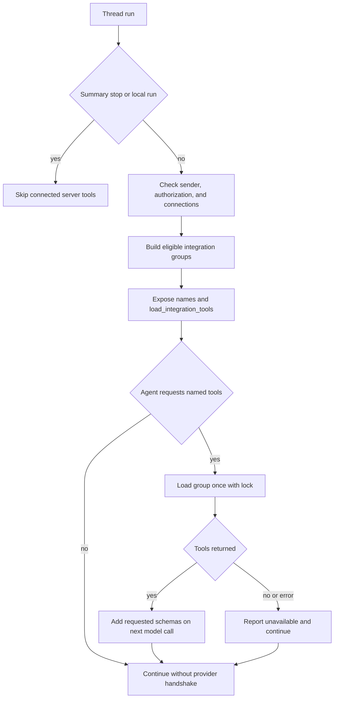

# Observability, MCP, browser, and connected tools

The agent treats connected capabilities as optional. Datadog, LangSmith run inspection, Currents, Notion, Corridor, and browser automation appear only when their configuration, credentials, and applicable authorization checks permit them. A missing connection, unreachable provider, or failed optional loader removes that capability rather than preventing the agent run from starting.

This page covers the integration boundary around the agent graph. See [tools](../concepts/tools.md) for the general tool model, [auth and security](../concepts/auth-and-security.md) for the trust model, [models, profiles, and instructions](../concepts/models-profiles-instructions.md) for model selection, and [configuration](../operations/configuration.md) for deployment settings.

## Execution and credential boundary

Most connected integrations execute in the LangGraph server process, not in the task sandbox:

- **Team-scoped:** Datadog MCP and LangSmith trace tools use team credentials.
- **Participant-scoped:** Currents, Notion, and an optional personal LangSmith connection use a named participant's credential at invocation time.
- **Deployment-scoped:** Corridor reads a bearer token from environment configuration.
- **Sandbox-local exception:** Stagehand executes inside the thread sandbox and uses a model API key available to that runtime rather than a persisted third-party integration secret.

Team Datadog and LangSmith credentials are encrypted using `agent.encryption` in the separate `team_credentials` Store namespace. Per-user Currents, LangSmith, and Notion records are in `user_credentials/<login>` and encrypted as applicable. Dashboard status endpoints return redacted connection metadata; the credentials-loading path decrypts only when it needs to decide whether to expose or call optional tools. Store lookup errors are deliberately fail-soft for that path, while ordinary dashboard reads surface failures.

## Dynamic catalog and authorization flow

`DynamicToolMiddleware` initially gives the model a catalog of available connected tool *names* and the `load_integration_tools` tool. It does not add the provider schemas to a model request until the agent explicitly loads them. The middleware validates requested names (including `Group:name` aliases), serializes a group build with a per-group lock, and remembers both successful and empty resolutions. A direct call before loading returns an instruction to load first; an unavailable loader becomes an error message telling the agent to continue without it. The loaded-name state is reset before each agent execution.

This flow shows that eligibility is decided before catalog exposure, while costly tool construction and MCP handshakes are deferred until requested.

The server preloads the concrete schemas for eligible Observability, Currents, Notion, and Browser groups through bounded cached loaders; Corridor is special because its static `analyzePlan` catalog can be registered without a handshake. Server loaders use stale-while-revalidate TTL caching and a timeout. Failures produce an empty group. Observability, Currents, and Notion are not considered for local or summary-stop runs, and Currents/Notion need a triggering GitHub login. Browser and Corridor are likewise omitted in those modes.

## Team observability

### Authorization tiers

Team logs, traces, and run inputs/outputs are attacker-influenceable content and may themselves contain prompt injection. The server therefore evaluates observability access for the user that triggered the current run, rather than trusting thread history. It accepts a configured admin identity (`CONFIGURED_ADMINS`) or an email in `OBSERVABILITY_AUTHORIZED_EMAILS`; it examines configured user email, Slack triggering email, the GitHub login, and an email resolved for that login.

The resulting grants are tiered:

- An authorized user can load **Datadog** and **LangSmith**; LangSmith may fall back to the team key.
- A member of an `ALLOWED_GITHUB_ORGS` organization can load LangSmith with the same team fallback, but not Datadog.
- Everyone else may receive LangSmith tools only if their own personal connection exists; no team fallback is permitted.

The authorization decision is intentionally recalculated per run because it reads run configuration. The relatively expensive allowed-org membership and tool/credential resolution are cached instead.

### Datadog MCP

A connected team Datadog record includes a validated site plus API and application keys. The supported-site allowlist is `datadoghq.com`, `us3.datadoghq.com`, `us5.datadoghq.com`, `datadoghq.eu`, `ap1.datadoghq.com`, and `ap2.datadoghq.com`. The agent derives the hosted MCP endpoint by using `mcp.<site>/api/unstable/mcp-server/mcp`, then creates a `MultiServerMCPClient` with `streamable_http`, `DD_API_KEY`, and `DD_APPLICATION_KEY` headers. It requests the `core` toolset unless `DATADOG_MCP_TOOLSETS` overrides it. No credentials or Datadog connection means no Datadog tools.

### LangSmith run tools

The read-only LangSmith surface consists of `langsmith_get_trace` and `langsmith_list_runs`. The former can retrieve one run and optionally children; the latter lists project runs with the requested limit clamped to 1–50. Each invocation resolves `on_behalf_of`, tries that verified participant's personal LangSmith credentials, and uses the team credential only if the group was created with `allow_team=True`. Provider and credential failures are returned as tool result errors rather than uncaught run failures.

This is distinct from **LangSmith LLM Gateway** routing. At model construction, a deployment default (`LANGSMITH_GATEWAY_ENABLED`) or authoritative `gateway_enabled` team value can route supported provider calls through the gateway. The gateway uses `LANGSMITH_GATEWAY_API_KEY` in preference to `LANGSMITH_API_KEY` and obtains real provider keys from LangSmith workspace Provider Secrets. Supported provider prefixes are `openai`, `anthropic`, `baseten`, `fireworks`, and `google_genai`; an unsupported provider or missing gateway key is logged and continues directly to the provider rather than failing a run.

## Hosted and REST integrations

### Corridor

Corridor is a deployment-configured security-analysis MCP. It is configured only when `CORRIDOR_API_TOKEN` is present, either directly or as a `token` or `api_key` query value on `CORRIDOR_MCP_URL`; query credentials are removed before the URL is used. The endpoint must be HTTPS at `app.corridor.dev/api/mcp`, otherwise it is rejected to avoid sending the bearer token to another host. The MCP client uses HTTP transport and an `Authorization: Bearer` header.

After the handshake, the loader filters the remote catalog to exactly `analyzePlan`. The dynamic catalog advertises only that static name, so registration can be lazy and defer the handshake until requested. When Corridor is enabled, the system prompt instructs the agent to call `analyzePlan` before generating code; if unavailable, it should say so once and continue rather than retrying or blocking work.

### Notion OAuth MCP

Notion uses the hosted `https://mcp.notion.com/mcp` `streamable_http` endpoint with a per-user OAuth bearer token. The OAuth implementation validates Notion HTTPS endpoints during discovery. `load_notion_tools(login)` uses the triggering user's valid token solely to discover the provider catalog; it then wraps every discovered tool, giving the resulting definitions a stable schema across participants.

The wrapper adds required `on_behalf_of`. At invocation it verifies the named participant, retrieves a current access token (refreshing an expired token under a per-login lock where possible), rebuilds the named MCP tool with that token, and invokes it without forwarding `on_behalf_of` to Notion. If the user lacks a usable connection or the provider no longer supplies the named tool, the call fails with a reconnect/unavailable error.

### Currents

Currents is a server-side, read-only REST integration at `https://api.currents.dev/v1`. Its five tools list projects, get a run, find a matching completed run, list project runs, and retrieve a spec-execution instance. Each resolves `on_behalf_of`, reads that verified participant's encrypted Currents API key, and sends it as a bearer header. List limits are clamped to 1–50. The loader first checks whether the triggering login has a connection; a missing key suppresses the entire group, and operational errors become tool result errors.

### Participant invariant

Notion, Currents, and LangSmith do not permit the model to choose another user's credential. `resolve_participant` requires a nonempty `on_behalf_of` value that case-insensitively matches the triggering user's GitHub login and that login must also be a verified participant of the active thread. This means stable schemas do not weaken credential ownership: the acting participant is fixed by the run, not by model output.

## Stagehand browser tools

When enabled, `browser_navigate`, `browser_act`, `browser_observe`, `browser_extract`, and `browser_close` execute commands in the thread's sandbox. They can drive sandbox-local Chromium, including services on the sandbox's `localhost`. A request is JSON encoded, base64 encoded, and dispatched to `/opt/open-swe/stagehand_runtime.py` through `/tmp/open-swe-stagehand.sock`; the command health-checks and reuses a long-lived runtime or starts one if needed. A command failure or invalid response is converted to a structured tool error.

Stagehand is exposed only when `SANDBOX_TYPE` is `langsmith`, its configured model provider is `anthropic` or `openai`, and a usable key is found from `STAGEHAND_MODEL_API_KEY`, `MODEL_API_KEY`, or `ANTHROPIC_API_KEY`. The default model is `anthropic/claude-sonnet-4-5`; `STAGEHAND_MODEL` and `STAGEHAND_HEADLESS` control the model and headless behavior. Thus browser automation is conditional too: it is absent rather than partially configured when its sandbox or model requirements are not met.

## Operating and extending integrations

To add a server-side connected capability, make its loader return `[]` for absent credentials and provider failures, ensure credentials stay in the server-side encrypted Store or deployment configuration, and add it to an eligible integration group in `get_agent`. Prefer `IntegrationGroup` with a known static catalog when a network handshake can be deferred; otherwise use the eager-group path once eligibility has been checked. Reserve names against static and deep-agent tools, and preserve the `on_behalf_of`/`resolve_participant` pattern for personal credentials.

Focused coverage exists for dynamic loading and routing (`tests/middleware/test_dynamic_tools.py`), Corridor configuration and lazy registration (`tests/tools/test_corridor_mcp.py`), observability and Notion behavior (`tests/tools/test_observability_tools.py`), and Stagehand enablement and runtime dispatch (`tests/tools/test_stagehand_browser.py`).
