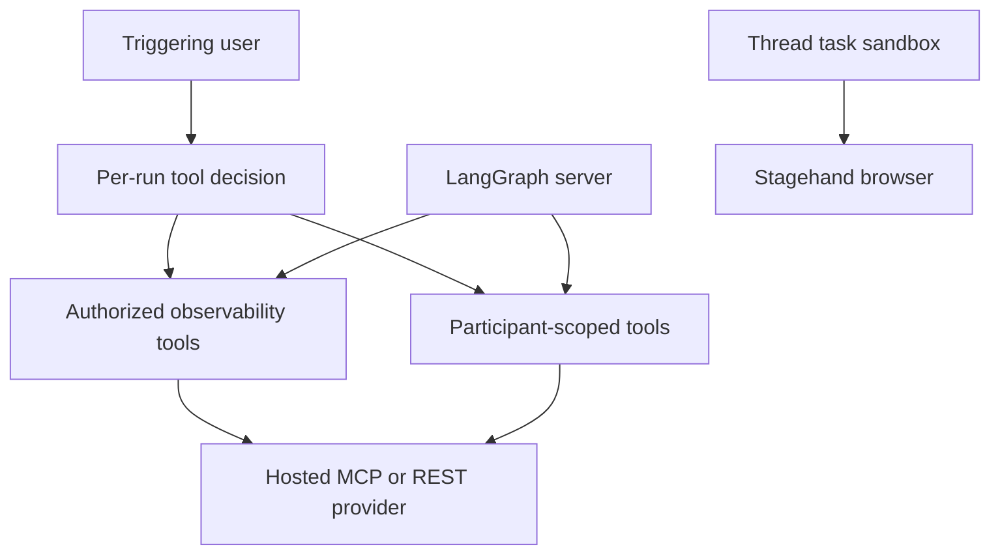

# Observability, MCP, and Connected Tools

The agent has two related but distinct LangSmith integrations. **Tracing** assigns graph executions to stable LangSmith projects. The optional **LLM Gateway** routes supported provider model calls through LangSmith. Separately, integration loaders add optional tools for observability, connected services, and browser automation. Tool loading is deliberately capability- and credential-aware: a missing connection or an unavailable provider removes optional tools rather than preventing an agent run.

See [Agent graph](../architecture/agent-graph.md) for graph construction, [Tools](../concepts/tools.md) for the general tool model, [Authentication and security](../concepts/auth-and-security.md) for the wider trust boundary, and [Configuration](../operations/configuration.md) for deployment settings.

## LangSmith tracing and LLM Gateway

`traced_graph_factory` wraps a graph factory and enters `langsmith.tracing_context` only while the yielded graph is used. Agent and chat graphs use the `open-swe-agent` project; analyzer and reviewer graphs use `open-swe-review`. This is tracing-project routing, not the read-only LangSmith tools described below.

The LLM Gateway is model transport rather than a tool. Team setting `gateway_enabled` is authoritative when set; otherwise `LANGSMITH_GATEWAY_ENABLED` supplies the deployment default. At graph construction, the resolved value is passed into `make_model`. When enabled, supported `openai`, `anthropic`, `baseten`, `fireworks`, and `google_genai` model IDs receive a provider-specific gateway base URL and a LangSmith credential, preferring `LANGSMITH_GATEWAY_API_KEY`, then `LANGSMITH_API_KEY_PROD`, then `LANGSMITH_API_KEY`. The gateway obtains the actual provider credential from workspace Provider Secrets and can enforce policy and trace calls. Unsupported providers or a missing LangSmith key are logged and continue directly to the provider instead of failing the run. `LANGSMITH_GATEWAY_BASE_URL` permits a regional or self-hosted gateway; routed OpenAI uses the Responses API by default and can be switched with `LANGSMITH_GATEWAY_OPENAI_USE_RESPONSES=false`.

## Credential and execution boundary

Server-side providers—Datadog, LangSmith tools, Corridor, Notion, and Currents—make hosted MCP or REST requests from the LangGraph server process. Their credentials are encrypted at rest and are not placed in the task sandbox. Team Datadog and LangSmith records live under the separate `team_credentials` Store namespace, rather than the plaintext team settings record; status APIs expose only connection metadata and key suffixes. Per-user Currents, LangSmith, and Notion records live beneath `user_credentials/<login>` and are encrypted too.

Server-hosted connections keep provider credentials outside the task sandbox; Stagehand is the sandbox-local exception.

Credential reads made solely to decide optional tool availability are fail-soft: Store or token-refresh failures return no credential, losing the optional integration but not the run. Dashboard status reads do not use that suppression. At the loader layer, server-side calls are behind stale-while-revalidate TTL caches and a per-load timeout; a timeout or exception similarly produces `[]`.

## Observability access: Datadog and LangSmith

Team observability content—logs, traces, run inputs, and outputs—is attacker-influenceable and can contain prompt injection. `_observability_authorized` therefore runs for each agent run rather than being cached. It accepts a configured admin or an email in `OBSERVABILITY_AUTHORIZED_EMAILS`, checking configured user email, Slack triggering email, the GitHub login, and the email resolved from that login. The expensive credential and allowed-organization lookups may be cached, but the per-run access decision is not.

The resulting grants are tiered:

- An explicitly authorized user receives Datadog plus LangSmith with team credential fallback.
- An active member of any `ALLOWED_GITHUB_ORGS` organization receives LangSmith with team fallback, but not Datadog.
- Anyone else can receive LangSmith only if their own connection exists; team fallback is disabled.

### Datadog hosted MCP

Datadog requires a team API-key/application-key pair. The dashboard normalizes the selected site and accepts only the supported Datadog sites; `DatadogCredentials.mcp_url` derives `https://mcp.<site>/api/unstable/mcp-server/mcp` and passes its toolsets query parameter. `load_datadog_tools` opens a `MultiServerMCPClient` with `streamable_http`, a 30-second timeout, and `DD_API_KEY` / `DD_APPLICATION_KEY` headers. The default `core` toolset is overridable through `DATADOG_MCP_TOOLSETS`. No credentials or failed MCP discovery means no Datadog tools.

### Read-only LangSmith tools

`load_langsmith_tools` exposes only `langsmith_get_trace` and `langsmith_list_runs`. The former retrieves one run and can load child runs; the latter lists project runs and clamps its limit to 1–50. Each invocation resolves `on_behalf_of` and fetches that participant's per-user credential first. It falls back to the team credential only when its `allow_team` loader option permits it. Provider/API failures are returned as a structured `{success: False, error: ...}` result rather than raising through the tool loop.

## Connected MCP and REST tools

### Corridor guardrail MCP

Corridor is deployment-configured, not user-connected. Its token comes from the first set of `CORRIDOR_API_TOKEN`, `CORRIDOR_MCP_TOKEN`, or `CORRIDOR_TOKEN`; a `token` or `api_key` query parameter is also accepted and removed from the connection URL. The URL defaults to `https://app.corridor.dev/api/mcp` and is accepted only when it is HTTPS at `app.corridor.dev` with that path. This pinning prevents sending the bearer token to a configured hostile endpoint.

After the MCP handshake, the loader filters the provider catalog to the single allowed `analyzePlan` tool. The server registers this static name as an `IntegrationGroup` only when configured, so `DynamicToolMiddleware` defers the handshake until the agent requests it rather than before its first model call. The prompt asks for `analyzePlan` before substantial security-sensitive code changes; if it is unavailable, the agent reports that once and continues without retrying.

### Notion MCP: fresh authorization per action

Notion uses `https://mcp.notion.com/mcp` over streamable HTTP with a per-user OAuth bearer token. Initial discovery uses the triggering login merely to obtain the catalog, which keeps tool schemas stable across thread participants. Each discovered tool is wrapped: `on_behalf_of` is required in its schema, then the wrapper resolves the named participant, retrieves a valid access token, rebuilds that specific MCP tool, and invokes it. An unavailable authorization raises a reconnect instruction instead of using the token from discovery. Stored access tokens are refreshed near expiry under a per-login lock; a refresh failure requiring reauthorization removes the dead Notion connection.

### Currents e2e investigation

Currents is a read-only REST surface over `https://api.currents.dev/v1`. Its five tools list projects, retrieve a run, find a matching run, list a project's runs, and retrieve a spec-execution instance. Calls resolve the named participant at execution time, use that person's encrypted Currents key as a bearer token, and bound list limits to 50. HTTP and credential errors become structured error results. A triggering login with no Currents key sees no Currents tool group.

### Participant invariant

`on_behalf_of` is not a general impersonation parameter. `resolve_participant` requires a nonempty login that equals the current run's triggering GitHub login and is verified as a participant in the active thread. This shared check protects Notion, Currents, and LangSmith from using one participant's connected account on behalf of another.

## Sandbox-local Stagehand browser

Stagehand is intentionally different: it executes browser operations in the current thread's task sandbox so it can drive sandbox-local Chromium, including services on sandbox `localhost`. A request is JSON/base64 encoded and executed through the sandbox backend. The command checks a Unix-socket runtime, starts the long-lived `/opt/open-swe/stagehand_runtime.py` server when necessary, then dispatches the operation with a 180-second execution timeout. The available operations are `browser_navigate`, `browser_act`, `browser_observe`, `browser_extract`, and `browser_close`.

Browser tools do not use a stored third-party integration secret. They are enabled only for `SANDBOX_TYPE=langsmith` and an available model key from `STAGEHAND_MODEL_API_KEY`, `MODEL_API_KEY`, or `ANTHROPIC_API_KEY`, with an `anthropic` or `openai` model provider. `STAGEHAND_MODEL` selects the model (default `anthropic/claude-sonnet-4-5`) and `STAGEHAND_HEADLESS` controls headless mode.

## Assembly lifecycle and tests

The agent builds dynamic groups for Observability, Currents, and Notion. Currents and Notion require a triggering profile login; all three are skipped for local/desktop and summary-stop runs. Browser tools are likewise excluded in those modes. Corridor is conditionally added as its lazy group. Dynamic loading avoids collisions with reserved and deep-agent tool names.

Focused tests document the intended failure and safety boundaries: `tests/tools/test_observability_tools.py` covers empty/degraded loaders, authorization tiers, rechecking authorization across runs, per-call Notion token refresh, and LangSmith limits; `tests/tools/test_corridor_mcp.py` covers token extraction, URL pinning, filtering, and deferred handshake; `tests/tools/test_currents_tools.py` verifies the catalog, response errors, parameters, and limit caps; and `tests/tools/test_stagehand_browser.py` checks sandbox dispatch and enablement constraints. Gateway routing, provider paths, credential precedence, and direct-provider fallback are covered in `tests/sandbox/test_gateway.py`.
