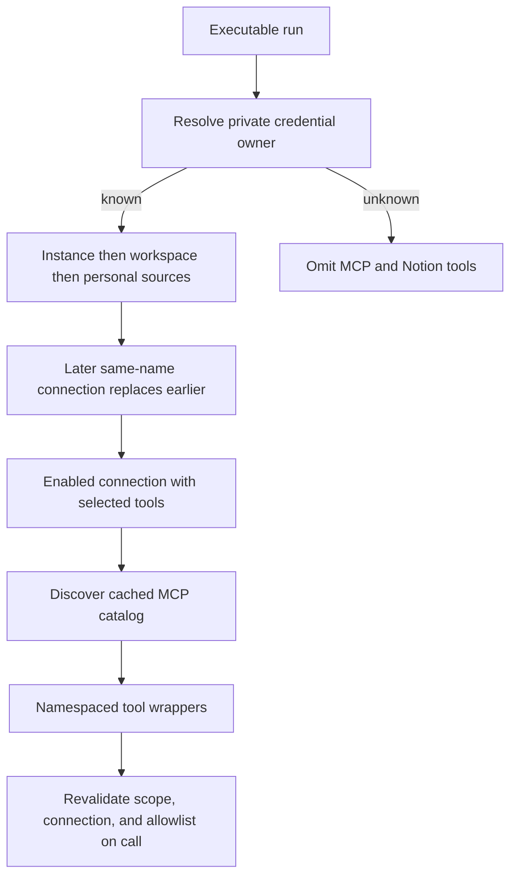
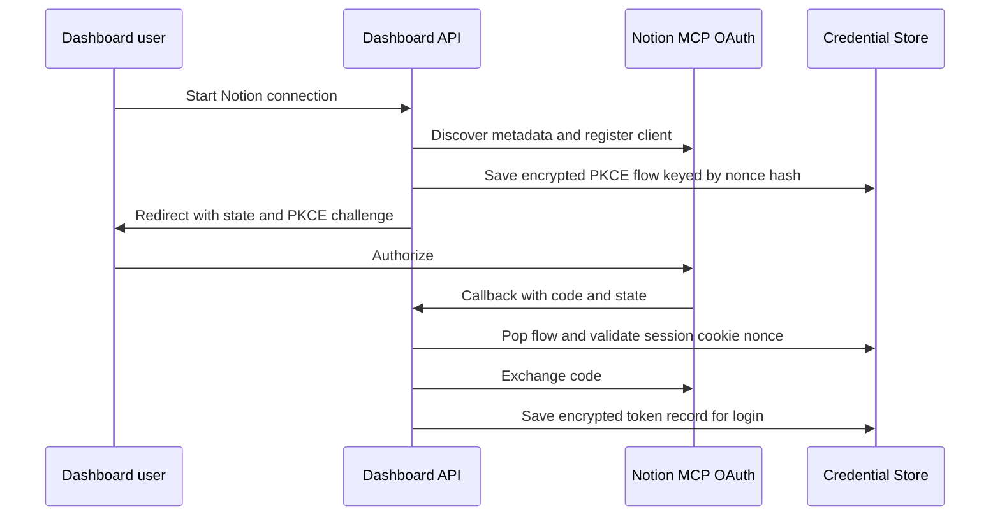

# MCP, Connected Tools, and Observability Integrations

OpenSWE's connected-tool surface has two distinct mechanisms. The generic MCP runtime lets administrators and users configure remote MCP servers at instance, workspace, or personal scope. Notion is a dedicated per-user OAuth integration to Notion's hosted MCP server. Both execute network calls from the agent process rather than copying provider credentials into a task sandbox. Separately, the optional LangSmith LLM Gateway is model-call routing, not an agent tool integration.

See [Agent graph](../architecture/agent-graph.md) for agent construction, [Authentication and security](../concepts/auth-and-security.md) for the broader trust model, [Tools](../concepts/tools.md) for dynamic availability, and [Configuration](../operations/configuration.md) for deployment settings.

## Connection scopes and loading

A generic MCP connection has a stable lowercase name, HTTPS endpoint, `streamable_http` or `sse` transport, enabled flag, selected `allowed_tools`, optional authentication headers, and optional OAuth client-credentials settings. A newly saved connection exposes no tools until an administrator or owner discovers the server's catalog and explicitly saves the desired names in `allowed_tools`.

Connections are stored in three ordered scopes:

1. **Instance** connections apply to every workspace.
2. **Workspace** connections apply to one normalized workspace slug.
3. **Personal** connections belong to one dashboard login and are available only when that person is eligible to provide private credentials for the run.

Later scopes replace an earlier connection with the same connection name *entirely*. This includes a disabled connection or one with an empty allowlist: it deliberately suppresses the lower-scope connection rather than falling back to it. The server builds the ordered sources as instance, workspace, then eligible user and loads them only for executable, non-local, non-summary runs after it can resolve the thread's credential scope. If the scope cannot be determined, it omits MCP and Notion tools rather than guessing.

This shows the load-time precedence and the call-time check that prevents a previously loaded tool from silently changing scope.

The catalog is discovered by initializing an MCP session and following pagination. Duplicate server tool names or a repeated cursor make that connection's discovery fail. A successful catalog is cached for 600 seconds using the source namespace, connection name, and record revision, so changing settings creates a new cache identity. One unavailable server produces no tools for that server without hiding the other configured servers; unavailable source data, however, produces no MCP tools at all so a failed higher-precedence lookup cannot accidentally reveal a lower-precedence connection.

Remote tool names are made deterministic and collision-resistant (`mcp_<connection>_<tool>_<hash>`). Discovery returns only allowlisted definitions, but wrappers also resolve the connection afresh when invoked. They reject a deleted or disabled connection, an allowlist removal, an endpoint/transport change, or resolution to a different scope; ordinary failures become a generic tool error without exposing provider or credential details.

### Dashboard ownership and stored secrets

Instance and workspace APIs require an administrator; personal endpoints use the authenticated dashboard session and are restricted to that user's records. Public connection representations include header names and OAuth metadata but not header values or client secrets. The header-reveal endpoint is separately protected and responds with `Cache-Control: no-store`.

Connection settings reject non-HTTPS URLs, embedded credentials, fragments, secret-like query parameters, invalid or duplicate headers, unsafe hop-by-hop headers, and unsupported transports. Headers and OAuth client secrets are encrypted with `agent.encryption` before Store persistence. Updating a connection may reuse a saved secret only from the same scope and only for the same destination; changing an authenticated server URL requires explicitly replacing or clearing headers, and changing OAuth endpoint or client ID requires a new client secret. OAuth cannot be combined with an `Authorization` header.

The generic transport is intentionally constrained even after validation: it disables environment proxy settings and redirects, requires every request to remain at the configured HTTPS origin, resolves and validates public DNS addresses, then pins the connection to a validated address while preserving the hostname for TLS. These constraints prevent an admin-configured connection or a redirect from delivering credentials to a private network or another origin.

### Client-credentials OAuth

A connection may use `client_credentials` OAuth with either `client_secret_post` or `client_secret_basic`. The runtime decrypts the saved secret only to request a bearer token, caches the auth object per source namespace, connection name, settings, and encrypted secret, and serializes refreshes with a lock. Tokens are renewed before expiry and a 401 triggers one forced refresh and retry. This cache identity prevents identical-looking personal connections owned by different users from sharing access tokens; rotating settings or a secret produces a new token cache entry. Token failures are reduced to safe operator-facing messages.

## Notion OAuth and hosted MCP tools

Notion uses the fixed hosted MCP endpoint `https://mcp.notion.com/mcp` over Streamable HTTP. The dashboard's connect route starts a short-lived OAuth flow: it discovers protected-resource and authorization-server metadata, validates that all discovered authorization, registration, and token URLs remain HTTPS on `mcp.notion.com`, dynamically registers the deployment as a public client, and generates a PKCE verifier/challenge plus state. The verifier and any dynamically issued client secret are encrypted in the pending flow record, which is consumed (read and deleted) during callback processing.

The browser callback validates signed state and a same-site, HTTP-only state nonce cookie before exchanging the authorization code. Desktop login uses a one-time loopback handoff: the browser carries the code back to the desktop app, whose existing dashboard session completes the exchange. Successful tokens are stored under `user_credentials/<login>/notion`; status returns only connection state, expiry, and update time. Disconnect deletes the record.

This shows the OAuth connection lifecycle; desktop callbacks use the same stored flow but hand the code to the already authenticated desktop session.

The token record contains an encrypted access token and, when supplied, refresh token and client secret. The credentials reader is deliberately fail-soft because it gates optional tools: an unavailable Store, corrupt record, or refresh failure removes Notion tools instead of failing the run. Expired or forced-refresh tokens are refreshed under a per-login lock. An `invalid_grant` refresh failure removes the dead connection, while a concurrent replacement token is preserved when detected.

At load time, `load_notion_tools` first establishes that the current run is a private thread started by its recorded owner. It then uses that owner's current token only to fetch the hosted MCP catalog. Each advertised definition is wrapped with a required `on_behalf_of` field. On every invocation the wrapper:

1. validates `on_behalf_of` through `resolve_participant`—it must match the triggering GitHub login and a verified participant of the active thread;
2. confirms that login remains the private credential owner;
3. obtains a current Notion token, rebuilds the named remote tool, and forwards the original arguments without `on_behalf_of`.

Therefore catalog discovery never grants a transferable Notion capability. A public thread, a run started by someone other than the private owner, an unavailable current authorization, or a tool removed by Notion cannot be used to act with another person's connection. The loader degrades to no tools when no connection or catalog is available; a call-time missing token asks the user to reconnect.

## LangSmith LLM Gateway

The LangSmith LLM Gateway is independent of MCP tool loading and Notion. `make_model` is the central routing point: when enabled, it asks the gateway helper for provider overrides and supplies a gateway base URL plus a LangSmith API key to the chat-model factory. The gateway then resolves actual provider credentials from LangSmith workspace Provider Secrets and can enforce policies and trace calls.

A workspace `gateway_enabled` setting overrides the deployment default. Otherwise `LANGSMITH_GATEWAY_ENABLED` controls the default; absent that explicit flag, setting `LANGSMITH_GATEWAY_API_KEY` enables gateway routing. `LANGSMITH_GATEWAY_BASE_URL` overrides `https://gateway.smith.langchain.com`, and a dedicated gateway key is preferred over `LANGSMITH_API_KEY` because a normal LangSmith key may lack `gateway:invoke` permission.

Only `openai`, `anthropic`, `baseten`, `fireworks`, and `google_genai` model prefixes have gateway routes. An unsupported provider or missing LangSmith key logs a warning and leaves the direct provider path intact rather than preventing model creation. Gateway-routed OpenAI uses the Responses API by default; `LANGSMITH_GATEWAY_OPENAI_USE_RESPONSES=false` is the compatibility escape hatch for Chat Completions.

## Operational behavior and focused tests

Generic MCP discovery and calls have 30-second timeouts. Agent-level Notion loading is additionally wrapped in a stale-while-revalidate cache with a 300-second TTL and a configurable loader timeout; exceptions and timeouts yield an empty optional tool list. The generic MCP runtime similarly fails soft per connection, while preserving a fail-closed boundary if a scope source cannot be read.

Focused tests verify scope replacement and fail-closed source loading in `tests/tools/test_mcp_sources.py`; encrypted persistence, redacted dashboard responses, validation, and authorization in `tests/dashboard/test_workspace_mcps.py` and `tests/dashboard/test_user_mcps.py`; catalog filtering, call-time revocation, and cache revision behavior in `tests/tools/test_workspace_mcp_tools.py`; OAuth renewal and secret redaction in `tests/tools/test_mcp_oauth.py`; transport address pinning and origin controls in `tests/tools/test_mcp_transport.py`; Notion wrapper refresh behavior in `tests/tools/test_notion_mcp_tools.py`; and instance/workspace persistence isolation and legacy adoption in `tests/mcp/`.
