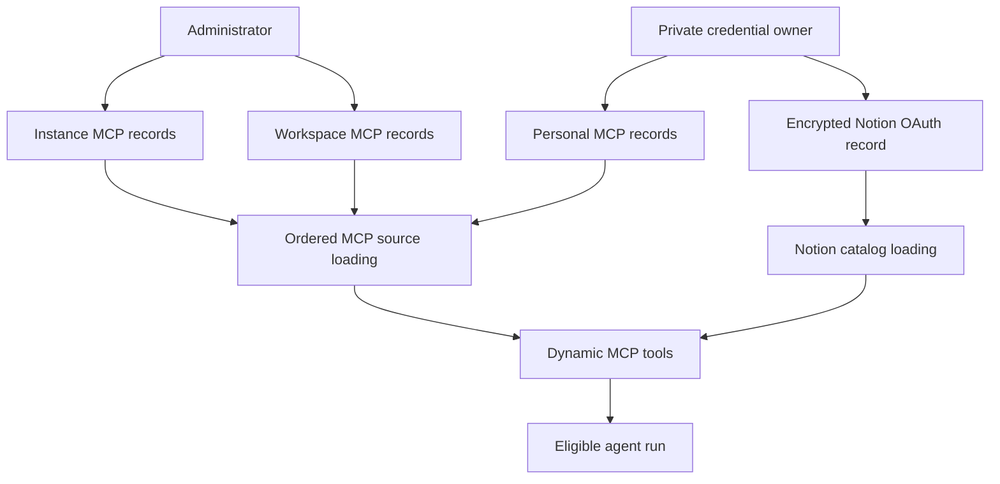

# MCP, Connected Services, and Observability

The current connected-service surface consists of administrator-configured and personal MCP connections plus a personal Notion MCP connection. These optional integrations are assembled by the agent factory alongside normal tools; a connection problem removes that integration rather than being a prerequisite for creating the agent. See [Authentication and security](../concepts/auth-and-security.md) for the wider trust model, [Tools](../concepts/tools.md) for dynamic tool availability, [Models, profiles, and instructions](../concepts/models-profiles-instructions.md) for model selection, and [Dashboard UI](dashboard-ui.md) for the dashboard boundary.

## Connection scopes and credential storage

An MCP connection has a stable short name, HTTPS URL, `streamable_http` or `sse` transport, enable flag, and an explicit `allowed_tools` allowlist. It can authenticate with stored request headers or OAuth client credentials, but not both with an `Authorization` header. The public representation deliberately contains only header names and OAuth configuration, never encrypted headers or the client secret.

Connections live in three Store-backed scopes:

| Scope | Namespace | Managed by | Run eligibility |
| --- | --- | --- | --- |
| Instance | `instance_mcps` | Dashboard admin | Inherited by every eligible run |
| Workspace | `workspace_mcps/<workspace>` | Dashboard admin | Available in that workspace |
| Personal | `user_mcps/<login>` | Signed-in user | Available only when the run has that verified private credential owner |

Secrets are encrypted through `agent.encryption` before persistence. Updating a connection may preserve its stored credential only from the same scope and same connection name. In particular, changing a header-authenticated connection's URL requires headers to be replaced or explicitly cleared, and changing an OAuth destination, token URL, or client ID requires a new client secret. This prevents silently forwarding a saved secret to a new endpoint.

This shows the credential-to-tool-loading boundary: configuration records are loaded server-side; the agent receives only dynamic tool definitions and invokes a freshly validated connection.

### Scope precedence and lifecycle

`build_agent` first determines the thread's private credential owner. For a non-desktop, non-summary run with a known credential scope, it loads MCP and Notion tools concurrently. MCP sources are ordered instance, workspace, then personal; a later source replaces an earlier connection with the same name entirely. Thus a disabled personal override—or one with an empty allowlist—intentionally suppresses, rather than falls back to, a same-named workspace or instance connection.

Catalog discovery is cached for 600 seconds by source namespace, connection name, and connection revision. The namespace in that key prevents users or workspaces that happen to have an identical revision from sharing a catalog. If any source cannot be listed, MCP loading returns no tools: it does not expose a lower-precedence scope whose overriding scope could not be checked. Individual discovery failures are likewise fail-soft for that connection.

The wrappers retain the URL, transport, selected source namespace, and remote tool definition discovered at load time. Each invocation resolves the connection again and rejects it if its scope, URL, transport, enable state, or allowlist changed; the user must start a new run. This avoids a long-running agent using a tool under a newly changed configuration or silently crossing scopes.

## MCP administration and network boundary

Dashboard routes expose list, save, delete, header-reveal, and discovery operations for instance, workspace, and personal connections. Instance and workspace routes require the admin dependency; personal routes derive the owner from the authenticated session. Header reveal is served with `Cache-Control: no-store`. Discovery may validate a draft and retrieve its catalog, but does not save the draft.

Input validation is intentionally restrictive:

- URLs and OAuth token URLs must be HTTPS, without embedded credentials, fragments, whitespace/control characters, or secret-like query parameter names.
- Connection names are lowercase, bounded identifiers; only Streamable HTTP and SSE transports are accepted.
- Header names and values are bounded and validated; hop-by-hop, `Host`, and proxy authorization headers are blocked.
- The server exposes only tools explicitly selected in `allowed_tools`, even if the remote catalog advertises more.

The custom HTTP transport protects server-side credentials when communicating with a configured MCP server. It disables proxy environment trust and redirects, requires every request to remain at the configured HTTPS origin, resolves and validates public addresses, and pins the checked IP while retaining the original `Host` header and TLS SNI hostname. If a connection attempt fails, it can try another validated address; it cannot follow a redirect or DNS change to another or private origin.

## OAuth client credentials

For a connection configured with OAuth, the server decrypts the client secret only while requesting a token through the same protected transport. It supports the `client_credentials` grant with either `client_secret_post` or `client_secret_basic`, accepts only a valid bearer token, and caches the auth object by connection scope, settings, and encrypted secret. Tokens are refreshed before expiry; a `401` retries once with a replacement token. Scope-aware cache keys mean identical credentials owned by different users or workspaces do not share a token.

Discovery and invocation both use a 30-second timeout. Failures are reduced to safe operational messages rather than remote response bodies or secret values. A failed tool call becomes `MCP call failed; check its connection and credentials`; administrators can use discovery to diagnose safe HTTP-status-specific guidance.

## Notion connected service

Notion is a separate personal integration backed by `https://mcp.notion.com/mcp` over Streamable HTTP. The dashboard's connect flow discovers protected-resource and authorization-server metadata only from `mcp.notion.com`, dynamically registers this deployment as an OAuth client, and uses PKCE (`S256`) plus a state nonce. The short-lived flow record contains encrypted verifier and, when supplied, client secret. The callback validates the state cookie before exchanging the authorization code and saving the connection.

The saved per-login record in `user_credentials/<login>` encrypts the access token, refresh token, and optional client secret. Status endpoints expose connection state, expiry, and update time—not tokens. Credential lookup is intentionally fail-soft because it gates an optional tool group. Expired credentials refresh under a per-login async lock; an `invalid_grant` refresh failure removes the stale connection so the user must reconnect.

`load_notion_tools` is stricter than a generic personal MCP source: it only accepts the current private credential owner. It uses that owner's current token to discover the catalog and returns no tools for a missing owner/token or a discovery error. Each advertised tool is a wrapper whose schema adds required `on_behalf_of`. On invocation, the wrapper resolves that participant and then verifies that the resolved login is still the private credential owner, retrieves a current token, rebuilds the named remote tool, and invokes it. A missing or expired authorization produces a reconnect error; a tool that disappeared from the remote catalog also fails rather than using a stale definition.

## Eligibility, operations, and verification

MCP and Notion groups are not loaded for desktop/local or summary-stop runs. They are also withheld when the factory cannot establish the thread's private credential scope; personal connections and Notion therefore cannot be selected merely from a caller-supplied login. These are run and credential-scope boundaries, not model-provider gates: this code does not make tool eligibility depend on the chosen LLM provider.

For operations, configure a connection with a minimal `allowed_tools` set, use discovery before saving a new endpoint, and rotate credentials by resaving headers or OAuth secret. Expect optional tools to disappear on Store, discovery, timeout, or provider failure; investigate server logs and the discovery endpoint rather than assuming the core agent failed.

Focused tests cover scope replacement and fail-closed lookup behavior, workspace sharding and legacy instance adoption, encrypted/redacted dashboard persistence, transport origin and public-address enforcement, OAuth token caching and redaction, and Notion wrapper refresh/failure behavior. Relevant suites include `tests/tools/test_mcp_sources.py`, `tests/tools/test_mcp_transport.py`, `tests/tools/test_mcp_oauth.py`, `tests/tools/test_notion_mcp_tools.py`, `tests/dashboard/test_workspace_mcps.py`, `tests/dashboard/test_user_mcps.py`, and `tests/mcp/`.
