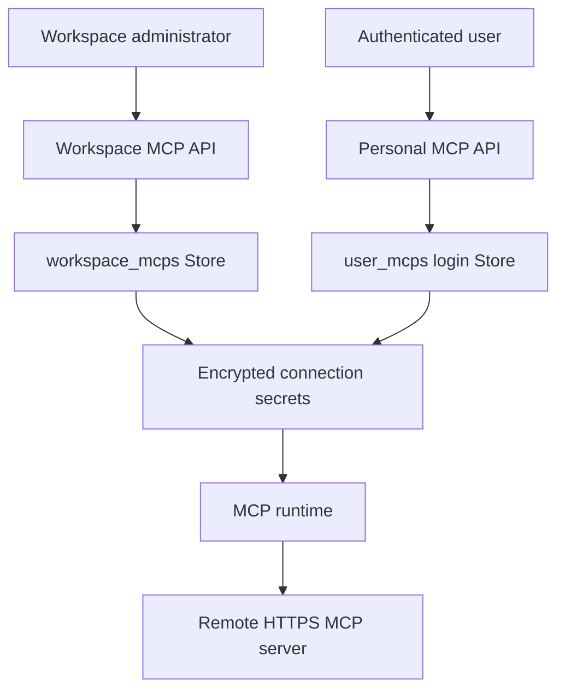
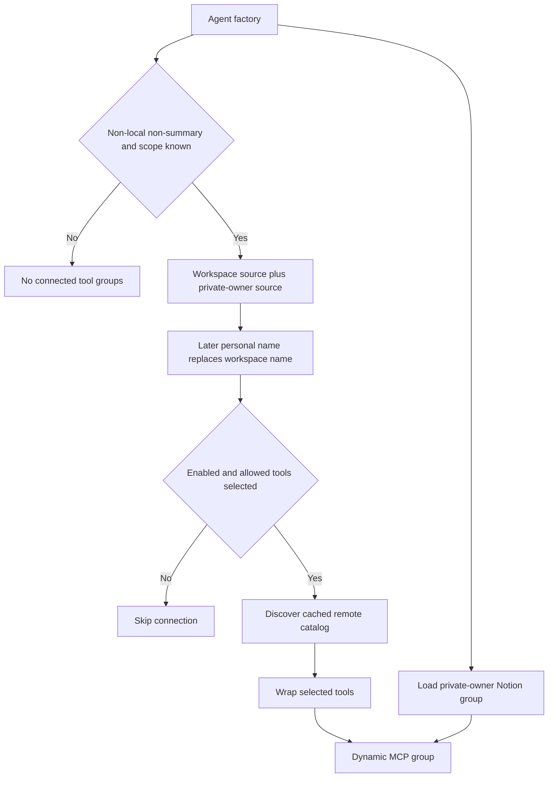

# MCP, Connected Tools, and Observability

Open SWE has three distinct connected-tool paths: administrator-managed workspace MCP connections, personal MCP connections usable only in an eligible private-owner run, and the built-in personal Notion MCP connection. All remote MCP traffic originates in the server process; credentials are encrypted in the Store and are not placed into the task sandbox. The agent graph treats these as optional dynamic tool groups: connection, Store, discovery, or timeout failures remove the relevant tools rather than preventing an agent from being built.

This page covers connected services and product observability. See [Tools](../concepts/tools.md) for the general dynamic-tool model, [Authentication and security](../concepts/auth-and-security.md) for the trust model, [Agent graph](../architecture/agent-graph.md) for graph construction, and [Configuration](../operations/configuration.md) for deployment settings.

## Credential scopes and administration

### Generic MCP connections

A workspace connection is shared by the deployment and is managed through the admin-only `/dashboard/api/workspace-mcps` endpoints. A personal connection is managed by its authenticated owner through `/dashboard/api/my-mcps`; records live below `user_mcps/<lowercase-login>`. Both have the same connection shape: a stable connection name, HTTPS URL, `streamable_http` or SSE transport, enabled flag, selected `allowed_tools`, optional headers, and optional client-credentials OAuth settings. Dashboard list and save responses return only public connection fields, header names, and OAuth metadata—never header values or client secrets. The separately protected header-reveal endpoints return `Cache-Control: no-store`.

Secrets are encrypted using `agent.encryption`: headers are serialized into `encrypted_headers`, and an OAuth client secret into `encrypted_client_secret`. Updating a connection can retain its secret only within the same scope and compatible destination. In particular, changing a URL with existing headers requires explicitly replacing or clearing them; changing the MCP URL, OAuth token URL, or OAuth client ID requires a new client secret. OAuth cannot be combined with an `Authorization` header.

Connection input is deliberately narrow: names have a constrained lowercase format, URLs and token URLs must be HTTPS and cannot include userinfo, fragments, whitespace, or secret-like query parameters, and only safe, non-duplicate header names and printable values are accepted. Validation errors are rewritten by the route class so rejected submitted secrets do not appear in API error detail.

Workspace and personal scopes persist encrypted connection secrets separately; the runtime decrypts them only to make server-side provider requests.

### Private ownership is the personal-credential boundary

The server derives `credential_login` from saved thread metadata before loading personal integrations. Public threads return no personal credential login. A private thread must have a valid owner login and the triggering run's GitHub login must match that owner; unknown visibility or ownership metadata fails closed. Desktop runs do not resolve this scope. Consequently, built-in Notion and user MCP connections are not a way for one thread participant to use another participant's connection.

Workspace MCP connections do not depend on a personal login. When both scopes provide a connection with the same name, the personal record entirely replaces the workspace record, including when it is disabled or has no allowed tools; the runtime must not fall back to the workspace version.

## MCP discovery, loading, and calls

Administrators and users can use a `discover` endpoint to inspect a connection's remote catalog before saving its `allowed_tools` selection. Discovery initializes an MCP session, follows paginated `tools/list` results, and rejects repeated cursors and duplicate remote tool names. A failed discovery returns a safe diagnostic, with tailored hints for common HTTP statuses, without exposing credentials.

At agent creation, non-desktop, non-summary runs concurrently load generic MCP tools and Notion tools only after credential scope resolution succeeds. Generic loading combines the workspace source and, if present, the private owner's source. Each enabled connection with a nonempty allowlist is discovered under a cache key containing scope namespace, connection name, and revision for 600 seconds. Tool names are prefixed and sanitized as `mcp_<connection>_<remote-name>` with a hash suffix, avoiding collisions with agent tools and other MCP tools.

This flow shows why tool availability is determined at graph construction, while every execution still rechecks the connection record.

A wrapped tool resolves the connection again for each call. It rejects a missing or disabled connection, a changed scope, URL, transport, or removed allowlist entry with a safe tool error; otherwise it creates a fresh adapter tool and enforces a 30-second call limit. Unexpected failures are logged without provider details and become `MCP call failed; check its connection and credentials`. A failed source listing returns no MCP tools as a whole, rather than silently exposing a lower-precedence connection.

Remote requests use a dedicated HTTPX transport. It disables environment proxy trust and redirects; permits requests only to the configured HTTPS origin; resolves and verifies that every address is public; then pins the chosen IP while preserving the Host header and TLS SNI hostname. This prevents an MCP server, redirect, or DNS rebinding from sending credentials to another origin or a private network address.

### OAuth client credentials

A generic connection may instead obtain bearer tokens with the OAuth `client_credentials` grant, using either `client_secret_post` or `client_secret_basic`. The auth object is cached by source namespace, connection name, OAuth settings, and encrypted secret, so different owners never share access tokens and secret rotation gets a new cache entry. It serializes token acquisition with a lock, refreshes before expiry, and retries a rejected bearer token once on HTTP 401. Token failures are converted to safe errors and token requests use the same pinned HTTPS transport.

## Notion MCP OAuth

Notion is a built-in personal MCP integration at `https://mcp.notion.com/mcp`, not a generic workspace connection. The dashboard exposes connection status and disconnect endpoints plus browser and desktop OAuth completion paths. Login discovers protected-resource and authorization-server metadata, dynamically registers an OAuth client, and starts authorization-code PKCE with an S256 challenge. Discovery, authorization, registration, and token endpoints are all required to be HTTPS on `mcp.notion.com`.

A pending flow is stored once under `notion_oauth_flows/<login>/<nonce-hash>` and contains encrypted PKCE verifier and, when issued, client secret. The browser callback verifies a signed state and an HTTP-only, SameSite Lax nonce cookie in constant time before it consumes the one-time flow and exchanges the code. Desktop browser completion instead transfers the code through the existing authenticated desktop handoff, then performs the exchange under that desktop session. OAuth and Store errors become HTTP errors appropriate to the caller; an expired or consumed flow requires retry.

The resulting per-user `user_credentials/<login>/notion` record encrypts access, refresh, and optional client-secret values. Status exposes only connection state and timestamps. Credential lookup on the tool-loading path is intentionally fail-soft: Store or refresh failure yields no Notion tools. A token approaching expiry is refreshed under a per-login async lock; if the provider reports `invalid_grant`, the implementation checks for a concurrent replacement, otherwise deletes the dead connection and requires reauthorization.

`load_notion_tools` first requires that its supplied login remains the private credential owner, then gets an access token and discovers the hosted catalog over streamable HTTP. It wraps the catalog definitions with a required `on_behalf_of` parameter. On invocation, the wrapper validates that participant and then independently verifies private ownership, obtains a current token, rediscovers the named tool, and invokes it. A catalog loaded with an old token therefore never grants continued use after disconnection or credential loss.

## Tracing and analytics

### Request tracing

The FastAPI application installs `TraceResourceNameMiddleware` before routes are included. When the hosting platform's Datadog instrumentation cannot resolve the mounted application's route, the middleware waits until routing has completed and assigns the current root span a resource such as `GET /dashboard/api/...`. It also assigns the resource while an exception unwinds, because the response-start hook is not reached for an externally generated 500. Non-HTTP scopes pass through and a tracing failure is debug logged rather than changing request behavior.

### Product analytics lifecycle

Product analytics is PostgreSQL-backed and is optional: it is enabled only when `POSTGRES_URI` is configured and migrations establish the persistent workspace ID. During application lifespan startup, the service migrates analytics tables, activates the reporting cutover once, and starts its worker; startup failure is logged but does not prevent the API from serving. Shutdown stops the worker and closes the database.

Event emitters create typed envelopes with opaque identifiers, deployment workspace ID, producer environment, entry point, and deterministic producer event IDs, then enqueue them transactionally in an outbox. Capture functions are fail-soft: disabled or failed analytics logs a warning and does not interrupt product operations, while cancellation is not swallowed. Agent construction records a run-start event when an invocation ID exists; completion records terminal token usage only after a start and only once.

The worker claims up to 50 due rows using `FOR UPDATE SKIP LOCKED`, allowing parallel workers without double claiming. It validates and ingests each event into an idempotent event store, projections, receipts, and dirty summary partitions, then acknowledges the outbox row. On failure it stores only the exception class, schedules exponential jittered retry, and dead-letters the row after `ANALYTICS_OUTBOX_MAX_ATTEMPTS` attempts. Each cycle also recomputes dirty summaries and enforces retention; it polls quickly after delivery and otherwise every five seconds.

Analytics report endpoints return 503 when analytics is unconfigured or database work fails. The authenticated usage endpoint and aggregate PR metric endpoint use their query-layer access controls, while readiness and outbox status are admin endpoints. Readiness reports configuration, query health, queue counts, workspace ID, collection and processing metadata, and whether pending or dead-lettered events exist.

## Operational guidance and verification

`TOOL_LOADER_TIMEOUT_SECONDS` defaults to five seconds and bounds the cached Notion loader; invalid or nonpositive values fall back to that default. Treat a missing MCP group as an optional-integration failure first: inspect Store availability, private-thread ownership, enabled status and selected allowlist, then discovery endpoint diagnostics. For generic MCPs, ensure the provider has a public HTTPS address and does not redirect to another origin.

Focused tests cover encrypted/redacted workspace storage and validation, source precedence and scope-change rejection, client-credentials refresh/redaction, public-address pinning, Notion wrapper refresh behavior, and analytics capture failure behavior. These tests are the key safety contracts when extending the connection model, changing credential scoping, or altering delivery semantics.
