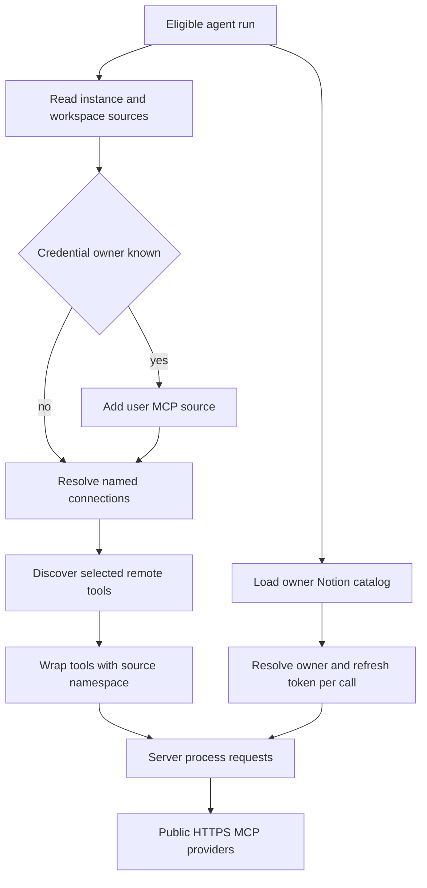

# MCP, Connected Tools, and Observability

Open SWE has two distinct connected-capability mechanisms. Generic MCP connections are configured at instance, workspace, or user scope and loaded into eligible agent runs. Notion is a separate, personal OAuth-backed hosted-MCP integration. Both perform provider requests in the server process, not in the task sandbox. LangSmith is also used independently for run tracing and, optionally, as an LLM Gateway; neither function makes it a generic MCP connection.

See [Tools](../concepts/tools.md) for the agent tool surface, [Authentication and security](../concepts/auth-and-security.md) for the broader trust model, [Agent graph](../architecture/agent-graph.md) for factory lifecycle context, and [Configuration](../operations/configuration.md) for deployment settings.

## Ownership and isolation boundaries

### Workspace-wide MCP configuration

Administrators manage **instance-wide** connections at `/mcps` and **workspace** connections at `/workspaces/{workspace}/mcps`; both route families require `ADMIN_DEP`. Instance connections are inherited by every workspace. Workspace connections are stored under `workspace_mcps/<workspace>`. A workspace MCP loader combines the instance and workspace sources, allowing the workspace record to replace an identically named instance connection.

A connection has a name, HTTPS server URL, `streamable_http` or `sse` transport, enabled flag, selected `allowed_tools`, optional authentication headers, and optional OAuth client-credentials settings. New connections expose no tools until an administrator discovers the remote catalog and explicitly selects tool names. Dashboard list/save responses use the public record: it includes header names but excludes encrypted header values and OAuth client secret. Header reveal is a separate no-store endpoint and is still admin-only.

Configuration validation is deliberately restrictive:

- URLs must be HTTPS and cannot contain embedded credentials, fragments, control/whitespace characters, or secret-like query parameters.
- Header names are validated, case-insensitively unique, limited to 20, and cannot override transport-sensitive headers such as `Host`, `Content-Length`, `Connection`, or `Proxy-Authorization`.
- OAuth is only the `client_credentials` grant. It cannot be combined with an `Authorization` header, and a changed OAuth configuration must supply a client secret.
- Authentication headers and OAuth client secrets are encrypted at rest with `agent.encryption`. Reusing saved credentials is limited to the prior record in the same scope; changing a URL without replacing or clearing headers is rejected.

### User-owned credentials

A dashboard user manages personal generic MCP connections through `/my-mcps`; records live under `user_mcps/<login>`. These are not workspace configuration and only join a run when the credential owner is known. The run factory combines generic sources in this order: **instance → workspace → user**. Later sources replace an entire same-named connection, including when the later record is disabled or has an empty allowlist—there is no fallback to an earlier credentialed connection.

Notion is personal as well, but it is not stored as a generic `MCPConnection`. Its OAuth tokens, refresh tokens, and any dynamic-client secret are encrypted in `user_credentials/<login>/notion`. The OAuth helper discovers protected-resource and authorization-server metadata, accepts only HTTPS endpoints on `mcp.notion.com`, registers the client, and uses PKCE. Token refresh is serialized per login; a reauthorization-required failure removes the unusable connection.

*Capability-loading flow: generic MCP sources are resolved by scope while Notion remains a separate personal OAuth capability; both execute from the server process.*

## Generic MCP lifecycle

The factory loads generic MCP and Notion tools concurrently only for non-local, non-summary runs with a known credential scope. Thus connected capabilities are optional: a local/desktop run, summary stop, or absent ownership does not attempt to load them.

For generic MCP, the runtime lists all configured sources before loading. It discards disabled records and records with no selected tools, discovers each remaining remote catalog with a 30-second deadline, then wraps only advertised tools included in `allowed_tools`. Discovery follows pagination but rejects repeated cursors and duplicate remote names. Its 600-second catalog cache key includes the source namespace, connection name, and record revision, so identical names or revisions owned by different users cannot share a catalog. A bad server only removes that server's tool group; unavailable source data removes the entire generic MCP surface rather than accidentally exposing a lower-precedence source.

Tool names are made stable and collision-resistant as `mcp_<connection>_<tool>_<hash>`. More importantly, a wrapper does not trust the load-time snapshot when invoked. It rereads the named connection from the original source, verifies that the source namespace, URL, transport, enabled status, and allowlist still match, then builds a fresh remote tool. Disabling, deleting, changing scope or endpoint, or removing the allowlist entry revokes already loaded tools. Errors are returned as handled tool failures with a generic connection/credentials message rather than provider detail.

Remote MCP traffic is constrained to the configured HTTPS origin. The transport does not follow redirects, uses no environment proxy settings, validates that DNS resolves only to public addresses, pins a validated address while preserving the hostname for TLS, and rejects an origin change. These checks apply to both MCP discovery/execution and OAuth token retrieval, preventing credentials from being redirected to a private or different host.

For a client-credentials connection, the runtime decrypts the secret only to request a bearer token, caches the auth object by source namespace, connection name, settings, and encrypted secret, refreshes before expiry, and retries once after a 401 with a new token. This prevents token reuse across owners and makes a rotated secret select a new cache entry.

## Hosted Notion MCP

`load_notion_tools(login)` first establishes that `login` is the private credential owner and has a usable token, then obtains the hosted `https://mcp.notion.com/mcp` catalog over `streamable_http`. It wraps every discovered tool with a required `on_behalf_of` parameter. The initial catalog load only exposes schemas; it is not a durable authorization grant.

At each tool call, the wrapper resolves `on_behalf_of` and independently verifies the private owner again, obtains a current token, reconnects to find the named tool, and invokes it with `on_behalf_of` removed from the provider payload. A missing current authorization instructs the user to reconnect; a removed remote tool fails explicitly. This freshness check prevents a catalog loaded under an earlier token or owner context from becoming a reusable credential capability.

## Model gateway and tracing

The LangSmith LLM Gateway is a model-routing layer, not an MCP provider. `make_model` applies it centrally after the run factory resolves the workspace setting. `gateway_enabled=True` or `False` is authoritative at the workspace level; `None` inherits the deployment default. That default is controlled by `LANGSMITH_GATEWAY_ENABLED`, or becomes enabled when `LANGSMITH_GATEWAY_API_KEY` is present. Gateway calls prefer `LANGSMITH_GATEWAY_API_KEY` and fall back to `LANGSMITH_API_KEY`; the gateway-specific key is intended to carry `gateway:invoke` permission.

When enabled, supported `openai`, `anthropic`, `baseten`, `fireworks`, and `google_genai` model IDs receive a gateway base URL and LangSmith API key. The base host defaults to `https://gateway.smith.langchain.com` and can be changed with `LANGSMITH_GATEWAY_BASE_URL`. Unsupported providers and missing gateway credentials log a warning and continue directly to the provider rather than preventing model construction. Gateway-routed OpenAI keeps the Responses API by default; set `LANGSMITH_GATEWAY_OPENAI_USE_RESPONSES=false` only for a deployment that must use Chat Completions.

Tracing is independently configured through `LANGSMITH_TRACING`, `LANGSMITH_API_KEY`, `LANGSMITH_ENDPOINT`, and `LANGSMITH_PROJECT`. `LANGSMITH_PROJECT` defaults to `default` (with `LANGCHAIN_PROJECT` as its legacy alias) and is the project used by the SDK, trace links, cost lookups, and feedback. Trace-link creation is best effort: it resolves tenant and project IDs and returns no link if unavailable. Separately, dashboard HTTP middleware renames the active Datadog root span after routing to `METHOD route-path`, including error paths, so APM can group and alert by route instead of a single mounted-server resource.

## Operational checks and focused tests

When diagnosing an MCP issue, first verify scope ownership and the selected allowlist, then use the appropriate discover endpoint. Discovery returns safe, actionable failures for authentication, permissions, URL, rate-limit, and timeout cases; run-time calls intentionally remain generic. Rotate credentials by saving replacement headers or OAuth secret in the owning scope; a new record revision invalidates catalog reuse, and existing wrappers revalidate before their next invocation.

Focused tests cover source precedence and no-fallback behavior in `tests/tools/test_mcp_sources.py`; OAuth token reuse, rotation, retry, and secret redaction in `tests/tools/test_mcp_oauth.py`; public-origin pinning and redirect/private-address blocking in `tests/tools/test_mcp_transport.py`; generic tool allowlisting, revocation, caching, and error isolation in `tests/tools/test_workspace_mcp_tools.py`; and Notion wrapper schemas and per-call token refresh in `tests/tools/test_notion_mcp_tools.py`.
