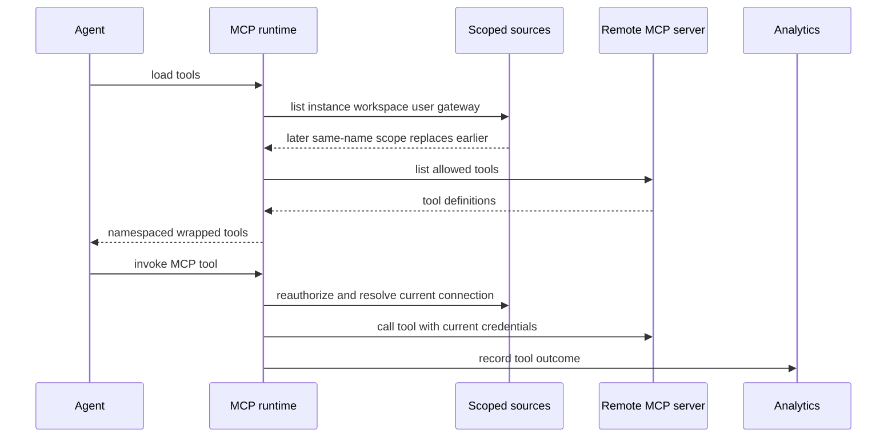

# MCP, model gateway, and observability integrations

Open SWE has three distinct integration paths:

- **Configured MCP connections** add administrator-, workspace-, or user-scoped remote tools to agent runs.
- **LangSmith Managed Tools (LMT)** lets a workspace select a curated LangSmith gateway while each person authorizes and uses their own provider connections.
- **Observability** comprises LangSmith LLM Gateway model routing, Datadog APM resource naming, product analytics, and audit logs. These paths have different data stores and failure contracts; none is a general-purpose remote-tool credential channel.

See [Authentication and security](../concepts/auth-and-security.md), [Tools](../concepts/tools.md), [Models, profiles, and instructions](../concepts/models-profiles-instructions.md), and [Configuration](../operations/configuration.md) for the surrounding policies.

## Configured MCP connections

### Scopes, precedence, and ownership

An administrator can configure MCP connections at **instance** and **workspace** scope, while an authenticated dashboard user can configure a personal connection. Agent runs combine them in this order: instance, workspace, personal, then (when selected) the managed-tools gateway. A connection with the same name in a later scope replaces the earlier connection completely. A personal source is authorized again at invocation time and requires the private thread owner; it cannot be used from a public thread or by a different participant.

Connections are stored with a scope-specific namespace. The user identity is normalized in the namespace, and a discovery/cache key includes the source namespace, connection name, and revision. This isolates catalogs and OAuth tokens across owners and invalidates a cached catalog when a connection is saved again.

```mermaid
sequenceDiagram
  participant Agent
  participant Runtime as MCP runtime
  participant Sources as Scoped sources
  participant Remote as Remote MCP server
  participant Analytics

  Agent->>Runtime: load tools
  Runtime->>Sources: list instance workspace user gateway
  Sources-->>Runtime: later same-name scope replaces earlier
  Runtime->>Remote: list allowed tools
  Remote-->>Runtime: tool definitions
  Runtime-->>Agent: namespaced wrapped tools
  Agent->>Runtime: invoke MCP tool
  Runtime->>Sources: reauthorize and resolve current connection
  Runtime->>Remote: call tool with current credentials
  Runtime->>Analytics: record tool outcome
```

This shows catalog discovery followed by a fresh, authorized connection lookup before execution; discovery does not grant a durable capability.

### Connection configuration and credential handling

A connection has an HTTPS URL, either `streamable_http` or `sse` transport, an enabled flag, and an explicit `allowed_tools` allowlist. A connection that has no allowed tools offers no tools. URLs reject embedded credentials, fragments, whitespace/control characters, and secret-looking query parameters; authentication belongs in headers or client-credentials OAuth. Header validation rejects hop-by-hop and proxy authorization headers, duplicate names, and unsafe values. Dashboard list responses expose header names but not values; the separately audited reveal endpoint returns decrypted headers with `Cache-Control: no-store`.

Headers and an OAuth client secret are encrypted at rest. Updating a connection can reuse saved credentials only from the same scope; changing the server URL without replacing or clearing existing headers is rejected. OAuth uses the `client_credentials` grant with either client-secret-post or basic authentication. Its in-memory token cache is keyed by scope, connection name, settings, and encrypted secret; it refreshes before expiry and retries one request once after a `401`.

The dashboard offers a discovery endpoint that lists descriptions but does not execute tools. Discovery has a 30-second bound and turns transport, protocol, authentication, and HTTP errors into safe diagnostics that do not echo request secrets. Tool catalogs use stale-while-revalidate caching for 10 minutes fresh and at most 24 hours old. A catalog failure drops that connection's tools rather than failing the run.

At execution, each wrapper verifies that the connection still exists, is enabled, belongs to the scope it was discovered from, has unchanged URL/transport, and still allows the named remote tool. It then builds a fresh MCP client, applies a 30-second call timeout, and converts unexpected failures to a `ToolException`. Remote tool names are prefixed and sanitized with a hash suffix to avoid collisions. Each call records an MCP-tool analytics outcome, including whether it failed.

### Dashboard and external MCP entrypoints

The dashboard exposes separate admin routes for instance and workspace connections and session routes for personal connections. Saves, deletes, and credential-reveal operations are audit-marked; discovery is read-only. The external Open SWE MCP server uses the caller's GitHub identity, rejects unauthorized accounts, exposes opted-in local tools according to session/admin access, and adds instance, default-workspace, and caller-owned personal MCP tools. It invokes them through the same tool-node path as a private thread.

## LangSmith Managed Tools

LMT is deliberately not a set of provider keys stored by Open SWE. A workspace administrator selects one LangSmith gateway, which is a curated tool set served from one MCP URL. A user connects LangSmith through OAuth 2.1 as a confidential, organization-registered client with PKCE; encrypted access and refresh tokens live in PostgreSQL keyed by immutable Open SWE user ID rather than mutable GitHub login. OAuth discovery and saved token endpoints must remain on the configured LangSmith origin. Tokens refresh under a per-user/provider guard; a revoked or unrefreshable grant is deleted and requires reconnection.

For a private thread, Open SWE retrieves the owner's current LangSmith token and sends it only as a bearer header to that gateway. LangSmith owns the downstream provider grants, API secrets, and consent links, and proxies the tool calls. Those credentials and the LangSmith token are neither tool arguments nor sandbox material. The managed source is available only to the private thread owner and is reauthorized on every invocation.

A gateway may return HTTP `428` with the services that person must connect. OAuth services can produce an HTTPS, single-use consent link; secret-backed services must be configured in LangSmith. Open SWE polls a consent session with long polling until it completes, fails, or expires. Missing LangSmith connection, token-refresh outage, or an unreachable managed gateway removes only the managed gateway from the tool set; configured instance/workspace MCP tools remain available.

## LangSmith LLM Gateway

The LLM Gateway is separate from LMT and MCP. `make_model` centrally applies it when enabled, routing supported provider SDK calls through the LangSmith gateway. The gateway authenticates with `LANGSMITH_GATEWAY_API_KEY` in preference to `LANGSMITH_API_KEY`; LangSmith resolves the real provider secret from workspace Provider Secrets and can enforce spend, PII, and secret policies while tracing calls.

A workspace `gateway_enabled` value overrides the deployment default. Otherwise, `LANGSMITH_GATEWAY_ENABLED` controls routing, or a configured dedicated gateway key enables it by default. `LANGSMITH_GATEWAY_BASE_URL` permits a regional or self-hosted gateway. Supported prefixes are `openai`, `anthropic`, `baseten`, `fireworks`, and `google_genai`. Unsupported providers, missing LangSmith credentials, and gateway non-applicability log a warning and retain direct provider routing instead of failing model construction. Gateway-routed OpenAI defaults to the Responses API; `LANGSMITH_GATEWAY_OPENAI_USE_RESPONSES=false` forces Chat Completions when needed.

## Operational telemetry and audit paths

### Datadog tracing

At app construction, Open SWE sets `DD_ENV` from `OPENSWE_ENV` and updates `ddtrace` configuration when available. A request middleware renames the current root APM span after routing to `METHOD route-path`. It does so both at response start and while unwinding an exception, addressing the platform tracer's otherwise generic dashboard resource name. If Datadog tracing is not installed or span naming fails, the app continues and logs only diagnostic information.

### Product analytics

Lifecycle emitters construct typed, versioned analytics events with opaque identifiers for runs, threads, people, repositories, and models. They queue events in a PostgreSQL outbox and are fail-soft, so an analytics problem does not interrupt the product transition that produced the event. The outbox insert is deduplicated by event ID. A background worker claims pending or abandoned deliveries with row locks, ingests events idempotently, recomputes dirty summaries, and enforces retention. Failures retry with exponential jitter; after `ANALYTICS_OUTBOX_MAX_ATTEMPTS` attempts, an event is dead-lettered rather than retried indefinitely.

Ingestion deduplicates event IDs, records an event and receipt, updates projections, and marks affected summaries dirty within a transaction. Admins can inspect readiness and outbox status; usage and PR analytics report `503` when the database/report path is unavailable rather than returning partial results. Dashboard page-view telemetry is separately sent through the usage/Segment path.

### Audit logs

Audit logging is an append-only PostgreSQL trail for selected durable or security-sensitive dashboard mutations and selected tool mutations. The HTTP middleware considers only write methods, records route metadata and authenticated actor context for endpoints explicitly marked with `@audit_endpoint`, and never records request payloads. It captures success from the response status, including failures. Tool auditing similarly retains operation and outcome, actor/workspace/thread/sandbox context when available, but not arguments or returned values.

Audit persistence is intentionally best-effort: if PostgreSQL is unconfigured, or the write exceeds a three-second shielded limit or fails, the operation still completes and the failure is logged. Installation administrators can query logs read-only using a keyset cursor, filters, and a maximum 31-day time range. This means audit history is useful operational evidence, not a transactional prerequisite for a mutation.

## Failure boundaries and verification

The key boundary is that optional integration degradation narrows the catalog rather than broadening access or aborting unrelated work. A source-list failure returns no MCP tools so a lower-precedence scope is not accidentally exposed; a changed connection requires a new run; and scoped authorization is repeated before remote invocation. Managed-tools outages are isolated to that source. Analytics and audit writes are fail-soft by design, while dashboard reports surface database unavailability explicitly.

Focused tests cover catalog invalidation and stale refresh, secret-safe discovery failures, scoped source behavior, OAuth retry/caching, instance/workspace/user connection behavior, managed-gateway private-owner enforcement and outage isolation, analytics emission, and audit secret exclusion and outcome recording.
