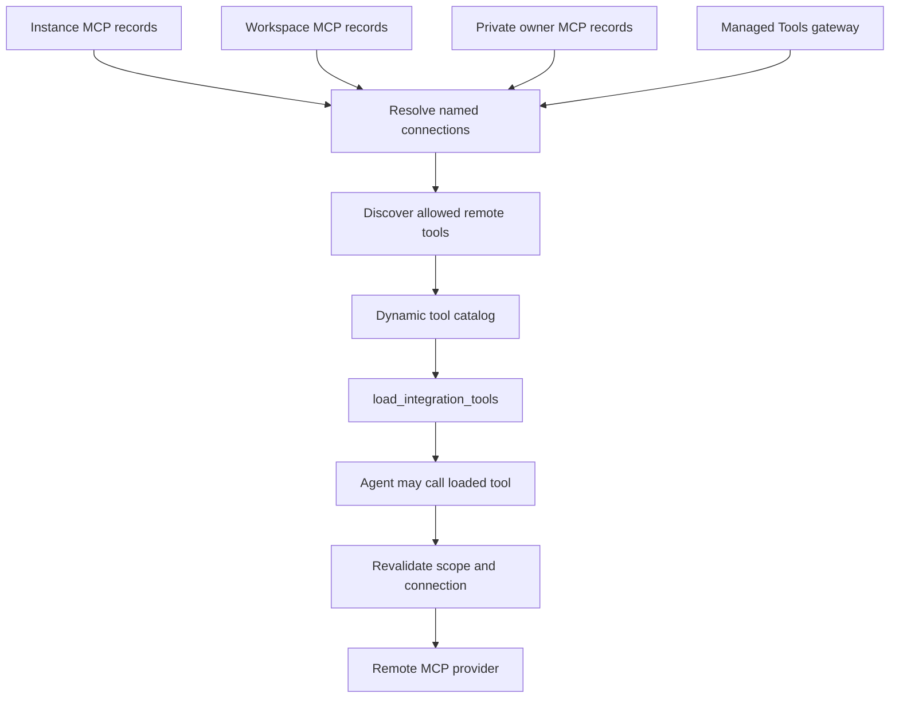

# MCP, External Tools, and Observability Integrations

Open SWE treats external tools as optional, server-mediated integrations. Configured MCP connections contribute tools to an agent only after discovery and explicit dynamic loading; a broken optional connection removes that surface rather than making the agent unavailable. Credentials remain in server-side stores or the provider gateway, not in the task sandbox.

See [Tools](../concepts/tools.md) for the agent tool model, [Authentication and security](../concepts/auth-and-security.md) for the broader trust boundary, [Agent graph](../architecture/agent-graph.md) for agent construction, and [Configuration](../operations/configuration.md) for deployment settings.

## MCP scopes and precedence

An MCP connection has a lowercase connection name, HTTPS server URL, `streamable_http` or `sse` transport, enabled flag, authentication configuration, and an explicit `allowed_tools` allowlist. A new connection offers no tools until its administrator discovers the remote catalog and selects names. The public dashboard representation contains header names and OAuth settings, never encrypted header values or client secrets.

Connections are stored in three ordinary scopes:

| Scope | Owner and storage | Availability |
| --- | --- | --- |
| Instance | Instance administrators; `instance_mcps` | Base tier inherited by every workspace and run |
| Workspace | Workspace administrators; `workspace_mcps/<workspace>` | Applies to runs in that workspace |
| User | A dashboard user; `user_mcps/<login>` | Only the private-thread owner who started the run |

The runtime resolves tiers in that order, with a later same-named connection replacing the whole earlier connection. This includes a disabled or empty-allowlist override: it deliberately suppresses the inherited connection rather than falling back to it. Catalog cache keys include source namespace, connection name, and revision, isolating owners and invalidating a catalog when settings change.

```mermaid
flowchart TD
  I["Instance MCP records"] --> R["Resolve named connections"]
  W["Workspace MCP records"] --> R
  U["Private owner MCP records"] --> R
  M["Managed Tools gateway"] --> R
  R --> C["Discover allowed remote tools"]
  C --> D["Dynamic tool catalog"]
  D --> L["load_integration_tools"]
  L --> A["Agent may call loaded tool"]
  A --> V["Revalidate scope and connection"]
  V --> P["Remote MCP provider"]
```

This flow shows precedence at discovery time and authorization/configuration revalidation at invocation time.

## Credential delivery and safeguards

Connection URLs must be HTTPS, without embedded credentials, fragments, or secret-looking query parameters. Header names and values are validated; hop-by-hop and `Host`/proxy authorization headers are blocked. Headers and OAuth client secrets are encrypted at rest. Updating a URL cannot silently retain headers from the old host, and OAuth cannot be combined with an `Authorization` header.

A connection can use static encrypted headers or OAuth 2.0 `client_credentials`. For OAuth, Open SWE decrypts the stored client secret only while obtaining a bearer token, caches the token per connection namespace/settings, refreshes it before expiry, and retries once on a `401` with a replacement token. Token requests use either `client_secret_post` or `client_secret_basic`. The transport applies its safe HTTP client to both token and MCP endpoints, so a blocked private endpoint or redirect is reached before credentials are delivered. Error messages are redacted rather than echoing provider responses or submitted secrets.

Discovery initializes an MCP session and walks its paginated catalog, rejecting repeated cursors and duplicate remote names. It has a 30-second timeout; catalog entries are served through stale-while-revalidate caching for 10 minutes and can remain usable for up to 24 hours. A discovery failure removes tools from that connection while preserving tools from other connections. If scope settings themselves cannot be read, loading returns no MCP tools—rather than exposing a lower-precedence tier.

Each generated LangChain tool has a bounded, namespaced-and-hashed local name (`mcp_<connection>_<tool>_…`) and preserves the remote tool name in metadata. On every call it resolves the connection again and rejects disabled/deleted connections, allowlist revocation, URL/transport changes, or a connection that has moved to a different scope. Remote failure becomes a generic tool error. This makes an already loaded schema non-authoritative for access.

## Private credentials and LangSmith Managed Tools

Personal MCPs are not a participant selector. `private_credential_login` reads saved thread metadata and permits personal credentials only for a private thread whose owner matches the authenticated run starter. Public threads return no personal credential login; system threads cannot use private credentials. The user MCP source repeats this authorization at invocation, so changing a thread from private to shared revokes a tool that was already loaded.

A workspace may additionally select one LangSmith Managed Tools (LMT) gateway. LMT is a curated gateway of tools across providers, but it is loaded with the private owner's **own** LangSmith access token. LangSmith owns the provider grants and proxies calls; provider tokens, consent links, and the LangSmith token never become agent arguments or sandbox secrets. The managed source follows user MCPs, so it is the final precedence tier.

Open SWE's LangSmith connection is an OAuth 2.1 confidential-client flow with PKCE. Encrypted per-person tokens are stored in PostgreSQL keyed by immutable user ID rather than a mutable GitHub login, and refreshed under a per-provider/login guard to prevent concurrent refresh-token reuse. An unavailable or unlinked LangSmith account skips only the managed gateway.

A managed gateway may return HTTP 428 listing provider credentials that person still needs. OAuth-backed services yield person-specific HTTPS consent links; API-key services must be configured in LangSmith. Consent status is long-polled with a deadline and a minimum pause rather than busy-polled. The gateway is usable only once its required services are connected.

## Dynamic loading into the agent

Agent construction loads the applicable MCP wrappers, then installs them as the `MCPs` group in `DynamicToolMiddleware`. The model initially sees `load_integration_tools` and a textual catalog, not every remote schema. It must request selected names before calling them. Unknown names return an error; a failed group reports unavailable tools and tells the agent to continue. A per-group lock ensures concurrent requests build the integration once, cache the resolved result for the run, and convert exceptions into an empty group.

For models that support provider-native tool additions, supported Anthropic and OpenAI Responses models receive newly loaded schema blocks at the result that loaded them. This anchors additions after the relevant turn and preserves prompt-cache continuity. Other models receive the loaded definitions in the ordinary tool list. If tools are configured to run through the sandbox endpoint, the middleware hides the loading tool from the model and requires sandbox calls instead.

## Model gateway, tracing, and analytics

The LangSmith LLM Gateway is distinct from Managed Tools. Model construction optionally routes supported `openai`, `anthropic`, `baseten`, `fireworks`, and `google_genai` model identifiers through provider-specific paths at `https://gateway.smith.langchain.com` (or `LANGSMITH_GATEWAY_BASE_URL`). The gateway authenticates with `LANGSMITH_GATEWAY_API_KEY`, falling back to `LANGSMITH_API_KEY`, and LangSmith resolves the actual provider secret from workspace Provider Secrets while enforcing policy and tracing. A workspace `gateway_enabled` value overrides the `LANGSMITH_GATEWAY_ENABLED` deployment default; a dedicated gateway key enables it by default when the explicit setting is absent. Unsupported providers or absent gateway credentials are logged and continue directly to the provider. Gateway-routed OpenAI uses the Responses API unless `LANGSMITH_GATEWAY_OPENAI_USE_RESPONSES=false`.

Datadog tracing is optional. When `OPENSWE_ENV` is set, startup sets `DD_ENV` and configures `ddtrace` if installed. `TraceResourceNameMiddleware` names the current root span after FastAPI routing as `<HTTP method> <route path>`, including endpoints that raise before they emit a response, so dashboard traces can be searched and alerted by route rather than a generic mounted-server resource.

Analytics has two integration points. Domain lifecycle emitters create typed, opaque-ID events and enqueue them through the analytics outbox; their `fail_soft` wrapper skips capture without PostgreSQL and logs, rather than interrupting product work, on any capture error. Separately, if `SEGMENT_WRITE_KEY` is configured, every MCP invocation records a Segment `MCP Tool Called` event with remote tool name and error status; Segment failure is also non-fatal. The runtime records this after each call, including failed calls.

## Operating and testing integrations

Use connection discovery to inspect tool descriptions before setting `allowed_tools`; discovery does not execute remote tools. Treat a change of connection URL, authentication, scope, or allowlist as an authorization change: existing tool wrappers will reject incompatible state, but an agent run may need a new load to acquire newly allowed schema.

Focused tests cover scope replacement and revocation after load (`tests/tools/test_mcp_sources.py`), catalog refresh, discovery redaction, allowlist enforcement, and remote argument preservation (`tests/tools/test_workspace_mcp_tools.py`, `tests/tools/test_mcp_catalog.py`), OAuth token caching/refresh/retry and credential-safe failures (`tests/tools/test_mcp_oauth.py`), and managed-gateway owner isolation, credential challenges, consent, and outage isolation (`tests/mcp/test_managed_mcps.py`).
