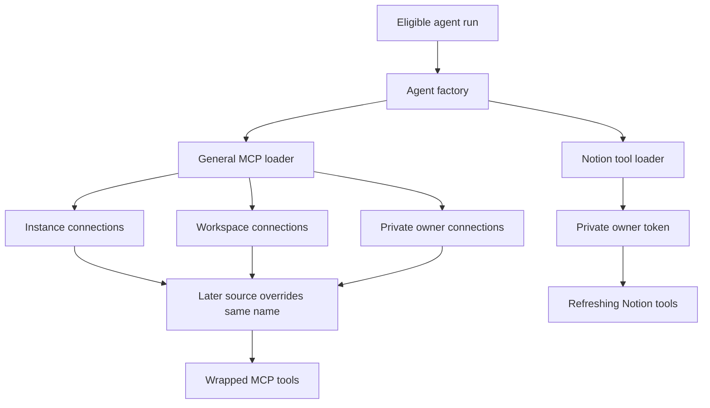

# Observability and MCP Tool Integrations

This page describes the integration surfaces implemented by the current runtime. The previous provider-specific Datadog, Corridor, Currents, Stagehand browser, and LangSmith run-inspection loaders are not part of the current agent factory. Today, external tools are supplied by the general MCP runtime and the private Notion MCP integration; LangSmith remains an optional model gateway and tracing destination rather than an agent tool surface.

See [Tools](../concepts/tools.md) for tool behavior, [Authentication and security](../concepts/auth-and-security.md) for the wider trust model, and [Configuration](../operations/configuration.md) for deployment settings.

## What becomes available to a run

For a non-local, non-summary run with a known credential scope, the agent factory loads general MCP tools and Notion tools concurrently. General MCP sources are ordered instance-wide, workspace, then personal. A later source with the same connection name replaces an earlier source, so an administrator can provide a default connection and a workspace or user can intentionally override it. Personal MCP tools and Notion tools require that the run was started by the owner of a private thread; they are not available merely because a login appears in configuration.

```mermaid
flowchart TD
  Run["Eligible agent run"] --> Factory["Agent factory"]
  Factory --> General["General MCP loader"]
  Factory --> Notion["Notion tool loader"]
  General --> Instance["Instance connections"]
  General --> Workspace["Workspace connections"]
  General --> Personal["Private owner connections"]
  Instance --> Resolve["Later source overrides same name"]
  Workspace --> Resolve
  Personal --> Resolve
  Resolve --> Tools["Wrapped MCP tools"]
  Notion --> Private["Private owner token"]
  Private --> NotionTools["Refreshing Notion tools"]
```

This flow shows the credential-scoped paths by which configured tools are offered; secret values remain stored and used server-side.

A connection has to be enabled and have an allowlist of tools before it is loaded. Catalog discovery and invocation use the connection's HTTPS URL, configured transport (`streamable_http` or `sse`), decrypted headers, and, where configured, client-credentials OAuth. The runtime gives discovery and each forwarded invocation a 30-second deadline. Connection listing or discovery failures degrade to an empty set for that connection instead of failing the run.

At invocation, a wrapped general MCP tool reauthorizes its source, re-resolves the named connection, and verifies that its scope, URL, transport, enabled state, and `allowed_tools` membership have not changed since catalog discovery. A changed or disabled connection therefore requires a new run rather than allowing a stale tool definition to use it. Tool failures are normalized to a `ToolException`, while MCP tool-call analytics records only tool name and error status.

## Credential storage and scope

MCP connection records store authentication headers and OAuth client secrets encrypted with `agent.encryption`. The dashboard-safe representation omits both encrypted fields and exposes only header names. Input validation accepts only HTTPS URLs without embedded credentials, fragments, or secret-looking query parameters; it blocks hop-by-hop and proxy authorization headers, limits header count and size, and forbids combining an `Authorization` header with OAuth. Updating a connection cannot silently retain headers when its URL changes.

Instance connections are stored separately from workspace-scoped connections, while personal connections live under a login-specific `user_mcps` namespace. The personal source has an authorization callback that checks `private_credential_login()` on every tool call. This gives the agent a defense-in-depth boundary: a catalog may have been loaded earlier, but it cannot be invoked if the current run is not owned by that private user.

Notion uses a distinct per-user credential record under `user_credentials/<login>`. Access, refresh, and optional client-secret tokens are encrypted at rest. Token retrieval is deliberately fail-soft for tool loading: unavailable Store access or a failed refresh makes Notion unavailable for that run. If refresh establishes that reauthorization is required, the stale connection is removed.

## Notion MCP

Notion is the built-in provider-specific MCP integration. It connects server-side to `https://mcp.notion.com/mcp` over streamable HTTP with a bearer access token; no Notion token is placed in the task sandbox. The OAuth helper restricts discovery, authorization-server metadata, registration, and token endpoints to HTTPS `mcp.notion.com`, dynamically registers the deployment as a public client, and uses PKCE.

The loader first verifies private-thread ownership and obtains the owner's current token to discover tool definitions. It then wraps each definition with a required `on_behalf_of` field. On every invocation, the wrapper validates that field with `resolve_participant`, retrieves a fresh token, rediscovers the requested remote tool, and invokes it without the wrapper field. This avoids binding an old MCP client or token to later calls.

`resolve_participant` requires a nonempty login that case-insensitively matches the GitHub user who triggered the run and is a verified participant in the thread. Thus `on_behalf_of` cannot select another participant's Notion connection. The Notion-specific private-owner check is stricter still: the resolved login must be the private thread owner.

## LangSmith and tracing hooks

LangSmith has two roles in the current codebase:

- `LANGSMITH_PROJECT` selects the project into which the SDK traces runs and where trace links and related lookups point. The configuration registry provides the legacy `LANGCHAIN_PROJECT` fallback.
- The optional LangSmith LLM Gateway routes supported model-provider traffic through LangSmith; it is not an agent tool and does not expose trace-reading operations to the model.

Startup and factory work can occur before a parent LangSmith run exists. `aphase` records bounded, per-thread timing entries while also opening best-effort Datadog APM spans when `ddtrace` is installed. When preparation reaches a traceable hook, `flush_phases` replays completed entries as LangSmith child chain runs, carrying timestamps, metadata, elapsed time, and any error. The prepare middleware checkpoints a fingerprint after successful setup, so a resumed attempt for the same invocation skips preparation; a later invocation re-prepares with fresh state.

Datadog's remaining observability hook is APM instrumentation, not a Datadog MCP tool: it sets `DD_ENV` from `OPENSWE_ENV` when configured and renames the root request span to the routed HTTP method and path. If `ddtrace` is absent, environment configuration and timing spans are safely no-ops.

Optional Segment delivery similarly runs server-side. It is disabled without `SEGMENT_WRITE_KEY`, identifies a resolved user, and sends usage or MCP-call events with product/environment metadata. It intentionally does not send tool content or page identifiers; delivery errors are logged rather than propagated to the agent run.

## LangSmith LLM Gateway

`make_model` is the central routing point. A workspace `gateway_enabled` value is authoritative when set; otherwise `LANGSMITH_GATEWAY_ENABLED` determines the deployment default, and a configured `LANGSMITH_GATEWAY_API_KEY` enables it when that toggle is unset. The agent factory obtains the resolved setting from workspace settings for hosted runs; local runs use the environment default.

For `openai`, `anthropic`, `baseten`, `fireworks`, and `google_genai` model IDs, the gateway supplies a provider-specific path beneath `LANGSMITH_GATEWAY_BASE_URL` (default `https://gateway.smith.langchain.com`) plus a LangSmith API key. A gateway-specific key takes precedence over `LANGSMITH_API_KEY`. Unsupported providers, or an enabled gateway without either key, log a warning and continue with direct provider routing. Gateway-routed OpenAI uses the Responses API by default; `LANGSMITH_GATEWAY_OPENAI_USE_RESPONSES=false` selects Chat Completions when required.

## Operations and focused verification

To add a general MCP integration, create or update an instance, workspace, or user connection through the MCP settings APIs; discover its catalog; then explicitly choose `allowed_tools`. Do not put credentials in a connection URL. Changes to a connection receive a new revision, which also changes the catalog-cache key. Discovery catalog data is stale-while-revalidate for 10 minutes and may be used for up to 24 hours; a failed refresh leaves the loader with no tools rather than an unchecked catalog.

Focused coverage includes Notion wrapper behavior: normalizing remote response formats, rebuilding tools with a call-time token, and producing a reconnect error when that token is missing. OAuth tests cover PKCE, Notion-host validation, one-time flow storage, and safe callback return targets. Gateway tests exercise provider paths and request serialization. MCP runtime tests should preserve the key invariants above: source precedence, encrypted/redacted credential handling, allowlist enforcement, reauthorization, and failure-to-empty loading.
